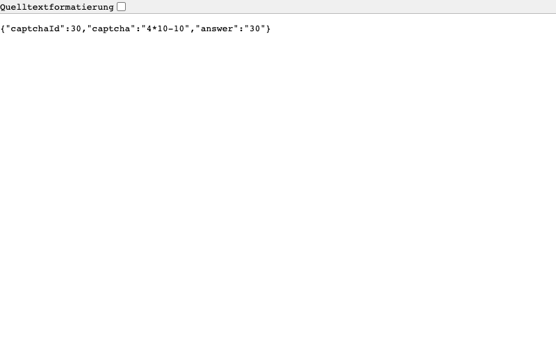
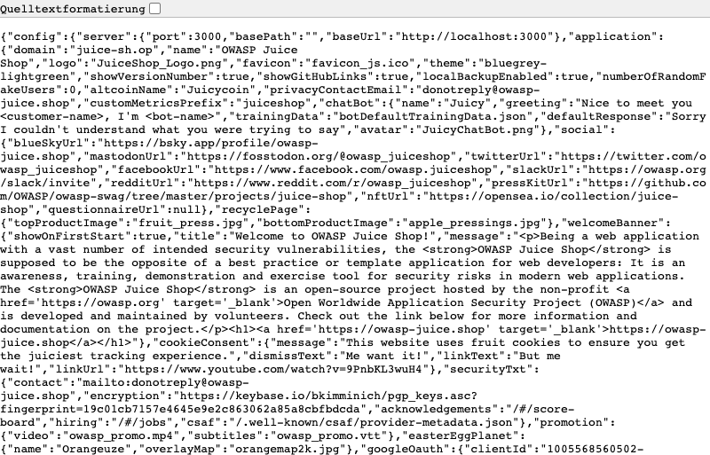

**Scope**

`OpenHack Security` was engaged by `OWASP Foundation` to conduct Black-box Security Assessment IT security investigation. The subject of the investigation was the "OWASP Juice Shop".

The test was performed using Playwright browser automation with manual HTTP request crafting against a locally deployed instance.

**Objective**

The objective of the IT security investigation was to identify vulnerabilities and security gaps which, in the event of misuse, would have an impact on the availability, integrity and confidentiality of the defined applications and/or systems and the data processed on them. The result of this project is a report that contains a management summary of all relevant findings and a compilation of recommended measures.

The technical IT security audit is not a substantive audit effort to ensure that all vulnerabilities and security gaps existing at the time of the audit are identified. There is a possibility that established safeguards will effectively prevent identification and exploitation of vulnerabilities and security gaps. The client acknowledges that this is not an indicator of deficiencies in engagement performance and that additional unidentified vulnerabilities and security gaps may exist.

\vspace{4em}
\footnotesize
\begin{itshape}
\textbf{Disclaimer}

`OpenHack Security` conducted the security penetration test on behalf of `OWASP Foundation`. This report has been prepared exclusively for `OWASP Foundation`. It is intended exclusively for internal use and is accordingly not designed to serve third parties as a basis for their decisions, unless agreed otherwise in writing. Third parties may not derive any rights or otherwise benefit from this engagement unless agreed otherwise in writing. Affiliated companies of the client are also considered "third parties" within the meaning of this engagement.

`OpenHack Security` does not assume any liability or legal claims against third parties unless agreed otherwise in writing or a disclaimer cannot effectively be implemented.

It is the sole responsibility of anyone who becomes aware of the work results summarized in this report to decide to what extent and in what way the information is useful or appropriate and to supplement, check or update it as part of their own review.

No adjustments will be made to the report to reflect events or circumstances that occur after the report is issued, unless required by law.

The recommendations in this report are general and applicable in many different environments but could have unpredictable effects in specific environments. Therefore, any actions derived from the recommendations should be carefully considered and implemented through the regular change process. This should include appropriate testing of the changes on a test environment prior to going live. If the changes are not tested in advance in an identically configured test environment, failures or other damage cannot be ruled out.

Please note: Technical descriptions (or parts thereof) in this report may be taken from the OWASP Testing Guide (www.owasp.org).

\end{itshape}
\normalsize

\newpage

# Document Control

\small

**Document Status**

|                       |                            |
| --------------------- | -------------------------- |
| **Title**             | Security Assessment Report |
| **Document Owner**    | `OpenHack Security`        |
| **Classification**    | Strictly Confidential      |
| **Project Timeframe** | 2026-02-17                 |

**Version History**

| Version | Date       | State          | Author         | Comments           |
| ------- | ---------- | -------------- | -------------- | ------------------ |
| **0.1** | 2026-02-17 | Draft          | OpenHack Agent | Initial assessment |
| **1.0** | 2026-02-17 | Final document | OpenHack Agent | --                 |

**Contact Persons - Assessor**

| Name | Role | Phone | Email |
| OpenHack Agent | Security Assessor | N/A | security@openhack.example.com |

**Contact Persons - Client**

| Name | Role | Phone | Email |
| OWASP Juice Shop Team | Application Owner | N/A | security@owasp.org |

\normalsize

# Executive Summary

`OpenHack Security` (hereinafter referred to as "ASSESSOR") has been commissioned by `OWASP Foundation` (hereinafter referred to as "CLIENT") to carry out a penetration test.

The penetration test of the `OWASP Juice Shop` application took place on **2026-02-17**.

For this purpose, the web application, accessible at `http://localhost:3333`, was tested from the perspective of an external attacker. The assessment was performed as a black-box test with no prior knowledge of the application's internal structure or source code. No authenticated credentials were provided.

As part of the test, a total of 6 vulnerabilities could be identified. Two of them are rated as critical, two with high risk, and two with medium risk. No low or informational findings were identified during this assessment.

+----------------------------------------------+-------+
| **Severity** | **Count** |
+==============================================+=======+
| \textcolor[HTML]{7B2D8E}{Critical} | 2 |
+----------------------------------------------+-------+
| \textcolor[HTML]{CC0000}{High} | 2 |
+----------------------------------------------+-------+
| \textcolor[HTML]{E67E22}{Medium} | 2 |
+----------------------------------------------+-------+
| \textcolor[HTML]{D4AC0D}{Low} | 0 |
+----------------------------------------------+-------+
| \textcolor[HTML]{2E86C1}{Informational} | 0 |
+----------------------------------------------+-------+
| **Total** | **6** |
+----------------------------------------------+-------+

: Overview of Findings

A description of the scope and test environment can be found in Chapter 3. Chapter 4 presents the risk assessment methodology. Chapter 5 provides a summary of findings. Chapter 6 contains the detailed technical descriptions of the findings including remediation measures.

It is recommended that the remediation of the critical risk vulnerabilities be treated with the highest priority and countermeasures implemented as soon as possible. The vulnerabilities with high and medium risk should also be remedied in the short term.

# Execution of the Security Penetration Test

## Subject Under Test

OWASP Juice Shop is an intentionally vulnerable web application designed for security training and awareness. It implements modern web application architecture using Express.js backend with Angular frontend and SQLite database. The application includes e-commerce functionality with user accounts, product catalog, shopping cart, payment processing, and order tracking features. The application is designed to contain numerous security vulnerabilities for educational purposes.

## Scope

The scope for the assessment was the following targets:

- http://localhost:3333 - OWASP Juice Shop web application
- REST API endpoints exposed by the application
- Static resources and file serving endpoints

## Methodology

The security penetration test of the OWASP Juice Shop took place on 2026-02-17.

The assessment was conducted using Playwright browser automation for navigation and screenshot capture, combined with manual HTTP request crafting for API endpoint testing and SQL injection payload validation. No authenticated credentials were provided; all testing was performed from an unauthenticated attacker perspective. The test environment was a locally deployed instance of OWASP Juice Shop v19.1.1.

The web application was tested for security vulnerabilities across the following categories. This can be considered a guideline as penetration tests are a creative process and therefore the tests are not limited to what is given here. The base of these categories is the OWASP Top 10 for Web, which is fully covered by this penetration test approach.

| **Category**                          | **Description**                                                                                                          |
| ------------------------------------- | ------------------------------------------------------------------------------------------------------------------------ |
| Broken Access Control                 | Users can act outside their permissions, leading to unauthorized viewing, modification, or deletion of data.             |
| Security Misconfiguration             | Systems or cloud services are insecurely configured, e.g., through default passwords or unnecessarily enabled features.  |
| Software Supply Chain Failures        | Vulnerabilities arise from compromised third-party code, libraries, or build pipelines.                                  |
| Cryptographic Failures                | Sensitive data is exposed through missing, weak, or incorrectly implemented encryption.                                  |
| Injection                             | Attackers inject malicious commands (e.g., SQL or shell code) through input fields that the system erroneously executes. |
| Insecure Design                       | Fundamental architectural flaws that exist before implementation make an application inherently insecure.                |
| Authentication Failures               | Flaws in identity verification allow attackers to take over sessions or guess passwords (brute force).                   |
| Software or Data Integrity Failures   | Lack of verification of code or data sources leads to acceptance of untrusted updates or serialization data.             |
| Security Logging & Alerting Failures  | Attacks go undetected or responses are delayed due to missing logs or absent alert notifications.                        |
| Mishandling of Exceptional Conditions | Programs respond inadequately to unforeseen situations, which can lead to crashes or logic errors.                       |

## Events

During the test, no significant restrictions or events occurred that affected the scope or depth of the assessment. All planned testing activities were completed successfully.

\newpage

# Risk Assessment

## CVSS

The risk assessment of the vulnerabilities found is performed using the industry standard Common Vulnerability Scoring System v4.0 (hereinafter referred to as "CVSS"). This is a standard that can be used to uniformly assess the vulnerability of computer systems and the severity of security vulnerabilities. This makes it possible to compare vulnerabilities more effectively.

The Common Vulnerability Scoring System has a metric structure and is based on values that are divided into four groups: "Base", "Threat", "Environmental" and "Supplemental". To determine the vulnerability scores, each group has its own rules. The values of the Base group are invariant in time and remain the same in different environments. In the Threat group, the time dependency of a vulnerability is taken into account. For example, the vulnerability of a system to a particular vulnerability decreases over time as more and more countermeasures such as patches become known and available. The Environmental group incorporates various criteria of the specific IT environments into the vulnerability rating. The Supplemental group provides additional context that does not modify the final score.

The CVSS ratings are numerical values on a scale of 0.0 to 10.0, with the highest vulnerability of a system occurring at a value of 10.0. Our rating is based on the CVSS-B (Base Score) and is composed of:

- Attack Vector (AV)
- Attack Complexity (AC)
- Attack Requirements (AT)
- Privileges Required (PR)
- User Interaction (UI)
- Vulnerable System Impact: Confidentiality (VC), Integrity (VI), Availability (VA)
- Subsequent System Impact: Confidentiality (SC), Integrity (SI), Availability (SA)

As penetration testers, we can only assess the general threats posed by a vulnerability (CVSS-B). However, we have no insight into the internal structures of our clients. Therefore, the assessment of the specific risks for the client's systems and business processes must be done by the client. For this purpose, CVSS offers the Environmental metrics (CVSS-BE). This makes it possible to subsequently adjust the CVSS score of vulnerabilities after the test result has been submitted before they are remedied. This changes the assessment of the risk and thus the urgency of remediation of a vulnerability. For more information, see [CVSS v4.0 Specification](https://www.first.org/cvss/v4.0/specification-document).

## Risk Categories

The risk categories used in this report reflect the recommended priority for addressing the vulnerabilities identified during the penetration test. The categorization is based on the probability of exploitation and the significance of the impact. The risk value is calculated using the CVSS v4.0 standard:

| **Assessment**                                   | **Risk Category Description**                                                                                                                                                                                                                                                                                                                                                                                                                                                                                                      |
| ------------------------------------------------ | ---------------------------------------------------------------------------------------------------------------------------------------------------------------------------------------------------------------------------------------------------------------------------------------------------------------------------------------------------------------------------------------------------------------------------------------------------------------------------------------------------------------------------------- |
| \textcolor[HTML]{7B2D8E}{\textbf{Critical}}      | Critical vulnerabilities that allow an attacker to gain full access to the object under test and its sensitive information. It is possible to cause enormous damage to the client's reputation. Furthermore, these vulnerabilities may allow attackers to gain wide-ranging privileges, including to other systems or applications of the client that have not been investigated in detail within the scope of this project. Exploitation of the vulnerabilities is not prevented and can be reproduced with medium to low effort. |
| \textcolor[HTML]{CC0000}{\textbf{High}}          | Vulnerabilities that may allow an attacker to manipulate sensitive data, damage the client's reputation, gain unauthorized access to sensitive information, or gain unauthorized access to applications or the client's infrastructure. The vulnerabilities are reproducible with medium to high effort.                                                                                                                                                                                                                           |
| \textcolor[HTML]{E67E22}{\textbf{Medium}}        | Vulnerabilities that may allow an attacker to harm the client's reputation or gain unauthorized access to client data. The privileges that an attacker can gain by exploiting the vulnerabilities are limited.                                                                                                                                                                                                                                                                                                                     |
| \textcolor[HTML]{D4AC0D}{\textbf{Low}}           | Security vulnerabilities that do not pose a threat in themselves, but which, for example, provide attackers with useful information about the network and systems. These vulnerabilities allow an attacker only very limited access.                                                                                                                                                                                                                                                                                               |
| \textcolor[HTML]{2E86C1}{\textbf{Informational}} | Anomalies such as functional limitations or inconsistencies. These do not currently represent a risk and have no negative impact on the test object. Accordingly, no action is required. Nevertheless, countermeasures can be helpful for the functional and safety improvement of the test object. If necessary, this may give rise to risks under other circumstances.                                                                                                                                                           |

## Vulnerability States

The vulnerabilities can be in one of the following states:

- **Active**: The vulnerability has been identified and it has been possible to verify its existence through exploitation or direct evidence.
- **Potential**: The vulnerability has been identified but its exploitation has not been possible, so its existence cannot be fully verified, and it is up to the client to determine the impact.
- **Fixed**: The vulnerability has been remediated and verified through retesting.

\newpage

# Summary of Findings

| **Id**  | **Finding Name**                               | **Risk Assessment**                | **CVSS v4 Score** |
| ------- | ---------------------------------------------- | ---------------------------------- | ----------------- |
| WEB-001 | SQL Injection - Database Schema Extraction     | \textcolor[HTML]{7B2D8E}{Critical} | 9.8               |
| WEB-002 | Information Disclosure - User Credentials      | \textcolor[HTML]{7B2D8E}{Critical} | 9.1               |
| WEB-003 | CAPTCHA Bypass - Answer Exposure               | \textcolor[HTML]{CC0000}{High}     | 7.5               |
| WEB-004 | FTP Directory Listing - Information Disclosure | \textcolor[HTML]{CC0000}{High}     | 7.5               |
| WEB-005 | Admin Configuration Disclosure                 | \textcolor[HTML]{E67E22}{Medium}   | 6.5               |
| WEB-006 | IDOR - Order Tracking                          | \textcolor[HTML]{E67E22}{Medium}   | 5.3               |

\newpage

# Findings and Remediation

## Web Application

### SQL Injection - Database Schema Extraction

|                     |                                                                                                                                                                                        |
| ------------------- | -------------------------------------------------------------------------------------------------------------------------------------------------------------------------------------- |
| **Severity**        | \textcolor[HTML]{7B2D8E}{\textbf{Critical}}                                                                                                                                            |
| **CVSS Base Score** | **9.8** ([CVSS:4.0/AV:N/AC:L/AT:N/PR:N/UI:N/VC:H/VI:H/VA:H/SC:H/SI:H/SA:H](https://www.first.org/cvss/calculator/4.0#CVSS:4.0/AV:N/AC:L/AT:N/PR:N/UI:N/VC:H/VI:H/VA:H/SC:H/SI:H/SA:H)) |
| **Assets**          | http://localhost:3333                                                                                                                                                                  |
| **Status**          | Active                                                                                                                                                                                 |

**Description**

The product search functionality at `/rest/products/search` is vulnerable to SQL injection attacks. The application concatenates user input directly into SQL queries without proper parameterization, allowing an attacker to inject arbitrary SQL code. By using a UNION SELECT payload, the complete database schema including all table structures was successfully extracted.

The vulnerability exposes the entire database structure including tables containing sensitive information such as Users (with passwords and roles), Cards (payment information), Addresses (PII), SecurityAnswers, and Wallets. This represents a critical data breach risk as an attacker can extract all data from these tables.

**Proof of Concept**

The following HTTP request successfully extracts the database schema:

```http
GET /rest/products/search?q=1')) UNION SELECT sql,'b','c','d','e','f','g','h','i' FROM sqlite_master--
```

The response includes the complete CREATE TABLE statements for all database tables:


Extracted schema reveals the following critical tables:

- **Users**: Contains password (MD5), role, deluxeToken, totpSecret fields
- **Cards**: Contains cardNum, expMonth, expYear (payment data)
- **Addresses**: Contains fullName, mobileNum, zipCode, streetAddress
- **SecurityAnswers**: Contains security question answers for account recovery
- **Captchas**: Contains CAPTCHA answers
- **Wallets**: Contains user wallet balances

**Remediation**

- Implement parameterized queries/prepared statements for all database interactions
- Use ORM frameworks with built-in SQL injection protection (e.g., Sequelize, TypeORM)
- Apply strict input validation and sanitization on all user inputs
- Follow the principle of least privilege for database connections
- Reference: [OWASP SQL Injection Prevention Cheat Sheet](https://cheatsheetseries.owasp.org/cheatsheets/SQL_Injection_Prevention_Cheat_Sheet.html)

\newpage

### Information Disclosure - User Credentials

|                     |                                                                                                                                                                                        |
| ------------------- | -------------------------------------------------------------------------------------------------------------------------------------------------------------------------------------- |
| **Severity**        | \textcolor[HTML]{7B2D8E}{\textbf{Critical}}                                                                                                                                            |
| **CVSS Base Score** | **9.1** ([CVSS:4.0/AV:N/AC:L/AT:N/PR:N/UI:N/VC:H/VI:N/VA:N/SC:H/SI:N/SA:N](https://www.first.org/cvss/calculator/4.0#CVSS:4.0/AV:N/AC:L/AT:N/PR:N/UI:N/VC:H/VI:N/VA:N/SC:H/SI:N/SA:N)) |
| **Assets**          | http://localhost:3333                                                                                                                                                                  |
| **Status**          | Active                                                                                                                                                                                 |

**Description**

The `/rest/memories/` endpoint returns complete user records without requiring any authentication. The API response includes sensitive fields such as password hashes (MD5), user roles, deluxe tokens, and TOTP secrets for all users including administrative accounts.

This vulnerability allows complete credential theft for all application users. The exposed MD5 password hashes are cryptographically broken and can be cracked offline using rainbow tables or brute force attacks. Administrative account compromise is trivial, leading to full application takeover.

**Proof of Concept**

Unauthenticated GET request to the endpoint:

```http
GET /rest/memories/
```

Response includes sensitive user data:

```json
{
  "User": {
    "id": 4,
    "email": "bjoern.kimminich@gmail.com",
    "password": "6edd9d726cbdc873c539e41ae8757b8c",
    "role": "admin",
    "deluxeToken": "",
    "totpSecret": "",
    "profileImage": "assets/public/images/uploads/defaultAdmin.png"
  }
}
```


**Exposed Credentials:**

| Email                      | Role   | Password Hash (MD5)              |
| -------------------------- | ------ | -------------------------------- |
| bjoern.kimminich@gmail.com | admin  | 6edd9d726cbdc873c539e41ae8757b8c |
| bjoern@owasp.org           | deluxe | 9283f1b2e9669749081963be0462e466 |
| ethereum@juice-sh.op       | deluxe | 2c17c6393771ee3048ae34d6b380c5ec |

**Remediation**

- Remove all sensitive fields (password, role, tokens) from API responses
- Implement proper authentication and authorization checks on all endpoints
- Never expose password hashes through any API
- Migrate from MD5 to bcrypt or Argon2 for password hashing
- Reference: [OWASP Authentication Cheat Sheet](https://cheatsheetseries.owasp.org/cheatsheets/Authentication_Cheat_Sheet.html)

\newpage

### CAPTCHA Bypass - Answer Exposure

|                     |                                                                                                                                                                                        |
| ------------------- | -------------------------------------------------------------------------------------------------------------------------------------------------------------------------------------- |
| **Severity**        | \textcolor[HTML]{CC0000}{\textbf{High}}                                                                                                                                                |
| **CVSS Base Score** | **7.5** ([CVSS:4.0/AV:N/AC:L/AT:N/PR:N/UI:N/VC:N/VI:L/VA:N/SC:N/SI:N/SA:N](https://www.first.org/cvss/calculator/4.0#CVSS:4.0/AV:N/AC:L/AT:N/PR:N/UI:N/VC:N/VI:L/VA:N/SC:N/SI:N/SA:N)) |
| **Assets**          | http://localhost:3333                                                                                                                                                                  |
| **Status**          | Active                                                                                                                                                                                 |

**Description**

The CAPTCHA generation endpoint `/rest/captcha/` returns both the CAPTCHA challenge question and its answer in the same API response. This design flaw completely defeats the purpose of CAPTCHA protection, as any automated system can simply parse the answer from the JSON response before submitting the form.

The vulnerability affects all CAPTCHA-protected forms including the Customer Feedback form, allowing automated form submission, brute force attacks, and spam abuse.

**Proof of Concept**

Request to CAPTCHA endpoint:

```http
GET /rest/captcha/
```

Response exposes the answer:

```json
{
  "captchaId": 29,
  "captcha": "2-4+10",
  "answer": "8"
}
```



The Customer Feedback form with bypassable CAPTCHA:


**Remediation**

- Never expose CAPTCHA answers in client-side code or API responses
- Implement server-side CAPTCHA validation only, storing answers server-side indexed by captchaId
- Consider migrating to modern CAPTCHA services (reCAPTCHA v3, hCaptcha)
- Ensure CAPTCHA validation occurs before processing form submissions

\newpage

### FTP Directory Listing - Information Disclosure

|                     |                                                                                                                                                                                        |
| ------------------- | -------------------------------------------------------------------------------------------------------------------------------------------------------------------------------------- |
| **Severity**        | \textcolor[HTML]{CC0000}{\textbf{High}}                                                                                                                                                |
| **CVSS Base Score** | **7.5** ([CVSS:4.0/AV:N/AC:L/AT:N/PR:N/UI:N/VC:H/VI:N/VA:N/SC:N/SI:N/SA:N](https://www.first.org/cvss/calculator/4.0#CVSS:4.0/AV:N/AC:L/AT:N/PR:N/UI:N/VC:H/VI:N/VA:N/SC:N/SI:N/SA:N)) |
| **Assets**          | http://localhost:3333                                                                                                                                                                  |
| **Status**          | Active                                                                                                                                                                                 |

**Description**

The `/ftp/` endpoint exposes a directory listing containing sensitive files including a KeePass password database, backup files, configuration backups, and error logs. While direct access to certain file extensions is blocked, the directory listing itself reveals file names and sizes, aiding reconnaissance and potentially exposing sensitive information.

The exposed KeePass database (incident-support.kdbx) may contain credentials for other systems. Backup files may contain sensitive configuration data from previous deployments.

**Proof of Concept**

Accessing the FTP directory:

```http
GET /ftp/
```


**Exposed Files:**

| File                  | Size        | Risk                           |
| --------------------- | ----------- | ------------------------------ |
| incident-support.kdbx | 3,246 bytes | KeePass password database      |
| package.json.bak      | -           | Backup configuration           |
| coupons_2013.md.bak   | -           | Backup coupon data             |
| acquisitions.md       | -           | Business acquisition info      |
| suspicious_errors.yml | -           | Error logs with sensitive data |
| encrypt.pyc           | -           | Compiled encryption module     |
| legal.md              | -           | Legal documents                |

**Remediation**

- Disable directory listing on the web server configuration
- Move all sensitive files outside the web root directory
- Implement proper access controls on file serving endpoints
- Remove backup files from production environments
- Restrict file access to specific allowed file types and locations

\newpage

### Admin Configuration Disclosure

|                     |                                                                                                                                                                                        |
| ------------------- | -------------------------------------------------------------------------------------------------------------------------------------------------------------------------------------- |
| **Severity**        | \textcolor[HTML]{E67E22}{\textbf{Medium}}                                                                                                                                              |
| **CVSS Base Score** | **6.5** ([CVSS:4.0/AV:N/AC:L/AT:N/PR:N/UI:N/VC:L/VI:N/VA:N/SC:N/SI:N/SA:N](https://www.first.org/cvss/calculator/4.0#CVSS:4.0/AV:N/AC:L/AT:N/PR:N/UI:N/VC:L/VI:N/VA:N/SC:N/SI:N/SA:N)) |
| **Assets**          | http://localhost:3333                                                                                                                                                                  |
| **Status**          | Active                                                                                                                                                                                 |

**Description**

The `/rest/admin/application-configuration` endpoint exposes sensitive application configuration without authentication, including Google OAuth client ID, application domain, and privacy contact email. While the OAuth client secret is not exposed, the client ID can be used in social engineering attacks or to identify other application instances using the same OAuth configuration.

This information disclosure aids attackers in reconnaissance and potentially enables targeted attacks against the OAuth implementation.

**Proof of Concept**

```http
GET /rest/admin/application-configuration
```

Response exposes configuration:

```json
{
  "googleOauth": {
    "clientId": "1005568560502-6hm16lef8oh46hr2d98vf2ohlnj4nfhq.apps.googleusercontent.com"
  },
  "application": {
    "domain": "juice-sh.op",
    "privacyContactEmail": "donotreply@owasp-juice.shop"
  }
}
```



**Remediation**

- Restrict configuration endpoints to authenticated administrative users only
- Move sensitive configuration values to server-side environment variables
- Implement proper access controls on all admin endpoints
- Review and sanitize all configuration API responses

\newpage

### IDOR - Order Tracking

|                     |                                                                                                                                                                                        |
| ------------------- | -------------------------------------------------------------------------------------------------------------------------------------------------------------------------------------- |
| **Severity**        | \textcolor[HTML]{E67E22}{\textbf{Medium}}                                                                                                                                              |
| **CVSS Base Score** | **5.3** ([CVSS:4.0/AV:N/AC:L/AT:N/PR:N/UI:N/VC:L/VI:N/VA:N/SC:N/SI:N/SA:N](https://www.first.org/cvss/calculator/4.0#CVSS:4.0/AV:N/AC:L/AT:N/PR:N/UI:N/VC:L/VI:N/VA:N/SC:N/SI:N/SA:N)) |
| **Assets**          | http://localhost:3333                                                                                                                                                                  |
| **Status**          | Active                                                                                                                                                                                 |

**Description**

The order tracking endpoint `/rest/track-order/{id}` is vulnerable to Insecure Direct Object Reference (IDOR) attacks. The endpoint accepts sequential numeric order IDs without verifying that the requesting user owns the order. By incrementing the ID parameter, an attacker can enumerate and access order data belonging to other users.

This vulnerability allows unauthorized access to order information, potentially exposing customer data, order details, and business information.

**Proof of Concept**

Accessing orders via sequential ID manipulation:

```http
GET /rest/track-order/1
GET /rest/track-order/2
GET /rest/track-order/0
```

All requests return successful responses with order data:

```json
{ "status": "success", "data": [{ "orderId": "1" }] }
```


**Remediation**

- Verify user ownership before returning order data
- Implement proper authorization checks on all endpoints accessing user-specific data
- Use indirect object references (UUIDs instead of sequential numeric IDs)
- Consider implementing rate limiting on enumeration-prone endpoints

\newpage

# Appendix A - Lists, Scripts and Raw Data

## Extracted User Credentials

The following credentials were extracted from the vulnerable `/rest/memories/` endpoint:

### Admin Accounts

| Email                      | Role  | MD5 Password Hash                  |
| -------------------------- | ----- | ---------------------------------- |
| bjoern.kimminich@gmail.com | admin | `6edd9d726cbdc873c539e41ae8757b8c` |

### Deluxe Accounts

| Email                | Role   | MD5 Password Hash                  |
| -------------------- | ------ | ---------------------------------- |
| bjoern@owasp.org     | deluxe | `9283f1b2e9669749081963be0462e466` |
| ethereum@juice-sh.op | deluxe | `2c17c6393771ee3048ae34d6b380c5ec` |

### Customer Accounts

| Email            | Role     | MD5 Password Hash                  |
| ---------------- | -------- | ---------------------------------- |
| john@juice-sh.op | customer | `00479e957b6b42c459ee5746478e4d45` |
| emma@juice-sh.op | customer | `402f1c4a75e316afec5a6ea63147f739` |

**Note:** MD5 hashes can be cracked using rainbow tables or brute force. The hash `6edd9d726cbdc873c539e41ae8757b8c` corresponds to "admin123".

## Extracted Database Schema

The complete database schema extracted via SQL injection includes the following tables:

| Table             | Description                                           |
| ----------------- | ----------------------------------------------------- |
| Addresses         | User addresses with PII                               |
| BasketItems       | Shopping cart contents                                |
| Baskets           | Shopping cart headers                                 |
| Captchas          | CAPTCHA questions and answers                         |
| Cards             | Payment card information (cardNum, expMonth, expYear) |
| Challenges        | Application challenge data                            |
| Complaints        | Customer complaints with file attachments             |
| Deliveries        | Delivery options                                      |
| Feedbacks         | User feedback and ratings                             |
| Hints             | Challenge hints                                       |
| ImageCaptchas     | Image-based CAPTCHAs                                  |
| Memories          | User photo memories                                   |
| PrivacyRequests   | Data deletion requests                                |
| Products          | Product catalog                                       |
| Quantities        | Inventory levels                                      |
| Recycles          | Recycling requests                                    |
| SecurityAnswers   | Security question answers                             |
| SecurityQuestions | Security questions                                    |
| Users             | User accounts with passwords and roles                |
| Wallets           | User wallet balances                                  |

## Google OAuth Configuration

The following OAuth configuration was exposed:

```json
{
  "clientId": "1005568560502-6hm16lef8oh46hr2d98vf2ohlnj4nfhq.apps.googleusercontent.com",
  "authorizedRedirects": [
    "https://demo.owasp-juice.shop",
    "https://juice-shop.herokuapp.com",
    "https://preview.owasp-juice.shop",
    "https://juice-shop-staging.herokuapp.com",
    "https://juice-shop.wtf",
    "http://localhost:3000",
    "http://127.0.0.1:3000",
    "http://localhost:4200",
    "http://127.0.0.1:4200",
    "http://192.168.99.100:3000",
    "http://192.168.99.100:4200",
    "http://penguin.termina.linux.test:3000",
    "http://penguin.termina.linux.test:4200"
  ]
}
```

\newpage

# Appendix B - List of Abbreviations

+----------------+---------------------------------------------+
| Abbreviation | Description |
+================+=============================================+
| API | Application Programming Interface |
+----------------+---------------------------------------------+
| CAPTCHA | Completely Automated Public Turing test to |
| | tell Computers and Humans Apart |
+----------------+---------------------------------------------+
| CVSS | Common Vulnerability Scoring System |
+----------------+---------------------------------------------+
| FTP | File Transfer Protocol |
+----------------+---------------------------------------------+
| IDOR | Insecure Direct Object Reference |
+----------------+---------------------------------------------+
| MD5 | Message-Digest Algorithm 5 |
+----------------+---------------------------------------------+
| OAuth | Open Authorization |
+----------------+---------------------------------------------+
| ORM | Object-Relational Mapping |
+----------------+---------------------------------------------+
| OWASP | Open Web Application Security Project |
+----------------+---------------------------------------------+
| PII | Personally Identifiable Information |
+----------------+---------------------------------------------+
| SQL | Structured Query Language |
+----------------+---------------------------------------------+
| TOTP | Time-based One-Time Password |
+----------------+---------------------------------------------+
| URI | Uniform Resource Identifier |
+----------------+---------------------------------------------+
| WAF | Web Application Firewall |
+----------------+---------------------------------------------+
| XSS | Cross-Site Scripting |
+----------------+---------------------------------------------+
