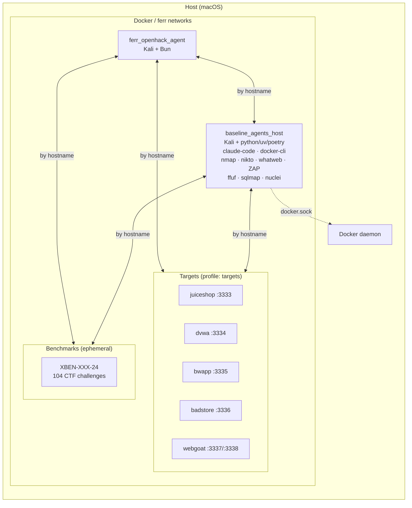

# ferr — container environment

Kali-based dev container for AI-assisted penetration testing, plus optional vulnerable targets and a playground container for running third-party agents.

## Architecture



Containers communicate by hostname on shared Docker networks. Target ports are also bound to `127.0.0.1` on the host for browser access (see [Host Access](#host-access)).

## Prerequisites

- Docker with Docker Compose v2 (`docker compose`)

## Quick Start

```bash
make quickstart       # clone benchmark repos, build, and start (first time)
make up               # start dev container only (after first build)
make shell            # open a shell in the openhack container
```

Start everything (dev + targets + playground):

```bash
make quickstart-all   # first time: clone repos, build, start everything
make up-all           # subsequent: start everything (builds if needed)
```

Or selectively:

```bash
make up               # dev container only
make up-with-targets  # dev + all vulnerable targets
make playground       # start playground container only (not GVM)
```

Note: `up-all` and `playground` mount `/var/run/docker.sock` into the playground container, giving it root-equivalent control over your Docker daemon. Only run trusted code in `./data/projects/source`.

## Build time

The first `docker compose build` is slow — expect **~60 minutes** on a cold cache:

| Layer | Time |
|---|---|
| apt packages (kali-linux-headless, pandoc, texlive, …) | ~23 min |
| SecLists wordlists (~450 MB download) | ~26 min |
| Go tools (httpx, katana, interactsh, gospider) | ~6 min |
| bun, trufflehog, nuclei templates | ~3 min |
| Everything else | ~2 min |

Subsequent builds are near-instant — all layers are cached unless the Dockerfile changes.

## Commands

```bash
make help                  # list all commands
make up-all                # start everything (dev + targets + playground)
make shell                 # enter dev container
make install               # bun install
make dev                   # bun run dev (TUI/CLI)
make app                   # web app dev server (port 3000)
make web                   # opencode web (port 4096)
make serve                 # opencode HTTP server (port 4096)
make playground            # start playground container
make benchmark-kali        # scan all targets (nmap, nikto, whatweb, ZAP, ffuf, sqlmap)
make benchmark-pentestgpt  # run PentestGPT benchmark (RUNS=5)
make benchmark-cai         # run CAI benchmark (RUNS=5)
make benchmark-strix       # run Strix benchmark (RUNS=5)
make status                # show service status
make down                  # stop everything
make validate              # run smoke tests
```

## Containers

| Container | Service | Profile | Hostname | URL |
|---|---|---|---|---|
| `ferr_openhack_agent` | `ferr_openhack_agent` | *(default)* | `openhack` | `http://localhost:4096` (after `make web`/`serve`) |
| `baseline_agents_host` | `baseline_agents_host` | `playground` | `baseline_agents_host` | — |
| `baseline_vulnerability_scanner` | `baseline_vulnerability_scanner` | `playground` | `scanner` | `http://localhost:9392` (container-internal) |
| `sut_juiceshop` | `sut_juiceshop` | `targets` | `juiceshop` | `http://localhost:3333` |
| `sut_badstore` | `sut_badstore` | `targets` | `badstore` | `http://localhost:3336` |
| `aux_dvwa` | `aux_dvwa` | `targets` | `dvwa` | `http://localhost:3334` |
| `aux_bwapp` | `aux_bwapp` | `targets` | `bwapp` | `http://localhost:3335` |
| `aux_webgoat` | `aux_webgoat` | `targets` | `webgoat` | `http://localhost:3337` |

## Dev Container

The repo is mounted at `/app`. Persistent caches across restarts:

- npm/npx: `/home/opencode/.npm` (used by MCP `npx -y ...`)

## Playground

Kali-based container for running third-party OSS hacking agents on the same Docker network as the targets. Reaches them by hostname (e.g. `http://juiceshop:3000`).

```bash
make playground
docker compose exec baseline_agents_host bash
```

### Scanning

The `benchmark-kali` script runs automated scans against all Docker-internal targets using their real hostnames and ports. Tools: nmap, whatweb, nikto, ZAP, ffuf, sqlmap, and optionally GVM/OpenVAS.

```bash
make benchmark-kali                 # scan all targets
```

| Target | Hostname | Port |
|---|---|---|
| Juice Shop | `juiceshop` | 3000 |
| DVWA | `dvwa` | 80 |
| bWAPP | `bwapp` | 80 |
| BadStore | `badstore` | 80 |
| WebGoat | `webgoat` | 8080 |

Scan output is saved to `data/projects/scans/` on the host using the flat naming convention `{target}-{agent}-run-{N}.*`. SecLists wordlists are available at `/usr/share/wordlists/seclists/` inside the container.

GVM (Greenbone Vulnerability Management / OpenVAS) runs as a separate container (`baseline_vulnerability_scanner`) in the `playground` profile. `make playground` starts only the playground container; use `make up-all` to start both. First startup takes 5–10 minutes to sync vulnerability feeds.

### Setup

If your agent needs environment variables (API keys, model selection), create a gitignored env file:

```bash
make playground-env
$EDITOR data/projects/playground.env
make playground
```

`make playground` passes these variables into the container so tools like Strix/CAI can read them.

### Projects

One-time setup to clone third-party agent repos into `data/projects/source/` (git-ignored):

```bash
./setup/projects
```

Inside the container they appear at `/playground/projects/source/`. Supported:

- **PentestGPT** / **CAI** — installed via `uv sync`
- **Strix** — installed via `poetry install`

The entrypoint (`bin/playground-entrypoint`) auto-installs dependencies on first boot. It checks for each CLI binary in `.venv/bin/` and skips if present. Virtualenvs persist on the host via bind mount.

To force reinstall: delete the project's `.venv` on the host and restart the container.

### Agent Setup (Keys / Docker)

Most projects require API keys and/or an interactive first-run setup:

- **PentestGPT**: uses Claude Code (`claude`). In the playground container, run `claude` and complete `/login` before running `pentestgpt`. A named volume (`playground-claude`) persists the Claude Code login across container recreations.
- **CAI**: requires a TTY (run from `docker compose exec baseline_agents_host bash`). Expects `OPENAI_API_KEY` and `CAI_MODEL` set in `data/projects/playground.env`. Use `OPENAI_BASE_URL` to point at an OpenAI-compatible proxy.
- **Strix**: runs a sandbox via Docker and needs Docker daemon access (provided via socket mount). Requires `STRIX_LLM` and `LLM_API_KEY`. Set `STRIX_SANDBOX_HOST=host.docker.internal` and `STRIX_SANDBOX_NETWORK` so the sandbox can reach targets by hostname.

Security note: mounting `/var/run/docker.sock` gives the playground container effectively root-equivalent control over your Docker daemon. Only run trusted code in `./data/projects/source`.

### Running Agents

All agents run inside the playground container and reach targets by Docker hostname:

```bash
make up-all
docker compose exec baseline_agents_host bash
```

#### PentestGPT

```bash
# First time only: authenticate Claude Code
claude
# Complete /login, then exit

pentestgpt --target http://juiceshop:3000
pentestgpt --target http://juiceshop:3000 --non-interactive
pentestgpt --target http://juiceshop:3000 --resume
```

#### CAI

Requires a TTY — must run from an interactive shell:

```bash
cai "Target: http://juiceshop:3000 - perform a full web application penetration test"
CAI_AGENT_TYPE=web_pentester cai "Target: http://juiceshop:3000"
```

Environment: `OPENAI_API_KEY` and `CAI_MODEL` set via `data/projects/playground.env`.

#### Strix

```bash
strix --target http://juiceshop:3000
strix --target http://juiceshop:3000 --scan-mode deep
strix --target http://juiceshop:3000 -n    # non-interactive / CI mode
```

Environment: `STRIX_LLM` and `LLM_API_KEY` set via `data/projects/playground.env`.

## Host Access

| Target | Host URL |
|---|---|
| Juice Shop | `http://localhost:3333` |
| DVWA | `http://localhost:3334` |
| bWAPP | `http://localhost:3335` |
| BadStore | `http://localhost:3336` |
| WebGoat | `http://localhost:3337` |
| WebWolf | `http://localhost:3338` |

From inside containers, use Docker hostnames instead (e.g. `http://juiceshop:3000`).

## Benchmarking

### Agent Benchmarks

Automated benchmark scripts run N runs per target with clean container restarts and `/tmp` archival between runs. Results saved to `data/projects/scans/` as `{target}-{agent}-run-{N}.*`.

```bash
make benchmark-pentestgpt RUNS=5     # PentestGPT: 5 runs on all targets
make benchmark-cai RUNS=5            # CAI: 5 runs on all targets
make benchmark-strix RUNS=5          # Strix: 5 runs on all targets
```

Or run directly:

```bash
bin/benchmark-cai 3                     # 3 runs, all targets
bin/benchmark-cai 5 3                   # runs 3–5, all targets
TARGET=juiceshop bin/benchmark-cai 3 3  # just run 3, juiceshop only

# CAI tuning
CAI_MAX_TURNS=50 CAI_TIMEOUT=900 bin/benchmark-cai 1 1
```

Data structure:

```
data/projects/
├── xbow/                        # XBOW validation-benchmarks clone (git-ignored)
│   └── benchmarks/              # XBEN-001-24 ... XBEN-104-24
├── source/                      # third-party agent repos (git-ignored)
│   ├── cai/
│   ├── strix/
│   └── PentestGPT/
├── scans/                       # primary benchmark data (flat)
│   ├── {target}-{agent}-run-{N}.log
│   ├── {target}-{agent}-run-{N}-tmp.tar.gz
│   └── archive/
├── enhancements-scans/          # manual baseline scans
│   ├── juiceshop/
│   └── badstore/
└── analysis/
    ├── templates/
    ├── code/                    # filled project/codebase analyses
    ├── runs/                    # per-agent × target benchmark results
    └── manual/                  # manual/baseline scanner results
```

### XBOW Benchmarks

104 CTF-style security challenges. Each benchmark is an independent Docker Compose stack.

One-time setup:

```bash
./setup/benchmarks
```

Usage:

```bash
make xbow-list                       # list all 104 benchmarks
make xbow-build BENCH=XBEN-001-24    # build with random flag
make xbow-run   BENCH=XBEN-001-24    # start + connect to network
make xbow-flag  BENCH=XBEN-001-24    # show the flag
make xbow-stop  BENCH=XBEN-001-24    # tear down
```

Running benchmarks are reachable from `ferr_openhack_agent` and `baseline_agents_host` by container name.
