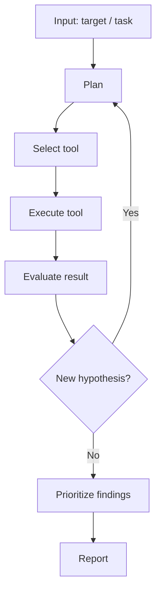
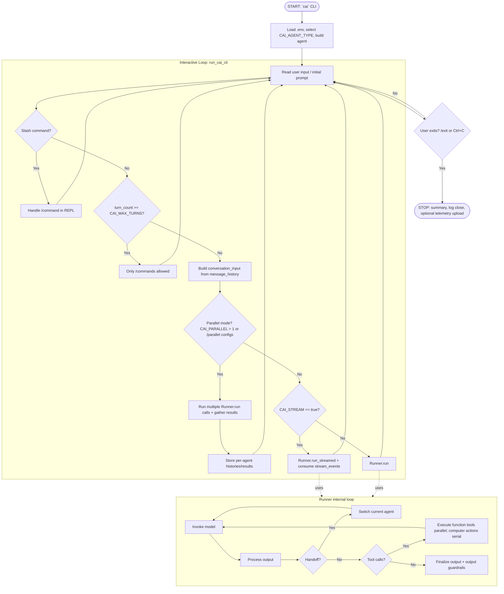
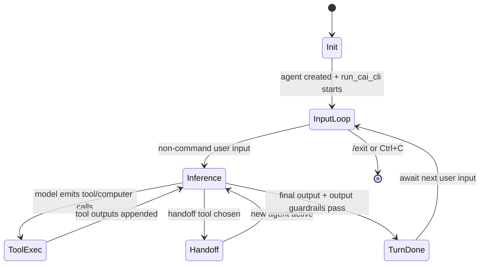

# CAI - Project Analysis

> **Context:** This template provides a standardized analysis framework for
> autonomous penetration testing agents, designed for use in a bachelor thesis.
> It enables systematic, comparable evaluation of each agent's architecture,
> tool usage, and vulnerability discovery capabilities.

| Field | Value |
|-------|-------|
| **Project** | CAI (Cybersecurity AI) |
| **Version / Commit** | `cai-framework` 0.5.10 / `e22a1220f764e2d7cf9da6d6144926f53ca01cde` (local clone) |
| **Repository** | https://github.com/aliasrobotics/cai |
| **License** | Dual: MIT + research-use proprietary additions |
| **Language(s)** | Python 3.9+ |
| **Runtime** | Local Python CLI (`cai`), optional Docker workflow |
| **Date Analyzed** | 2026-02-13 |

> **Template Ecosystem - Three-Layer Analysis:**
>
> | Layer | Template | Scope | Cardinality |
> |-------|----------|-------|-------------|
> | 1. Project Analysis | **this file** | Deep technical analysis of codebase, architecture, and design decisions | One per agent |
> | 2. Benchmark Results | `results-template.md` | Quantitative data: tool calls, flags, cost, duration, vulnerability coverage | One per agent x target |
> | 3. Learnings Synthesis | `learnings-template.md` | Qualitative synthesis: what worked, what to adopt for OpenHack | One per agent |
>
> **Workflow:** (1) Analyze the codebase and fill this template ->
> (2) Run benchmarks and fill `results-template.md` per target ->
> (3) Synthesize findings from both into `learnings-template.md`.

---

## 1. Project Profile

- **Primary goal:** Build customizable cybersecurity agents/patterns for CTFs, web pentesting, red teaming, and related security automation (`cai/README.md:106`, `cai/src/cai/agents/one_tool.py:1`, `cai/src/cai/agents/web_pentester.py:1`, `cai/src/cai/agents/red_teamer.py:1`).
- **Supported asset types:** Web apps/APIs, CTF environments, local/containerized/SSH-accessible systems, and external tool ecosystems via MCP (`cai/src/cai/tools/reconnaissance/generic_linux_command.py:95`, `cai/src/cai/tools/common.py:155`, `cai/README.md:893`, `cai/src/cai/sdk/agents/agent.py:115`).
- **Explicitly out of scope:** Unauthorized or disruptive use; production misuse is explicitly disallowed in project legal guidance (`cai/README.md:145`, `cai/DISCLAIMER:21`).
- **Assumed attacker model:** Authorized red-team/bug-bounty/CTF operator with command execution ability and model API connectivity (`cai/src/cai/cli.py:80`, `cai/src/cai/agents/red_teamer.py:46`, `cai/src/cai/agents/web_pentester.py:45`).
- **Human-in-the-loop:** Yes. Interactive REPL is the default, with command control, agent switching, and user interrupt handling during execution (`cai/src/cai/cli.py:424`, `cai/src/cai/cli.py:714`, `cai/src/cai/repl/commands/base.py:142`, `cai/src/cai/repl/commands/exit.py:19`).
- **Short description (3-5 sentences):**
  CAI is a Python framework/CLI for running security-focused LLM agents with tools, handoffs, guardrails, tracing, and optional multi-agent patterns (`cai/README.md:546`, `cai/src/cai/sdk/agents/agent.py:57`). Runtime orchestration is split between a high-level interactive CLI loop and an SDK runner loop that iterates model calls, tools, and handoffs until final output (`cai/src/cai/cli.py:424`, `cai/src/cai/sdk/agents/run.py:145`). Tool execution supports function tools, hosted tools (file/web/computer), and command-execution-centric workflows; function tools run concurrently while computer actions are serialized (`cai/src/cai/sdk/agents/_run_impl.py:224`, `cai/src/cai/sdk/agents/_run_impl.py:557`, `cai/src/cai/sdk/agents/_run_impl.py:597`). Compared to many agent wrappers, CAI contains stronger built-in operational controls (guardrails, turn limits, cost limits, structured histories), but it remains heavily LLM-policy-driven for tactical vulnerability decisions (assumption) (`cai/src/cai/agents/guardrails.py:232`, `cai/src/cai/util.py:416`, `cai/src/cai/sdk/agents/run.py:223`).

---

## 2. Quickstart for Reproduction

> Required for thesis reproducibility. Document the exact steps to set up
> and run the agent from a clean state.

- **Entry point(s) in code:**
  - CLI entrypoint: `cai.cli:main` (`cai/pyproject.toml:238`, `cai/src/cai/cli.py:1838`)
  - Main runtime loop: `run_cai_cli(...)` (`cai/src/cai/cli.py:424`)
  - SDK orchestration: `Runner.run(...)` / `Runner.run_streamed(...)` (`cai/src/cai/sdk/agents/run.py:135`, `cai/src/cai/sdk/agents/run.py:399`)
- **Key configuration files:**
  - Package/runtime metadata and script definitions: `cai/pyproject.toml:1`
  - Env template: `cai/.env.example:1`
  - Agent registry/factory: `cai/src/cai/agents/__init__.py:75`
  - Core security agents: `cai/src/cai/agents/one_tool.py:61`, `cai/src/cai/agents/web_pentester.py:44`, `cai/src/cai/agents/red_teamer.py:44`
  - Prompt templates: `cai/src/cai/prompts/system_web_pentester.md:1`, `cai/src/cai/prompts/system_red_team_agent.md:1`
- **Startup command:**
  - `python3.12 -m venv cai_env && source cai_env/bin/activate && pip install cai-framework && cai` (`cai/README.md:359`, `cai/README.md:445`)
  - Source-based variant: `cd cai && python3.12 -m venv cai_env && source cai_env/bin/activate && pip install -e . && cp .env.example .env && cai` (`cai/README.md:490`, `cai/README.md:499`, `cai/README.md:502`)
- **Minimal test run:**
  - `cai` (launch REPL and banner)
  - Optional one-shot initial prompt via argv: `cai "env info"` (`cai/src/cai/cli.py:1850`, `cai/src/cai/cli.py:1880`)
- **Log / artifact output paths:**
  - Structured JSONL session log: `logs/cai_<session>_...jsonl` (`cai/src/cai/sdk/agents/run_to_jsonl.py:70`, `cai/src/cai/sdk/agents/run_to_jsonl.py:119`)
  - Symlink to latest log: `logs/last` (`cai/src/cai/cli.py:1806`, `cai/src/cai/cli.py:943`)
  - REPL history file: `~/.cai/history.txt` (`cai/src/cai/repl/ui/logging.py:15`)

---

## 3. Architecture

### 3a. Component Decomposition

| Component | Purpose | Inputs | Outputs | Key Files |
|-----------|---------|--------|---------|-----------|
| Agent Core | Defines agent identity, instructions, tools, guardrails, handoffs, model behavior | Agent config, prompts, tool list, model settings | Executable agent object with tool/handoff capabilities | `cai/src/cai/sdk/agents/agent.py:57` |
| Planner / Orchestrator | Manages interactive loop, turn gating, model invocation mode, and parallel branches | User input, env vars, active agent, prior history | Per-turn model/tool execution, session progression, summaries | `cai/src/cai/cli.py:424`, `cai/src/cai/cli.py:955` |
| Executor | Runs iterative agent loop: model response -> tools/handoffs -> next turn/final output | Agent, conversation input, hooks, guardrails, max turns | `RunResult` / streamed events / exceptions | `cai/src/cai/sdk/agents/run.py:135`, `cai/src/cai/sdk/agents/run.py:539` |
| Tool Adapter | Parses model outputs into tool/handoff/computer actions and executes them | `ModelResponse.output`, tool registry, run context | Tool outputs, handoff transitions, final-output decisions | `cai/src/cai/sdk/agents/_run_impl.py:411`, `cai/src/cai/sdk/agents/_run_impl.py:501` |
| Memory / State | Maintains per-agent message history and optional parallel-isolated histories | User/assistant/tool messages, agent switches | Context for subsequent turns; cleaned/sanitized history | `cai/src/cai/sdk/agents/models/openai_chatcompletions.py:400`, `cai/src/cai/sdk/agents/simple_agent_manager.py:17`, `cai/src/cai/util.py:1127` |
| Reporter | Emits runtime summaries and persists session logs/usage/timing | Interaction telemetry, costs, logs | Session summary panel + JSONL artifacts + optional telemetry upload | `cai/src/cai/cli.py:846`, `cai/src/cai/sdk/agents/run_to_jsonl.py:143`, `cai/src/cai/internal/components/metrics.py:53` |

### 3b. Generic Agent Loop (reference)

The following diagram shows a generic agent loop for comparison. Replace section 3c
with the project's actual flow.

### 3c. Project-Specific Agent Flow (Mermaid)

> **Customization checklist:**
> - [x] Replace placeholder nodes with actual function/method names
> - [x] Add agent-specific branches (parallel execution, guardrail handling, stream/non-stream)
> - [x] Annotate edges with transition conditions where non-obvious
> - [x] Update STOP node with actual termination reasons

### 3d. Start and Stop Conditions

| Condition | Type | Trigger | Behavior |
|-----------|------|---------|----------|
| CLI invocation | **Start** | User runs `cai` | Loads env/config, instantiates selected agent, enters interactive loop (`cai/src/cai/cli.py:119`, `cai/src/cai/cli.py:1855`, `cai/src/cai/cli.py:1880`) |
| Initial prompt argument | **Start** | `cai "<prompt>"` | First turn uses argv text before interactive prompt (`cai/src/cai/cli.py:1850`, `cai/src/cai/cli.py:690`) |
| Manual exit command | **Stop (manual)** | `/exit` / `/quit` / `/q` | Immediate process exit via command handler (`cai/src/cai/repl/commands/exit.py:19`, `cai/src/cai/repl/commands/exit.py:36`) |
| Keyboard interrupt at prompt | **Stop (manual)** | Ctrl+C during input stage | Persists summaries/log metadata, closes session, creates `logs/last`, then breaks loop (`cai/src/cai/cli.py:714`, `cai/src/cai/cli.py:935`, `cai/src/cai/cli.py:943`, `cai/src/cai/cli.py:953`) |
| Max-turn threshold | **Stop (budget gate, not process stop)** | `turn_count >= CAI_MAX_TURNS` in CLI | Blocks normal prompts and accepts only slash commands until limit increased (`cai/src/cai/cli.py:534`, `cai/src/cai/cli.py:963`) |
| Runner max turns | **Stop (budget)** | `current_turn > max_turns` | Raises `MaxTurnsExceeded` (non-stream) or ends streamed run queue (`cai/src/cai/sdk/agents/run.py:224`, `cai/src/cai/sdk/agents/run.py:232`, `cai/src/cai/sdk/agents/run.py:584`) |
| Guardrail tripwire | **Stop (safety at interaction level)** | Input/output guardrail `tripwire_triggered=True` | Raises tripwire exceptions in Runner; CLI shows warning and continues loop (`cai/src/cai/sdk/agents/run.py:978`, `cai/src/cai/sdk/agents/run.py:1016`, `cai/src/cai/cli.py:1645`, `cai/src/cai/cli.py:1669`) |
| Price limit exceeded | **Stop (budget at interaction level)** | `COST_TRACKER.check_price_limit(...)` fails | Raises `PriceLimitExceeded`; propagates as error in turn execution (`cai/src/cai/util.py:416`, `cai/src/cai/util.py:431`, `cai/src/cai/sdk/agents/models/openai_chatcompletions.py:692`) |
| Unrecoverable runtime exception | **Stop (error for current turn)** | Exceptions in main turn block | Logs/prints error, resets timers, loop continues unless explicit exit (assumption) (`cai/src/cai/cli.py:1785`, `cai/src/cai/cli.py:1799`) |

### 3e. Phase Transitions

| From | To | Signal | Explicit or LLM-decided? | Code Location |
|------|----|--------|--------------------------|---------------|
| Init -> InputLoop | `main()` selects agent and calls `run_cai_cli()` | Explicit | `cai/src/cai/cli.py:1858`, `cai/src/cai/cli.py:1880` |
| InputLoop -> Inference | Non-command user input reaches Runner invocation | Explicit | `cai/src/cai/cli.py:1300`, `cai/src/cai/cli.py:1499`, `cai/src/cai/cli.py:1644` |
| Inference -> ToolExec | Model response includes function/computer tool calls | LLM-decided (response content), explicit parser/dispatch | `cai/src/cai/sdk/agents/_run_impl.py:430`, `cai/src/cai/sdk/agents/_run_impl.py:551`, `cai/src/cai/sdk/agents/_run_impl.py:587` |
| Inference -> Handoff | Model emits handoff tool call | LLM-decided, explicit execution path | `cai/src/cai/sdk/agents/_run_impl.py:468`, `cai/src/cai/sdk/agents/_run_impl.py:612`, `cai/src/cai/sdk/agents/run.py:293` |
| Inference -> TurnDone | Final output schema/text condition satisfied | Mixed: explicit termination conditions over LLM output | `cai/src/cai/sdk/agents/_run_impl.py:363`, `cai/src/cai/sdk/agents/_run_impl.py:376`, `cai/src/cai/sdk/agents/run.py:277` |
| ToolExec -> Inference | Tool results appended, `NextStepRunAgain` | Explicit | `cai/src/cai/sdk/agents/_run_impl.py:388`, `cai/src/cai/sdk/agents/run.py:334` |
| InputLoop -> Stop | `/exit` command or Ctrl+C branch | Explicit | `cai/src/cai/repl/commands/exit.py:36`, `cai/src/cai/cli.py:714` |

### 3f. Retry and Backtrack Strategy

- **On tool failure:**
  - `function_tool` defaults to non-fatal error messages back to the model unless `failure_error_function=None` (`cai/src/cai/sdk/agents/tool.py:189`, `cai/src/cai/sdk/agents/tool.py:292`).
  - Runtime tool invocation errors may still raise `UserError` at Runner level (`cai/src/cai/sdk/agents/_run_impl.py:543`).
- **On exploit failure:** Usually LLM policy/prompt-driven (assumption), not a hardcoded exploit-retry scheduler; prompts instruct iterative adaptation (`cai/src/cai/prompts/system_web_pentester.md:117`, `cai/src/cai/prompts/system_red_team_agent.md:33`).
- **Max retries per hypothesis:** No explicit per-hypothesis counter in Runner/CLI (assumption). Global bounds are turn and price limits (`cai/src/cai/sdk/agents/run.py:223`, `cai/src/cai/util.py:416`).
- **Backtrack depth:** Potentially deep via repeated loops and handoffs until stop conditions fire; handoff can switch agent and continue with transferred context (`cai/src/cai/sdk/agents/run.py:293`, `cai/src/cai/sdk/agents/run.py:308`).
- **Dead-end detection:** Final output emitted by model path or tool-use behavior controls (`run_llm_again` / `stop_on_first_tool` / callable) (`cai/src/cai/sdk/agents/_run_impl.py:844`).

### 3g. Memory and State Management

- **Session state:** Tracks active agent(s), agent IDs, message history per agent, cost/time counters, and optional parallel isolation (`cai/src/cai/sdk/agents/simple_agent_manager.py:17`, `cai/src/cai/util.py:392`, `cai/src/cai/cli.py:988`).
- **Short-term memory:** Maintained in `OpenAIChatCompletionsModel.message_history` and prepended to each new model call (`cai/src/cai/sdk/agents/models/openai_chatcompletions.py:400`, `cai/src/cai/sdk/agents/models/openai_chatcompletions.py:2551`).
- **Long-term memory:** Baseline code relies on log reloading and optional memory features/extensions; not a mandatory always-on persistent semantic store in core path (assumption) (`cai/src/cai/cli.py:40`, `cai/README.md:1180`).
- **Persistence format:** JSONL session logs + text command history (`cai/src/cai/sdk/agents/run_to_jsonl.py:132`, `cai/src/cai/repl/ui/logging.py:17`).
- **Resume capability:** Manual reload of prior JSONL logs via `/load` command family (`cai/README.md:1180`, `cai/README.md:1187`).
- **Reset behavior:** New model/agent instances start fresh unless history is shared/transferred; auto-compaction can summarize+clear context (`cai/src/cai/sdk/agents/models/openai_chatcompletions.py:417`, `cai/src/cai/sdk/agents/models/openai_chatcompletions.py:3525`).

---

## 4. Tool-Use Analysis

### 4a. Tool Inventory

| Tool | Type | Purpose | Agent Trigger | Input | Output | Error Handling | Security Constraints |
|------|------|---------|---------------|-------|--------|----------------|----------------------|
| `generic_linux_command` | external (shell/CTF/container/SSH backend) | Primary command execution, enumeration, exploitation, session management | LLM calls from security agents | command string (+ optional session params) | command output / session status | timeout handling + synthetic interruption handling | multiple command pattern blocks and output sanitization when guardrails enabled (`cai/src/cai/tools/reconnaissance/generic_linux_command.py:219`) |
| `execute_code` | internal wrapper over command execution | Build/execute PoC scripts in multiple languages | LLM call in relevant agents | code, language, timeout | stdout/stderr from execution | relies on `run_command` and tool-level return values | inherits same command execution risk surface (`cai/src/cai/tools/reconnaissance/exec_code.py:10`) |
| `web_request_framework` | internal | HTTP request/response and security header/body analysis | LLM call (web pentester) | URL/request params | analyzed response | tool-specific | guardrails at agent level (`cai/src/cai/agents/web_pentester.py:16`) |
| `js_surface_mapper` | internal | JavaScript surface extraction for endpoint discovery | LLM call (web pentester) | URL/assets | extracted JS findings | tool-specific | guardrails at agent level (`cai/src/cai/agents/web_pentester.py:17`) |
| `make_web_search_with_explanation` | external API-backed | OSINT/search enrichment | Conditionally available if `PERPLEXITY_API_KEY` is set | query | summarized web findings | tool-specific | only attached when key exists (`cai/src/cai/agents/web_pentester.py:37`, `cai/src/cai/agents/red_teamer.py:38`) |
| Hosted `file_search`, `web_search`, `computer_use` | hosted model tools | Retrieval and browser/computer interaction support at SDK level | Model emits hosted tool call types | model-constructed payloads | hosted output items | parser enforces tool availability | `computer` actions serialized; model behavior errors on missing tool (`cai/src/cai/sdk/agents/_run_impl.py:433`, `cai/src/cai/sdk/agents/_run_impl.py:452`, `cai/src/cai/sdk/agents/_run_impl.py:597`) |
| MCP tools | external (MCP servers) | Integrate external tool ecosystems (for example Burp MCP) | User loads MCP, then LLM can call added tools | MCP protocol calls | tool outputs from server | depends on MCP server | configurable load/add at runtime (`cai/README.md:893`, `cai/src/cai/sdk/agents/agent.py:230`, `cai/src/cai/agents/__init__.py:263`) |

> **Type:** `internal` = built into the agent (custom HTTP client, code
> execution sandbox); `external` = shell-invoked CLI tool (nmap, sqlmap, ffuf).

### 4b. Tool Selection Strategy

- Core selection is primarily LLM-decided from available tools/handoffs in each turn (`cai/src/cai/sdk/agents/_run_impl.py:430`, `cai/src/cai/sdk/agents/run.py:145`).
- Agent-specific tool sets constrain choice space (for example web pentester has a minimal curated set) (`cai/src/cai/agents/web_pentester.py:29`).
- The framework supports explicit `tool_use_behavior` policies (`run_llm_again`, stop-on-tool, stop-at-tool-list, custom callable), giving deterministic post-tool control hooks (`cai/src/cai/sdk/agents/agent.py:142`, `cai/src/cai/sdk/agents/_run_impl.py:844`).
- Time/cost awareness exists through max turns and price-limit checks before and during generation (`cai/src/cai/sdk/agents/run.py:223`, `cai/src/cai/sdk/agents/models/openai_chatcompletions.py:686`, `cai/src/cai/sdk/agents/models/openai_chatcompletions.py:1607`).
- Users can add custom tools via `@function_tool`, MCP servers, or agent factory/definitions (`cai/src/cai/sdk/agents/tool.py:182`, `cai/src/cai/sdk/agents/agent.py:232`, `cai/src/cai/agents/__init__.py:195`).

### 4c. Tool-Use Risks

| Risk | Concrete Example | Impact | Existing Mitigation | Residual Risk |
|------|------------------|--------|---------------------|---------------|
| Hallucinated tool parameters | Model generates malformed JSON for function tool args | Failed tool calls, wasted turns/cost | strict schema validation + `ModelBehaviorError` paths (`cai/src/cai/sdk/agents/tool.py:254`) | Medium |
| Over-privileged tool usage | `generic_linux_command` can execute broad shell commands | Potential unintended destructive actions | command block patterns + output/input guardrails (`cai/src/cai/tools/reconnaissance/generic_linux_command.py:315`, `cai/src/cai/agents/guardrails.py:355`) | Medium |
| Unsafe command execution substrate | local execution uses shell-based subprocess paths | command injection blast radius if upstream control fails | workspace scoping and command/time controls; optional container/CTF/SSH contexts (`cai/src/cai/tools/common.py:119`, `cai/src/cai/tools/common.py:1237`) | Medium-high |
| Missing semantic vuln validation | Agent can still produce plausible but weak findings without deterministic verifier (assumption) | False positives / noisy reports | methodology prompts encourage explicit validation and severity rationale (`cai/src/cai/prompts/system_web_pentester.md:143`) | Medium |
| Sensitive telemetry/log leakage | Session logs include detailed conversation/tool traces; telemetry upload path exists | confidentiality/privacy risk | telemetry can be disabled (`CAI_TELEMETRY=false`) (`cai/src/cai/cli.py:923`, `cai/README.md:980`) | Medium-high |

---

## 5. Operational Workflow

### 5a. Workflow Phases

| # | Phase | Entry Condition | Exit Condition | Typical Actions | Artifacts Produced |
|---|-------|-----------------|----------------|-----------------|--------------------|
| 1 | Initialization | `cai` starts | Agent + manager + logging initialized | load `.env`, resolve agent type/model, init recorder/trackers | session ID, history/log files (`cai/src/cai/cli.py:119`, `cai/src/cai/cli.py:1855`, `cai/src/cai/sdk/agents/run_to_jsonl.py:62`) |
| 2 | Reconnaissance | First operational prompt arrives | Sufficient context for exploitation hypothesis (LLM-decided, assumption) | shell/web enumeration, endpoint and environment discovery | message history + tool outputs (`cai/src/cai/prompts/system_web_pentester.md:61`, `cai/src/cai/tools/reconnaissance/generic_linux_command.py:95`) |
| 3 | Hypothesis Generation | Recon data present in context | Next exploit/test vector selected | threat-model reasoning and prioritization | assistant reasoning/output messages (`cai/src/cai/prompts/system_web_pentester.md:74`) |
| 4 | Exploitation | Hypothesis selected | success, rejection, or pivot | tool calls, payload execution, verification attempts | tool call/output records in history and JSONL logs (`cai/src/cai/sdk/agents/_run_impl.py:501`, `cai/src/cai/sdk/agents/run_to_jsonl.py:223`) |
| 5 | Post-Exploitation | Initial foothold / high-value signal (assumption) | no further escalation path or budget guard | privilege escalation/lateral actions, artifact extraction | additional command traces, findings text (`cai/src/cai/prompts/system_red_team_agent.md:14`) |
| 6 | Reporting | Turn finalizes or user exits | summary/logging finalized | produce concise findings in chat + session summary and costs | terminal summary panel + JSONL log + `logs/last` symlink (`cai/src/cai/cli.py:887`, `cai/src/cai/cli.py:943`, `cai/src/cai/sdk/agents/run_to_jsonl.py:314`) |

---

## 6. Vulnerability Discovery Model

### 6a. Methodology

- **Detection strategies:** Primarily prompt-guided LLM reasoning plus executable tools (shell, code, web analysis, optional search), with pattern-based safety guardrails around inputs/outputs (`cai/src/cai/prompts/system_web_pentester.md:48`, `cai/src/cai/agents/web_pentester.py:29`, `cai/src/cai/agents/guardrails.py:232`).
- **Exploitability verification:** Operational verification through command execution/tool outputs; framework itself does not enforce a mandatory vulnerability proof schema (assumption) (`cai/src/cai/sdk/agents/_run_impl.py:501`, `cai/src/cai/prompts/system_web_pentester.md:133`).
- **Payload generation:** Dynamic at runtime via LLM + `execute_code`/shell tooling rather than static payload-only templates (`cai/src/cai/tools/reconnaissance/exec_code.py:10`, `cai/src/cai/prompts/system_web_pentester.md:120`).
- **False-positive handling:** Guardrails reduce unsafe behavior; prompts request reproducibility/severity discipline, but no strict central dedup/triage classifier for vulnerabilities is enforced in Runner (assumption) (`cai/src/cai/agents/guardrails.py:355`, `cai/src/cai/prompts/system_web_pentester.md:145`).
- **False-negative risk:** Depends on tool availability, model skill, and context limits. Auto-compaction may trade completeness for context survivability, creating potential recall loss (assumption) (`cai/src/cai/sdk/agents/models/openai_chatcompletions.py:3484`, `cai/src/cai/sdk/agents/models/openai_chatcompletions.py:3525`).

### 6b. Browser vs. CLI Capabilities

- **Browser capabilities:** Framework supports `ComputerTool` actions (click/type/scroll/screenshot) in SDK execution path (`cai/src/cai/sdk/agents/tool.py:128`, `cai/src/cai/sdk/agents/_run_impl.py:910`).
- **Headless browser integration:** Not a default first-class dependency in the reviewed default cybersecurity agents; primary operational path is command-line tools plus HTTP/script tooling (assumption) (`cai/src/cai/agents/web_pentester.py:29`, `cai/src/cai/agents/one_tool.py:66`).
- **CLI-only limitations:** Workflows that require full browser state, complex DOM/session behavior, or rich client-side interaction may underperform when no computer/browser tool is attached (assumption).

### 6c. Attack Chaining

- **Multi-step attacks:** Supported through iterative turns and tool-result feedback loops (`cai/src/cai/sdk/agents/run.py:145`).
- **Privilege escalation:** Explicitly included in red-team prompt strategy (`cai/src/cai/prompts/system_red_team_agent.md:7`, `cai/src/cai/prompts/system_red_team_agent.md:14`).
- **Lateral movement:** Possible through shell/SSH/container execution contexts and multi-agent patterns (`cai/src/cai/tools/common.py:579`, `cai/src/cai/agents/__init__.py:72`).

---

## 7. Reporting and Output

- **Output format:** Interactive textual outputs in CLI plus structured JSONL logs containing request/response/tool/cost/timing metadata (`cai/src/cai/cli.py:887`, `cai/src/cai/sdk/agents/run_to_jsonl.py:223`).
- **Severity classification:** Prompt-level guidance exists for severity labels (Informational to Critical), but no enforced global schema in core runner (`cai/src/cai/prompts/system_web_pentester.md:151`).
- **Remediation advice:** Prompt instructions explicitly request remediation fields in finding summaries (`cai/src/cai/prompts/system_web_pentester.md:164`).
- **Evidence / PoC quality:** Strong raw operational evidence potential via command/tool traces and session logs; quality still depends on agent behavior and operator review (`cai/src/cai/sdk/agents/run_to_jsonl.py:153`, `cai/src/cai/tools/reconnaissance/generic_linux_command.py:393`).
- **Report generation:** Continuous conversational generation per turn; end-of-session summary/logging is generated on exit. Optional dedicated reporter mode exists via extension env (`CAI_REPORT`) (`cai/src/cai/cli.py:72`, `cai/src/cai/cli.py:919`).

---

## 8. Security and Ethics Mechanisms

- **Scope enforcement:** Mainly policy/prompt-driven; no strict central allowlist engine in Runner core (assumption). Safety controls focus on injection and dangerous command patterns (`cai/src/cai/prompts/system_web_pentester.md:27`, `cai/src/cai/agents/guardrails.py:398`).
- **Rate limiting:** No explicit global request throttler in core run loop; controls are primarily turns, timeout, and budget (`cai/src/cai/sdk/agents/run.py:223`, `cai/src/cai/tools/common.py:734`, `cai/src/cai/util.py:416`).
- **Dangerous action guards:** Multi-layer guardrails (input/output), plus command-level blocking/sanitization inside `generic_linux_command` (`cai/src/cai/agents/guardrails.py:232`, `cai/src/cai/agents/guardrails.py:355`, `cai/src/cai/tools/reconnaissance/generic_linux_command.py:315`).
- **Secrets handling:** `.env`-based key loading is standard; however, session logging currently records `ALIAS_API_KEY` field in session-start record, which is a security concern (`cai/.env.example:1`, `cai/src/cai/sdk/agents/run_to_jsonl.py:138`).
- **Logging / auditability:** High traceability via JSONL run logs, cost/timing summaries, and latest-log symlink (`cai/src/cai/sdk/agents/run_to_jsonl.py:132`, `cai/src/cai/cli.py:919`, `cai/src/cai/cli.py:943`).
- **Legal / ethical constraints:** Strongly stated in README/disclaimer, but enforcement remains partly policy/social rather than hard technical isolation for all misuse modes (`cai/README.md:145`, `cai/DISCLAIMER:21`).

---

## 9. Evaluation Scorecard

> Standardized scoring for cross-project comparison. Rate each criterion 1-5
> based **solely on codebase review** (reading source code, documentation,
> and configuration). Criteria marked with *(B)* receive a preliminary score
> here; their final score is validated against benchmark data in
> `learnings-template.md`.

| Criterion | 1 (weak) | 3 (medium) | 5 (strong) | Score | Code Evidence |
|-----------|----------|------------|------------|-------|---------------|
| Flow traceability | barely documented | partly explainable | clear, reproducible | 4 | `cai/src/cai/cli.py:424`, `cai/src/cai/sdk/agents/run.py:145`, `cai/src/cai/sdk/agents/_run_impl.py:411` |
| Tool-use transparency | black box | partly visible | fully traceable | 4 | `cai/src/cai/sdk/agents/_run_impl.py:430`, `cai/src/cai/sdk/agents/tool.py:182`, `cai/src/cai/tools/reconnaissance/generic_linux_command.py:65` |
| Reproducibility | hard to set up | partly documented | fully scripted setup | 4 | `cai/README.md:359`, `cai/README.md:791`, `cai/.env.example:1` |
| Detection coverage *(B)* | few vuln categories | moderate coverage | comprehensive methodology | 4 | `cai/src/cai/prompts/system_web_pentester.md:76`, `cai/src/cai/prompts/system_red_team_agent.md:3`, `cai/README.md:642` |
| False-positive handling *(B)* | none | basic checks | systematic verification | 3 | guardrails + prompt verification guidance (`cai/src/cai/agents/guardrails.py:262`, `cai/src/cai/prompts/system_web_pentester.md:145`) |
| Level of autonomy | mostly manual | semi-autonomous | robust autonomous | 4 | autonomous runner loop with HITL control (`cai/src/cai/sdk/agents/run.py:203`, `cai/src/cai/cli.py:714`) |
| Execution safety | no guardrails | basic limits | defense-in-depth | 3 | input/output guardrails + command blocking, but broad shell power remains (`cai/src/cai/agents/guardrails.py:499`, `cai/src/cai/tools/reconnaissance/generic_linux_command.py:315`) |
| Extensibility | hard to adapt | moderate | modular, extensible | 5 | Agent abstraction + MCP + function tools + dynamic agent loading (`cai/src/cai/sdk/agents/agent.py:232`, `cai/src/cai/sdk/agents/tool.py:182`, `cai/src/cai/agents/__init__.py:75`) |
| Cost awareness | no controls | basic limits | fine-grained budgeting | 4 | proactive and streaming-time price checks (`cai/src/cai/util.py:416`, `cai/src/cai/sdk/agents/models/openai_chatcompletions.py:686`, `cai/src/cai/sdk/agents/models/openai_chatcompletions.py:1607`) |
| Adoptability for OpenHack | low transferability | selectively usable | directly adoptable | 5 | reusable runner/tool/memory/parallel stack (`cai/src/cai/sdk/agents/run.py:133`, `cai/src/cai/sdk/agents/simple_agent_manager.py:11`, `cai/src/cai/cli.py:973`) |

**Overall score:** 40 / 50

> *(B)* = preliminary, to be validated by benchmarks. After running benchmarks,
> compare these code-review scores with actual performance in
> `learnings-template.md` section 9.

---

## 10. Strengths, Weaknesses, and Transferable Ideas

### 10a. Strengths (from code review)

- Clear separation of concerns between CLI interaction, SDK runner orchestration, and tool execution internals (`cai/src/cai/cli.py:424`, `cai/src/cai/sdk/agents/run.py:133`, `cai/src/cai/sdk/agents/_run_impl.py:201`).
- Strong extensibility primitives: custom function tools, MCP integration, dynamic agent discovery/factory cloning, and handoffs/patterns (`cai/src/cai/sdk/agents/tool.py:182`, `cai/src/cai/sdk/agents/agent.py:230`, `cai/src/cai/agents/__init__.py:195`).
- Practical operational controls: turn limits, guardrail tripwires, timeout handling, and budget checks including preflight/streaming checks (`cai/src/cai/cli.py:534`, `cai/src/cai/sdk/agents/run.py:978`, `cai/src/cai/tools/common.py:734`, `cai/src/cai/sdk/agents/models/openai_chatcompletions.py:686`).
- Good observability/audit trail with detailed JSONL logs, timing/cost summaries, and session-level IDs (`cai/src/cai/sdk/agents/run_to_jsonl.py:61`, `cai/src/cai/sdk/agents/run_to_jsonl.py:223`, `cai/src/cai/cli.py:919`).
- Built-in parallel-agent path with per-agent isolation/history control for comparative runs and swarm-like workflows (`cai/src/cai/cli.py:973`, `cai/src/cai/cli.py:988`, `cai/src/cai/sdk/agents/simple_agent_manager.py:183`).

### 10b. Weaknesses (from code review)

- Safety scope enforcement is not centrally strict in the runner; it relies heavily on prompt policy and command-pattern filters (assumption) (`cai/src/cai/prompts/system_web_pentester.md:27`, `cai/src/cai/agents/guardrails.py:398`).
- Some execution paths still rely on shell-based subprocess invocation, preserving command-injection risk if upstream control fails (`cai/src/cai/tools/common.py:250`, `cai/src/cai/tools/common.py:1237`).
- Potential confidentiality issue: session log start record includes `ALIAS_API_KEY` field (`cai/src/cai/sdk/agents/run_to_jsonl.py:138`).
- Interactive control flow is complex (multiple nested exception paths, stream/non-stream branches), increasing maintenance and regression risk (`cai/src/cai/cli.py:1490`, `cai/src/cai/cli.py:1718`, `cai/src/cai/cli.py:1785`).
- Vulnerability validation/reporting quality is mainly prompt- and operator-dependent; no mandatory normalized finding schema in core run loop (assumption) (`cai/src/cai/prompts/system_web_pentester.md:154`, `cai/src/cai/sdk/agents/run.py:277`).

### 10c. Transferable Ideas for OpenHack

| Idea / Mechanism | Why Useful | Effort (low / med / high) | Priority |
|------------------|-----------|---------------------------|----------|
| Runner pattern (model -> tools/handoff -> rerun) | Clean, reusable autonomy loop with explicit termination contracts | med | High |
| `tool_use_behavior` strategy hook | Adds deterministic control over when tool results finalize runs | low | High |
| Guardrail tripwire model (input + output) | Practical security chokepoints around unsafe model behavior | med | High |
| Cost-aware preflight and streaming budget checks | Prevents runaway costs in long autonomous sessions | low | High |
| Per-agent message-history isolation in parallel mode | Enables robust multi-agent experiments and apples-to-apples comparisons | med | High |
| Auto-compaction with summary injection | Keeps long sessions alive despite context window limits | med | Medium |

> **Detailed prioritized recommendations** belong in `learnings-template.md`
> section 8, where this analysis is combined with benchmark results for the final
> synthesis.

---

## 11. Cross-Project Comparison

> Fill in after analyzing multiple agents. Keep brief here - the full
> comparison lives in `learnings-template.md` section 9.

- Similarities with PentestGPT:
  - Both are CLI-centric, operator-supervised autonomous pentest agents with strong command-line execution dependence.
  - Both persist run artifacts and support iterative turns over a conversation history.
- Key differences from PentestGPT:
  - CAI has a more formalized SDK runner architecture (handoffs, guardrails, tool behavior policies, streaming API), while PentestGPT is more tightly centered around a Claude-backed controller loop.
  - CAI has richer built-in extensibility (MCP, dynamic agent factory, parallel multi-agent mode).
  - CAI includes more explicit runtime budget/guardrail hooks in core code, although both still rely on LLM policy for many tactical decisions.
- Relative positioning:
  - CAI appears stronger as a reusable framework substrate; PentestGPT appears simpler and more focused as a productized CTF/pentest runtime.
- Open questions for follow-up investigation:
  - How much benchmark gain comes from CAI's framework mechanisms versus prompt/model selection?
  - Does CAI's additional complexity improve real vulnerability yield per cost/time on OpenHack targets?

---

## 12. Sources and Evidence

| Type | Reference | Relevance | Date |
|------|-----------|-----------|------|
| README | `cai/README.md` | Quickstart, env vars, architecture claims, MCP usage, legal notes | 2026-02-13 |
| Code path | `cai/src/cai/cli.py` | Main orchestration loop, guardrail handling, stream/non-stream behavior | 2026-02-13 |
| Code path | `cai/src/cai/sdk/agents/run.py` | Core iterative runner semantics, max-turns, guardrail exception flow | 2026-02-13 |
| Code path | `cai/src/cai/sdk/agents/_run_impl.py` | Tool/handoff parsing and execution, final-output decisions | 2026-02-13 |
| Code path | `cai/src/cai/sdk/agents/agent.py` | Agent abstraction, tools/handoffs/guardrails/MCP model | 2026-02-13 |
| Code path | `cai/src/cai/sdk/agents/tool.py` | Function tool schema and error behavior, hosted tool classes | 2026-02-13 |
| Code path | `cai/src/cai/agents/guardrails.py` | Prompt-injection and command guardrails | 2026-02-13 |
| Code path | `cai/src/cai/util.py` | Cost tracking, price limit enforcement, message-list sanitization | 2026-02-13 |
| Code path | `cai/src/cai/tools/reconnaissance/generic_linux_command.py` | Primary command-execution tool and command-level guardrails | 2026-02-13 |
| Code path | `cai/src/cai/sdk/agents/run_to_jsonl.py` | Session logging/output artifact format | 2026-02-13 |
| Code path | `cai/src/cai/internal/components/*.py` | Telemetry upload endpoint/transfer behavior | 2026-02-13 |
| License / legal | `cai/LICENSE`, `cai/LICENSE-MIT`, `cai/DISCLAIMER` | Licensing and ethical constraints | 2026-02-13 |

---

## 13. Setup and Execution Protocol

> Document the exact steps to install and run this agent from a clean state.
> Required for thesis reproducibility. Benchmark-specific parameters and
> results belong in `results-template.md`.

1. **Prerequisites:**
   - Python 3.12 recommended for local setup and `pip`.
   - At least one configured model/API route via `.env` (for example `OPENAI_API_KEY`, optionally `ALIAS_API_KEY`).
   - Optional Docker path if local dependency/tooling mismatches occur (`cai/README.md:448`, `cai/README.md:454`).
2. **Installation:**
   - `git clone https://github.com/aliasrobotics/cai && cd cai`
   - `python3.12 -m venv cai_env`
   - `source cai_env/bin/activate`
   - `pip install -e .` (source mode) or `pip install cai-framework` (package mode) (`cai/README.md:490`, `cai/README.md:496`, `cai/README.md:359`).
3. **Configuration:**
   - `cp .env.example .env`
   - Edit `.env` with model/key setup (minimum placeholder/non-empty `OPENAI_API_KEY`) (`cai/README.md:506`, `cai/README.md:517`, `cai/.env.example:1`).
   - Optional runtime tuning: `CAI_AGENT_TYPE`, `CAI_MODEL`, `CAI_GUARDRAILS`, `CAI_PRICE_LIMIT`, `CAI_PARALLEL`, `CAI_STREAM` (`cai/src/cai/cli.py:22`, `cai/src/cai/cli.py:61`).
4. **Verify installation:**
   - `cai` (verify banner + REPL prompt appears) (`cai/README.md:794`, `cai/README.md:819`).
5. **Run against a target:**
   - Generic: set task in prompt directly after launch (`CAI>`).
   - Example with explicit agent/model: `CAI_AGENT_TYPE=web_pentester_agent CAI_MODEL=alias1 cai` (agent names from registry files; ensure exact key present in runtime list) (`cai/src/cai/agents/web_pentester.py:44`, `cai/src/cai/agents/__init__.py:75`).
   - Optional parallel experiment: `CAI_PARALLEL=3 cai` (`cai/src/cai/cli.py:61`, `cai/src/cai/cli.py:1391`).
6. **Known issues / gotchas:**
   - Some workflows assume security tooling availability similar to Kali-like environments (`cai/README.md:448`).
   - Telemetry is enabled by default unless `CAI_TELEMETRY=false` (`cai/src/cai/cli.py:923`, `cai/README.md:980`).
   - Guardrails can block prompts/outputs; disabling is possible but reduces safety (`cai/src/cai/agents/guardrails.py:249`, `cai/src/cai/agents/guardrails.py:370`).
   - Price limit checks may abort interactions when estimated/actual costs exceed budget (`cai/src/cai/util.py:416`, `cai/src/cai/sdk/agents/models/openai_chatcompletions.py:686`).

---

### Fill Rules

- Fill this template **entirely from source code, documentation, and project configuration** - no benchmark runs required.
- Every claim must cite a specific code path, file, or documentation section as evidence.
- Mark uncertainty explicitly as **"assumption"** (e.g., when behavior is LLM-dependent and not deterministic from code).
- Use identical structure across all projects for comparability.
- Empirical validation of claims (actual behavior, performance, accuracy) belongs in `results-template.md` and `learnings-template.md`.
