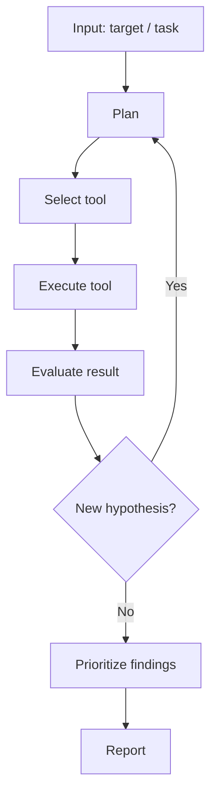
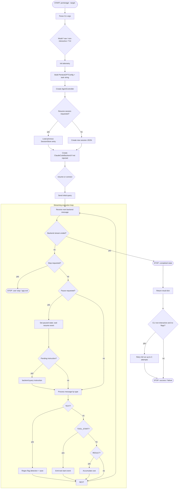
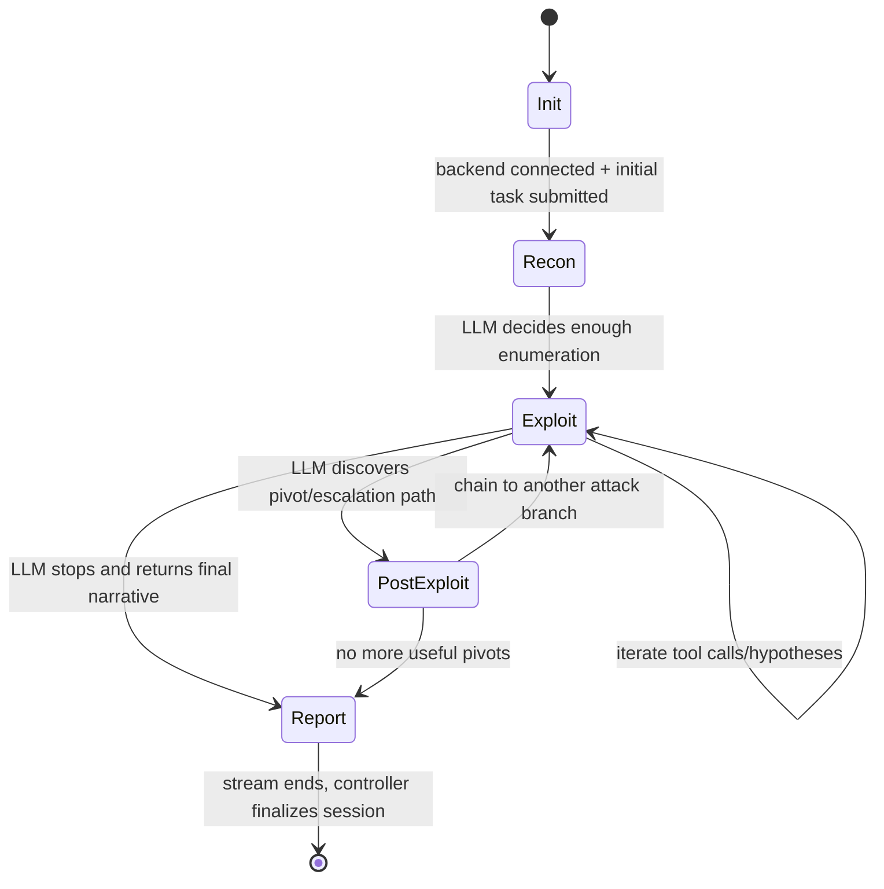

# PentestGPT - Project Analysis

> **Context:** This template provides a standardized analysis framework for
> autonomous penetration testing agents, designed for use in a bachelor thesis.
> It enables systematic, comparable evaluation of each agent's architecture,
> tool usage, and vulnerability discovery capabilities.

| Field | Value |
|-------|-------|
| **Project** | PentestGPT |
| **Version / Commit** | 1.0.0 / `6e84be8df5338b724adfb21c19700dd03547b007` (local clone) |
| **Repository** | https://github.com/GreyDGL/PentestGPT |
| **License** | MIT |
| **Language(s)** | Python 3.12, Shell (Docker/ops scripts) |
| **Runtime** | Docker-first interactive container + local Python CLI entrypoint |
| **Date Analyzed** | 2026-02-12 |

> **Template Ecosystem - Three-Layer Analysis:**
>
> | Layer | Template | Scope | Cardinality |
> |-------|----------|-------|-------------|
> | 1. Project Analysis | **this file** | Deep technical analysis of codebase, architecture, and design decisions | One per agent |
> | 2. Benchmark Results | `results-template.md` | Quantitative data: tool calls, flags, cost, duration, vulnerability coverage | One per agent x target |
> | 3. Learnings Synthesis | `learnings-template.md` | Qualitative synthesis: what worked, what to adopt for OpenHack | One per agent |
>
> **Workflow:** (1) Analyze the codebase and fill this template ->
> (2) Run benchmarks and fill `results-template.md` per target ->
> (3) Synthesize findings from both into `learnings-template.md`.

---

## 1. Project Profile

- **Primary goal:** Autonomous CTF challenge solving with strong focus on capturing flags, using penetration-testing style workflows (`PentestGPT/pentestgpt/prompts/pentesting.py:3`, `PentestGPT/README.md:66`).
- **Supported asset types:** CTF web targets, HTB-style hosts, service endpoints, and file/binary style tasks via command-line tooling (`PentestGPT/pentestgpt/prompts/pentesting.py:36`, `PentestGPT/README.md:68`).
- **Explicitly out of scope:** Strictly safe production assessment workflows and compliance-grade vulnerability reporting are not implemented as first-class outcomes; system is optimized for challenge solving and walkthrough output (`PentestGPT/pentestgpt/prompts/pentesting.py:149`, `PentestGPT/README.md:272`).
- **Assumed attacker model:** Authorized red-team/CTF participant with shell-level tool access in an isolated container (`PentestGPT/Dockerfile:26`, `PentestGPT/docker-compose.yml:18`).
- **Human-in-the-loop:** Yes. User provides target/instructions, can pause/resume/inject instructions in TUI, and can rerun with better guidance (`PentestGPT/pentestgpt/core/controller.py:106`, `PentestGPT/pentestgpt/interface/tui.py:355`, `PentestGPT/pentestgpt/interface/main.py:174`).
- **Short description (3-5 sentences):**
  PentestGPT v1.0 is a Docker-first autonomous pentesting/CTF agent that wraps Claude Code SDK behind a project-specific controller and TUI/CLI frontend (`PentestGPT/README.md:54`, `PentestGPT/pentestgpt/core/backend.py:78`). The runtime behavior is event-driven: the backend streams text/tool events, the controller tracks state and flags, and the UI renders live activity (`PentestGPT/pentestgpt/core/controller.py:179`, `PentestGPT/pentestgpt/core/events.py:14`). Persistence is file-based via per-session JSON files, enabling resume and post-run audit (`PentestGPT/pentestgpt/core/session.py:76`). The current design is highly autonomous in execution, but governance controls (budget limits, strict scope enforcement, tool guardrails) are limited in code and mostly policy-driven via prompting (`PentestGPT/pentestgpt/core/config.py:33`, `PentestGPT/pentestgpt/prompts/pentesting.py:28`).

---

## 2. Quickstart for Reproduction

> Required for thesis reproducibility. Document the exact steps to set up
> and run the agent from a clean state.

- **Entry point(s) in code:**
  - Primary CLI: `pentestgpt.interface.main:main` (`PentestGPT/pyproject.toml:35`, `PentestGPT/pentestgpt/interface/main.py:419`)
  - Programmatic runner: `run_pentest(...)` (`PentestGPT/pentestgpt/core/agent.py:258`)
- **Key configuration files:**
  - Runtime config model: `PentestGPT/pentestgpt/core/config.py:10`
  - Core system prompt: `PentestGPT/pentestgpt/prompts/pentesting.py:3`
  - Docker runtime and tools: `PentestGPT/Dockerfile:4`, `PentestGPT/docker-compose.yml:1`
  - Auth configuration helper: `PentestGPT/scripts/config.sh:1`
- **Startup command:**
  - `cd PentestGPT && make install && make config && make connect` (`PentestGPT/README.md:88`, `PentestGPT/Makefile:40`)
- **Minimal test run:**
  - In container shell: `pentestgpt --target http://host.docker.internal:8001 --non-interactive` (`PentestGPT/README.md:127`, `PentestGPT/pentestgpt/interface/main.py:151`)
- **Log / artifact output paths:**
  - Session JSON: `~/.pentestgpt/sessions/*.json` (`PentestGPT/pentestgpt/core/session.py:79`)
  - Optional debug log: `/workspace/pentestgpt-debug.log` or `/tmp/pentestgpt-debug.log` (`PentestGPT/pentestgpt/core/agent.py:24`)
  - CCR router log: `/tmp/ccr.log` (`PentestGPT/README.md:184`, `PentestGPT/scripts/entrypoint.sh:64`)

---

## 3. Architecture

### 3a. Component Decomposition

| Component | Purpose | Inputs | Outputs | Key Files |
|-----------|---------|--------|---------|-----------|
| Agent Core | Wraps task execution semantics and maps final output format | Target, custom instruction, config | Success/failure, text output, flags, cost, session id | `PentestGPT/pentestgpt/core/agent.py:258` |
| Planner / Orchestrator | Lifecycle state machine, pause/resume/inject flow, message processing | Task string, backend stream, UI events | State transitions, flags/cost/session updates, emitted UI events | `PentestGPT/pentestgpt/core/controller.py:29` |
| Executor | Connect/query/resume against Claude Code SDK client | System prompt, model, cwd, auth env | Stream of text/tool/result messages | `PentestGPT/pentestgpt/core/backend.py:78` |
| Tool Adapter | Converts Claude Code SDK blocks into framework-agnostic messages | `AssistantMessage`, `ToolUseBlock`, `ResultMessage` | `AgentMessage` events (`TEXT`, `TOOL_START`, `RESULT`) | `PentestGPT/pentestgpt/core/backend.py:151` |
| Memory / State | Persists run metadata and supports session resume/listing | Session id, status, flags, cost, user instructions | JSON session records | `PentestGPT/pentestgpt/core/session.py:76` |
| Reporter | Produces walkthrough-like textual output in CLI/TUI; no dedicated vuln report engine | Streamed text and tool events | Live feed + final console summary + session artifacts | `PentestGPT/pentestgpt/interface/tui.py:111`, `PentestGPT/pentestgpt/interface/main.py:151` |

### 3b. Generic Agent Loop (reference)

The following diagram shows a generic agent loop for comparison. Replace section 3c
with the project's actual flow.

### 3c. Project-Specific Agent Flow (Mermaid)

> **Customization checklist:**
> - [x] Replace placeholder nodes with actual function/method names
> - [x] Add agent-specific branches (resume session, pause/inject)
> - [x] Annotate edges with transition conditions where non-obvious
> - [x] Update STOP node with actual termination reasons

### 3d. Start and Stop Conditions

| Condition | Type | Trigger | Behavior |
|-----------|------|---------|----------|
| CLI invocation with target URL | **Start** | User runs `pentestgpt --target <target>` | Parse args, init telemetry, launch selected interface mode (`PentestGPT/pentestgpt/interface/main.py:419`) |
| Resume session by id/latest | **Start** | `--session-id` or `--resume` | Load prior JSON session; if missing, return error (`PentestGPT/pentestgpt/core/controller.py:195`) |
| Backend stream completion | **Stop (objective/self-assessed)** | `receive_messages()` iterator ends | Mark state completed, persist status, return result (`PentestGPT/pentestgpt/core/controller.py:285`) |
| No flags in non-interactive mode | **Stop (wrapper policy)** | `result.success` true but `flags_found` empty | Retry entire run up to 3 attempts with stronger instruction (`PentestGPT/pentestgpt/interface/main.py:174`) |
| Max attempts reached (CLI wrapper) | **Stop (budget/policy)** | `attempt > 3` in CLI wrapper | Exit code 1 with guidance (`PentestGPT/pentestgpt/interface/main.py:242`) |
| User interrupt (Ctrl+C) | **Stop (manual)** | Keyboard interrupt in main entrypoint | Print cancellation and exit code 130 (`PentestGPT/pentestgpt/interface/main.py:450`) |
| External timeout | **Stop (external)** | Benchmark harness kills long run (`--timeout`) | Process termination outside core controller (`PentestGPT/benchmark/README.md:117`) |
| Unrecoverable error | **Stop (error)** | Exceptions from backend/controller | Set error state, persist `last_error`, return failure (`PentestGPT/pentestgpt/core/controller.py:298`) |

### 3e. Phase Transitions

| From | To | Signal | Explicit or LLM-decided? | Code Location |
|------|----|--------|--------------------------|---------------|
| Init -> Recon | `backend.connect()`/`resume()` succeeds and `backend.query(task)` sent | Explicit | `PentestGPT/pentestgpt/core/controller.py:230` |
| Recon -> Exploit | Agent starts exploit commands after reconnaissance | LLM-decided (assumption) | `PentestGPT/pentestgpt/prompts/pentesting.py:28` |
| Exploit -> Post-Exploit | Successful foothold triggers escalation/pivot activity | LLM-decided (assumption) | `PentestGPT/pentestgpt/prompts/pentesting.py:59` |
| Exploit -> Report | Model ends response stream / concludes challenge | Largely LLM-decided; stream termination explicit | `PentestGPT/pentestgpt/core/backend.py:163`, `PentestGPT/pentestgpt/core/controller.py:285` |
| Post-Exploit -> Exploit | New path found and exploited | LLM-decided (assumption) | `PentestGPT/pentestgpt/prompts/pentesting.py:61` |
| Post-Exploit -> Report | No remaining valuable hypotheses | LLM-decided (assumption) | `PentestGPT/pentestgpt/prompts/pentesting.py:157` |

### 3f. Retry and Backtrack Strategy

- **On tool failure:** No controller-level deterministic retry policy; retries/alternatives are primarily delegated to model behavior via prompt guidance (assumption) (`PentestGPT/pentestgpt/prompts/pentesting.py:61`).
- **On exploit failure:** Prompt explicitly tells the model to switch techniques and re-enumerate; not enforced by explicit program logic (`PentestGPT/pentestgpt/prompts/pentesting.py:12`).
- **Max retries per hypothesis:** Not hardcoded at controller/backend level (assumption). At wrapper level, full-run retries are capped to 3 for non-interactive mode (`PentestGPT/pentestgpt/interface/main.py:175`).
- **Backtrack depth:** Potentially unbounded within a single model session until stream ends or external timeout (assumption).
- **Dead-end detection:** Mostly LLM self-assessment; plus wrapper-level heuristic "no flags found" triggers full rerun (`PentestGPT/pentestgpt/interface/main.py:220`).

### 3g. Memory and State Management

- **Session state:** `session_id`, target, status, task, user instructions, flags, cost, model, last error (`PentestGPT/pentestgpt/core/session.py:21`).
- **Short-term memory:** Maintained inside ongoing Claude Code conversation/context window (assumption from SDK usage) (`PentestGPT/pentestgpt/core/backend.py:143`).
- **Long-term memory:** No dedicated knowledge base; persistence is session JSON and optional telemetry user id (`PentestGPT/pentestgpt/core/session.py:79`, `PentestGPT/pentestgpt/core/langfuse.py:51`).
- **Persistence format:** File-based JSON (`~/.pentestgpt/sessions/*.json`) (`PentestGPT/pentestgpt/core/session.py:123`).
- **Resume capability:** Supported by CLI args and backend resume path (`PentestGPT/pentestgpt/interface/main.py:318`, `PentestGPT/pentestgpt/core/backend.py:195`).
- **Reset behavior:** New run without resume creates a fresh session; previous sessions remain on disk (`PentestGPT/pentestgpt/core/controller.py:206`).

---

## 4. Tool-Use Analysis

### 4a. Tool Inventory

| Tool | Type | Purpose | Agent Trigger | Input | Output | Error Handling | Security Constraints |
|------|------|---------|---------------|-------|--------|----------------|----------------------|
| ClaudeSDKClient session | internal | LLM interaction and streaming tool/text events | Controller creates backend and starts run | system prompt, task, model, cwd | `AgentMessage` stream | Exceptions propagated to controller error state | Permission mode configurable (`ask` or `bypassPermissions`) (`PentestGPT/pentestgpt/core/backend.py:123`) |
| Claude Code tool invocation channel (`ToolUseBlock`, usually `bash`) | external via SDK | Execute recon/exploit commands | LLM decides tool use during response generation | Tool name + args from model | Tool start events (results mostly embedded in text blocks) | If backend fails, controller returns error | Depends on Claude Code permissions; default bypass in config (`PentestGPT/pentestgpt/core/config.py:58`) |
| Preinstalled security binaries (`nmap`, `netcat`, `curl`, etc.) | external | Practical pentest operations inside container | Usually via bash tool calls from model | Shell commands | CLI output in conversation stream | Command-level failure handled implicitly by model narrative | Runs as non-root user with passwordless sudo capability (`PentestGPT/Dockerfile:66`) |
| `TerminalTool` placeholder (`terminal_execute`) | internal (placeholder) | Planned direct tool abstraction | Not part of main execution path (assumption) | command string | stub success dict | No real execution or retry logic | No runtime enforcement in MVP path (`PentestGPT/pentestgpt/tools/base.py:34`) |
| Benchmark CLI (`pentestgpt-benchmark`) | internal utility | Start/stop/list dockerized challenge targets | User-invoked benchmarking workflow | benchmark id/tags/levels | benchmark target URLs + container status | Non-zero exit on failures | No direct connection to controller safety logic (`PentestGPT/pentestgpt/benchmark/cli.py:133`) |

> **Type:** `internal` = built into the agent (custom HTTP client, code
> execution sandbox); `external` = shell-invoked CLI tool (nmap, sqlmap, ffuf).

### 4b. Tool Selection Strategy

- Tool selection during solving is mostly LLM-driven by system prompt and context; there is no deterministic hardcoded tool planner (`PentestGPT/pentestgpt/prompts/pentesting.py:112`, `PentestGPT/pentestgpt/core/controller.py:250`).
- The model is nudged toward standard pentest order (analysis -> recon -> vuln discovery -> exploit -> flag extraction), but the sequence is prompt-level guidance, not programmatically enforced (`PentestGPT/pentestgpt/prompts/pentesting.py:28`).
- No explicit forbidden tool combinations are implemented in controller/backend code.
- Time/cost awareness is weak in core loop (cost is tracked after completion but not used for adaptive stopping) (`PentestGPT/pentestgpt/core/controller.py:344`).
- Custom tool extension is possible architecturally by implementing `AgentBackend` or extending tool registry, but current runtime path uses Claude Code tools directly and does not wire registry tools into the control loop (`PentestGPT/pentestgpt/core/backend.py:31`, `PentestGPT/pentestgpt/tools/registry.py:8`).

### 4c. Tool-Use Risks

| Risk | Concrete Example | Impact | Existing Mitigation | Residual Risk |
|------|------------------|--------|---------------------|---------------|
| Hallucinated tool parameters | Model may construct invalid flags/options for CLI tools in free-form bash calls (assumption) | Wasted time/cost, noisy output, missed findings | Prompt encourages retries and alternatives (`PentestGPT/pentestgpt/prompts/pentesting.py:12`) | Medium-high |
| Over-privileged tool usage | Default permission mode is `bypassPermissions`; container user also has passwordless sudo | Potentially dangerous commands in wrong scope | Optional `ask` mode exists in config (`PentestGPT/pentestgpt/core/config.py:58`) | High |
| Unsafe command execution | Arbitrary shell commands executed through Claude Code tooling | Could harm test environment or exceed intended scope | Docker isolation and non-root runtime reduce host impact (`PentestGPT/docker-compose.yml:1`, `PentestGPT/Dockerfile:75`) | Medium-high |
| Missing tool-output validation | Controller emits tool start events, but does not implement strict semantic validation of outputs | False confidence, incomplete exploitation chains | Wrapper retries if no flags captured in CLI mode (`PentestGPT/pentestgpt/interface/main.py:220`) | Medium |

---

## 5. Operational Workflow

### 5a. Workflow Phases

| # | Phase | Entry Condition | Exit Condition | Typical Actions | Artifacts Produced |
|---|-------|-----------------|----------------|-----------------|--------------------|
| 1 | Initialization | CLI/TUI invocation with target | Config built, backend connected/resumed | Parse args, initialize telemetry, create session/controller | Session JSON created/loaded (`PentestGPT/pentestgpt/core/session.py:91`) |
| 2 | Reconnaissance | Initial task submitted to backend | LLM decides to shift into exploitation | Service discovery, endpoint mapping, command-based probing | Streaming messages/tool-start events (`PentestGPT/pentestgpt/core/backend.py:163`) |
| 3 | Hypothesis Generation | Recon outputs exist in conversation context | Candidate exploit path selected | Reasoning over findings, selecting exploit strategy | Text reasoning trace in message stream |
| 4 | Exploitation | Hypothesis selected by LLM | Flag captured or path exhausted | Execute commands/payloads, validate responses, pivot attempts | Tool events, text outputs, detected flags (`PentestGPT/pentestgpt/core/controller.py:318`) |
| 5 | Post-Exploitation | Initial foothold achieved (assumption) | No further useful escalation path | Privilege escalation, additional enumeration, artifact extraction | Additional flags and context entries in session JSON |
| 6 | Reporting | Backend stream ends or wrapper forces stop | Result returned to caller and shown in UI/CLI | Summarize walkthrough and found flags | Console/TUI summary + persisted cost/status/flags (`PentestGPT/pentestgpt/interface/main.py:197`) |

---

## 6. Vulnerability Discovery Model

### 6a. Methodology

- **Detection strategies:** Prompt-driven LLM reasoning + command execution + regex-based flag detection in returned text (`PentestGPT/pentestgpt/prompts/pentesting.py:28`, `PentestGPT/pentestgpt/core/controller.py:349`).
- **Exploitability verification:** Primarily operational (model runs commands and inspects outputs), but controller-level success criterion is strongly tied to flag extraction rather than structured exploit proof (`PentestGPT/pentestgpt/interface/main.py:199`).
- **Payload generation:** Dynamic, LLM-generated at runtime; no static payload library in current v1 core path (assumption from codebase scan).
- **False-positive handling:** Minimal deterministic handling; regex captures and deduplicates candidate flag strings without semantic validation (`PentestGPT/pentestgpt/core/controller.py:323`).
- **False-negative risk:** Non-trivial for non-standard flag formats and workflows that require browser-state logic; benchmark notes document hard unsolved cases and extraction issues (`PentestGPT/benchmark/standalone-xbow-benchmark-runner/results/dec-2025.md:101`).

### 6b. Browser vs. CLI Capabilities

- **Browser capabilities:** No first-class browser automation module in v1 core path (assumption from `pentestgpt/` scan).
- **Headless browser integration:** No direct Playwright/Puppeteer/Selenium integration in main runtime (`PentestGPT/pentestgpt/core/*`, assumption).
- **CLI-only limitations:** Browser-heavy vulnerabilities requiring DOM event precision or complex JS execution may be harder unless model compensates with indirect methods (assumption).

### 6c. Attack Chaining

- **Multi-step attacks:** Supported implicitly by open-ended conversation loop and persistent instructions in prompt (`PentestGPT/pentestgpt/prompts/pentesting.py:59`).
- **Privilege escalation:** Explicitly encouraged by prompt strategies (`PentestGPT/pentestgpt/prompts/pentesting.py:79`).
- **Lateral movement:** Not explicitly implemented as dedicated phase in code; possible only if LLM decides and environment allows (assumption).

---

## 7. Reporting and Output

- **Output format:** Primarily plain-text walkthrough stream plus terminal/TUI summaries; session state in JSON files (`PentestGPT/pentestgpt/interface/main.py:207`, `PentestGPT/pentestgpt/core/session.py:124`).
- **Severity classification:** No explicit CVSS/OWASP severity engine in v1 core runtime.
- **Remediation advice:** Not a first-class requirement; prompt prioritizes solving/capturing flags over remediation reporting (`PentestGPT/pentestgpt/prompts/pentesting.py:149`).
- **Evidence / PoC quality:** Depends on model-produced command/result narrative; tool start events are visible, but structured proof schema is absent (`PentestGPT/pentestgpt/core/controller.py:330`).
- **Report generation:** Integrated into the main loop as streamed text; final summary emitted at end of run in CLI/TUI wrappers (`PentestGPT/pentestgpt/interface/main.py:197`, `PentestGPT/pentestgpt/interface/tui.py:306`).

---

## 8. Security and Ethics Mechanisms

- **Scope enforcement:** No strict code-level allowlist for targets or command scope in controller/backend; enforcement is mostly user/prompt policy.
- **Rate limiting:** No explicit request throttling or global rate limiter in runtime control path.
- **Dangerous action guards:** Permission mode supports `ask`, but default is `bypassPermissions`; this weakens guardrails by default (`PentestGPT/pentestgpt/core/config.py:58`).
- **Secrets handling:** Interactive setup writes `.env.auth` with restrictive permissions (`chmod 600`), and runtime reads env vars (`PentestGPT/scripts/config.sh:84`, `PentestGPT/docker-compose.yml:41`).
- **Logging / auditability:** Event bus emits state/message/tool/flag events; session metadata/cost/flags persisted to JSON; optional debug logs available (`PentestGPT/pentestgpt/core/events.py:14`, `PentestGPT/pentestgpt/core/session.py:118`).
- **Legal / ethical constraints:** Repository includes explicit educational/authorized-use disclaimer, but there is no strong policy enforcement in runtime code (`PentestGPT/README.md:272`).

---

## 9. Evaluation Scorecard

> Standardized scoring for cross-project comparison. Rate each criterion 1-5
> based **solely on codebase review** (reading source code, documentation,
> and configuration). Criteria marked with *(B)* receive a preliminary score
> here; their final score is validated against benchmark data in
> `learnings-template.md`.

| Criterion | 1 (weak) | 3 (medium) | 5 (strong) | Score | Code Evidence |
|-----------|----------|------------|------------|-------|---------------|
| Flow traceability | barely documented | partly explainable | clear, reproducible | 4 | `PentestGPT/pentestgpt/core/controller.py:179`, `PentestGPT/pentestgpt/interface/main.py:419` |
| Tool-use transparency | black box | partly visible | fully traceable | 3 | `PentestGPT/pentestgpt/core/backend.py:151`, `PentestGPT/pentestgpt/core/events.py:124` |
| Reproducibility | hard to set up | partly documented | fully scripted setup | 4 | `PentestGPT/README.md:88`, `PentestGPT/Makefile:40`, `PentestGPT/docker-compose.yml:1` |
| Detection coverage *(B)* | few vuln categories | moderate coverage | comprehensive methodology | 4 | `PentestGPT/pentestgpt/prompts/pentesting.py:36`, `PentestGPT/benchmark/README.md:76` |
| False-positive handling *(B)* | none | basic checks | systematic verification | 2 | Regex-only flag detection in `PentestGPT/pentestgpt/core/controller.py:323` |
| Level of autonomy | mostly manual | semi-autonomous | robust autonomous | 4 | Autonomous run loop in `PentestGPT/pentestgpt/core/controller.py:250` |
| Execution safety | no guardrails | basic limits | defense-in-depth | 2 | Default bypass permissions `PentestGPT/pentestgpt/core/config.py:58`; no explicit scope guard |
| Extensibility | hard to adapt | moderate | modular, extensible | 4 | Backend abstraction `PentestGPT/pentestgpt/core/backend.py:31`, tool registry scaffold `PentestGPT/pentestgpt/tools/registry.py:8` |
| Cost awareness | no controls | basic limits | fine-grained budgeting | 2 | Cost is tracked but not used for stopping/planning `PentestGPT/pentestgpt/core/controller.py:344` |
| Adoptability for OpenHack | low transferability | selectively usable | directly adoptable | 4 | Reusable controller/event/session architecture (`PentestGPT/pentestgpt/core/controller.py:29`, `PentestGPT/pentestgpt/core/session.py:76`) |

**Overall score:** 33 / 50

> *(B)* = preliminary, to be validated by benchmarks. After running benchmarks,
> compare these code-review scores with actual performance in
> `learnings-template.md` section 9.

---

## 10. Strengths, Weaknesses, and Transferable Ideas

### 10a. Strengths (from code review)

- Clean separation between interface, orchestrator, backend adapter, and persistence; this improves maintainability and testability (`PentestGPT/pentestgpt/interface/main.py:419`, `PentestGPT/pentestgpt/core/controller.py:29`, `PentestGPT/pentestgpt/core/backend.py:31`, `PentestGPT/pentestgpt/core/session.py:76`).
- Robust interactive control model (pause/resume/inject) with event bus decoupling UI from execution (`PentestGPT/pentestgpt/core/controller.py:106`, `PentestGPT/pentestgpt/core/events.py:59`).
- Practical reproducibility through Docker-first distribution and scripted setup (`PentestGPT/README.md:88`, `PentestGPT/Dockerfile:4`, `PentestGPT/Makefile:40`).
- Session persistence and resume improve long-running workflow resilience (`PentestGPT/pentestgpt/core/session.py:126`, `PentestGPT/pentestgpt/core/backend.py:195`).
- Benchmark ecosystem is well-structured and produces useful aggregate analytics (`PentestGPT/benchmark/README.md:98`, `PentestGPT/benchmark/standalone-xbow-benchmark-runner/results/dec-2025.md:1`).

### 10b. Weaknesses (from code review)

- Safety guardrails are weak by default (`bypassPermissions`) and no strict scope policy is enforced in controller logic (`PentestGPT/pentestgpt/core/config.py:58`).
- No explicit hard limits for iterations/cost inside the core loop despite config fields (for example `max_iterations` is not enforced in controller path) (`PentestGPT/pentestgpt/core/config.py:33`, `PentestGPT/pentestgpt/core/controller.py:250`).
- Tool-output validation is minimal; flag detection relies on regex and can misclassify artifacts (`PentestGPT/pentestgpt/core/controller.py:349`, `PentestGPT/benchmark/standalone-xbow-benchmark-runner/results/dec-2025.md:101`).
- Placeholder internal tool framework is not yet integrated into primary execution path (`PentestGPT/pentestgpt/tools/base.py:34`).
- Reporting is challenge-walkthrough oriented; structured vuln taxonomy/severity/remediation output is underdeveloped for enterprise pentest reporting needs (`PentestGPT/pentestgpt/prompts/pentesting.py:149`).

### 10c. Transferable Ideas for OpenHack

| Idea / Mechanism | Why Useful | Effort (low / med / high) | Priority |
|------------------|-----------|---------------------------|----------|
| Event-bus mediated UI/agent communication | Decouples runtime logic from presentation and simplifies observability hooks | med | High |
| File-based session checkpointing and resume | Cheap persistence layer that supports interrupted long runs | low | High |
| Controller-level lifecycle state machine (`idle/running/paused/...`) | Improves operational control and debuggability | med | High |
| Non-interactive wrapper retry policy when objective unmet | Simple reliability gain for autonomous runs without manual supervision | low | Medium |
| Benchmark runner with standardized metadata and cost/time analytics | Enables consistent scientific comparison across agent variants | high | High |

> **Detailed prioritized recommendations** belong in `learnings-template.md`
> section 8, where this analysis is combined with benchmark results for the final
> synthesis.

---

## 11. Cross-Project Comparison

> Fill in after analyzing multiple agents. Keep brief here - the full
> comparison lives in `learnings-template.md` section 9.

- Similarities with CAI: Both use a single LLM-driven agent loop with tool invocation via SDK. Both lack browser capability, limiting client-side vulnerability testing. Both rely on system prompts for task guidance rather than structured planning.
- Key differences from Strix: Strix uses a multi-tool architecture (browser + proxy + terminal + Python), produces CVSS-scored vulnerability reports with validated PoCs, and uses GPT-5 (vs. Sonnet 4.5). PentestGPT achieves deeper exploitation (OS shell access) but produces less structured output (flag submissions vs. CVSS reports).
- Relative positioning: Strong operational autonomy and tool breadth (sqlmap, gobuster, nmap, hashcat); weaker on output structure and client-side testing capability.
- Open questions for follow-up investigation: How much performance gain comes from prompt engineering versus controller design choices?

---

## 12. Sources and Evidence

| Type | Reference | Relevance | Date |
|------|-----------|-----------|------|
| README | `PentestGPT/README.md` | Official usage model, benchmark claims, legal framing | 2026-02-12 |
| Code path | `PentestGPT/pentestgpt/core/controller.py` | Main lifecycle/orchestration logic | 2026-02-12 |
| Code path | `PentestGPT/pentestgpt/core/backend.py` | SDK integration and tool event translation | 2026-02-12 |
| Code path | `PentestGPT/pentestgpt/core/session.py` | Persistence and resume behavior | 2026-02-12 |
| Code path | `PentestGPT/pentestgpt/prompts/pentesting.py` | Methodology/tool policy encoded in prompt | 2026-02-12 |
| Code path | `PentestGPT/pentestgpt/core/config.py` | Runtime guardrails and defaults | 2026-02-12 |
| Code path | `PentestGPT/Dockerfile` | Installed tooling and execution environment | 2026-02-12 |
| Paper / blog | USENIX paper link in `PentestGPT/README.md:27` | Research provenance | 2026-02-12 |
| Issue / discussion | `PentestGPT/benchmark/standalone-xbow-benchmark-runner/results/dec-2025.md` | Observed limitations and failure patterns | 2026-02-12 |

---

## 13. Setup and Execution Protocol

> Document the exact steps to install and run this agent from a clean state.
> Required for thesis reproducibility. Benchmark-specific parameters and
> results belong in `results-template.md`.

1. **Prerequisites:** Linux/macOS with Docker; Python tooling for local development; one auth method (`manual`, `openrouter`, `anthropic`, or `local`) (`PentestGPT/README.md:78`, `PentestGPT/scripts/config.sh:32`).
2. **Installation:**
   - `git clone --recurse-submodules https://github.com/GreyDGL/PentestGPT.git`
   - `cd PentestGPT`
   - `make install`
3. **Configuration:**
   - `make config` and select auth mode (writes `.env.auth`)
   - `make connect` to start/attach container (`PentestGPT/Makefile:48`)
4. **Verify installation:**
   - Inside container: `pentestgpt --version`
   - Optional smoke test: `pentestgpt --target http://host.docker.internal:8001 --non-interactive`
5. **Run against a target:**
   - Interactive: `pentestgpt --target <TARGET>`
   - Non-interactive: `pentestgpt --target <TARGET> --non-interactive`
   - Resume latest session for same target: `pentestgpt --target <TARGET> --resume`
6. **Known issues / gotchas:**
   - No strict built-in scope guardrails by default; verify legal authorization before execution (`PentestGPT/README.md:272`).
   - Long tasks may require external timeout handling in benchmark harness (`PentestGPT/benchmark/README.md:117`).
   - For host-side services from container, use `host.docker.internal` instead of `localhost` (`PentestGPT/README.md:183`).

---

### Fill Rules

- Fill this template **entirely from source code, documentation, and project configuration** - no benchmark runs required.
- Every claim must cite a specific code path, file, or documentation section as evidence.
- Mark uncertainty explicitly as **"assumption"** (for example when behavior is LLM-dependent and not deterministic from code).
- Use identical structure across all projects for comparability.
- Empirical validation of claims (actual behavior, performance, accuracy) belongs in `results-template.md` and `learnings-template.md`.
