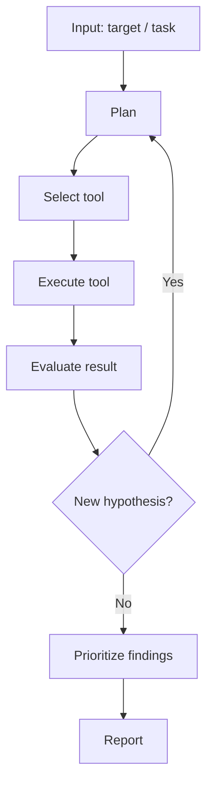
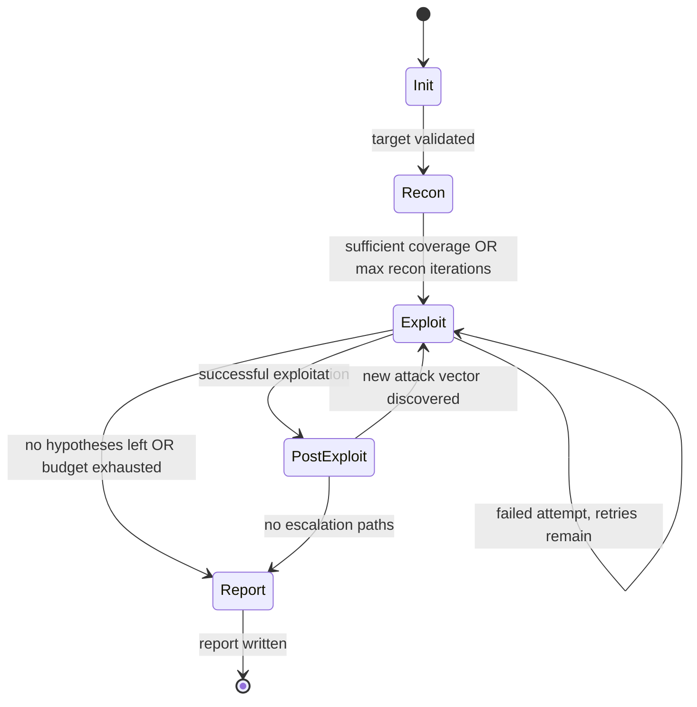

# {AGENT_NAME} — Project Analysis

> **Context:** This template provides a standardized analysis framework for
> autonomous penetration testing agents, designed for use in a bachelor thesis.
> It enables systematic, comparable evaluation of each agent's architecture,
> tool usage, and vulnerability discovery capabilities.

| Field | Value |
|-------|-------|
| **Project** | {AGENT_NAME} |
| **Version / Commit** | {VERSION_OR_COMMIT} |
| **Repository** | {REPO_URL} |
| **License** | {LICENSE} |
| **Language(s)** | {LANGUAGES} |
| **Runtime** | {e.g., Docker, local Python, cloud API} |
| **Date Analyzed** | {DATE} |

> **Template Ecosystem — Three-Layer Analysis:**
>
> | Layer | Template | Scope | Cardinality |
> |-------|----------|-------|-------------|
> | 1. Project Analysis | **this file** | Deep technical analysis of codebase, architecture, and design decisions | One per agent |
> | 2. Benchmark Results | `results-template.md` | Quantitative data: tool calls, flags, cost, duration, vulnerability coverage | One per agent × target |
> | 3. Learnings Synthesis | `learnings-template.md` | Qualitative synthesis: what worked, what to adopt for OpenHack | One per agent |
>
> **Workflow:** (1) Analyze the codebase and fill this template →
> (2) Run benchmarks and fill `results-template.md` per target →
> (3) Synthesize findings from both into `learnings-template.md`.

---

## 1. Project Profile

- **Primary goal:** {e.g., web app pentest, CTF solving, code audit, red teaming}
- **Supported asset types:** {e.g., web apps, APIs, network services, binaries}
- **Explicitly out of scope:** {what the agent cannot or will not test}
- **Assumed attacker model:** {e.g., unauthenticated remote, authenticated user, local}
- **Human-in-the-loop:** {yes/no — where in the workflow and why}
- **Short description (3–5 sentences):**

---

## 2. Quickstart for Reproduction

> Required for thesis reproducibility. Document the exact steps to set up
> and run the agent from a clean state.

- **Entry point(s) in code:** {main file(s), CLI entrypoint}
- **Key configuration files:** {paths to config, prompts, agent definitions}
- **Startup command:** {exact command}
- **Minimal test run:** {shortest command to verify functionality}
- **Log / artifact output paths:** {where results are written}

---

## 3. Architecture

### 3a. Component Decomposition

| Component | Purpose | Inputs | Outputs | Key Files |
|-----------|---------|--------|---------|-----------|
| Agent Core | | | | |
| Planner / Orchestrator | | | | |
| Executor | | | | |
| Tool Adapter | | | | |
| Memory / State | | | | |
| Reporter | | | | |

### 3b. Generic Agent Loop (reference)

The following diagram shows a generic agent loop for comparison. Replace §3c
with the project's actual flow.

### 3c. Project-Specific Agent Flow (Mermaid)

> **Instructions:** Replace the diagram below with the project's actual control
> flow. Capture every phase, decision point, and loop. Use color/style to
> distinguish phases (recon, exploit, post-exploit, report). Show start and
> stop conditions explicitly as terminal nodes.

```mermaid
flowchart TD
    START([🟢 START<br/>Trigger: CLI invocation])
    START --> INIT

    subgraph INIT_PHASE [Phase 1 — Initialization]
        INIT[Load config + model]
        INIT --> PARSE[Parse target URL]
        PARSE --> HEALTH{Target reachable?}
        HEALTH -- No --> FAIL_EARLY([🔴 STOP<br/>Target unreachable])
        HEALTH -- Yes --> RECON_ENTRY
    end

    subgraph RECON_PHASE [Phase 2 — Reconnaissance]
        RECON_ENTRY[Begin recon]
        RECON_ENTRY --> SCAN[Port scan / endpoint discovery]
        SCAN --> FINGERPRINT[Technology fingerprinting]
        FINGERPRINT --> SITEMAP[Crawl sitemap / robots.txt / JS]
        SITEMAP --> MAP_COMPLETE{Sufficient coverage?}
        MAP_COMPLETE -- No --> SCAN
    end

    MAP_COMPLETE -- Yes --> HYPOTHESIS

    subgraph EXPLOIT_PHASE [Phase 3 — Hypothesis + Exploitation]
        HYPOTHESIS[Generate attack hypotheses]
        HYPOTHESIS --> PRIORITIZE[Rank by likelihood × impact]
        PRIORITIZE --> SELECT[Select next hypothesis]
        SELECT --> PAYLOAD[Craft payload / tool call]
        PAYLOAD --> EXECUTE[Execute exploit attempt]
        EXECUTE --> EVAL{Success?}
        EVAL -- Yes --> EVIDENCE[Capture evidence / PoC]
        EVAL -- No --> BACKTRACK{Retries left?}
        BACKTRACK -- Yes --> PAYLOAD
        BACKTRACK -- No --> MORE{More hypotheses?}
        EVIDENCE --> MORE
        MORE -- Yes --> SELECT
    end

    MORE -- No --> POST

    subgraph POST_PHASE [Phase 4 — Post-Exploitation]
        POST[Extract data / escalate]
        POST --> CHAIN{Chain to new attack?}
        CHAIN -- Yes --> HYPOTHESIS
    end

    CHAIN -- No --> REPORT

    subgraph REPORT_PHASE [Phase 5 — Reporting]
        REPORT[Generate report]
        REPORT --> OUTPUT[Write artifacts to disk]
    end

    OUTPUT --> STOP([🔴 STOP<br/>Reason: ___])

    style START fill:#2d6a2d,color:#fff
    style FAIL_EARLY fill:#8b0000,color:#fff
    style STOP fill:#8b0000,color:#fff
    style INIT_PHASE fill:#1a1a2e,color:#fff
    style RECON_PHASE fill:#16213e,color:#fff
    style EXPLOIT_PHASE fill:#0f3460,color:#fff
    style POST_PHASE fill:#533483,color:#fff
    style REPORT_PHASE fill:#2c3e50,color:#fff
```

> **Customization checklist:**
> - [ ] Replace placeholder nodes with actual function/method names
> - [ ] Add agent-specific branches (e.g., multi-agent handoff, parallel execution)
> - [ ] Annotate edges with transition conditions where non-obvious
> - [ ] Update STOP node with actual termination reasons

### 3d. Start and Stop Conditions

| Condition | Type | Trigger | Behavior |
|-----------|------|---------|----------|
| CLI invocation with target URL | **Start** | User runs `{COMMAND}` | Agent initializes, loads config |
| Target unreachable | **Stop (early)** | Health check fails after N retries | Exit with error |
| Max iterations reached | **Stop (budget)** | `turn_count >= max_turns` | {Exit cleanly / prompt user / continue reporting?} |
| Cost limit exceeded | **Stop (budget)** | `total_cost >= price_limit` | {Exit / warn / reduce scope?} |
| Timeout | **Stop (external)** | Wall-clock limit (e.g., `timeout 1800s`) | SIGINT → cleanup → exit |
| Coverage saturation | **Stop (self-assessed)** | Agent determines no more hypotheses | Transition to reporting |
| All challenges solved | **Stop (objective)** | {CTF-specific: all flags found} | Transition to reporting |
| User interrupt (Ctrl+C) | **Stop (manual)** | SIGINT from user | {Save state / discard / prompt?} |
| Unrecoverable error | **Stop (error)** | Tool crash, API failure, OOM | {Retry / abort / partial report?} |

> Fill in the **Behavior** column with the project's actual implementation.
> Delete rows that don't apply. Add project-specific conditions as needed.

### 3e. Phase Transitions

> Document how the agent moves between phases. For each transition, identify
> the signal, whether it's explicit in code (hardcoded logic) or implicit
> (LLM decides), and cite the responsible code location.

| From | To | Signal | Explicit or LLM-decided? | Code Location |
|------|----|--------|--------------------------|---------------|
| Init → Recon | Target health check passes | | | |
| Recon → Exploit | {e.g., endpoint map built, N endpoints found} | | | |
| Exploit → Post-Exploit | {e.g., successful SQLi, admin access gained} | | | |
| Exploit → Report | {e.g., no hypotheses left, budget exhausted} | | | |
| Post-Exploit → Exploit | {e.g., new credentials found, pivot opportunity} | | | |
| Post-Exploit → Report | {e.g., no escalation paths remaining} | | | |

### 3f. Retry and Backtrack Strategy

- **On tool failure:** {retry same tool, try alternative tool, skip, abort?}
- **On exploit failure:** {modify payload, try different vuln class, move on?}
- **Max retries per hypothesis:** {number or unlimited?}
- **Backtrack depth:** {can it revisit earlier phases? How far back?}
- **Dead-end detection:** {how does it recognize it's stuck?}

### 3g. Memory and State Management

- **Session state:** {what is tracked within a single run?}
- **Short-term memory:** {context window management, summarization?}
- **Long-term memory:** {cross-session persistence, knowledge base?}
- **Persistence format:** {JSON, SQLite, files, in-memory only?}
- **Resume capability:** {can it continue from a previous session?}
- **Reset behavior:** {what happens on restart?}

---

## 4. Tool-Use Analysis

### 4a. Tool Inventory

| Tool | Type | Purpose | Agent Trigger | Input | Output | Error Handling | Security Constraints |
|------|------|---------|---------------|-------|--------|----------------|----------------------|
| | int. / ext. | | | | | | |

> **Type:** `internal` = built into the agent (custom HTTP client, code
> execution sandbox); `external` = shell-invoked CLI tool (nmap, sqlmap, ffuf).

### 4b. Tool Selection Strategy

- How does the agent decide *which* tool to use?
- Are there tool priorities, heuristics, or a fixed sequence?
- Are there forbidden tool combinations or ordering constraints?
- Is there time / cost awareness in tool selection?
- Can users add custom tools? How?

### 4c. Tool-Use Risks

| Risk | Concrete Example | Impact | Existing Mitigation | Residual Risk |
|------|------------------|--------|---------------------|---------------|
| Hallucinated tool parameters | | | | |
| Over-privileged tool usage | | | | |
| Unsafe command execution | | | | |
| Missing tool-output validation | | | | |

---

## 5. Operational Workflow

### 5a. Workflow Phases

| # | Phase | Entry Condition | Exit Condition | Typical Actions | Artifacts Produced |
|---|-------|-----------------|----------------|-----------------|--------------------|
| 1 | Initialization | CLI invocation | Config loaded, target validated | | |
| 2 | Reconnaissance | Target reachable | Sufficient endpoint coverage | | |
| 3 | Hypothesis Generation | Recon data available | Prioritized attack list built | | |
| 4 | Exploitation | Hypotheses ranked | All hypotheses tested OR budget spent | | |
| 5 | Post-Exploitation | Successful exploit | No escalation paths remaining | | |
| 6 | Reporting | Testing complete OR budget exhausted | Report written to disk | | |

---

## 6. Vulnerability Discovery Model

### 6a. Methodology

- **Detection strategies:** {pattern matching, rule-based, fuzzing, LLM reasoning, search?}
- **Exploitability verification:** {does it confirm true exploitability or only indicators?}
- **Payload generation:** {hardcoded, dynamic, payload library, LLM-generated?}
- **False-positive handling:** {explicit verification strategy or none?}
- **False-negative risk:** {known blind spots, untested categories?}

### 6b. Browser vs. CLI Capabilities

- **Browser capabilities:** {JS execution, DOM interaction, CSRF token handling?}
- **Headless browser integration:** {Playwright, Puppeteer, Selenium, none?}
- **CLI-only limitations:** {which vulnerability categories are unreachable without a browser?}

### 6c. Attack Chaining

- **Multi-step attacks:** {can it chain vulns? e.g., SQLi → cred dump → admin login}
- **Privilege escalation:** {does it attempt escalation after initial access?}
- **Lateral movement:** {does it pivot to other services/endpoints?}

---

## 7. Reporting and Output

- **Output format:** {Markdown, JSON, HTML, structured data?}
- **Severity classification:** {CVSS, custom scale, OWASP categories?}
- **Remediation advice:** {does it suggest fixes?}
- **Evidence / PoC quality:** {proof-of-concept commands, screenshots, request/response?}
- **Report generation:** {when is the report generated — continuously or at the end? Is it a separate phase or integrated into the main loop?}

---

## 8. Security and Ethics Mechanisms

- **Scope enforcement:** {how does the agent stay within defined scope?}
- **Rate limiting:** {does it throttle requests to avoid DoS?}
- **Dangerous action guards:** {confirmation prompts, command blocklists, sandboxing?}
- **Secrets handling:** {how are API keys / credentials stored and injected?}
- **Logging / auditability:** {is every action traceable and reproducible?}
- **Legal / ethical constraints:** {built-in refusal mechanisms, content filtering?}

---

## 9. Evaluation Scorecard

> Standardized scoring for cross-project comparison. Rate each criterion 1–5
> based **solely on codebase review** (reading source code, documentation,
> and configuration). Criteria marked with *(B)* receive a preliminary score
> here; their final score is validated against benchmark data in
> `learnings-template.md`.

| Criterion | 1 (weak) | 3 (medium) | 5 (strong) | Score | Code Evidence |
|-----------|----------|------------|------------|-------|---------------|
| Flow traceability | barely documented | partly explainable | clear, reproducible | | {file:line or description} |
| Tool-use transparency | black box | partly visible | fully traceable | | |
| Reproducibility | hard to set up | partly documented | fully scripted setup | | |
| Detection coverage *(B)* | few vuln categories | moderate coverage | comprehensive methodology | | |
| False-positive handling *(B)* | none | basic checks | systematic verification | | |
| Level of autonomy | mostly manual | semi-autonomous | robust autonomous | | |
| Execution safety | no guardrails | basic limits | defense-in-depth | | |
| Extensibility | hard to adapt | moderate | modular, extensible | | |
| Cost awareness | no controls | basic limits | fine-grained budgeting | | |
| Adoptability for OpenHack | low transferability | selectively usable | directly adoptable | | |

**Overall score:** {sum or weighted average} / 50

> *(B)* = preliminary, to be validated by benchmarks. After running benchmarks,
> compare these code-review scores with actual performance in
> `learnings-template.md` § 9.

---

## 10. Strengths, Weaknesses, and Transferable Ideas

### 10a. Strengths (from code review)

- {Cite specific code paths, architecture decisions, or design patterns}

### 10b. Weaknesses (from code review)

- {Cite specific code paths, missing functionality, or design limitations}

### 10c. Transferable Ideas for OpenHack

| Idea / Mechanism | Why Useful | Effort (low / med / high) | Priority |
|------------------|-----------|---------------------------|----------|
| | | | |

> **Detailed prioritized recommendations** belong in `learnings-template.md`
> § 8, where this analysis is combined with benchmark results for the final
> synthesis.

---

## 11. Cross-Project Comparison

> Fill in after analyzing multiple agents. Keep brief here — the full
> comparison lives in `learnings-template.md` § 9.

- Similarities with {PROJECT_X}:
- Key differences from {PROJECT_X}:
- Relative positioning:
- Open questions for follow-up investigation:

---

## 12. Sources and Evidence

| Type | Reference | Relevance | Date |
|------|-----------|-----------|------|
| README | | | |
| Code path | | | |
| Paper / blog | | | |
| Issue / discussion | | | |

---

## 13. Setup and Execution Protocol

> Document the exact steps to install and run this agent from a clean state.
> Required for thesis reproducibility. Benchmark-specific parameters and
> results belong in `results-template.md`.

1. **Prerequisites:** {OS, Docker, Python version, API keys needed}
2. **Installation:** {clone, install dependencies, build steps}
3. **Configuration:** {env vars, config files, model selection}
4. **Verify installation:** {smoke-test command to confirm it works}
5. **Run against a target:** {exact command with placeholder target URL}
6. **Known issues / gotchas:** {common setup problems and workarounds}

---

### Fill Rules

- Fill this template **entirely from source code, documentation, and project configuration** — no benchmark runs required.
- Every claim must cite a specific code path, file, or documentation section as evidence.
- Mark uncertainty explicitly as **"assumption"** (e.g., when behavior is LLM-dependent and not deterministic from code).
- Use identical structure across all projects for comparability.
- Empirical validation of claims (actual behavior, performance, accuracy) belongs in `results-template.md` and `learnings-template.md`.
