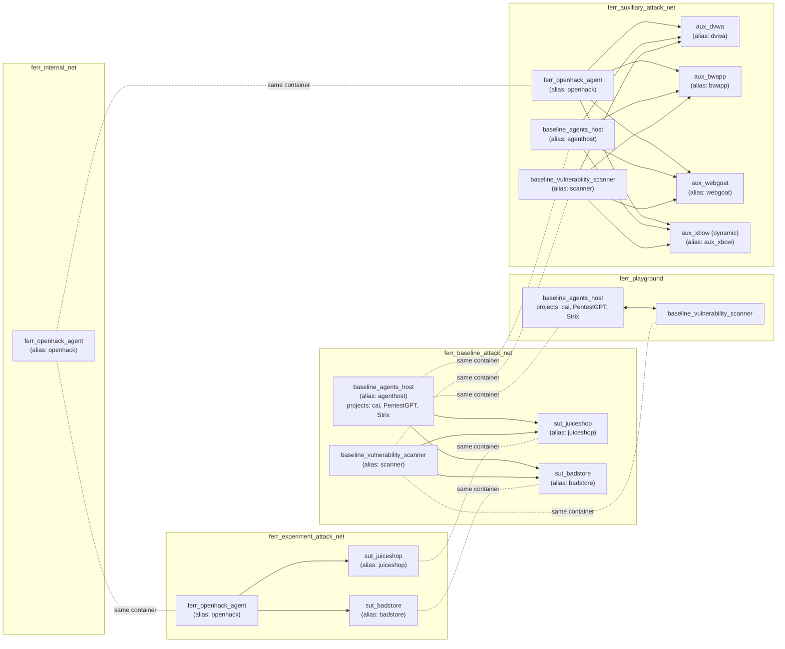
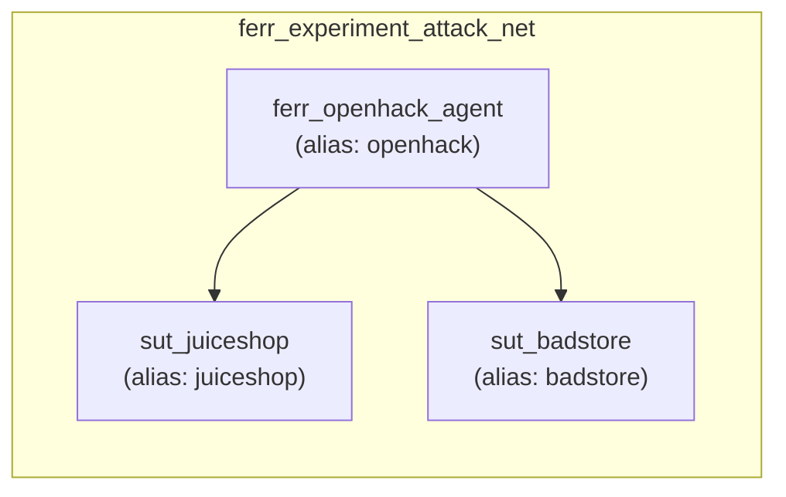
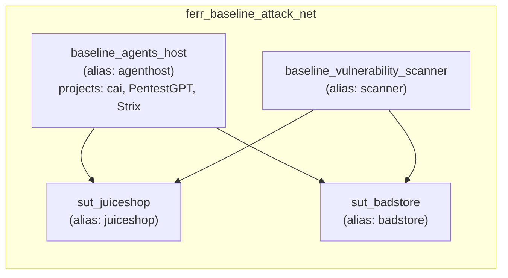
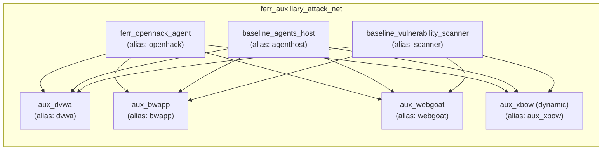

# Docker Topology

## Verification Status

- Last verified: **2026-02-25**
- Compose source: `containers/compose.yaml` (`name: ferr`, service/network definitions)
- Dynamic benchmark alias source: `containers/bin/benchmark-xbow` (`ferr_auxiliary_attack_net`, alias `aux_xbow`)

## Goal
Define the current Docker research testbed layout, including:
- container responsibilities
- network boundaries
- stable logical hostnames used by tools and agents

This setup keeps descriptive infrastructure names while preserving one-word runtime hostnames (`juiceshop`, `dvwa`, `openhack`, etc.) through network aliases.

## Runtime Overview

### Containers

| Container | Purpose | Profiles | Exposed Host Ports |
|---|---|---|---|
| `ferr_openhack_agent` | Main OpenHack runtime for orchestration, exploit workflow, and reporting | default | `127.0.0.1:4096->4096`, `${OPENCODE_APP_PORT:-0}->3000` |
| `baseline_agents_host` | Baseline agent runner host (Kali-based) hosting `cai`, `PentestGPT`, and `Strix` for comparative agent execution | `playground` | none |
| `baseline_vulnerability_scanner` | Baseline vulnerability scanner (OpenVAS/GVM) | `playground` | none |
| `sut_juiceshop` | SUT: OWASP Juice Shop | `targets` | `127.0.0.1:3333->3000` |
| `aux_dvwa` | Auxiliary target: DVWA | `targets` | `127.0.0.1:3334->80` |
| `aux_bwapp` | Auxiliary target: bWAPP | `targets` | `127.0.0.1:3335->80` |
| `sut_badstore` | SUT: BadStore | `targets` | `127.0.0.1:3336->80` |
| `aux_webgoat` | Auxiliary target: WebGoat/WebWolf | `targets` | `127.0.0.1:3337->8080`, `127.0.0.1:3338->9090` |

### Networks
| Network | Purpose | Members |
|---|---|---|
| `ferr_internal_net` | Internal OpenHack network | `ferr_openhack_agent` |
| `ferr_experiment_attack_net` | Experiment path (`ferr_openhack_agent -> active sut_*`) | `ferr_openhack_agent`, `sut_juiceshop`, `sut_badstore` |
| `ferr_baseline_attack_net` | Baseline path (`baseline_* -> active sut_*`) | `baseline_agents_host`, `baseline_vulnerability_scanner`, `sut_juiceshop`, `sut_badstore` |
| `ferr_auxiliary_attack_net` | Auxiliary-target plane (`aux_*`) reachable by OpenHack and baseline hosts | `ferr_openhack_agent`, `baseline_agents_host`, `baseline_vulnerability_scanner`, `aux_dvwa`, `aux_bwapp`, `aux_webgoat`, dynamic `aux_xbow` |
| `ferr_playground` | Baseline host-to-host internal plane | `baseline_agents_host`, `baseline_vulnerability_scanner` |

## Stable Hostname Aliases

These aliases are intentionally stable for tools/scripts:

| Container | Network | Alias |
|---|---|---|
| `ferr_openhack_agent` | `ferr_internal_net` | `openhack` |
| `ferr_openhack_agent` | `ferr_experiment_attack_net` | `openhack` |
| `ferr_openhack_agent` | `ferr_auxiliary_attack_net` | `openhack` |
| `baseline_agents_host` | `ferr_baseline_attack_net` | `agenthost` |
| `baseline_agents_host` | `ferr_auxiliary_attack_net` | `agenthost` |
| `baseline_vulnerability_scanner` | `ferr_baseline_attack_net` | `scanner` |
| `baseline_vulnerability_scanner` | `ferr_auxiliary_attack_net` | `scanner` |
| `sut_juiceshop` | both attack nets | `juiceshop` |
| `sut_badstore` | both attack nets | `badstore` |
| `aux_dvwa` | `ferr_auxiliary_attack_net` | `dvwa` |
| `aux_bwapp` | `ferr_auxiliary_attack_net` | `bwapp` |
| `aux_webgoat` | `ferr_auxiliary_attack_net` | `webgoat` |
| `XBOW benchmark primary container (dynamic)` | `ferr_auxiliary_attack_net` | `aux_xbow` |

Examples:
- from `ferr_openhack_agent`: `http://juiceshop:3000`, `http://badstore:80`
- from `baseline_agents_host`: `http://juiceshop:3000`, `http://scanner:9392` (service-dependent)
- aux targets from both hosts: `http://dvwa:80`, `http://bwapp:80`, `http://webgoat:8080`

## Full Topology Diagram



## Experiment View (OpenHack + SUT)



## Baseline View (Baseline + SUT)



## Auxiliary View



## Operational Notes
- Container/service names are descriptive for research methodology and role clarity.
- Runtime target access should use logical aliases, not infrastructure names.
- `aux_*` targets are on `ferr_auxiliary_attack_net` and are reachable from `ferr_openhack_agent`, `baseline_agents_host`, and `baseline_vulnerability_scanner`.
- The `containers/bin/benchmark-xbow` script attaches benchmark stacks to `ferr_auxiliary_attack_net`; the primary benchmark app is exposed there with hostname alias `aux_xbow`.
- SUT host ports are bound to localhost, keeping targets accessible from the host while reducing external exposure.

## Verification Commands

```bash
docker compose -f containers/compose.yaml --profile targets --profile playground up -d --force-recreate --remove-orphans
docker network inspect ferr_experiment_attack_net --format '{{range $k,$v := .Containers}}{{println $v.Name}}{{end}}' | sort
docker network inspect ferr_baseline_attack_net --format '{{range $k,$v := .Containers}}{{println $v.Name}}{{end}}' | sort
docker network inspect ferr_auxiliary_attack_net --format '{{range $k,$v := .Containers}}{{println $v.Name}}{{end}}' | sort
docker exec ferr_openhack_agent getent hosts openhack juiceshop badstore
docker exec baseline_agents_host getent hosts agenthost scanner juiceshop badstore
docker exec ferr_openhack_agent getent hosts dvwa bwapp webgoat
docker exec baseline_agents_host getent hosts dvwa bwapp webgoat
```
