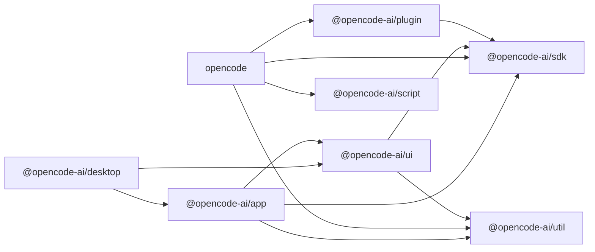
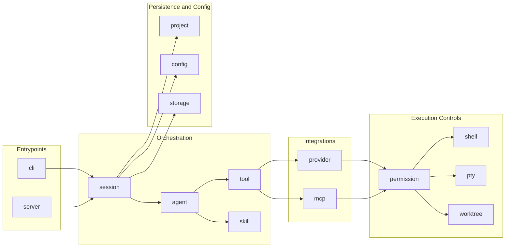

# OpenCode Project Overview

This document covers the OpenCode product layer in this repository (runtime, apps, SDK, and shared packages).

## Scope

OpenCode in this repo includes:
- CLI/TUI runtime,
- API server,
- web app,
- desktop app,
- SDK and shared libraries used by those surfaces.

OpenHack-specific pentest workflows are documented in `project-openhack.md`.

## Core Top-Level Paths

| Path | Purpose |
| --- | --- |
| `package.json` | Monorepo scripts, workspace config, dependency catalog |
| `turbo.json` | Turborepo task graph |
| `packages/` | Product packages and shared libraries |
| `script/` | Repo-level utilities (`generate.ts`, formatting, report deps helper) |
| `patches/` | Patched upstream dependencies |
| `third_party_licenses/` | Third-party license attribution |
| `AGENTS.md` | Local coding/testing guardrails for contributors |

## Package Map

| Package | Purpose |
| --- | --- |
| `packages/opencode` | Core runtime: CLI/TUI/server, agent/session/tooling infrastructure |
| `packages/app` | Web frontend (Solid + Vite) |
| `packages/desktop` | Tauri desktop wrapper around app UI |
| `packages/sdk/js` | JavaScript SDK (`@opencode-ai/sdk`) |
| `packages/ui` | Shared UI components and theme primitives |
| `packages/util` | Shared utility library |
| `packages/plugin` | Plugin helpers and tool schema helpers |
| `packages/script` | Shared internal script helpers |

## Package Dependency View

## Runtime Areas (`packages/opencode/src/`)

Key directories:
- `cli/`, `server/`: user-facing runtime entrypoints
- `agent/`, `session/`, `tool/`, `skill/`: orchestration and tool/skill runtime
- `provider/`, `mcp/`: model provider + MCP integration
- `permission/`, `shell/`, `pty/`, `worktree/`: local execution and workspace boundaries
- `project/`, `config/`, `storage/`: metadata, config loading, persistence

## Runtime Component Flow

## Where to Change What

| Change type | Primary paths | Notes |
| --- | --- | --- |
| CLI behavior | `packages/opencode/src/cli/`, `packages/opencode/src/command/` | Command parsing, UX flow, local terminal behavior |
| Server/API behavior | `packages/opencode/src/server/`, `packages/opencode/src/tool/` | HTTP/session APIs and tool execution endpoints |
| Orchestration/task flow | `packages/opencode/src/agent/`, `packages/opencode/src/session/`, `packages/opencode/src/skill/` | Agent lifecycle, delegation flow, session state |
| Permissions/sandboxing | `packages/opencode/src/permission/`, `packages/opencode/src/shell/`, `packages/opencode/src/pty/`, `packages/opencode/src/worktree/` | Command policy, process boundaries, filesystem scope |
| Provider/MCP integration | `packages/opencode/src/provider/`, `packages/opencode/src/mcp/` | LLM provider adapters and MCP transport/integration |
| SDK generation | `packages/sdk/js/`, `packages/sdk/js/script/build.ts` | JavaScript SDK source/build output pipeline |
| Web UI | `packages/app/`, `packages/ui/` | Product web app surface and shared UI primitives |
| Desktop wrapper | `packages/desktop/`, `packages/app/` | Tauri wrapper and desktop packaging around app |
| Shared utilities/components | `packages/util/`, `packages/ui/`, `packages/plugin/` | Cross-package helpers, UI primitives, plugin helpers |
| Repo scripts/codegen | `script/`, `packages/script/`, `script/generate.ts` | Repo maintenance scripts and generated artifacts |

## Common Commands

### Local Development
1. `bun install`
2. `bun dev` (CLI/TUI)
3. Optional web UI: `bun run --cwd packages/app dev`
4. Optional desktop UI: `bun run --cwd packages/desktop tauri dev`

### Build and Typecheck
- Typecheck monorepo: `bun run typecheck`
- Build core package: `bun run --cwd packages/opencode build`
- Build desktop app: `bun run --cwd packages/desktop tauri build`

### Generation
- Regenerate runtime-generated files: `./script/generate.ts`
- Regenerate JavaScript SDK: `./packages/sdk/js/script/build.ts`

## Testing

- Root `bun test` is intentionally blocked in this repo.
- Run tests from package directories (for example `packages/opencode`, `packages/app`).
- Core runtime tests are under `packages/opencode/test/`.

## Branching and Diffs

- Default branch is `dev`.
- Use `dev` or `origin/dev` as your diff base.
