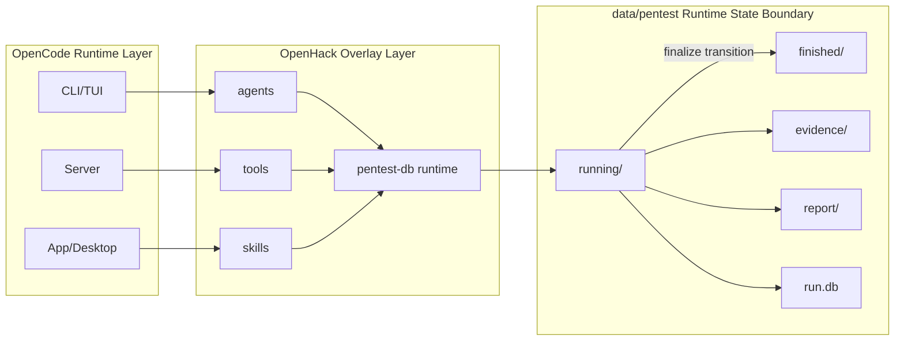

# Project Overview

This repository integrates two layers:
- OpenCode (the core product/runtime),
- OpenHack (security-assessment workflows built on top of OpenCode).

## Read These Docs

- OpenCode overview: `project-opencode.md`
- OpenHack overview: `project-openhack.md`

## Use this doc if...

- `project-opencode.md`: you are changing OpenCode product/runtime/packages.
- `project-openhack.md`: you are changing pentest workflow/runtime data/reporting behavior.

## Integration Story

1. OpenCode provides the runtime platform (CLI/TUI/server, agents, tool execution, MCP/provider integration, UI surfaces).
2. OpenHack extends that platform with pentest-specific configuration, subagent contracts, and skills under `.opencode/`.
3. OpenHack persists assessment state in run-scoped SQLite databases and artifacts under `data/pentest/`.
4. Reporting and finalize workflows convert proposal-level findings into canonical reports and move runs from `running` to `finished`.

## System Context

## Fast Orientation

- Start product development from `project-opencode.md`.
- Start pentest workflow/runtime work from `project-openhack.md`.
- For containerized lab workflows and vulnerable targets, use `docker/README.md`.
