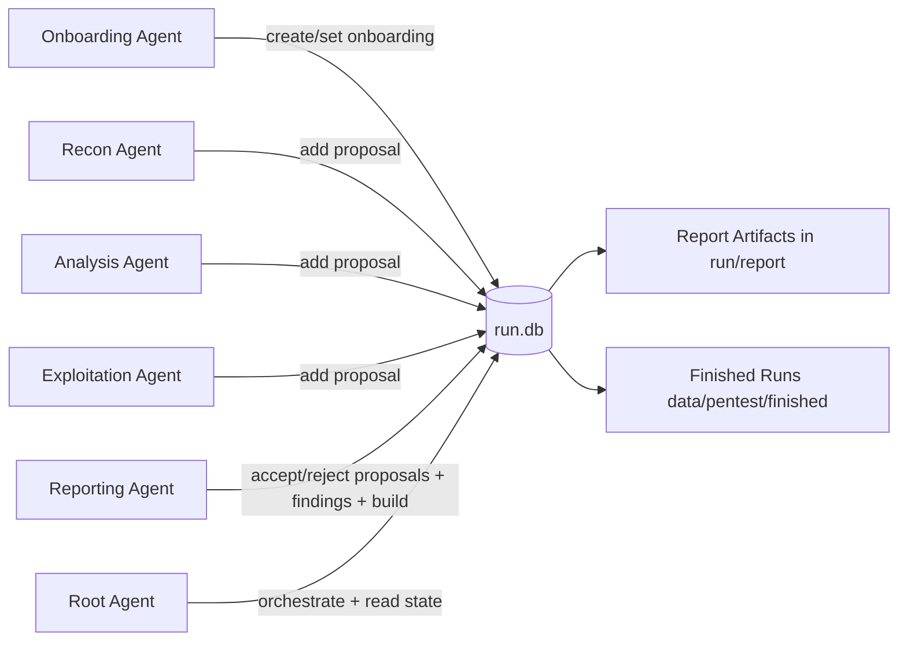
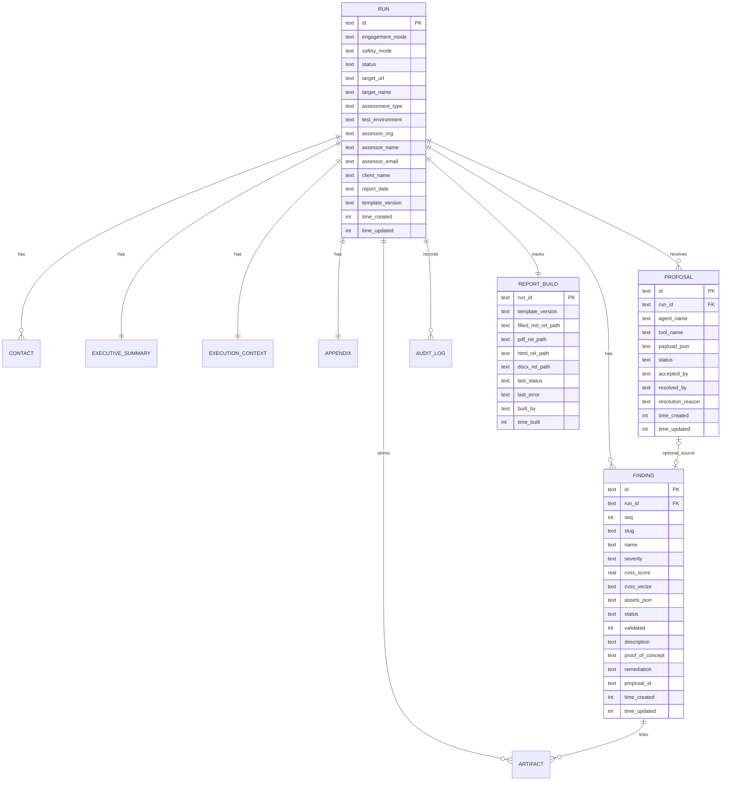
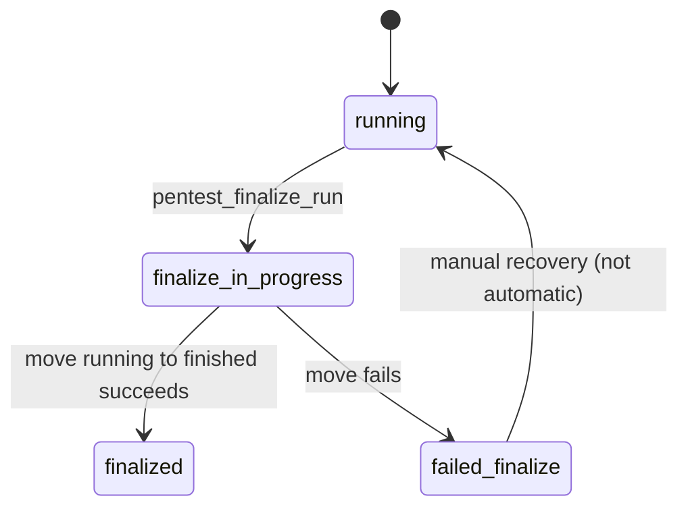
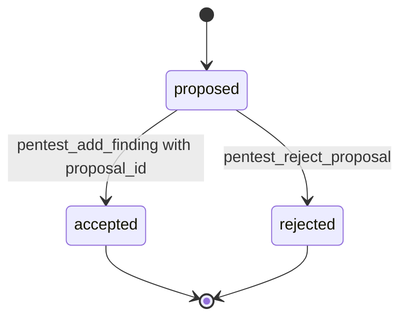
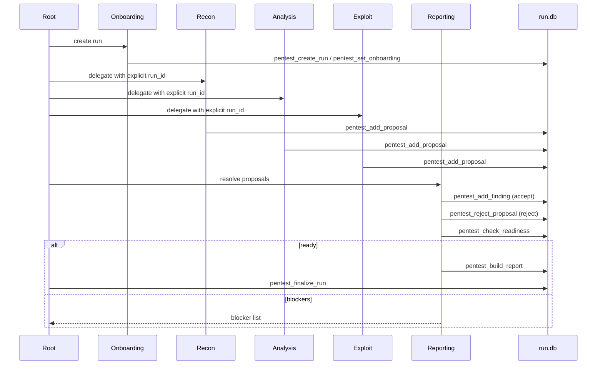

# Pentest Runtime Database (DB-First)

## Purpose

This document specifies the pentest runtime database used by the proposal-first workflow.

Goals:
- Store canonical run state in one place
- Let multiple agents collaborate safely on a shared run
- Keep reporting deterministic and auditable
- Enforce production safety gates before report build/finalize

Implementation source:
- `.opencode/lib/pentest-db.ts`
- `.opencode/tools/pentest.ts`

## Runtime Topology



## Filesystem Layout

Each run has its own SQLite DB file:

- Running DB: `data/pentest/running/<run_id>/run.db`
- Finished DB: `data/pentest/finished/<run_id>/run.db`

Per-run artifact folders:

- `data/pentest/running/<run_id>/report`
- `data/pentest/running/<run_id>/evidence`

## SQLite Settings and Concurrency

Configured at DB open:
- `PRAGMA journal_mode = WAL`
- `PRAGMA synchronous = NORMAL`
- `PRAGMA foreign_keys = ON`
- `PRAGMA busy_timeout = 5000`

Writes use `BEGIN IMMEDIATE` transactions (`withTx`) to prevent partial state updates.

## Schema Versioning and Migrations

Migration tracking table:
- `schema_migrations(version, applied_at, applied_by)`

Current schema version:
- `2`

Version 2 migration adds:
- `proposal.resolved_by`
- `proposal.resolution_reason`
- Unique index `uq_finding_run_proposal` on `(run_id, proposal_id)`

Migration precheck:
- Migration fails if duplicate non-null `(run_id, proposal_id)` links already exist in `finding`.

## ER Diagram



## Table-by-Table Reference

### `run`

Primary run metadata and lifecycle.

Key constraints:
- `engagement_mode IN ('manual','defaults','juiceshop-defaults')`
- `safety_mode IN ('test','production')`
- `status IN ('running','finalize_in_progress','finalized','failed_finalize')`

### `contact`

Assessor/client contacts.

Key constraints:
- `side IN ('assessor','client')`
- FK `run_id -> run(id)` with `ON DELETE CASCADE`

### `executive_summary`

Run summary narrative plus severity counters.

Key relationship:
- One-to-one with run (`run_id` as PK and FK)

### `execution_context`

Execution narrative: subject, scope, methodology, events.

### `appendix`

Appendix content blocks.

### `proposal`

Subagent proposal queue and resolution state.

Key constraints:
- `status IN ('proposed','accepted','rejected')`
- FK `run_id -> run(id)` with `ON DELETE CASCADE`

Resolution fields:
- `accepted_by`
- `resolved_by`
- `resolution_reason`

### `finding`

Canonical finding records (reporting-owned writes).

Key constraints:
- `severity IN ('critical','high','medium','low','info')`
- `status IN ('draft','open','mitigated','closed','wontfix')`
- `validated IN (0,1)`
- `cvss_score` numeric range `[0,10]` when provided
- `UNIQUE(run_id, slug)`
- `UNIQUE(run_id, seq)`
- `UNIQUE(run_id, proposal_id)` via `uq_finding_run_proposal` (NULL allowed)
- `proposal_id` is a logical/unique link to `proposal.id` (currently no DB FK constraint)

### `artifact`

Evidence attachments and checksums.

Key relationships:
- `run_id -> run(id)` cascade
- optional `finding_id -> finding(id)` set null on finding delete

### `audit_log`

Audit trail of tool operations.

Columns include:
- agent name, tool name, args hash, result code, timestamp

### `report_build`

Last build/materialization status and artifact paths for each run.

## Indexes

- `idx_finding_run_seq` on `finding(run_id, seq)`
- `idx_finding_run_validated` on `finding(run_id, validated)`
- `idx_artifact_finding` on `artifact(finding_id)`
- `idx_proposal_run_status` on `proposal(run_id, status)`
- `idx_audit_run_time` on `audit_log(run_id, time_created)`
- `idx_run_status` on `run(status)`
- `uq_finding_run_proposal` unique index on `finding(run_id, proposal_id)`

## Run Lifecycle State Machine



## Proposal Lifecycle State Machine



## Canonical Workflow (Proposal-First)



## Production Readiness Guards

`check_readiness` computes:
- `ready` (bool)
- `errors[]`
- `warnings[]`
- proposal/finding counts
- `missing_required_fields[]`
- `default_placeholder_fields[]`

In `production` safety mode, build is blocked when:
- required run fields are missing
- default placeholders are still present
- no findings exist

In all safety modes, build is blocked when:
- one or more proposals remain in `proposed`

Validation note:
- unvalidated findings generate warnings but do not hard-block build.

`pentest_build_report` runs readiness internally and fails fast if not ready.

## Tool API to Data Mapping

### Run and onboarding
- `pentest_create_run` -> inserts run + summary + context + appendix + contacts
- `pentest_set_onboarding` -> updates run/summary/context/appendix/contacts
- `pentest_add_contact` -> inserts contact row
- `pentest_get_run` -> run + related one-to-one sections + contacts + report_build

### Proposals
- `pentest_add_proposal` -> inserts `proposal(status='proposed')`
- `pentest_get_proposals` -> list proposals (`status` and `agent_name` filters)
- `pentest_reject_proposal` -> sets proposal to rejected with reason

### Findings
- `pentest_add_finding` -> inserts canonical finding, optionally accepts linked proposal
- `pentest_update_finding` -> patch finding fields
- `pentest_delete_finding` -> deletes finding and linked artifacts
- `pentest_get_finding` / `pentest_get_findings` -> read finding views

### Evidence and audit
- `pentest_attach_artifact` -> verifies path and checksum, inserts artifact
- `pentest_get_audit_log` -> paged audit list by run

### Reporting lifecycle
- `pentest_check_readiness` -> readiness snapshot
- `pentest_materialize_report` -> fill markdown only
- `pentest_build_report` -> render outputs and persist build metadata
- `pentest_finalize_run` -> guarded move running -> finished with status transitions

## Validation Rules

Run-level:
- `target_url` required at creation

Finding-level:
- `cvss_score` in `0.0..10.0`
- `cvss_vector` regex: `CVSS:4.0/<metric>:<value>`
- `assets_json` must be JSON array of strings

Path-level:
- artifact paths are validated to remain inside the run directory

## Atomicity Guarantees

Atomic units (single transaction):
- onboarding updates
- contact insert
- proposal insert/reject
- finding create/update/delete
- artifact attach
- report_build status updates

Finalize sequence:
1. DB tx sets `run.status='finalize_in_progress'`
2. Filesystem rename `running/<id>` -> `finished/<id>`
3. On success: DB tx sets `run.status='finalized'`
4. On failure: DB tx sets `run.status='failed_finalize'`

## Reporting Data Flow

1. Read DB state and findings
2. Compute severity counts
3. Map domain fields to template markers
4. Replace markers and inject generated finding blocks
5. Verify unresolved markers = 0
6. Render via pandoc (`pdf|html|docx|all`)
7. Persist outputs and status to `report_build`

## Date and Time Conventions

- `time_*` fields store epoch seconds (UTC-style integer timestamps)
- `report_date` is `YYYY-MM-DD`
- `report_date` is auto-populated during report assembly if missing

## Operational Queries (Examples)

Pending proposals in a run:
```sql
SELECT id, agent_name, tool_name, time_created
FROM proposal
WHERE run_id = ? AND status = 'proposed'
ORDER BY time_created;
```

Validated findings count:
```sql
SELECT COUNT(*) AS validated
FROM finding
WHERE run_id = ? AND validated = 1;
```

Audit trail:
```sql
SELECT time_created, agent_name, tool_name, result_code
FROM audit_log
WHERE run_id = ?
ORDER BY time_created, id;
```

## Troubleshooting

Migration error about duplicate proposal mapping:
- Cause: more than one finding linked to the same `(run_id, proposal_id)`
- Fix: clean duplicates, then reopen DB to apply migration v2

Build blocked in production:
- Run `pentest_check_readiness`
- Resolve `errors[]` first

Finalize failed:
- Run status becomes `failed_finalize`
- Inspect filesystem and audit log
- Recover manually and re-attempt finalize

## Known Constraints (v1)

- No DB-native phase/checkpoint table yet (root orchestrates phase externally)
- `proposal.payload_json` is contract-driven by docs, not DB JSON schema constraints
- Contact parser accepts pipe/semicolon rows and skips malformed rows silently

## Recommended Developer Workflow

1. Use onboarding to create run and baseline metadata
2. Pass explicit `run_id` to every delegated agent/task
3. Let recon/analysis/exploitation submit proposals only
4. Let reporting resolve proposals to canonical findings
5. Run readiness before every build attempt
6. Build and then finalize
7. Use audit log for traceability and debugging
