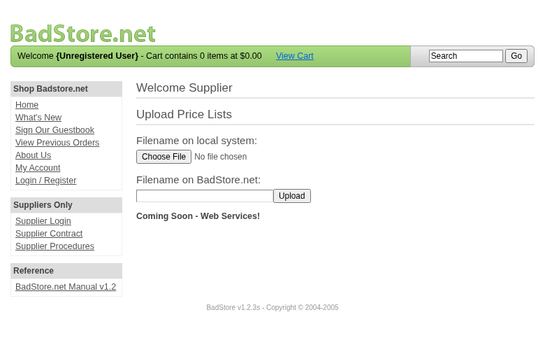

**Scope**

`OpenHack Security Agent` was engaged by `Richard Roe` to conduct an external IT security investigation. The subject of the investigation was the "BadStore.net v1.2.3s".

The test was performed using a local instance of the application at `http://localhost:3336` in a dedicated test environment..

**Objective**

The objective of the IT security investigation was to identify vulnerabilities and security gaps which, in the event of misuse, would have an impact on the availability, integrity and confidentiality of the defined applications and/or systems and the data processed on them. The result of this project is a report that contains a management summary of all relevant findings and a compilation of recommended measures.

The technical IT security audit is not a substantive audit effort to ensure that all vulnerabilities and security gaps existing at the time of the audit are identified. There is a possibility that established safeguards will effectively prevent identification and exploitation of vulnerabilities and security gaps. The client acknowledges that this is not an indicator of deficiencies in engagement performance and that additional unidentified vulnerabilities and security gaps may exist.

\vspace{4em}
\footnotesize
\begin{itshape}
\textbf{Disclaimer}

`OpenHack Security Agent` conducted the security penetration test on behalf of `Richard Roe`. This report has been prepared exclusively for `Richard Roe`. It is intended exclusively for internal use and is accordingly not designed to serve third parties as a basis for their decisions, unless agreed otherwise in writing. Third parties may not derive any rights or otherwise benefit from this engagement unless agreed otherwise in writing. Affiliated companies of the client are also considered "third parties" within the meaning of this engagement.

`OpenHack Security Agent` does not assume any liability or legal claims against third parties unless agreed otherwise in writing or a disclaimer cannot effectively be implemented.

It is the sole responsibility of anyone who becomes aware of the work results summarized in this report to decide to what extent and in what way the information is useful or appropriate and to supplement, check or update it as part of their own review.

No adjustments will be made to the report to reflect events or circumstances that occur after the report is issued, unless required by law.

The recommendations in this report are general and applicable in many different environments but could have unpredictable effects in specific environments. Therefore, any actions derived from the recommendations should be carefully considered and implemented through the regular change process. This should include appropriate testing of the changes on a test environment prior to going live. If the changes are not tested in advance in an identically configured test environment, failures or other damage cannot be ruled out.

Please note: Technical descriptions (or parts thereof) in this report may be taken from the OWASP Testing Guide (www.owasp.org).

\end{itshape}
\normalsize

\newpage

# Document Control

\small

**Document Status**

|                         |                                              |
| ----------------------- | -------------------------------------------- |
| **Title**               | Security Assessment Report                   |
| **Document Owner**      | OpenHack Security Agent                                 |
| **Classification**      | Strictly Confidential                        |
| **Project Timeframe**   | 2026-02-26                                    |

**Version History**

| Version | Date       | State          | Author       | Comments |
| ------- | ---------- | -------------- | ------------ | -------- |
| **0.1** | 2026-02-26 | Draft          | Jane Doe | --       |
| **1.0** | 2026-02-26 | Final document | Jane Doe | --       |

**Contact Persons - Assessor**

| Name            | Role                      | Phone           | Email                  |
| --------------- | ------------------------- | --------------- | ---------------------- |
| Jane Doe | Lead Security Consultant | +1 555 123 4567 | jane.doe@openhack.sec |
| John Smith | Security Consultant | +1 555 234 5678 | john.smith@openhack.sec |

**Contact Persons - Client**

| Name            | Role                      | Phone           | Email                  |
| --------------- | ------------------------- | --------------- | ---------------------- |
| Richard Roe | Project Lead | +1 555 345 6789 | spam@badstore.net |

\normalsize

# Executive Summary

`OpenHack Security Agent` (hereinafter referred to as "ASSESSOR") has been commissioned by `Richard Roe` (hereinafter referred to as "CLIENT") to carry out a penetration test.

The penetration test of the `BadStore.net v1.2.3s` application took place on **2026-02-26**.

For this purpose, the web application, accessible at `http://badstore:80`, was tested from the perspective of an external attacker. 

As part of the test, a total of 10 vulnerabilities were identified: 6 critical, 2 high, 2 medium, 0 low, and 0 informational.

Critical: **6** | High: **2** | Medium: **2** | Low: **0** | Informational: **0** | Total: **10**

+----------------------------------------------+-------+
| **Severity**                              | **Count** |
+==============================================+=======+
| \textcolor[HTML]{7B2D8E}{Critical}           | 6     |
+----------------------------------------------+-------+
| \textcolor[HTML]{CC0000}{High}               | 2     |
+----------------------------------------------+-------+
| \textcolor[HTML]{E67E22}{Medium}             | 2     |
+----------------------------------------------+-------+
| \textcolor[HTML]{D4AC0D}{Low}                | 0     |
+----------------------------------------------+-------+
| \textcolor[HTML]{2E86C1}{Informational}      | 0     |
+----------------------------------------------+-------+
| **Total**                                    | **10** |
+----------------------------------------------+-------+

: Overview of Findings

A description of the scope and test environment can be found in Chapter 3. Chapter 4 presents the risk assessment methodology. Chapter 5 provides a summary of findings. Chapter 6 contains the detailed technical descriptions of the findings including remediation measures.

It is recommended that the remediation of the critical risk vulnerabilities be treated with the highest priority and countermeasures implemented as soon as possible. The vulnerabilities with high and medium risk should also be remedied in the short term. The low-risk vulnerabilities should be treated with lower priority due to their reduced risk, but should still be addressed.

# Execution of the Security Penetration Test

## Subject Under Test

## Scope

The scope for the assessment was the following targets:

## Methodology

The security penetration test of the BadStore.net v1.2.3s took place on 2026-02-26.

The web application was tested for security vulnerabilities across the following categories. This can be considered a guideline as penetration tests are a creative process and therefore the tests are not limited to what is given here. The base of these categories is the OWASP Top 10 for Web, which is fully covered by this penetration test approach.

| **Category**                            | **Description**                                                                                            |
| --------------------------------------- | ---------------------------------------------------------------------------------------------------------- |
| Broken Access Control                   | Users can act outside their permissions, leading to unauthorized viewing, modification, or deletion of data. |
| Security Misconfiguration               | Systems or cloud services are insecurely configured, e.g., through default passwords or unnecessarily enabled features. |
| Software Supply Chain Failures          | Vulnerabilities arise from compromised third-party code, libraries, or build pipelines.                    |
| Cryptographic Failures                  | Sensitive data is exposed through missing, weak, or incorrectly implemented encryption.                    |
| Injection                               | Attackers inject malicious commands (e.g., SQL or shell code) through input fields that the system erroneously executes. |
| Insecure Design                         | Fundamental architectural flaws that exist before implementation make an application inherently insecure.  |
| Authentication Failures                 | Flaws in identity verification allow attackers to take over sessions or guess passwords (brute force).     |
| Software or Data Integrity Failures     | Lack of verification of code or data sources leads to acceptance of untrusted updates or serialization data. |
| Security Logging & Alerting Failures    | Attacks go undetected or responses are delayed due to missing logs or absent alert notifications.          |
| Mishandling of Exceptional Conditions   | Programs respond inadequately to unforeseen situations, which can lead to crashes or logic errors.         |

## Events

During the test, the following restrictions or events occurred that may have affected the scope or depth of the assessment: 

\newpage

# Risk Assessment

## CVSS

The risk assessment of the vulnerabilities found is performed using the industry standard Common Vulnerability Scoring System v3.1 (hereinafter referred to as "CVSS"). This is a standard that can be used to uniformly assess the vulnerability of computer systems and the severity of security vulnerabilities. This makes it possible to compare vulnerabilities more effectively.

The Common Vulnerability Scoring System has a metric structure and is based on values that are divided into three groups: "Base", "Temporal", and "Environmental". To determine the vulnerability scores, each group has its own rules. The values of the Base group are invariant in time and remain the same in different environments. In the Temporal group, the time dependency of a vulnerability is taken into account. For example, the vulnerability of a system to a particular vulnerability decreases over time as more and more countermeasures such as patches become known and available. The Environmental group incorporates various criteria of the specific IT environments into the vulnerability rating.

The CVSS ratings are numerical values on a scale of 0.0 to 10.0, with the highest vulnerability of a system occurring at a value of 10.0. Our rating is based on the Base Metrics (Base Score) and is composed of:

- Attack Vector (AV)
- Attack Complexity (AC)
- Privileges Required (PR)
- User Interaction (UI)
- Scope (S)
- Confidentiality (C)
- Integrity (I)
- Availability (A)

As penetration testers, we can only assess the general threats posed by a vulnerability through Base Metrics. However, we have no insight into the internal structures of our clients. Therefore, the assessment of the specific risks for the client's systems and business processes must be done by the client. For this purpose, CVSS offers Environmental Metrics. This makes it possible to subsequently adjust the CVSS score of vulnerabilities after the test result has been submitted before they are remedied. This changes the assessment of the risk and thus the urgency of remediation of a vulnerability. For more information, see [CVSS v3.1 Specification](https://www.first.org/cvss/v3.1/specification-document).

## Risk Categories

The risk categories used in this report reflect the recommended priority for addressing the vulnerabilities identified during the penetration test. The categorization is based on the probability of exploitation and the significance of the impact. The risk value is calculated using the CVSS v3.1 standard:

| **Assessment**  | **Risk Category Description**                                |
| --------------- | ------------------------------------------------------------ |
| \textcolor[HTML]{7B2D8E}{\textbf{Critical}} | Critical vulnerabilities that allow an attacker to gain full access to the object under test and its sensitive information. It is possible to cause enormous damage to the client's reputation. Furthermore, these vulnerabilities may allow attackers to gain wide-ranging privileges, including to other systems or applications of the client that have not been investigated in detail within the scope of this project. Exploitation of the vulnerabilities is not prevented and can be reproduced with medium to low effort. |
| \textcolor[HTML]{CC0000}{\textbf{High}} | Vulnerabilities that may allow an attacker to manipulate sensitive data, damage the client's reputation, gain unauthorized access to sensitive information, or gain unauthorized access to applications or the client's infrastructure. The vulnerabilities are reproducible with medium to high effort. |
| \textcolor[HTML]{E67E22}{\textbf{Medium}} | Vulnerabilities that may allow an attacker to harm the client's reputation or gain unauthorized access to client data. The privileges that an attacker can gain by exploiting the vulnerabilities are limited. |
| \textcolor[HTML]{D4AC0D}{\textbf{Low}} | Security vulnerabilities that do not pose a threat in themselves, but which, for example, provide attackers with useful information about the network and systems. These vulnerabilities allow an attacker only very limited access. |
| \textcolor[HTML]{2E86C1}{\textbf{Informational}} | Anomalies such as functional limitations or inconsistencies. These do not currently represent a risk and have no negative impact on the test object. Accordingly, no action is required. Nevertheless, countermeasures can be helpful for the functional and safety improvement of the test object. If necessary, this may give rise to risks under other circumstances. |

## Vulnerability States

The vulnerabilities can be in one of the following states:

- **Active**: The vulnerability has been identified and it has been possible to verify its existence through exploitation or direct evidence.
- **Potential**: The vulnerability has been identified but its exploitation has not been possible, so its existence cannot be fully verified, and it is up to the client to determine the impact.
- **Fixed**: The vulnerability has been remediated and verified through retesting.

\newpage

# Summary of Findings

| **Id**   | **Finding Name**       | **Risk Assessment** | **CVSS v3.1 Score** |
| -------- | ---------------------- | --------------- | ------------- |
| 01 | Privilege Escalation via Hidden Role Parameter in Registration | \textcolor[HTML]{7B2D8E}{\textbf{Critical}} | 10 |
| 02 | Weak Password Reset Mechanism - Account Takeover | \textcolor[HTML]{7B2D8E}{\textbf{Critical}} | 9.4 |
| 03 | Insecure Session Token - Session Hijacking via Base64-Encoded User Data | \textcolor[HTML]{7B2D8E}{\textbf{Critical}} | 9.1 |
| 04 | Vertical Privilege Escalation - Supplier Portal Accessible Without Authentication | \textcolor[HTML]{CC0000}{\textbf{High}} | 8.2 |
| 05 | SQL Injection Authentication Bypass - Supplier Portal | \textcolor[HTML]{7B2D8E}{\textbf{Critical}} | 9.1 |
| 06 | SQL Injection in Search Endpoint | \textcolor[HTML]{CC0000}{\textbf{High}} | 8.6 |
| 07 | SQL Injection Authentication Bypass | \textcolor[HTML]{7B2D8E}{\textbf{Critical}} | 9.4 |
| 08 | Stored Cross-Site Scripting in Guestbook | \textcolor[HTML]{7B2D8E}{\textbf{Critical}} | 9.6 |
| 09 | Admin Portal Exposure Without Authentication | \textcolor[HTML]{E67E22}{\textbf{Medium}} | 5.3 |
| 10 | Sensitive Directory Disclosure via robots.txt | \textcolor[HTML]{E67E22}{\textbf{Medium}} | 5.3 |

\newpage

# Findings and Remediation

## Finding

### Privilege Escalation via Hidden Role Parameter in Registration

|                      |                                                              |
| -------------------- | ------------------------------------------------------------ |
| **Severity**      | \textcolor[HTML]{7B2D8E}{\textbf{Critical}} |
| **CVSS Base Score**  | **10.0** ([CVSS:3.1/AV:N/AC:L/PR:N/UI:N/S:C/C:H/I:H/A:H](https://www.first.org/cvss/calculator/3.1#CVSS:3.1/AV:N/AC:L/PR:N/UI:N/S:C/C:H/I:H/A:H)) |
| **Assets**           | http://badstore:80/cgi-bin/badstore.cgi?action=register |
| **Status**           | open |

**Description**

The registration form contains a hidden 'role' parameter with default value 'U' (User). By modifying this parameter to 'A' (Admin), an attacker can create an administrative account with full privileges. This allows complete compromise of the application including access to the Supplier Portal with file upload capabilities. The vulnerability exists because the application trusts client-side input for role assignment without server-side validation.

**Proof of Concept**

1. Navigate to the registration page at /cgi-bin/badstore.cgi?action=loginregister
2. Intercept the registration request or use browser dev tools
3. Locate the hidden input: <input type="hidden" name="role" value="U" />
4. Change the value from 'U' to 'A'
5. Submit the registration form with any email/password
6. The new account is created with admin privileges (role='A')
7. Access supplier portal at /cgi-bin/badstore.cgi?action=supplierportal which is now accessible

Evidence shows:
- Hidden role parameter in HTML source
- My Account page confirms role='A' for the created account
- Direct access to Supplier Portal with file upload functionality

**Remediation**

Not provided

**Evidence**

- Hidden role parameter in registration form showing default value U that can be modified to A for admin privileges: [images/finding-38ba1713-b992-4a0b-9522-b0fb731922dd-1-priv-esc-hidden-role-param.txt](images/finding-38ba1713-b992-4a0b-9522-b0fb731922dd-1-priv-esc-hidden-role-param.txt)

- Supplier Portal access after registering with role=A showing file upload functionality available to attacker

## Finding

### Weak Password Reset Mechanism - Account Takeover

|                      |                                                              |
| -------------------- | ------------------------------------------------------------ |
| **Severity**      | \textcolor[HTML]{7B2D8E}{\textbf{Critical}} |
| **CVSS Base Score**  | **9.4** ([CVSS:3.1/AV:N/AC:L/PR:N/UI:N/S:U/C:H/I:H/A:L](https://www.first.org/cvss/calculator/3.1#CVSS:3.1/AV:N/AC:L/PR:N/UI:N/S:U/C:H/I:H/A:L)) |
| **Assets**           | http://badstore:80/cgi-bin/badstore.cgi?action=moduser |
| **Status**           | open |

**Description**

The password reset mechanism uses only an email address and a 'password hint' that is limited to 6 possible color values (green, blue, red, orange, purple, yellow). An attacker can brute-force any user's password by trying all 6 possible hints. Upon successful reset, the new password is revealed directly in the server response, allowing immediate account takeover. This completely bypasses authentication for any account.

**Proof of Concept**

1. Navigate to /cgi-bin/badstore.cgi?action=myaccount (as unauthenticated user)
2. Locate the 'Reset A Forgotten Password' form
3. Enter target email address (e.g., victim@test.com)
4. Try each of the 6 color hints: green, blue, red, orange, purple, yellow
5. When correct hint is provided, the response reveals: 'The password for user: [email] ...has been reset to: [new_password]'
6. Use the revealed password to login as the victim

Example successful reset:
POST /cgi-bin/badstore.cgi?action=moduser
email=resettestwlbepb@test.com&pwdhint=blue&DoMods=Reset User Password

Response: 'The password for user: resettestwlbepb@test.com ...has been reset to: Welcome'

Login with new password confirmed successful.

**Remediation**

Not provided

**Evidence**

- Password reset response revealing the new password Welcome for the compromised account: [images/finding-1d14c960-6612-413d-ad66-c94f7783a0b1-3-weak-pwdreset-result.txt](images/finding-1d14c960-6612-413d-ad66-c94f7783a0b1-3-weak-pwdreset-result.txt)

## Finding

### Insecure Session Token - Session Hijacking via Base64-Encoded User Data

|                      |                                                              |
| -------------------- | ------------------------------------------------------------ |
| **Severity**      | \textcolor[HTML]{7B2D8E}{\textbf{Critical}} |
| **CVSS Base Score**  | **9.1** ([CVSS:3.1/AV:N/AC:L/PR:N/UI:N/S:U/C:H/I:H/A:N](https://www.first.org/cvss/calculator/3.1#CVSS:3.1/AV:N/AC:L/PR:N/UI:N/S:U/C:H/I:H/A:N)) |
| **Assets**           | http://badstore:80/cgi-bin/badstore.cgi |
| **Status**           | open |

**Description**

The SSOid session cookie contains base64-encoded user data without any cryptographic signature or HMAC verification. The cookie format is: base64(email:MD5(password):fullname:role). This allows an attacker who captures any user's cookie to fully impersonate that user. The password MD5 hash is also exposed in the cookie, enabling offline credential cracking. Confirmed by using User2's cookie to access User2's account from a different session context, proving session hijacking is trivially possible.

**Proof of Concept**

1. Register/login as user1@test.com
2. Capture the SSOid cookie: dXNlcjFAdGVzdC5jb206NWY0ZGNjM2I1YWE3NjVkNjFkODMyN2RlYjg4MmNmOTk6VGVzdFVzZXIxOg==
3. Base64 decode: user1@test.com:5f4dcc3b5aa765d61d8327deb882cf99:TestUser1:
4. The MD5 hash 5f4dcc3b5aa765d61d8327deb882cf99 = 'password'
5. Using User2's cookie (dXNlcjJAdGVzdC5jb206NWY0ZGNjM2I1YWE3NjVkNjFkODMyN2RlYjg4MmNmOTk6VGVzdFVzZXIyOg==) grants access to User2's account
6. Request: curl -s -b "SSOid=dXNlcjJAdGVzdC5jb206NWY0ZGNjM2I1YWE3NjVkNjFkODMyN2RlYjg4MmNmOTk6VGVzdFVzZXIyOg==" "http://badstore:80/cgi-bin/badstore.cgi?action=myaccount"
7. Response shows User2's account: 'Welcome, TestUser2' and 'Current Email Address: user2@test.com'

**Remediation**

Not provided

**Evidence**

- Session hijacking proof of concept showing cookie reuse grants access to another user's account: [images/finding-08c933ef-3116-4f2b-815e-9fca5765631a-4-session-hijacking-proof.txt](images/finding-08c933ef-3116-4f2b-815e-9fca5765631a-4-session-hijacking-proof.txt)

- Full analysis of insecure session token structure showing base64 encoding without signature: [images/finding-08c933ef-3116-4f2b-815e-9fca5765631a-5-session-token-full-analysis.txt](images/finding-08c933ef-3116-4f2b-815e-9fca5765631a-5-session-token-full-analysis.txt)

## Finding

### Vertical Privilege Escalation - Supplier Portal Accessible Without Authentication

|                      |                                                              |
| -------------------- | ------------------------------------------------------------ |
| **Severity**      | \textcolor[HTML]{CC0000}{\textbf{High}} |
| **CVSS Base Score**  | **8.2** ([CVSS:3.1/AV:N/AC:L/PR:N/UI:N/S:U/C:H/I:L/A:N](https://www.first.org/cvss/calculator/3.1#CVSS:3.1/AV:N/AC:L/PR:N/UI:N/S:U/C:H/I:L/A:N)) |
| **Assets**           | http://badstore:80/cgi-bin/badstore.cgi?action=supplierportal |
| **Status**           | open |

**Description**

The Supplier Portal page (action=supplierportal) is accessible without any authentication. This page is intended to be restricted to authenticated suppliers only, as indicated by the 'Suppliers Only' menu section. While the file upload functionality (action=supupload) does require authentication, the portal page itself exposes sensitive information about supplier operations and reveals the file upload functionality. This is a vertical privilege escalation vulnerability allowing unauthenticated users to access supplier-only functionality.

**Proof of Concept**

1. Navigate to the supplier portal without any authentication
2. Request: curl -s "http://badstore:80/cgi-bin/badstore.cgi?action=supplierportal"
3. Response shows: 'Welcome Supplier' and 'Upload Price Lists' form
4. The page exposes supplier functionality and reveals internal business processes
5. Evidence saved to: supplierportal-noauth-1772083681.html

**Remediation**

Not provided

**Evidence**

- Supplier portal page accessible without authentication showing upload form: [images/finding-463cf274-3248-46d4-b589-f064bc683ca5-6-supplierportal-noauth-1772083681.html](images/finding-463cf274-3248-46d4-b589-f064bc683ca5-6-supplierportal-noauth-1772083681.html)

## Finding

### SQL Injection Authentication Bypass - Supplier Portal

|                      |                                                              |
| -------------------- | ------------------------------------------------------------ |
| **Severity**      | \textcolor[HTML]{7B2D8E}{\textbf{Critical}} |
| **CVSS Base Score**  | **9.1** ([CVSS:3.1/AV:N/AC:L/PR:N/UI:N/S:U/C:H/I:H/A:N](https://www.first.org/cvss/calculator/3.1#CVSS:3.1/AV:N/AC:L/PR:N/UI:N/S:U/C:H/I:H/A:N)) |
| **Assets**           | http://badstore:80/cgi-bin/badstore.cgi |
| **Status**           | open |

**Description**

The Supplier Portal login form is vulnerable to SQL injection authentication bypass. An unauthenticated attacker can bypass authentication by injecting SQL payloads in the email and password fields. The injection payload ' OR '1'='1 allows complete bypass of the authentication mechanism, granting access to the supplier portal including the file upload functionality. This vulnerability allows attackers to: 1) Access the supplier portal without valid credentials, 2) Potentially upload arbitrary files to the server, 3) Access supplier-only functionality. The vulnerable endpoint is /cgi-bin/badstore.cgi?action=supplierportal with POST parameters 'email' and 'passwd'.

**Proof of Concept**

1. Navigate to http://badstore:80/cgi-bin/badstore.cgi?action=supplierlogin
2. Enter the following payload in the Email field: ' OR '1'='1
3. Enter the following payload in the Password field: ' OR '1'='1
4. Click Login
5. Observe successful authentication bypass - the page displays 'Welcome Supplier' and provides access to the file upload form

HTTP Request:
POST /cgi-bin/badstore.cgi?action=supplierportal
Content-Type: application/x-www-form-urlencoded

email=' OR '1'='1&passwd=' OR '1'='1

**Remediation**

Not provided

**Evidence**

- Evidence of SQL injection authentication bypass showing successful access to supplier portal with file upload form after submitting ' OR '1'='1 in both login fields: [images/finding-a5b2c102-02a4-41f6-938c-9589238d6fca-7-sqli-auth-bypass-1772083931.html](images/finding-a5b2c102-02a4-41f6-938c-9589238d6fca-7-sqli-auth-bypass-1772083931.html)

## Finding

### SQL Injection in Search Endpoint

|                      |                                                              |
| -------------------- | ------------------------------------------------------------ |
| **Severity**      | \textcolor[HTML]{CC0000}{\textbf{High}} |
| **CVSS Base Score**  | **8.6** ([CVSS:3.1/AV:N/AC:L/PR:N/UI:N/S:U/C:H/I:L/A:L](https://www.first.org/cvss/calculator/3.1#CVSS:3.1/AV:N/AC:L/PR:N/UI:N/S:U/C:H/I:L/A:L)) |
| **Assets**           | http://badstore:80/cgi-bin/badstore.cgi?action=search |
| **Status**           | open |

**Description**

The search endpoint at /cgi-bin/badstore.cgi?action=search is vulnerable to SQL injection via the 'searchquery' parameter. The application directly concatenates user input into SQL queries without proper sanitization. A single quote (') triggers a MySQL syntax error, revealing the database structure and confirming the injection point. The error message shows: 'DBD::mysql::st execute failed: You have an error in your SQL syntax... near ''test'' IN (itemnum,sdesc,ldesc)''. This allows attackers to manipulate database queries, potentially extracting sensitive data from the itemdb table and other database tables.

**Proof of Concept**

1. Navigate to http://badstore:80/cgi-bin/badstore.cgi?action=search
2. Enter a single quote (') in the search query parameter: ?searchquery='
3. Observe the SQL error message revealing database structure
4. The error confirms the injection point: 'test'' IN (itemnum,sdesc,ldesc)'
5. Further exploitation possible with UNION-based or blind SQL injection techniques

**Remediation**

Not provided

**Evidence**

- SQL injection error message showing database syntax error from single quote injection in searchquery parameter: [images/finding-7192554e-d1c1-442c-8019-3550f6481be9-8-sqli-error-1772083554.html](images/finding-7192554e-d1c1-442c-8019-3550f6481be9-8-sqli-error-1772083554.html)

## Finding

### SQL Injection Authentication Bypass

|                      |                                                              |
| -------------------- | ------------------------------------------------------------ |
| **Severity**      | \textcolor[HTML]{7B2D8E}{\textbf{Critical}} |
| **CVSS Base Score**  | **9.4** ([CVSS:3.1/AV:N/AC:L/PR:N/UI:N/S:U/C:H/I:H/A:L](https://www.first.org/cvss/calculator/3.1#CVSS:3.1/AV:N/AC:L/PR:N/UI:N/S:U/C:H/I:H/A:L)) |
| **Assets**           | http://badstore:80/cgi-bin/badstore.cgi?action=login |
| **Status**           | open |

**Description**

The login endpoint at /cgi-bin/badstore.cgi?action=login is vulnerable to SQL injection in the 'email' parameter, allowing complete authentication bypass. By injecting SQL payloads like 'admin@badstore.net' OR '1'='1'-- - into the email field, an attacker can bypass password verification and gain unauthorized access to user accounts. The application returns a 'Welcome to BadStore.net!' page and sets an authentication cookie (SSOid), confirming successful login without valid credentials. The injected SQL comment (-- -) terminates the password check, allowing authentication with any password.

**Proof of Concept**

1. Send POST request to /cgi-bin/badstore.cgi?action=login
2. Set email parameter to: admin@badstore.net' OR '1'='1'-- -
3. Set passwd parameter to any value (e.g., 'anything')
4. Observe successful login with 'Welcome to BadStore.net!' page
5. Verify SSOid cookie is set, confirming authenticated session
6. Alternatively, use payload: ' OR 1=1-- - for blind bypass

**Remediation**

Not provided

**Evidence**

- Successful authentication bypass showing Welcome page after SQL injection in email parameter: [images/finding-356a7899-1596-4718-a153-d578d1223960-9-sqli-auth-bypass-1772083922.html](images/finding-356a7899-1596-4718-a153-d578d1223960-9-sqli-auth-bypass-1772083922.html)

- SQL injection error from login endpoint showing vulnerable email parameter in SQL query: [images/finding-356a7899-1596-4718-a153-d578d1223960-10-sqli-login-error-1772083943.html](images/finding-356a7899-1596-4718-a153-d578d1223960-10-sqli-login-error-1772083943.html)

## Finding

### Stored Cross-Site Scripting in Guestbook

|                      |                                                              |
| -------------------- | ------------------------------------------------------------ |
| **Severity**      | \textcolor[HTML]{7B2D8E}{\textbf{Critical}} |
| **CVSS Base Score**  | **9.6** ([CVSS:3.1/AV:N/AC:L/PR:N/UI:R/S:C/C:H/I:H/A:L](https://www.first.org/cvss/calculator/3.1#CVSS:3.1/AV:N/AC:L/PR:N/UI:R/S:C/C:H/I:H/A:L)) |
| **Assets**           | http://badstore:80/cgi-bin/badstore.cgi?action=doguestbook, http://badstore:80/cgi-bin/badstore.cgi?action=viewguestbook |
| **Status**           | open |

**Description**

The guestbook endpoint at /cgi-bin/badstore.cgi?action=doguestbook is vulnerable to stored Cross-Site Scripting (XSS). The application accepts user-submitted name, email, and comments fields without proper input sanitization or output encoding. Malicious JavaScript code submitted in the comments field is stored in the database and displayed to other users without escaping. When viewing the guestbook entries, the injected script executes in the victim's browser context, allowing attackers to steal session cookies, perform actions on behalf of authenticated users, or redirect users to malicious sites.

**Proof of Concept**

1. Navigate to http://badstore:80/cgi-bin/badstore.cgi?action=guestbook
2. Submit a guestbook entry with the following payload in comments: 
3. Navigate to view the guestbook entries
4. Observe the JavaScript executes, displaying an alert with document.cookie
5. The stored payload will execute for any user viewing the guestbook
6. This allows session hijacking, credential theft, and other client-side attacks

**Remediation**

Not provided

**Evidence**

- Stored XSS evidence showing unescaped script tag in guestbook comments field: [images/finding-abcc2158-67cd-4327-ab2f-980f748c4706-11-xss-stored-guestbook-1772083842.html](images/finding-abcc2158-67cd-4327-ab2f-980f748c4706-11-xss-stored-guestbook-1772083842.html)

## Finding

### Admin Portal Exposure Without Authentication

|                      |                                                              |
| -------------------- | ------------------------------------------------------------ |
| **Severity**      | \textcolor[HTML]{E67E22}{\textbf{Medium}} |
| **CVSS Base Score**  | **5.3** ([CVSS:3.1/AV:N/AC:L/PR:N/UI:N/S:U/C:L/I:N/A:N](https://www.first.org/cvss/calculator/3.1#CVSS:3.1/AV:N/AC:L/PR:N/UI:N/S:U/C:L/I:N/A:N)) |
| **Assets**           | http://badstore:80/cgi-bin/badstore.cgi |
| **Status**           | open |

**Description**

The Secret Administration Portal is accessible without authentication, revealing the admin menu and available functions. While executing admin actions requires admin privileges, the portal itself is exposed to unauthenticated users, revealing sensitive information about the application's admin capabilities including: View Sales Reports, Reset User Password, Add User, Delete User, Show Current Users, Troubleshooting, and Backup Databases. This information disclosure helps attackers understand the attack surface and potential privilege escalation paths.

**Proof of Concept**

1. Navigate to http://badstore:80/cgi-bin/badstore.cgi?action=admin
2. Observe the 'Secret Administration Menu' is displayed without any authentication
3. The menu reveals available admin functions: View Sales Reports, Reset User Password, Add User, Delete User, Show Current Users, Troubleshooting, Backup Databases

This exposure reveals the admin functionality structure and potential attack vectors.

**Remediation**

Not provided

**Evidence**

- Evidence of Secret Administration Menu exposed without authentication, revealing admin functions like user management and database backup capabilities: [images/finding-3b63edb1-e030-40e0-9ef1-02431da0a772-12-admin-portal-exposure-1772084331.html](images/finding-3b63edb1-e030-40e0-9ef1-02431da0a772-12-admin-portal-exposure-1772084331.html)

## Finding

### Sensitive Directory Disclosure via robots.txt

|                      |                                                              |
| -------------------- | ------------------------------------------------------------ |
| **Severity**      | \textcolor[HTML]{E67E22}{\textbf{Medium}} |
| **CVSS Base Score**  | **5.3** ([CVSS:3.1/AV:N/AC:L/PR:N/UI:N/S:U/C:L/I:N/A:N](https://www.first.org/cvss/calculator/3.1#CVSS:3.1/AV:N/AC:L/PR:N/UI:N/S:U/C:L/I:N/A:N)) |
| **Assets**           | http://badstore:80/robots.txt |
| **Status**           | open |

**Description**

The robots.txt file reveals sensitive directory paths that should not be publicly disclosed. The file lists: /backup, /cgi-bin, /supplier, and /upload directories. These paths indicate potential areas of interest for attackers and reveal the application's internal structure. The /supplier directory was confirmed to contain sensitive files (including .htpasswd which returns 403 Forbidden, confirming its existence), and the /backup directory exists but is currently empty.

**Proof of Concept**

1. Navigate to http://badstore:80/robots.txt
2. Observe the following sensitive paths are disclosed:
   - Disallow: /backup
   - Disallow: /cgi-bin
   - Disallow: /supplier
   - Disallow: /upload

These paths reveal the application's internal structure and potential attack vectors.

**Remediation**

Not provided

**Evidence**

- robots.txt revealing sensitive directories: /backup, /cgi-bin, /supplier, and /upload: [images/finding-92dadd9a-c2d8-49ba-bf54-62d3d0064624-13-robots-txt-disclosure.txt](images/finding-92dadd9a-c2d8-49ba-bf54-62d3d0064624-13-robots-txt-disclosure.txt)

\newpage

# Appendix A - Lists, Scripts and Raw Data

\newpage

# Appendix B - List of Abbreviations

+----------------+---------------------------------------------+
| Abbreviation   | Description                                 |
+================+=============================================+
| API            | Application Programming Interface           |
+----------------+---------------------------------------------+
| CAPTCHA        | Completely Automated Public Turing test to  |
|                | tell Computers and Humans Apart             |
+----------------+---------------------------------------------+
| CVSS           | Common Vulnerability Scoring System         |
+----------------+---------------------------------------------+
| FTP            | File Transfer Protocol                      |
+----------------+---------------------------------------------+
| IDOR           | Insecure Direct Object Reference            |
+----------------+---------------------------------------------+
| MD5            | Message-Digest Algorithm 5                  |
+----------------+---------------------------------------------+
| OAuth          | Open Authorization                          |
+----------------+---------------------------------------------+
| ORM            | Object-Relational Mapping                   |
+----------------+---------------------------------------------+
| OWASP          | Open Web Application Security Project       |
+----------------+---------------------------------------------+
| PII            | Personally Identifiable Information         |
+----------------+---------------------------------------------+
| SQL            | Structured Query Language                   |
+----------------+---------------------------------------------+
| TOTP           | Time-based One-Time Password                |
+----------------+---------------------------------------------+
| URI            | Uniform Resource Identifier                 |
+----------------+---------------------------------------------+
| WAF            | Web Application Firewall                    |
+----------------+---------------------------------------------+
| XSS            | Cross-Site Scripting                        |

+----------------+---------------------------------------------+
