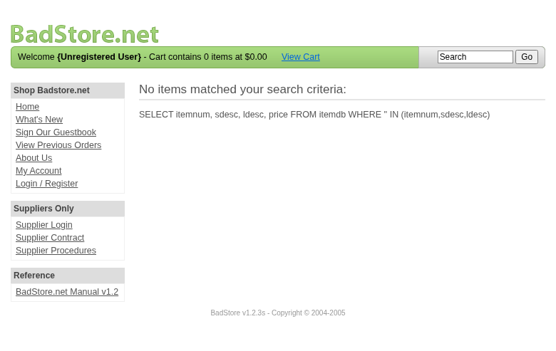

**Scope**

`OpenHack Security Agent` was engaged by `Richard Roe` to conduct an external IT security investigation. The subject of the investigation was the "BadStore.net v1.2.3s".

The test was performed using a local instance of the application at `http://localhost:3336` in a dedicated test environment..

**Objective**

The objective of the IT security investigation was to identify vulnerabilities and security gaps which, in the event of misuse, would have an impact on the availability, integrity and confidentiality of the defined applications and/or systems and the data processed on them. The result of this project is a report that contains a management summary of all relevant findings and a compilation of recommended measures.

The technical IT security audit is not a substantive audit effort to ensure that all vulnerabilities and security gaps existing at the time of the audit are identified. There is a possibility that established safeguards will effectively prevent identification and exploitation of vulnerabilities and security gaps. The client acknowledges that this is not an indicator of deficiencies in engagement performance and that additional unidentified vulnerabilities and security gaps may exist.

\vspace{4em}
\footnotesize
\begin{itshape}
\textbf{Disclaimer}

`OpenHack Security Agent` conducted the security penetration test on behalf of `Richard Roe`. This report has been prepared exclusively for `Richard Roe`. It is intended exclusively for internal use and is accordingly not designed to serve third parties as a basis for their decisions, unless agreed otherwise in writing. Third parties may not derive any rights or otherwise benefit from this engagement unless agreed otherwise in writing. Affiliated companies of the client are also considered "third parties" within the meaning of this engagement.

`OpenHack Security Agent` does not assume any liability or legal claims against third parties unless agreed otherwise in writing or a disclaimer cannot effectively be implemented.

It is the sole responsibility of anyone who becomes aware of the work results summarized in this report to decide to what extent and in what way the information is useful or appropriate and to supplement, check or update it as part of their own review.

No adjustments will be made to the report to reflect events or circumstances that occur after the report is issued, unless required by law.

The recommendations in this report are general and applicable in many different environments but could have unpredictable effects in specific environments. Therefore, any actions derived from the recommendations should be carefully considered and implemented through the regular change process. This should include appropriate testing of the changes on a test environment prior to going live. If the changes are not tested in advance in an identically configured test environment, failures or other damage cannot be ruled out.

Please note: Technical descriptions (or parts thereof) in this report may be taken from the OWASP Testing Guide (www.owasp.org).

\end{itshape}
\normalsize

\newpage

# Document Control

\small

**Document Status**

|                         |                                              |
| ----------------------- | -------------------------------------------- |
| **Title**               | Security Assessment Report                   |
| **Document Owner**      | OpenHack Security Agent                                 |
| **Classification**      | Strictly Confidential                        |
| **Project Timeframe**   | 2026-02-27                                    |

**Version History**

| Version | Date       | State          | Author       | Comments |
| ------- | ---------- | -------------- | ------------ | -------- |
| **0.1** | 2026-02-27 | Draft          | Jane Doe | --       |
| **1.0** | 2026-02-27 | Final document | Jane Doe | --       |

**Contact Persons - Assessor**

| Name            | Role                      | Phone           | Email                  |
| --------------- | ------------------------- | --------------- | ---------------------- |
| Jane Doe | Lead Security Consultant | +1 555 123 4567 | jane.doe@openhack.sec |
| John Smith | Security Consultant | +1 555 234 5678 | john.smith@openhack.sec |

**Contact Persons - Client**

| Name            | Role                      | Phone           | Email                  |
| --------------- | ------------------------- | --------------- | ---------------------- |
| Richard Roe | Project Lead | +1 555 345 6789 | spam@badstore.net |

\normalsize

# Executive Summary

`OpenHack Security Agent` (hereinafter referred to as "ASSESSOR") has been commissioned by `Richard Roe` (hereinafter referred to as "CLIENT") to carry out a penetration test.

The penetration test of the `BadStore.net v1.2.3s` application took place on **2026-02-27**.

For this purpose, the web application, accessible at `http://badstore:80`, was tested from the perspective of an external attacker. 

As part of the test, a total of 13 vulnerabilities were identified: 6 critical, 2 high, 5 medium, 0 low, and 0 informational.

Critical: **6** | High: **2** | Medium: **5** | Low: **0** | Informational: **0** | Total: **13**

+----------------------------------------------+-------+
| **Severity**                              | **Count** |
+==============================================+=======+
| \textcolor[HTML]{7B2D8E}{Critical}           | 6     |
+----------------------------------------------+-------+
| \textcolor[HTML]{CC0000}{High}               | 2     |
+----------------------------------------------+-------+
| \textcolor[HTML]{E67E22}{Medium}             | 5     |
+----------------------------------------------+-------+
| \textcolor[HTML]{D4AC0D}{Low}                | 0     |
+----------------------------------------------+-------+
| \textcolor[HTML]{2E86C1}{Informational}      | 0     |
+----------------------------------------------+-------+
| **Total**                                    | **13** |
+----------------------------------------------+-------+

: Overview of Findings

A description of the scope and test environment can be found in Chapter 3. Chapter 4 presents the risk assessment methodology. Chapter 5 provides a summary of findings. Chapter 6 contains the detailed technical descriptions of the findings including remediation measures.

It is recommended that the remediation of the critical risk vulnerabilities be treated with the highest priority and countermeasures implemented as soon as possible. The vulnerabilities with high and medium risk should also be remedied in the short term. The low-risk vulnerabilities should be treated with lower priority due to their reduced risk, but should still be addressed.

# Execution of the Security Penetration Test

## Subject Under Test

## Scope

The scope for the assessment was the following targets:

## Methodology

The security penetration test of the BadStore.net v1.2.3s took place on 2026-02-27.

The web application was tested for security vulnerabilities across the following categories. This can be considered a guideline as penetration tests are a creative process and therefore the tests are not limited to what is given here. The base of these categories is the OWASP Top 10 for Web, which is fully covered by this penetration test approach.

| **Category**                            | **Description**                                                                                            |
| --------------------------------------- | ---------------------------------------------------------------------------------------------------------- |
| Broken Access Control                   | Users can act outside their permissions, leading to unauthorized viewing, modification, or deletion of data. |
| Security Misconfiguration               | Systems or cloud services are insecurely configured, e.g., through default passwords or unnecessarily enabled features. |
| Software Supply Chain Failures          | Vulnerabilities arise from compromised third-party code, libraries, or build pipelines.                    |
| Cryptographic Failures                  | Sensitive data is exposed through missing, weak, or incorrectly implemented encryption.                    |
| Injection                               | Attackers inject malicious commands (e.g., SQL or shell code) through input fields that the system erroneously executes. |
| Insecure Design                         | Fundamental architectural flaws that exist before implementation make an application inherently insecure.  |
| Authentication Failures                 | Flaws in identity verification allow attackers to take over sessions or guess passwords (brute force).     |
| Software or Data Integrity Failures     | Lack of verification of code or data sources leads to acceptance of untrusted updates or serialization data. |
| Security Logging & Alerting Failures    | Attacks go undetected or responses are delayed due to missing logs or absent alert notifications.          |
| Mishandling of Exceptional Conditions   | Programs respond inadequately to unforeseen situations, which can lead to crashes or logic errors.         |

## Events

During the test, the following restrictions or events occurred that may have affected the scope or depth of the assessment: 

\newpage

# Risk Assessment

## CVSS

The risk assessment of the vulnerabilities found is performed using the industry standard Common Vulnerability Scoring System v3.1 (hereinafter referred to as "CVSS"). This is a standard that can be used to uniformly assess the vulnerability of computer systems and the severity of security vulnerabilities. This makes it possible to compare vulnerabilities more effectively.

The Common Vulnerability Scoring System has a metric structure and is based on values that are divided into three groups: "Base", "Temporal", and "Environmental". To determine the vulnerability scores, each group has its own rules. The values of the Base group are invariant in time and remain the same in different environments. In the Temporal group, the time dependency of a vulnerability is taken into account. For example, the vulnerability of a system to a particular vulnerability decreases over time as more and more countermeasures such as patches become known and available. The Environmental group incorporates various criteria of the specific IT environments into the vulnerability rating.

The CVSS ratings are numerical values on a scale of 0.0 to 10.0, with the highest vulnerability of a system occurring at a value of 10.0. Our rating is based on the Base Metrics (Base Score) and is composed of:

- Attack Vector (AV)
- Attack Complexity (AC)
- Privileges Required (PR)
- User Interaction (UI)
- Scope (S)
- Confidentiality (C)
- Integrity (I)
- Availability (A)

As penetration testers, we can only assess the general threats posed by a vulnerability through Base Metrics. However, we have no insight into the internal structures of our clients. Therefore, the assessment of the specific risks for the client's systems and business processes must be done by the client. For this purpose, CVSS offers Environmental Metrics. This makes it possible to subsequently adjust the CVSS score of vulnerabilities after the test result has been submitted before they are remedied. This changes the assessment of the risk and thus the urgency of remediation of a vulnerability. For more information, see [CVSS v3.1 Specification](https://www.first.org/cvss/v3.1/specification-document).

## Risk Categories

The risk categories used in this report reflect the recommended priority for addressing the vulnerabilities identified during the penetration test. The categorization is based on the probability of exploitation and the significance of the impact. The risk value is calculated using the CVSS v3.1 standard:

| **Assessment**  | **Risk Category Description**                                |
| --------------- | ------------------------------------------------------------ |
| \textcolor[HTML]{7B2D8E}{\textbf{Critical}} | Critical vulnerabilities that allow an attacker to gain full access to the object under test and its sensitive information. It is possible to cause enormous damage to the client's reputation. Furthermore, these vulnerabilities may allow attackers to gain wide-ranging privileges, including to other systems or applications of the client that have not been investigated in detail within the scope of this project. Exploitation of the vulnerabilities is not prevented and can be reproduced with medium to low effort. |
| \textcolor[HTML]{CC0000}{\textbf{High}} | Vulnerabilities that may allow an attacker to manipulate sensitive data, damage the client's reputation, gain unauthorized access to sensitive information, or gain unauthorized access to applications or the client's infrastructure. The vulnerabilities are reproducible with medium to high effort. |
| \textcolor[HTML]{E67E22}{\textbf{Medium}} | Vulnerabilities that may allow an attacker to harm the client's reputation or gain unauthorized access to client data. The privileges that an attacker can gain by exploiting the vulnerabilities are limited. |
| \textcolor[HTML]{D4AC0D}{\textbf{Low}} | Security vulnerabilities that do not pose a threat in themselves, but which, for example, provide attackers with useful information about the network and systems. These vulnerabilities allow an attacker only very limited access. |
| \textcolor[HTML]{2E86C1}{\textbf{Informational}} | Anomalies such as functional limitations or inconsistencies. These do not currently represent a risk and have no negative impact on the test object. Accordingly, no action is required. Nevertheless, countermeasures can be helpful for the functional and safety improvement of the test object. If necessary, this may give rise to risks under other circumstances. |

## Vulnerability States

The vulnerabilities can be in one of the following states:

- **Active**: The vulnerability has been identified and it has been possible to verify its existence through exploitation or direct evidence.
- **Potential**: The vulnerability has been identified but its exploitation has not been possible, so its existence cannot be fully verified, and it is up to the client to determine the impact.
- **Fixed**: The vulnerability has been remediated and verified through retesting.

\newpage

# Summary of Findings

| **Id**   | **Finding Name**       | **Risk Assessment** | **CVSS v3.1 Score** |
| -------- | ---------------------- | --------------- | ------------- |
| 01 | Session Cookie Manipulation - Privilege Escalation | \textcolor[HTML]{7B2D8E}{\textbf{Critical}} | 10 |
| 02 | Mass Assignment - Privilege Escalation via Hidden Role Field | \textcolor[HTML]{7B2D8E}{\textbf{Critical}} | 10 |
| 03 | SQL Injection in Search Endpoint (searchquery parameter) | \textcolor[HTML]{7B2D8E}{\textbf{Critical}} | 9.8 |
| 04 | SQL Injection Authentication Bypass in Login Form (email parameter) | \textcolor[HTML]{7B2D8E}{\textbf{Critical}} | 9.8 |
| 05 | SQL Injection in Supplier Login Leading to Supplier Portal Access | \textcolor[HTML]{7B2D8E}{\textbf{Critical}} | 10 |
| 06 | SQL Injection in Registration Form (email parameter) | \textcolor[HTML]{7B2D8E}{\textbf{Critical}} | 9.8 |
| 07 | Reflected Cross-Site Scripting (XSS) in Search Function | \textcolor[HTML]{E67E22}{\textbf{Medium}} | 6.1 |
| 08 | Stored Cross-Site Scripting (XSS) in Guestbook | \textcolor[HTML]{CC0000}{\textbf{High}} | 7.2 |
| 09 | Cross-Site Request Forgery (CSRF) on All Forms | \textcolor[HTML]{E67E22}{\textbf{Medium}} | 4.3 |
| 10 | Exposed Authentication Secrets in test.cgi | \textcolor[HTML]{CC0000}{\textbf{High}} | 7.5 |
| 11 | Sensitive Directory Disclosure via robots.txt | \textcolor[HTML]{E67E22}{\textbf{Medium}} | 5.3 |
| 12 | SQL Query Structure Exposure via Debug Error Messages | \textcolor[HTML]{E67E22}{\textbf{Medium}} | 5.3 |
| 13 | Sensitive Business Documents Publicly Accessible | \textcolor[HTML]{E67E22}{\textbf{Medium}} | 5.3 |

\newpage

# Findings and Remediation

## Finding

### Session Cookie Manipulation - Privilege Escalation

|                      |                                                              |
| -------------------- | ------------------------------------------------------------ |
| **Severity**      | \textcolor[HTML]{7B2D8E}{\textbf{Critical}} |
| **CVSS Base Score**  | **10.0** ([CVSS:3.1/AV:N/AC:L/PR:N/UI:N/S:C/C:H/I:H/A:H](https://www.first.org/cvss/calculator/3.1#CVSS:3.1/AV:N/AC:L/PR:N/UI:N/S:C/C:H/I:H/A:H)) |
| **Assets**           | http://badstore:80/cgi-bin/badstore.cgi |
| **Status**           | open |

**Description**

The SSOid session cookie is encoded using base64 and contains user role information in the format 'email:md5_hash:fullname:role'. An attacker can decode the cookie, modify the role field from 'U' (User) to 'A' (Admin), re-encode it, and gain full administrative access to the application. The server does not validate the cookie contents against the database or use any signing mechanism to prevent tampering. This allows any authenticated user to escalate their privileges to admin level, granting access to the Secret Administration Portal which exposes all user credentials including MD5 password hashes.

**Proof of Concept**

Not provided

**Remediation**

Not provided

**Evidence**

- Session manipulation proof: Normal user cookie modified with role=A grants admin access: [images/finding-46058475-edfd-4408-90e9-46aadcdd4a61-1-session-manipulation-1772206701.html](images/finding-46058475-edfd-4408-90e9-46aadcdd4a61-1-session-manipulation-1772206701.html)

## Finding

### Mass Assignment - Privilege Escalation via Hidden Role Field

|                      |                                                              |
| -------------------- | ------------------------------------------------------------ |
| **Severity**      | \textcolor[HTML]{7B2D8E}{\textbf{Critical}} |
| **CVSS Base Score**  | **10.0** ([CVSS:3.1/AV:N/AC:L/PR:N/UI:N/S:C/C:H/I:H/A:H](https://www.first.org/cvss/calculator/3.1#CVSS:3.1/AV:N/AC:L/PR:N/UI:N/S:C/C:H/I:H/A:H)) |
| **Assets**           | http://badstore:80/cgi-bin/badstore.cgi |
| **Status**           | open |

**Description**

The user registration form contains a hidden field 'role' with a default value of 'U' (User). The application accepts this parameter during registration without validation, allowing attackers to modify the value to 'A' (Admin) or 'S' (Supplier) during the registration process. This results in the creation of privileged accounts without proper authorization. The newly created admin account has full access to the Secret Administration Portal, including the ability to view all user credentials and perform administrative actions.

**Proof of Concept**

Not provided

**Remediation**

Not provided

**Evidence**

- Mass assignment proof: Admin account created via role=A parameter shows full admin access to user database: [images/finding-dad65bde-976f-4c50-9e7c-bc6d5a5f0963-2-mass-assignment-admin-1772206701.html](images/finding-dad65bde-976f-4c50-9e7c-bc6d5a5f0963-2-mass-assignment-admin-1772206701.html)

- Registration form with hidden role field vulnerable to mass assignment: [images/finding-dad65bde-976f-4c50-9e7c-bc6d5a5f0963-3-registration-hidden-role-1772206701.html](images/finding-dad65bde-976f-4c50-9e7c-bc6d5a5f0963-3-registration-hidden-role-1772206701.html)

## Finding

### SQL Injection in Search Endpoint (searchquery parameter)

|                      |                                                              |
| -------------------- | ------------------------------------------------------------ |
| **Severity**      | \textcolor[HTML]{7B2D8E}{\textbf{Critical}} |
| **CVSS Base Score**  | **9.8** ([CVSS:3.1/AV:N/AC:L/PR:N/UI:N/S:U/C:H/I:H/A:H](https://www.first.org/cvss/calculator/3.1#CVSS:3.1/AV:N/AC:L/PR:N/UI:N/S:U/C:H/I:H/A:H)) |
| **Assets**           | http://badstore:80/cgi-bin/badstore.cgi?action=search |
| **Status**           | open |

**Description**

The search functionality at /cgi-bin/badstore.cgi?action=search is vulnerable to SQL injection via the 'searchquery' parameter. The application uses an insecure SQL query structure that allows an attacker to inject arbitrary SQL commands. The vulnerability was confirmed through multiple injection techniques including error-based, boolean-based, and LIKE-based injections. The error message reveals the database structure: `'searchquery' IN (itemnum,sdesc,ldesc)`. Successful exploitation allows reading all product data from the database and potentially extracting sensitive user information.

**Proof of Concept**

Not provided

**Remediation**

Use parameterized queries (prepared statements) instead of string concatenation for SQL queries. Implement input validation and sanitization. Apply the principle of least privilege for database accounts.

**Evidence**

- SQL error message revealing query structure on search endpoint: [images/finding-5627d444-a33e-4c48-9b1d-e5342979b40f-4-sqli-search-error-1772206458.html](images/finding-5627d444-a33e-4c48-9b1d-e5342979b40f-4-sqli-search-error-1772206458.html)

- Successful LIKE-based SQL injection extracting all products: [images/finding-5627d444-a33e-4c48-9b1d-e5342979b40f-5-sqli-search-like-1772206757.html](images/finding-5627d444-a33e-4c48-9b1d-e5342979b40f-5-sqli-search-like-1772206757.html)

- Successful OR-based SQL injection extracting all products: [images/finding-5627d444-a33e-4c48-9b1d-e5342979b40f-6-sqli-search-or-1772206757.html](images/finding-5627d444-a33e-4c48-9b1d-e5342979b40f-6-sqli-search-or-1772206757.html)

## Finding

### SQL Injection Authentication Bypass in Login Form (email parameter)

|                      |                                                              |
| -------------------- | ------------------------------------------------------------ |
| **Severity**      | \textcolor[HTML]{7B2D8E}{\textbf{Critical}} |
| **CVSS Base Score**  | **9.8** ([CVSS:3.1/AV:N/AC:L/PR:N/UI:N/S:U/C:H/I:H/A:H](https://www.first.org/cvss/calculator/3.1#CVSS:3.1/AV:N/AC:L/PR:N/UI:N/S:U/C:H/I:H/A:H)) |
| **Assets**           | http://badstore:80/cgi-bin/badstore.cgi?action=login |
| **Status**           | open |

**Description**

The login functionality at /cgi-bin/badstore.cgi?action=login is vulnerable to SQL injection in the 'email' parameter. An attacker can bypass authentication by injecting SQL payload `' OR '1'='1` in the email field, which causes the WHERE clause to always evaluate to true. This allows complete authentication bypass without valid credentials. The error messages also leak password hashes from the database.

**Proof of Concept**

Not provided

**Remediation**

Use parameterized queries for all database operations. Implement proper input validation. Never expose database error messages to users. Use secure password hashing (bcrypt, argon2) instead of MD5.

**Evidence**

- Successful authentication bypass via SQL injection on login form: [images/finding-b7539e1f-ceac-45c0-9777-c1d33d812eb1-7-sqli-login-bypass-1772206851.html](images/finding-b7539e1f-ceac-45c0-9777-c1d33d812eb1-7-sqli-login-bypass-1772206851.html)

## Finding

### SQL Injection in Supplier Login Leading to Supplier Portal Access

|                      |                                                              |
| -------------------- | ------------------------------------------------------------ |
| **Severity**      | \textcolor[HTML]{7B2D8E}{\textbf{Critical}} |
| **CVSS Base Score**  | **10.0** ([CVSS:3.1/AV:N/AC:L/PR:N/UI:N/S:C/C:H/I:H/A:H](https://www.first.org/cvss/calculator/3.1#CVSS:3.1/AV:N/AC:L/PR:N/UI:N/S:C/C:H/I:H/A:H)) |
| **Assets**           | http://badstore:80/cgi-bin/badstore.cgi?action=supplierlogin, http://badstore:80/cgi-bin/badstore.cgi?action=supplierportal |
| **Status**           | open |

**Description**

The supplier login functionality at /cgi-bin/badstore.cgi?action=supplierlogin is vulnerable to SQL injection in the 'email' parameter. By injecting the payload `' OR '1'='1`, an attacker can bypass supplier authentication and gain access to the Supplier Portal. The portal provides file upload functionality that could be exploited to upload malicious files, potentially leading to remote code execution.

**Proof of Concept**

Not provided

**Remediation**

Use parameterized queries for all database operations. Implement proper authentication and authorization checks. Validate file uploads strictly. Separate supplier and customer authentication systems.

**Evidence**

- Successful supplier authentication bypass via SQL injection: [images/finding-8fe87fbd-16e4-4a4f-8da9-09ef1ee43f9b-8-sqli-supplier-login-bypass-1772206865.html](images/finding-8fe87fbd-16e4-4a4f-8da9-09ef1ee43f9b-8-sqli-supplier-login-bypass-1772206865.html)

- Supplier portal access after SQL injection bypass showing file upload functionality: [images/finding-8fe87fbd-16e4-4a4f-8da9-09ef1ee43f9b-9-sqli-supplier-portal-access-1772206911.html](images/finding-8fe87fbd-16e4-4a4f-8da9-09ef1ee43f9b-9-sqli-supplier-portal-access-1772206911.html)

## Finding

### SQL Injection in Registration Form (email parameter)

|                      |                                                              |
| -------------------- | ------------------------------------------------------------ |
| **Severity**      | \textcolor[HTML]{7B2D8E}{\textbf{Critical}} |
| **CVSS Base Score**  | **9.8** ([CVSS:3.1/AV:N/AC:L/PR:N/UI:N/S:U/C:H/I:H/A:H](https://www.first.org/cvss/calculator/3.1#CVSS:3.1/AV:N/AC:L/PR:N/UI:N/S:U/C:H/I:H/A:H)) |
| **Assets**           | http://badstore:80/cgi-bin/badstore.cgi?action=register |
| **Status**           | open |

**Description**

The registration functionality at /cgi-bin/badstore.cgi?action=register is vulnerable to SQL injection in the 'email' parameter. The error message reveals the SQL query structure and shows password hashes being stored in the database. The error indicates: `..., '9dd4e461268c8034f5c8564e155c67a6', 'green', 'test', '')` - exposing the MD5 password hash of the test password.

**Proof of Concept**

Not provided

**Remediation**

Use parameterized queries for all database operations. Implement proper input validation and sanitization. Never expose database error messages to users. Use secure password hashing algorithms.

**Evidence**

- SQL error on registration form revealing password hash in query: [images/finding-1572c7c1-c208-4e5f-8c97-6eeff3c11352-10-sqli-register-error-1772206884.html](images/finding-1572c7c1-c208-4e5f-8c97-6eeff3c11352-10-sqli-register-error-1772206884.html)

## Finding

### Reflected Cross-Site Scripting (XSS) in Search Function

|                      |                                                              |
| -------------------- | ------------------------------------------------------------ |
| **Severity**      | \textcolor[HTML]{E67E22}{\textbf{Medium}} |
| **CVSS Base Score**  | **6.1** ([CVSS:3.1/AV:N/AC:L/PR:N/UI:R/S:C/C:L/I:L/A:N](https://www.first.org/cvss/calculator/3.1#CVSS:3.1/AV:N/AC:L/PR:N/UI:R/S:C/C:L/I:L/A:N)) |
| **Assets**           | http://badstore:80/cgi-bin/badstore.cgi?action=search |
| **Status**           | open |

**Description**

The search function reflects user input directly into the HTML response without proper output encoding. The searchquery parameter is embedded into the SQL error message displayed in the page, allowing arbitrary JavaScript execution. The payload '' executed successfully in the browser, demonstrating the vulnerability. This is exacerbated by the fact that the application displays raw SQL queries in the response, leaking internal implementation details.

**Proof of Concept**

Not provided

**Remediation**

Not provided

**Evidence**

- Reflected XSS - Search query reflected unencoded in SQL error message: [images/finding-9d9ea26b-df2c-4553-a4de-ef631aebc612-11-xss-search-reflected-1.html](images/finding-9d9ea26b-df2c-4553-a4de-ef631aebc612-11-xss-search-reflected-1.html)

- Reflected XSS - Browser screenshot showing alert execution

## Finding

### Stored Cross-Site Scripting (XSS) in Guestbook

|                      |                                                              |
| -------------------- | ------------------------------------------------------------ |
| **Severity**      | \textcolor[HTML]{CC0000}{\textbf{High}} |
| **CVSS Base Score**  | **7.2** ([CVSS:3.1/AV:N/AC:L/PR:N/UI:N/S:C/C:L/I:L/A:N](https://www.first.org/cvss/calculator/3.1#CVSS:3.1/AV:N/AC:L/PR:N/UI:N/S:C/C:L/I:L/A:N)) |
| **Assets**           | http://badstore:80/cgi-bin/badstore.cgi?action=guestbook, http://badstore:80/cgi-bin/badstore.cgi?action=doguestbook |
| **Status**           | open |

**Description**

The guestbook form stores user input (name and comments parameters) without proper sanitization or output encoding. When any user views the guestbook entries, the malicious JavaScript executes automatically in their browser context. Multiple stored XSS entries were confirmed executing alert() dialogs, including payloads in both the 'name' and 'comments' fields. The stored payloads persist and execute for every visitor to the guestbook.

**Proof of Concept**

Not provided

**Remediation**

Not provided

**Evidence**

- Stored XSS - Guestbook entries with unencoded script tags: [images/finding-5f16b480-b60b-4cb7-8597-9d4e006985cd-14-xss-stored-guestbook-entries.html](images/finding-5f16b480-b60b-4cb7-8597-9d4e006985cd-14-xss-stored-guestbook-entries.html)

## Finding

### Cross-Site Request Forgery (CSRF) on All Forms

|                      |                                                              |
| -------------------- | ------------------------------------------------------------ |
| **Severity**      | \textcolor[HTML]{E67E22}{\textbf{Medium}} |
| **CVSS Base Score**  | **4.3** ([CVSS:3.1/AV:N/AC:L/PR:N/UI:R/S:U/C:N/I:L/A:N](https://www.first.org/cvss/calculator/3.1#CVSS:3.1/AV:N/AC:L/PR:N/UI:R/S:U/C:N/I:L/A:N)) |
| **Assets**           | http://badstore:80/cgi-bin/badstore.cgi?action=login, http://badstore:80/cgi-bin/badstore.cgi?action=register, http://badstore:80/cgi-bin/badstore.cgi?action=doguestbook, http://badstore:80/cgi-bin/badstore.cgi?action=logout |
| **Status**           | open |

**Description**

All forms in the application lack CSRF protection tokens. Analysis of the login, register, and guestbook forms reveals no hidden token fields, CSRF headers, or other anti-CSRF mechanisms. Additionally, the logout action uses a GET request, making it trivially exploitable. An attacker can craft malicious pages that submit authenticated requests on behalf of logged-in users without their knowledge.

**Proof of Concept**

Not provided

**Remediation**

Not provided

**Evidence**

- CSRF - Login form without CSRF tokens: [images/finding-feb62cc2-e5e8-4b21-9c77-36120110c66d-13-csrf-login-form.html](images/finding-feb62cc2-e5e8-4b21-9c77-36120110c66d-13-csrf-login-form.html)

## Finding

### Exposed Authentication Secrets in test.cgi

|                      |                                                              |
| -------------------- | ------------------------------------------------------------ |
| **Severity**      | \textcolor[HTML]{CC0000}{\textbf{High}} |
| **CVSS Base Score**  | **7.5** ([CVSS:3.1/AV:N/AC:L/PR:N/UI:N/S:U/C:H/I:N/A:N](https://www.first.org/cvss/calculator/3.1#CVSS:3.1/AV:N/AC:L/PR:N/UI:N/S:U/C:H/I:N/A:N)) |
| **Assets**           | http://badstore:80/cgi-bin/test.cgi |
| **Status**           | open |

**Description**

The /cgi-bin/test.cgi endpoint exposes sensitive authentication secrets including a base64 encoded secret value and its MD5 hash. The exposed values are: Base64 'c2VjcmV0' (decodes to 'secret') and MD5 hash '5ebe2294ecd0e0f08eab7690d2a6ee69' (confirmed as MD5 of 'secret'). This information disclosure allows attackers to discover potential authentication credentials or test credentials against other systems. The exposed secret appears to be used for testing purposes but is accessible without authentication.

**Proof of Concept**

Not provided

**Remediation**

Not provided

**Evidence**

- test.cgi response exposing base64 encoded secret 'c2VjcmV0' (decodes to 'secret') and MD5 hash '5ebe2294ecd0e0f08eab7690d2a6ee69': [images/finding-6ed10404-0896-4f62-afb0-6fc3a291a941-15-info-disclosure-test-cgi-1772207633.html](images/finding-6ed10404-0896-4f62-afb0-6fc3a291a941-15-info-disclosure-test-cgi-1772207633.html)

## Finding

### Sensitive Directory Disclosure via robots.txt

|                      |                                                              |
| -------------------- | ------------------------------------------------------------ |
| **Severity**      | \textcolor[HTML]{E67E22}{\textbf{Medium}} |
| **CVSS Base Score**  | **5.3** ([CVSS:3.1/AV:N/AC:L/PR:N/UI:N/S:U/C:L/I:N/A:N](https://www.first.org/cvss/calculator/3.1#CVSS:3.1/AV:N/AC:L/PR:N/UI:N/S:U/C:L/I:N/A:N)) |
| **Assets**           | http://badstore:80/robots.txt |
| **Status**           | open |

**Description**

The robots.txt file at /robots.txt reveals hidden directory paths that should not be publicly disclosed. The file exposes the existence of sensitive directories: /backup, /cgi-bin, /supplier, and /upload. Attackers can use this information to discover and target these protected directories for further exploitation. The /backup directory may contain sensitive backup files, /supplier provides access to supplier portal, and /upload may expose uploaded files. This aids attackers in reconnaissance and identifying attack surfaces.

**Proof of Concept**

Not provided

**Remediation**

Not provided

**Evidence**

- robots.txt revealing hidden directories: /backup, /cgi-bin, /supplier, /upload: [images/finding-1aebd4d3-d8ef-482d-9ac5-7daebd5d739e-16-info-disclosure-robots-txt-1772207635.txt](images/finding-1aebd4d3-d8ef-482d-9ac5-7daebd5d739e-16-info-disclosure-robots-txt-1772207635.txt)

## Finding

### SQL Query Structure Exposure via Debug Error Messages

|                      |                                                              |
| -------------------- | ------------------------------------------------------------ |
| **Severity**      | \textcolor[HTML]{E67E22}{\textbf{Medium}} |
| **CVSS Base Score**  | **5.3** ([CVSS:3.1/AV:N/AC:L/PR:N/UI:N/S:U/C:L/I:N/A:N](https://www.first.org/cvss/calculator/3.1#CVSS:3.1/AV:N/AC:L/PR:N/UI:N/S:U/C:L/I:N/A:N)) |
| **Assets**           | http://badstore:80/cgi-bin/badstore.cgi?action=search |
| **Status**           | open |

**Description**

The search endpoint at /cgi-bin/badstore.cgi?action=search exposes internal SQL query structure through verbose error messages. When an invalid search query is submitted, the application returns detailed database error messages including: 'DBD::mysql::st execute failed: You have an error in your SQL syntax... near ''test'' IN (itemnum,sdesc,ldesc)'. This reveals the database type (MariaDB), table column names (itemnum, sdesc, ldesc), and the query structure. This information aids attackers in crafting SQL injection attacks and understanding the database schema.

**Proof of Concept**

Not provided

**Remediation**

Not provided

**Evidence**

- SQL error message exposing query structure with column names (itemnum, sdesc, ldesc) and database type (MariaDB): [images/finding-ac76af9c-b410-44c8-9264-d67f87058c15-17-info-disclosure-sql-debug-1772207637.html](images/finding-ac76af9c-b410-44c8-9264-d67f87058c15-17-info-disclosure-sql-debug-1772207637.html)

## Finding

### Sensitive Business Documents Publicly Accessible

|                      |                                                              |
| -------------------- | ------------------------------------------------------------ |
| **Severity**      | \textcolor[HTML]{E67E22}{\textbf{Medium}} |
| **CVSS Base Score**  | **5.3** ([CVSS:3.1/AV:N/AC:L/PR:N/UI:N/S:U/C:L/I:N/A:N](https://www.first.org/cvss/calculator/3.1#CVSS:3.1/AV:N/AC:L/PR:N/UI:N/S:U/C:L/I:N/A:N)) |
| **Assets**           | http://badstore:80/BadStore_net_v1_2_Manual.pdf, http://badstore:80/DoingBusiness/contract.doc |
| **Status**           | open |

**Description**

Two sensitive business documents are publicly accessible without authentication: 1) BadStore_net_v1_2_Manual.pdf (170KB) at /BadStore_net_v1_2_Manual.pdf, and 2) contract.doc (42KB) at /DoingBusiness/contract.doc. These documents likely contain sensitive business information, operational details, or internal procedures that should not be publicly accessible. The manual may reveal system architecture and potential vulnerabilities, while the contract document may contain confidential business terms.

**Proof of Concept**

Not provided

**Remediation**

Not provided

**Evidence**

- HTTP headers confirming BadStore_net_v1_2_Manual.pdf (170KB) is publicly accessible without authentication: [images/finding-1b69315d-4538-4ee9-b9e9-dc3f33d02ec6-18-info-disclosure-pdf-manual-1772207640.txt](images/finding-1b69315d-4538-4ee9-b9e9-dc3f33d02ec6-18-info-disclosure-pdf-manual-1772207640.txt)

- HTTP headers confirming contract.doc (42KB) is publicly accessible without authentication: [images/finding-1b69315d-4538-4ee9-b9e9-dc3f33d02ec6-19-info-disclosure-contract-doc-1772207642.txt](images/finding-1b69315d-4538-4ee9-b9e9-dc3f33d02ec6-19-info-disclosure-contract-doc-1772207642.txt)

\newpage

# Appendix A - Lists, Scripts and Raw Data

\newpage

# Appendix B - List of Abbreviations

+----------------+---------------------------------------------+
| Abbreviation   | Description                                 |
+================+=============================================+
| API            | Application Programming Interface           |
+----------------+---------------------------------------------+
| CAPTCHA        | Completely Automated Public Turing test to  |
|                | tell Computers and Humans Apart             |
+----------------+---------------------------------------------+
| CVSS           | Common Vulnerability Scoring System         |
+----------------+---------------------------------------------+
| FTP            | File Transfer Protocol                      |
+----------------+---------------------------------------------+
| IDOR           | Insecure Direct Object Reference            |
+----------------+---------------------------------------------+
| MD5            | Message-Digest Algorithm 5                  |
+----------------+---------------------------------------------+
| OAuth          | Open Authorization                          |
+----------------+---------------------------------------------+
| ORM            | Object-Relational Mapping                   |
+----------------+---------------------------------------------+
| OWASP          | Open Web Application Security Project       |
+----------------+---------------------------------------------+
| PII            | Personally Identifiable Information         |
+----------------+---------------------------------------------+
| SQL            | Structured Query Language                   |
+----------------+---------------------------------------------+
| TOTP           | Time-based One-Time Password                |
+----------------+---------------------------------------------+
| URI            | Uniform Resource Identifier                 |
+----------------+---------------------------------------------+
| WAF            | Web Application Firewall                    |
+----------------+---------------------------------------------+
| XSS            | Cross-Site Scripting                        |

+----------------+---------------------------------------------+
