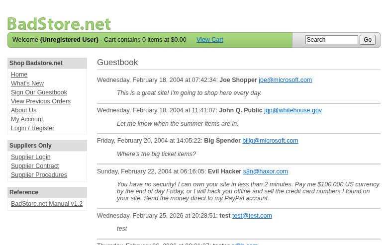

**Scope**

`OpenHack Security Agent` was engaged by `Bjoern Kimminich` to conduct Web Application Security Assessment IT security investigation. The subject of the investigation was the "BadStore".

The test was performed using Test/Staging.

**Objective**

The objective of the IT security investigation was to identify vulnerabilities and security gaps which, in the event of misuse, would have an impact on the availability, integrity and confidentiality of the defined applications and/or systems and the data processed on them. The result of this project is a report that contains a management summary of all relevant findings and a compilation of recommended measures.

The technical IT security audit is not a substantive audit effort to ensure that all vulnerabilities and security gaps existing at the time of the audit are identified. There is a possibility that established safeguards will effectively prevent identification and exploitation of vulnerabilities and security gaps. The client acknowledges that this is not an indicator of deficiencies in engagement performance and that additional unidentified vulnerabilities and security gaps may exist.

\vspace{4em}
\footnotesize
\begin{itshape}
\textbf{Disclaimer}

`OpenHack Security Agent` conducted the security penetration test on behalf of `Bjoern Kimminich`. This report has been prepared exclusively for `Bjoern Kimminich`. It is intended exclusively for internal use and is accordingly not designed to serve third parties as a basis for their decisions, unless agreed otherwise in writing. Third parties may not derive any rights or otherwise benefit from this engagement unless agreed otherwise in writing. Affiliated companies of the client are also considered "third parties" within the meaning of this engagement.

`OpenHack Security Agent` does not assume any liability or legal claims against third parties unless agreed otherwise in writing or a disclaimer cannot effectively be implemented.

It is the sole responsibility of anyone who becomes aware of the work results summarized in this report to decide to what extent and in what way the information is useful or appropriate and to supplement, check or update it as part of their own review.

No adjustments will be made to the report to reflect events or circumstances that occur after the report is issued, unless required by law.

The recommendations in this report are general and applicable in many different environments but could have unpredictable effects in specific environments. Therefore, any actions derived from the recommendations should be carefully considered and implemented through the regular change process. This should include appropriate testing of the changes on a test environment prior to going live. If the changes are not tested in advance in an identically configured test environment, failures or other damage cannot be ruled out.

Please note: Technical descriptions (or parts thereof) in this report may be taken from the OWASP Testing Guide (www.owasp.org).

\end{itshape}
\normalsize

\newpage

# Document Control

\small

**Document Status**

|                         |                                              |
| ----------------------- | -------------------------------------------- |
| **Title**               | Security Assessment Report                   |
| **Document Owner**      | OpenHack Security Agent                                 |
| **Classification**      | Strictly Confidential                        |
| **Project Timeframe**   | 2026-02-26                                    |

**Version History**

| Version | Date       | State          | Author       | Comments |
| ------- | ---------- | -------------- | ------------ | -------- |
| **0.1** | 2026-02-26 | Draft          | Jane Doe | --       |
| **1.0** | 2026-02-26 | Final document | Jane Doe | --       |

**Contact Persons - Assessor**

| Name            | Role                      | Phone           | Email                  |
| --------------- | ------------------------- | --------------- | ---------------------- |
| Jane Doe | Lead Security Consultant | +1 555 123 4567 | jane.doe@openhack.sec |
| John Smith | Security Consultant | +1 555 234 5678 | john.smith@openhack.sec |

**Contact Persons - Client**

| Name            | Role                      | Phone           | Email                  |
| --------------- | ------------------------- | --------------- | ---------------------- |
| Bjoern Kimminich | Project Lead | +1 555 345 6789 | bjoern.kimminich@owasp.org |

\normalsize

# Executive Summary

`OpenHack Security Agent` (hereinafter referred to as "ASSESSOR") has been commissioned by `Bjoern Kimminich` (hereinafter referred to as "CLIENT") to carry out a penetration test.

The penetration test of the `BadStore` application took place on **2026-02-26**.

For this purpose, the web application, accessible at `http://badstore:80`, was tested from the perspective of an external attacker. 

As part of the test, a total of 4 vulnerabilities were identified: 1 critical, 0 high, 3 medium, 0 low, and 0 informational.

Critical: **1** | High: **0** | Medium: **3** | Low: **0** | Informational: **0** | Total: **4**

+----------------------------------------------+-------+
| **Severity**                              | **Count** |
+==============================================+=======+
| \textcolor[HTML]{7B2D8E}{Critical}           | 1     |
+----------------------------------------------+-------+
| \textcolor[HTML]{CC0000}{High}               | 0     |
+----------------------------------------------+-------+
| \textcolor[HTML]{E67E22}{Medium}             | 3     |
+----------------------------------------------+-------+
| \textcolor[HTML]{D4AC0D}{Low}                | 0     |
+----------------------------------------------+-------+
| \textcolor[HTML]{2E86C1}{Informational}      | 0     |
+----------------------------------------------+-------+
| **Total**                                    | **4** |
+----------------------------------------------+-------+

: Overview of Findings

A description of the scope and test environment can be found in Chapter 3. Chapter 4 presents the risk assessment methodology. Chapter 5 provides a summary of findings. Chapter 6 contains the detailed technical descriptions of the findings including remediation measures.

It is recommended that the remediation of the critical risk vulnerabilities be treated with the highest priority and countermeasures implemented as soon as possible. The vulnerabilities with high and medium risk should also be remedied in the short term. The low-risk vulnerabilities should be treated with lower priority due to their reduced risk, but should still be addressed.

# Execution of the Security Penetration Test

## Subject Under Test

## Scope

The scope for the assessment was the following targets:

## Methodology

The security penetration test of the BadStore took place on 2026-02-26.

The web application was tested for security vulnerabilities across the following categories. This can be considered a guideline as penetration tests are a creative process and therefore the tests are not limited to what is given here. The base of these categories is the OWASP Top 10 for Web, which is fully covered by this penetration test approach.

| **Category**                            | **Description**                                                                                            |
| --------------------------------------- | ---------------------------------------------------------------------------------------------------------- |
| Broken Access Control                   | Users can act outside their permissions, leading to unauthorized viewing, modification, or deletion of data. |
| Security Misconfiguration               | Systems or cloud services are insecurely configured, e.g., through default passwords or unnecessarily enabled features. |
| Software Supply Chain Failures          | Vulnerabilities arise from compromised third-party code, libraries, or build pipelines.                    |
| Cryptographic Failures                  | Sensitive data is exposed through missing, weak, or incorrectly implemented encryption.                    |
| Injection                               | Attackers inject malicious commands (e.g., SQL or shell code) through input fields that the system erroneously executes. |
| Insecure Design                         | Fundamental architectural flaws that exist before implementation make an application inherently insecure.  |
| Authentication Failures                 | Flaws in identity verification allow attackers to take over sessions or guess passwords (brute force).     |
| Software or Data Integrity Failures     | Lack of verification of code or data sources leads to acceptance of untrusted updates or serialization data. |
| Security Logging & Alerting Failures    | Attacks go undetected or responses are delayed due to missing logs or absent alert notifications.          |
| Mishandling of Exceptional Conditions   | Programs respond inadequately to unforeseen situations, which can lead to crashes or logic errors.         |

## Events

During the test, the following restrictions or events occurred that may have affected the scope or depth of the assessment: 

\newpage

# Risk Assessment

## CVSS

The risk assessment of the vulnerabilities found is performed using the industry standard Common Vulnerability Scoring System v3.1 (hereinafter referred to as "CVSS"). This is a standard that can be used to uniformly assess the vulnerability of computer systems and the severity of security vulnerabilities. This makes it possible to compare vulnerabilities more effectively.

The Common Vulnerability Scoring System has a metric structure and is based on values that are divided into three groups: "Base", "Temporal", and "Environmental". To determine the vulnerability scores, each group has its own rules. The values of the Base group are invariant in time and remain the same in different environments. In the Temporal group, the time dependency of a vulnerability is taken into account. For example, the vulnerability of a system to a particular vulnerability decreases over time as more and more countermeasures such as patches become known and available. The Environmental group incorporates various criteria of the specific IT environments into the vulnerability rating.

The CVSS ratings are numerical values on a scale of 0.0 to 10.0, with the highest vulnerability of a system occurring at a value of 10.0. Our rating is based on the Base Metrics (Base Score) and is composed of:

- Attack Vector (AV)
- Attack Complexity (AC)
- Privileges Required (PR)
- User Interaction (UI)
- Scope (S)
- Confidentiality (C)
- Integrity (I)
- Availability (A)

As penetration testers, we can only assess the general threats posed by a vulnerability through Base Metrics. However, we have no insight into the internal structures of our clients. Therefore, the assessment of the specific risks for the client's systems and business processes must be done by the client. For this purpose, CVSS offers Environmental Metrics. This makes it possible to subsequently adjust the CVSS score of vulnerabilities after the test result has been submitted before they are remedied. This changes the assessment of the risk and thus the urgency of remediation of a vulnerability. For more information, see [CVSS v3.1 Specification](https://www.first.org/cvss/v3.1/specification-document).

## Risk Categories

The risk categories used in this report reflect the recommended priority for addressing the vulnerabilities identified during the penetration test. The categorization is based on the probability of exploitation and the significance of the impact. The risk value is calculated using the CVSS v3.1 standard:

| **Assessment**  | **Risk Category Description**                                |
| --------------- | ------------------------------------------------------------ |
| \textcolor[HTML]{7B2D8E}{\textbf{Critical}} | Critical vulnerabilities that allow an attacker to gain full access to the object under test and its sensitive information. It is possible to cause enormous damage to the client's reputation. Furthermore, these vulnerabilities may allow attackers to gain wide-ranging privileges, including to other systems or applications of the client that have not been investigated in detail within the scope of this project. Exploitation of the vulnerabilities is not prevented and can be reproduced with medium to low effort. |
| \textcolor[HTML]{CC0000}{\textbf{High}} | Vulnerabilities that may allow an attacker to manipulate sensitive data, damage the client's reputation, gain unauthorized access to sensitive information, or gain unauthorized access to applications or the client's infrastructure. The vulnerabilities are reproducible with medium to high effort. |
| \textcolor[HTML]{E67E22}{\textbf{Medium}} | Vulnerabilities that may allow an attacker to harm the client's reputation or gain unauthorized access to client data. The privileges that an attacker can gain by exploiting the vulnerabilities are limited. |
| \textcolor[HTML]{D4AC0D}{\textbf{Low}} | Security vulnerabilities that do not pose a threat in themselves, but which, for example, provide attackers with useful information about the network and systems. These vulnerabilities allow an attacker only very limited access. |
| \textcolor[HTML]{2E86C1}{\textbf{Informational}} | Anomalies such as functional limitations or inconsistencies. These do not currently represent a risk and have no negative impact on the test object. Accordingly, no action is required. Nevertheless, countermeasures can be helpful for the functional and safety improvement of the test object. If necessary, this may give rise to risks under other circumstances. |

## Vulnerability States

The vulnerabilities can be in one of the following states:

- **Active**: The vulnerability has been identified and it has been possible to verify its existence through exploitation or direct evidence.
- **Potential**: The vulnerability has been identified but its exploitation has not been possible, so its existence cannot be fully verified, and it is up to the client to determine the impact.
- **Fixed**: The vulnerability has been remediated and verified through retesting.

\newpage

# Summary of Findings

| **Id**   | **Finding Name**       | **Risk Assessment** | **CVSS v3.1 Score** |
| -------- | ---------------------- | --------------- | ------------- |
| 01 | SQL Injection in Search Function | \textcolor[HTML]{7B2D8E}{\textbf{Critical}} | 9.1 |
| 02 | Information Disclosure - Supplier Procedures Accessible Without Authentication | \textcolor[HTML]{E67E22}{\textbf{Medium}} | 5.3 |
| 03 | Stored Cross-Site Scripting (XSS) in Guestbook | \textcolor[HTML]{E67E22}{\textbf{Medium}} | 6.1 |
| 04 | Weak Password Policy - 8 Character Maximum | \textcolor[HTML]{E67E22}{\textbf{Medium}} | 5.3 |

\newpage

# Findings and Remediation

## Finding

### SQL Injection in Search Function

|                      |                                                              |
| -------------------- | ------------------------------------------------------------ |
| **Severity**      | \textcolor[HTML]{7B2D8E}{\textbf{Critical}} |
| **CVSS Base Score**  | **9.1** ([CVSS:3.1/AV:N/AC:L/PR:N/UI:N/S:U/C:H/I:H/A:N](https://www.first.org/cvss/calculator/3.1#CVSS:3.1/AV:N/AC:L/PR:N/UI:N/S:U/C:H/I:H/A:N)) |
| **Assets**           | http://badstore:80/cgi-bin/badstore.cgi?action=search |
| **Status**           | open |

**Description**

The search endpoint at /cgi-bin/badstore.cgi?action=search is vulnerable to SQL injection via the 'searchquery' parameter. The application directly concatenates user input into SQL queries without proper sanitization, exposing the raw SQL query in error messages and allowing attackers to manipulate database queries.

**Reproduction Steps:**
1. Navigate to http://badstore:80/cgi-bin/badstore.cgi?action=search
2. Enter searchquery parameter with SQL injection payload: searchquery=' OR '1'='1
3. Observe the raw SQL query exposed in the response: SELECT itemnum, sdesc, ldesc, price FROM itemdb WHERE '' OR '1'='1' IN (itemnum,sdesc,ldesc)
4. Alternative test: searchquery=%25 (URL-encoded %) returns all items using SQL wildcard

**Impact:**
- Complete database compromise through UNION-based injection
- Extraction of sensitive data (user credentials, personal information)
- Potential for data modification or deletion
- Database enumeration and schema discovery

**Evidence:**
- sqli-search-test.html: Shows raw SQL query with injected payload
- sqli-bypass-all.html: Demonstrates successful injection bypass

**Proof of Concept**

Not provided

**Remediation**

Not provided

**Evidence**

- SQL injection payload exposed in raw SQL query output showing vulnerable search endpoint

- SQL injection payload exposed in raw SQL query output showing vulnerable search endpoint

- Successful SQL injection bypass using OR 1=1 payload demonstrating query manipulation

- Successful SQL injection bypass using OR 1=1 payload demonstrating query manipulation

## Finding

### Information Disclosure - Supplier Procedures Accessible Without Authentication

|                      |                                                              |
| -------------------- | ------------------------------------------------------------ |
| **Severity**      | \textcolor[HTML]{E67E22}{\textbf{Medium}} |
| **CVSS Base Score**  | **5.3** ([CVSS:3.1/AV:N/AC:L/PR:N/UI:N/S:U/C:L/I:N/A:N](https://www.first.org/cvss/calculator/3.1#CVSS:3.1/AV:N/AC:L/PR:N/UI:N/S:U/C:L/I:N/A:N)) |
| **Assets**           | http://badstore:80/cgi-bin/badstore.cgi?action=supplierproc |
| **Status**           | open |

**Description**

The Supplier Procedures page at /cgi-bin/badstore.cgi?action=supplierproc is accessible without authentication. This page contains sensitive operational information about the supplier portal including file upload procedures that could be exploited by attackers.

**Reproduction Steps:**
1. Navigate directly to http://badstore:80/cgi-bin/badstore.cgi?action=supplierproc without logging in
2. Observe the page loads successfully displaying supplier-only information
3. The page reveals details about the file upload system including:
   - Upload form location and functionality
   - Accepted file types (HTML files, images)
   - Storage mechanism for uploaded files
   - Administrative workflow bypass opportunities

**Impact:**
- Exposure of internal business processes
- Disclosure of file upload functionality that could be targeted for attacks
- Information useful for planning further attacks against supplier systems
- Violation of access control expectations for supplier-only content

**Evidence:**
- supplierproc-unauth.html: Shows supplier procedures page accessible without authentication

**Proof of Concept**

Not provided

**Remediation**

Not provided

**Evidence**

- Supplier procedures page accessed without authentication revealing sensitive upload workflow details

- Supplier procedures page accessed without authentication revealing sensitive upload workflow details

## Finding

### Stored Cross-Site Scripting (XSS) in Guestbook

|                      |                                                              |
| -------------------- | ------------------------------------------------------------ |
| **Severity**      | \textcolor[HTML]{E67E22}{\textbf{Medium}} |
| **CVSS Base Score**  | **6.1** ([CVSS:3.1/AV:N/AC:L/PR:N/UI:R/S:C/C:L/I:L/A:N](https://www.first.org/cvss/calculator/3.1#CVSS:3.1/AV:N/AC:L/PR:N/UI:R/S:C/C:L/I:L/A:N)) |
| **Assets**           | http://badstore:80/cgi-bin/badstore.cgi?action=guestbook, http://badstore:80/cgi-bin/badstore.cgi?action=doguestbook |
| **Status**           | open |

**Description**

The Guestbook feature at /cgi-bin/badstore.cgi?action=guestbook is vulnerable to stored cross-site scripting (XSS) via the 'name' and 'comments' parameters. User input is not properly sanitized before being stored and displayed to other users, allowing attackers to inject malicious JavaScript that executes in victims' browsers.

**Reproduction Steps:**
1. Navigate to http://badstore:80/cgi-bin/badstore.cgi?action=guestbook
2. Fill in the 'Your Name' field with: 
3. Fill in the 'Comments' field with any text
4. Click 'Add Entry' button
5. Multiple JavaScript alert dialogs are triggered, confirming XSS execution:
   - alert('1')
   - alert('XSS-Name')
   - alert('XSS-Validation-Test')
   - alert('XSS')
   - alert('XSS-Comments-Validation')
6. The malicious script is stored and will execute whenever any user views the guestbook entries

**Impact:**
- Session hijacking through cookie theft
- Credential harvesting via fake login forms
- Defacement of web pages
- Malware distribution
- Phishing attacks against site visitors
- Potential for worm-like propagation

**Evidence:**
- xss-guestbook-exploit.png: Screenshot showing guestbook page after XSS injection
- xss-stored-guestbook.png: Screenshot showing stored XSS entry in guestbook
- Multiple JavaScript alerts triggered confirming script execution

**Proof of Concept**

Not provided

**Remediation**

Not provided

**Evidence**

- Stored XSS exploitation in guestbook showing script injection via name field

- Guestbook page displaying stored XSS entry with malicious script payload

## Finding

### Weak Password Policy - 8 Character Maximum

|                      |                                                              |
| -------------------- | ------------------------------------------------------------ |
| **Severity**      | \textcolor[HTML]{E67E22}{\textbf{Medium}} |
| **CVSS Base Score**  | **5.3** ([CVSS:3.1/AV:N/AC:L/PR:N/UI:N/S:U/C:L/I:N/A:N](https://www.first.org/cvss/calculator/3.1#CVSS:3.1/AV:N/AC:L/PR:N/UI:N/S:U/C:L/I:N/A:N)) |
| **Assets**           | http://badstore:80/cgi-bin/badstore.cgi?action=register, http://badstore:80/cgi-bin/badstore.cgi?action=loginregister |
| **Status**           | open |

**Description**

The application enforces a maximum password length of 8 characters, which is an extremely weak security policy. This limitation prevents users from creating strong passwords and makes accounts vulnerable to brute-force attacks.

**Reproduction Steps:**
1. Navigate to http://badstore:80/cgi-bin/badstore.cgi?action=loginregister
2. Attempt to register with a password longer than 8 characters
3. The registration form accepts only 8 characters maximum (maxlength=8)
4. Successfully register account with weak 8-character password: 12345678
5. Login succeeds with the weak password

**Impact:**
- Severely limited password entropy (max 8 characters)
- Vulnerable to brute-force attacks (8 chars = ~6.6 quadrillion combinations for alphanumeric, but much less for common passwords)
- Users cannot follow modern password best practices (12+ characters recommended)
- Password hints are stored and may be exposed
- Combined with no rate limiting, enables efficient credential attacks

**Evidence:**
- weak-password-register.html: Registration with 8-character password
- weak-password-login.html: Successful login with weak password
- myaccount-authenticated.html: Shows password field with size=8 maxlength constraint

**Proof of Concept**

Not provided

**Remediation**

Not provided

**Evidence**

- Registration page showing 8-character password field constraint allowing weak password 12345678

- Successful authentication with weak 8-character password demonstrating password policy vulnerability

\newpage

# Appendix A - Lists, Scripts and Raw Data

\newpage

# Appendix B - List of Abbreviations

+----------------+---------------------------------------------+
| Abbreviation   | Description                                 |
+================+=============================================+
| API            | Application Programming Interface           |
+----------------+---------------------------------------------+
| CAPTCHA        | Completely Automated Public Turing test to  |
|                | tell Computers and Humans Apart             |
+----------------+---------------------------------------------+
| CVSS           | Common Vulnerability Scoring System         |
+----------------+---------------------------------------------+
| FTP            | File Transfer Protocol                      |
+----------------+---------------------------------------------+
| IDOR           | Insecure Direct Object Reference            |
+----------------+---------------------------------------------+
| MD5            | Message-Digest Algorithm 5                  |
+----------------+---------------------------------------------+
| OAuth          | Open Authorization                          |
+----------------+---------------------------------------------+
| ORM            | Object-Relational Mapping                   |
+----------------+---------------------------------------------+
| OWASP          | Open Web Application Security Project       |
+----------------+---------------------------------------------+
| PII            | Personally Identifiable Information         |
+----------------+---------------------------------------------+
| SQL            | Structured Query Language                   |
+----------------+---------------------------------------------+
| TOTP           | Time-based One-Time Password                |
+----------------+---------------------------------------------+
| URI            | Uniform Resource Identifier                 |
+----------------+---------------------------------------------+
| WAF            | Web Application Firewall                    |
+----------------+---------------------------------------------+
| XSS            | Cross-Site Scripting                        |

+----------------+---------------------------------------------+
