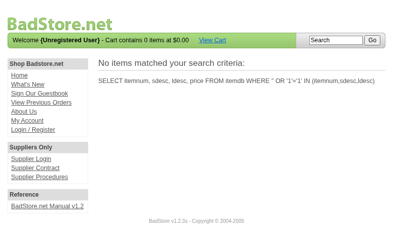
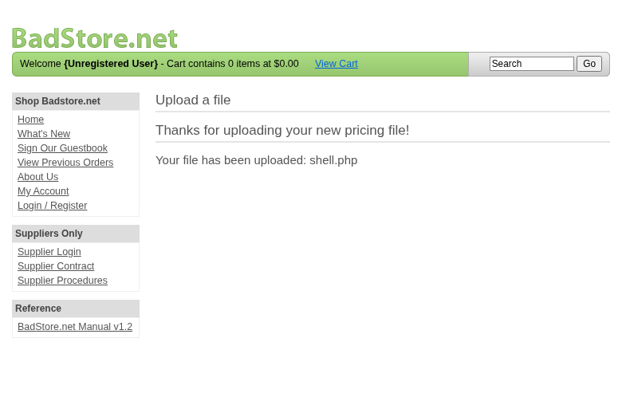

**Scope**

`Security Assessment Team` was engaged by `Richard Roe` to conduct Web Application Security Assessment IT security investigation. The subject of the investigation was the "BadStore".

The test was performed using Test/Development.

**Objective**

The objective of the IT security investigation was to identify vulnerabilities and security gaps which, in the event of misuse, would have an impact on the availability, integrity and confidentiality of the defined applications and/or systems and the data processed on them. The result of this project is a report that contains a management summary of all relevant findings and a compilation of recommended measures.

The technical IT security audit is not a substantive audit effort to ensure that all vulnerabilities and security gaps existing at the time of the audit are identified. There is a possibility that established safeguards will effectively prevent identification and exploitation of vulnerabilities and security gaps. The client acknowledges that this is not an indicator of deficiencies in engagement performance and that additional unidentified vulnerabilities and security gaps may exist.

\vspace{4em}
\footnotesize
\begin{itshape}
\textbf{Disclaimer}

`Security Assessment Team` conducted the security penetration test on behalf of `Richard Roe`. This report has been prepared exclusively for `Richard Roe`. It is intended exclusively for internal use and is accordingly not designed to serve third parties as a basis for their decisions, unless agreed otherwise in writing. Third parties may not derive any rights or otherwise benefit from this engagement unless agreed otherwise in writing. Affiliated companies of the client are also considered "third parties" within the meaning of this engagement.

`Security Assessment Team` does not assume any liability or legal claims against third parties unless agreed otherwise in writing or a disclaimer cannot effectively be implemented.

It is the sole responsibility of anyone who becomes aware of the work results summarized in this report to decide to what extent and in what way the information is useful or appropriate and to supplement, check or update it as part of their own review.

No adjustments will be made to the report to reflect events or circumstances that occur after the report is issued, unless required by law.

The recommendations in this report are general and applicable in many different environments but could have unpredictable effects in specific environments. Therefore, any actions derived from the recommendations should be carefully considered and implemented through the regular change process. This should include appropriate testing of the changes on a test environment prior to going live. If the changes are not tested in advance in an identically configured test environment, failures or other damage cannot be ruled out.

Please note: Technical descriptions (or parts thereof) in this report may be taken from the OWASP Testing Guide (www.owasp.org).

\end{itshape}
\normalsize

\newpage

# Document Control

\small

**Document Status**

|                         |                                              |
| ----------------------- | -------------------------------------------- |
| **Title**               | Security Assessment Report                   |
| **Document Owner**      | Security Assessment Team                                 |
| **Classification**      | Strictly Confidential                        |
| **Project Timeframe**   | 2026-02-27                                    |

**Version History**

| Version | Date       | State          | Author       | Comments |
| ------- | ---------- | -------------- | ------------ | -------- |
| **0.1** | 2026-02-27 | Draft          | Jane Doe | --       |
| **1.0** | 2026-02-27 | Final document | Jane Doe | --       |

**Contact Persons - Assessor**

| Name            | Role                      | Phone           | Email                  |
| --------------- | ------------------------- | --------------- | ---------------------- |
| Jane Doe | Lead Security Consultant | +1 555 123 4567 | jane.doe@openhack.sec |
| John Smith | Security Consultant | +1 555 234 5678 | john.smith@openhack.sec |

**Contact Persons - Client**

| Name            | Role                      | Phone           | Email                  |
| --------------- | ------------------------- | --------------- | ---------------------- |
| Richard Roe | Project Lead | +1 555 345 6789 | spam@badstore.net |

\normalsize

# Executive Summary

`Security Assessment Team` (hereinafter referred to as "ASSESSOR") has been commissioned by `Richard Roe` (hereinafter referred to as "CLIENT") to carry out a penetration test.

The penetration test of the `BadStore` application took place on **2026-02-27**.

For this purpose, the web application, accessible at `http://badstore:80`, was tested from the perspective of an external attacker. 

As part of the test, a total of 5 vulnerabilities were identified: 1 critical, 1 high, 2 medium, 0 low, and 1 informational.

Critical: **1** | High: **1** | Medium: **2** | Low: **0** | Informational: **1** | Total: **5**

+----------------------------------------------+-------+
| **Severity**                              | **Count** |
+==============================================+=======+
| \textcolor[HTML]{7B2D8E}{Critical}           | 1     |
+----------------------------------------------+-------+
| \textcolor[HTML]{CC0000}{High}               | 1     |
+----------------------------------------------+-------+
| \textcolor[HTML]{E67E22}{Medium}             | 2     |
+----------------------------------------------+-------+
| \textcolor[HTML]{D4AC0D}{Low}                | 0     |
+----------------------------------------------+-------+
| \textcolor[HTML]{2E86C1}{Informational}      | 1     |
+----------------------------------------------+-------+
| **Total**                                    | **5** |
+----------------------------------------------+-------+

: Overview of Findings

A description of the scope and test environment can be found in Chapter 3. Chapter 4 presents the risk assessment methodology. Chapter 5 provides a summary of findings. Chapter 6 contains the detailed technical descriptions of the findings including remediation measures.

It is recommended that the remediation of the critical risk vulnerabilities be treated with the highest priority and countermeasures implemented as soon as possible. The vulnerabilities with high and medium risk should also be remedied in the short term. The low-risk vulnerabilities should be treated with lower priority due to their reduced risk, but should still be addressed.

# Execution of the Security Penetration Test

## Subject Under Test

BadStore e-commerce web application security assessment

## Scope

The scope for the assessment was the following targets:

- Target: http://badstore:80
- Scope: Full web application attack surface

## Methodology

The security penetration test of the BadStore took place on 2026-02-27.

Standard scan mode with balanced coverage and validation depth. BadStore profile engagement mode applied.

The web application was tested for security vulnerabilities across the following categories. This can be considered a guideline as penetration tests are a creative process and therefore the tests are not limited to what is given here. The base of these categories is the OWASP Top 10 for Web, which is fully covered by this penetration test approach.

| **Category**                            | **Description**                                                                                            |
| --------------------------------------- | ---------------------------------------------------------------------------------------------------------- |
| Broken Access Control                   | Users can act outside their permissions, leading to unauthorized viewing, modification, or deletion of data. |
| Security Misconfiguration               | Systems or cloud services are insecurely configured, e.g., through default passwords or unnecessarily enabled features. |
| Software Supply Chain Failures          | Vulnerabilities arise from compromised third-party code, libraries, or build pipelines.                    |
| Cryptographic Failures                  | Sensitive data is exposed through missing, weak, or incorrectly implemented encryption.                    |
| Injection                               | Attackers inject malicious commands (e.g., SQL or shell code) through input fields that the system erroneously executes. |
| Insecure Design                         | Fundamental architectural flaws that exist before implementation make an application inherently insecure.  |
| Authentication Failures                 | Flaws in identity verification allow attackers to take over sessions or guess passwords (brute force).     |
| Software or Data Integrity Failures     | Lack of verification of code or data sources leads to acceptance of untrusted updates or serialization data. |
| Security Logging & Alerting Failures    | Attacks go undetected or responses are delayed due to missing logs or absent alert notifications.          |
| Mishandling of Exceptional Conditions   | Programs respond inadequately to unforeseen situations, which can lead to crashes or logic errors.         |

## Events

During the test, the following restrictions or events occurred that may have affected the scope or depth of the assessment: 

\newpage

# Risk Assessment

## CVSS

The risk assessment of the vulnerabilities found is performed using the industry standard Common Vulnerability Scoring System v3.1 (hereinafter referred to as "CVSS"). This is a standard that can be used to uniformly assess the vulnerability of computer systems and the severity of security vulnerabilities. This makes it possible to compare vulnerabilities more effectively.

The Common Vulnerability Scoring System has a metric structure and is based on values that are divided into three groups: "Base", "Temporal", and "Environmental". To determine the vulnerability scores, each group has its own rules. The values of the Base group are invariant in time and remain the same in different environments. In the Temporal group, the time dependency of a vulnerability is taken into account. For example, the vulnerability of a system to a particular vulnerability decreases over time as more and more countermeasures such as patches become known and available. The Environmental group incorporates various criteria of the specific IT environments into the vulnerability rating.

The CVSS ratings are numerical values on a scale of 0.0 to 10.0, with the highest vulnerability of a system occurring at a value of 10.0. Our rating is based on the Base Metrics (Base Score) and is composed of:

- Attack Vector (AV)
- Attack Complexity (AC)
- Privileges Required (PR)
- User Interaction (UI)
- Scope (S)
- Confidentiality (C)
- Integrity (I)
- Availability (A)

As penetration testers, we can only assess the general threats posed by a vulnerability through Base Metrics. However, we have no insight into the internal structures of our clients. Therefore, the assessment of the specific risks for the client's systems and business processes must be done by the client. For this purpose, CVSS offers Environmental Metrics. This makes it possible to subsequently adjust the CVSS score of vulnerabilities after the test result has been submitted before they are remedied. This changes the assessment of the risk and thus the urgency of remediation of a vulnerability. For more information, see [CVSS v3.1 Specification](https://www.first.org/cvss/v3.1/specification-document).

## Risk Categories

The risk categories used in this report reflect the recommended priority for addressing the vulnerabilities identified during the penetration test. The categorization is based on the probability of exploitation and the significance of the impact. The risk value is calculated using the CVSS v3.1 standard:

| **Assessment**  | **Risk Category Description**                                |
| --------------- | ------------------------------------------------------------ |
| \textcolor[HTML]{7B2D8E}{\textbf{Critical}} | Critical vulnerabilities that allow an attacker to gain full access to the object under test and its sensitive information. It is possible to cause enormous damage to the client's reputation. Furthermore, these vulnerabilities may allow attackers to gain wide-ranging privileges, including to other systems or applications of the client that have not been investigated in detail within the scope of this project. Exploitation of the vulnerabilities is not prevented and can be reproduced with medium to low effort. |
| \textcolor[HTML]{CC0000}{\textbf{High}} | Vulnerabilities that may allow an attacker to manipulate sensitive data, damage the client's reputation, gain unauthorized access to sensitive information, or gain unauthorized access to applications or the client's infrastructure. The vulnerabilities are reproducible with medium to high effort. |
| \textcolor[HTML]{E67E22}{\textbf{Medium}} | Vulnerabilities that may allow an attacker to harm the client's reputation or gain unauthorized access to client data. The privileges that an attacker can gain by exploiting the vulnerabilities are limited. |
| \textcolor[HTML]{D4AC0D}{\textbf{Low}} | Security vulnerabilities that do not pose a threat in themselves, but which, for example, provide attackers with useful information about the network and systems. These vulnerabilities allow an attacker only very limited access. |
| \textcolor[HTML]{2E86C1}{\textbf{Informational}} | Anomalies such as functional limitations or inconsistencies. These do not currently represent a risk and have no negative impact on the test object. Accordingly, no action is required. Nevertheless, countermeasures can be helpful for the functional and safety improvement of the test object. If necessary, this may give rise to risks under other circumstances. |

## Vulnerability States

The vulnerabilities can be in one of the following states:

- **Active**: The vulnerability has been identified and it has been possible to verify its existence through exploitation or direct evidence.
- **Potential**: The vulnerability has been identified but its exploitation has not been possible, so its existence cannot be fully verified, and it is up to the client to determine the impact.
- **Fixed**: The vulnerability has been remediated and verified through retesting.

\newpage

# Summary of Findings

| **Id**   | **Finding Name**       | **Risk Assessment** | **CVSS v3.1 Score** |
| -------- | ---------------------- | --------------- | ------------- |
| 01 | SQL Injection in Search Functionality | \textcolor[HTML]{7B2D8E}{\textbf{Critical}} | 9.1 |
| 02 | Unrestricted File Upload in Supplier Portal | \textcolor[HTML]{CC0000}{\textbf{High}} | 8.1 |
| 03 | Information Disclosure - SQL Queries Exposed in Responses | \textcolor[HTML]{E67E22}{\textbf{Medium}} | 5.3 |
| 04 | Weak Password Policy - 8 Character Maximum | \textcolor[HTML]{E67E22}{\textbf{Medium}} | 5.3 |
| 05 | robots.txt Directory Disclosure | \textcolor[HTML]{2E86C1}{\textbf{Informational}} | 0 |

\newpage

# Findings and Remediation

## Finding

### SQL Injection in Search Functionality

|                      |                                                              |
| -------------------- | ------------------------------------------------------------ |
| **Severity**      | \textcolor[HTML]{7B2D8E}{\textbf{Critical}} |
| **CVSS Base Score**  | **9.1** ([CVSS:3.1/AV:N/AC:L/PR:N/UI:N/S:U/C:H/I:H/A:N](https://www.first.org/cvss/calculator/3.1#CVSS:3.1/AV:N/AC:L/PR:N/UI:N/S:U/C:H/I:H/A:N)) |
| **Assets**           | http://badstore:80/cgi-bin/badstore.cgi |
| **Status**           | open |

**Description**

The search functionality in /cgi-bin/badstore.cgi is vulnerable to SQL injection via the 'searchquery' parameter. The application directly concatenates user input into SQL queries without proper sanitization, allowing attackers to extract sensitive data from the database.

**Reproduction Steps:**
1. Navigate to http://badstore:80/cgi-bin/badstore.cgi
2. Enter a search query with SQL injection payload: `' OR '1'='1`
3. The SQL query is displayed in the response, confirming the vulnerability
4. Extract database user: `' UNION SELECT 1,user(),3,4#` returns `root@localhost`
5. Extract table columns: `' UNION SELECT 1,column_name,3,4 FROM information_schema.columns WHERE table_name='userdb'#` reveals columns: email, passwd, pwdhint, fullname, role
6. Extract all user credentials: `' UNION SELECT email,passwd,fullname,role FROM userdb#` dumps all 50+ user accounts with password hashes

**Impact:**
- Complete database compromise
- Extraction of all user credentials (emails, password hashes, roles)
- Admin accounts compromised: admin, ryan@badstore.net, testadmin93jx3k@test.com, testadmin@test.com, roleadmin@example.com, masstest@example.com, logouttest2@example.com
- Password hashes can be cracked offline (MD5 hashes observed)

**Evidence:**
- Screenshot showing SQL query exposure: sqli-screenshot-20260227-001.png
- Full user data extraction: sqli-user-data-extraction-20260227-006.txt

**Proof of Concept**

Not provided

**Remediation**

Not provided

**Evidence**

- SQL injection proof showing exposed SQL query in response

- SQL injection proof showing exposed SQL query in response

- Full database user extraction via UNION-based SQL injection: [images/finding-f6e6ce48-d2e8-4e8b-a223-411bdf291e5d-3-sqli-user-data-extraction-20260227-006.txt](images/finding-f6e6ce48-d2e8-4e8b-a223-411bdf291e5d-3-sqli-user-data-extraction-20260227-006.txt)

## Finding

### Unrestricted File Upload in Supplier Portal

|                      |                                                              |
| -------------------- | ------------------------------------------------------------ |
| **Severity**      | \textcolor[HTML]{CC0000}{\textbf{High}} |
| **CVSS Base Score**  | **8.1** ([CVSS:3.1/AV:N/AC:L/PR:L/UI:N/S:U/C:H/I:H/A:N](https://www.first.org/cvss/calculator/3.1#CVSS:3.1/AV:N/AC:L/PR:L/UI:N/S:U/C:H/I:H/A:N)) |
| **Assets**           | http://badstore:80/cgi-bin/badstore.cgi?action=supplierportal, http://badstore:80/cgi-bin/badstore.cgi?action=supupload |
| **Status**           | open |

**Description**

The supplier portal file upload functionality at /cgi-bin/badstore.cgi?action=supupload accepts arbitrary file types without validation, allowing authenticated suppliers to upload malicious files such as PHP web shells.

**Reproduction Steps:**
1. Login to supplier portal with credentials: heinrich@supplier.de / password
2. Navigate to supplier portal upload page: /cgi-bin/badstore.cgi?action=supplierportal
3. Upload a PHP file (shell.php) containing malicious code
4. Specify filename as 'shell.php' in the 'Filename on BadStore.net' field
5. Click Upload - file is accepted with message 'Thanks for uploading your new pricing file!'
6. Uploaded file is stored and can be accessed (though execution depends on server configuration)

**Impact:**
- Arbitrary file upload allows deployment of web shells
- If PHP execution is enabled in upload directory, leads to Remote Code Execution (RCE)
- Can be used to persist access, deface site, or attack other systems
- Combined with SQL injection to obtain supplier credentials, any attacker can gain upload access

**Evidence:**
- Screenshot showing successful upload: file-upload-success-screenshot-20260227-002.png
- Upload response text: file-upload-success-20260227-002.txt

**Proof of Concept**

Not provided

**Remediation**

Not provided

**Evidence**

- Successful upload of PHP file to supplier portal

- Server response confirming PHP file upload acceptance: [images/finding-b859c872-490e-466a-a214-fc5557ecc1c8-5-file-upload-success-20260227-002.txt](images/finding-b859c872-490e-466a-a214-fc5557ecc1c8-5-file-upload-success-20260227-002.txt)

## Finding

### Information Disclosure - SQL Queries Exposed in Responses

|                      |                                                              |
| -------------------- | ------------------------------------------------------------ |
| **Severity**      | \textcolor[HTML]{E67E22}{\textbf{Medium}} |
| **CVSS Base Score**  | **5.3** ([CVSS:3.1/AV:N/AC:L/PR:N/UI:N/S:U/C:L/I:N/A:N](https://www.first.org/cvss/calculator/3.1#CVSS:3.1/AV:N/AC:L/PR:N/UI:N/S:U/C:L/I:N/A:N)) |
| **Assets**           | http://badstore:80/cgi-bin/badstore.cgi |
| **Status**           | open |

**Description**

The application exposes raw SQL queries in HTTP responses when processing search requests. This information disclosure vulnerability aids attackers in crafting SQL injection attacks and reveals database structure.

**Reproduction Steps:**
1. Navigate to http://badstore:80/cgi-bin/badstore.cgi?action=search&searchquery=test
2. Observe the page source or response body
3. SQL query is visible in HTML comment and displayed on page: 'SELECT itemnum, sdesc, ldesc, price FROM itemdb WHERE...'
4. When SQL injection is attempted, the full malformed query is displayed showing the exact injection point

**Impact:**
- Reveals database table names (itemdb, userdb)
- Exposes column names (itemnum, sdesc, ldesc, price, email, passwd, etc.)
- Shows exact SQL syntax used, enabling precise injection attacks
- Error messages reveal database technology (MariaDB/MySQL) and file paths (/data/apache2/cgi-bin/badstore.cgi line 242)
- Significantly reduces effort required for successful SQL injection

**Evidence:**
- Screenshot sqli-screenshot-20260227-001.png shows exposed SQL query
- Response files show full query disclosure

**Proof of Concept**

Not provided

**Remediation**

Not provided

**Evidence**

- SQL query exposed in page response revealing database structure

## Finding

### Weak Password Policy - 8 Character Maximum

|                      |                                                              |
| -------------------- | ------------------------------------------------------------ |
| **Severity**      | \textcolor[HTML]{E67E22}{\textbf{Medium}} |
| **CVSS Base Score**  | **5.3** ([CVSS:3.1/AV:N/AC:L/PR:N/UI:N/S:U/C:L/I:N/A:N](https://www.first.org/cvss/calculator/3.1#CVSS:3.1/AV:N/AC:L/PR:N/UI:N/S:U/C:L/I:N/A:N)) |
| **Assets**           | http://badstore:80/cgi-bin/badstore.cgi?action=loginregister |
| **Status**           | open |

**Description**

The application enforces a maximum password length of 8 characters in both login and registration forms. This severely limits password complexity and makes accounts vulnerable to brute force and dictionary attacks.

**Reproduction Steps:**
1. Navigate to http://badstore:80/cgi-bin/badstore.cgi?action=loginregister
2. Observe the password field has maxlength="8" attribute
3. Registration form also limits password to 8 characters
4. All user password hashes in database are MD5 of short passwords

**Impact:**
- 8-character maximum prevents use of strong passphrases
- Combined with MD5 hashing (no salt observed), passwords are easily crackable
- Extracted hashes show many users have simple passwords
- Brute force attacks are feasible due to short password space
- No account lockout mechanism observed

**Evidence:**
- Login page HTML shows maxlength="8" on password field
- User database extraction shows MD5 hashes for all passwords

**Proof of Concept**

Not provided

**Remediation**

Not provided

**Evidence**

- User database showing MD5 password hashes from 8-character passwords: [images/finding-4cbbefe9-aa43-4d7e-86e5-aad6af240bc2-7-sqli-user-data-extraction-20260227-006.txt](images/finding-4cbbefe9-aa43-4d7e-86e5-aad6af240bc2-7-sqli-user-data-extraction-20260227-006.txt)

## Finding

### robots.txt Directory Disclosure

|                      |                                                              |
| -------------------- | ------------------------------------------------------------ |
| **Severity**      | \textcolor[HTML]{2E86C1}{\textbf{Informational}} |
| **CVSS Base Score**  | **0.0** ([CVSS:3.1/AV:N/AC:L/PR:N/UI:N/S:U/C:N/I:N/A:N](https://www.first.org/cvss/calculator/3.1#CVSS:3.1/AV:N/AC:L/PR:N/UI:N/S:U/C:N/I:N/A:N)) |
| **Assets**           | http://badstore:80/robots.txt |
| **Status**           | open |

**Description**

The robots.txt file exposes hidden directories and administrative paths that should not be publicly disclosed. This aids attackers in discovering sensitive application areas.

**Reproduction Steps:**
1. Navigate to http://badstore:80/robots.txt
2. Observe exposed directories: /cgi-bin/, /DoingBusiness/, /BadStore_net_v1_2_Manual.pdf, /scanbot/
3. These paths reveal administrative interfaces and internal documentation

**Impact:**
- Reveals existence of /cgi-bin/ directory structure
- Exposes /DoingBusiness/ directory containing contract documents
- Discloses /scanbot/ directory (potential admin tool)
- Aids reconnaissance for further attacks
- Low severity but contributes to information gathering

**Proof of Concept**

Not provided

**Remediation**

Not provided

**Evidence**

\newpage

# Appendix A - Lists, Scripts and Raw Data

\newpage

# Appendix B - List of Abbreviations

+----------------+---------------------------------------------+
| Abbreviation   | Description                                 |
+================+=============================================+
| API            | Application Programming Interface           |
+----------------+---------------------------------------------+
| CAPTCHA        | Completely Automated Public Turing test to  |
|                | tell Computers and Humans Apart             |
+----------------+---------------------------------------------+
| CVSS           | Common Vulnerability Scoring System         |
+----------------+---------------------------------------------+
| FTP            | File Transfer Protocol                      |
+----------------+---------------------------------------------+
| IDOR           | Insecure Direct Object Reference            |
+----------------+---------------------------------------------+
| MD5            | Message-Digest Algorithm 5                  |
+----------------+---------------------------------------------+
| OAuth          | Open Authorization                          |
+----------------+---------------------------------------------+
| ORM            | Object-Relational Mapping                   |
+----------------+---------------------------------------------+
| OWASP          | Open Web Application Security Project       |
+----------------+---------------------------------------------+
| PII            | Personally Identifiable Information         |
+----------------+---------------------------------------------+
| SQL            | Structured Query Language                   |
+----------------+---------------------------------------------+
| TOTP           | Time-based One-Time Password                |
+----------------+---------------------------------------------+
| URI            | Uniform Resource Identifier                 |
+----------------+---------------------------------------------+
| WAF            | Web Application Firewall                    |
+----------------+---------------------------------------------+
| XSS            | Cross-Site Scripting                        |

+----------------+---------------------------------------------+
