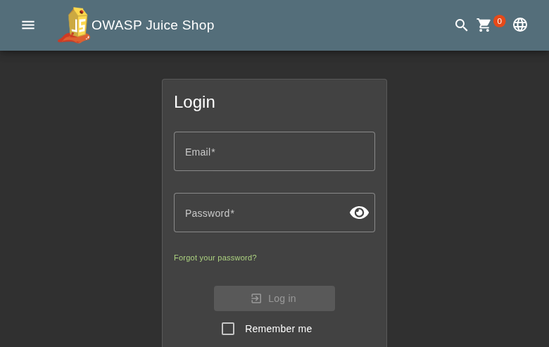
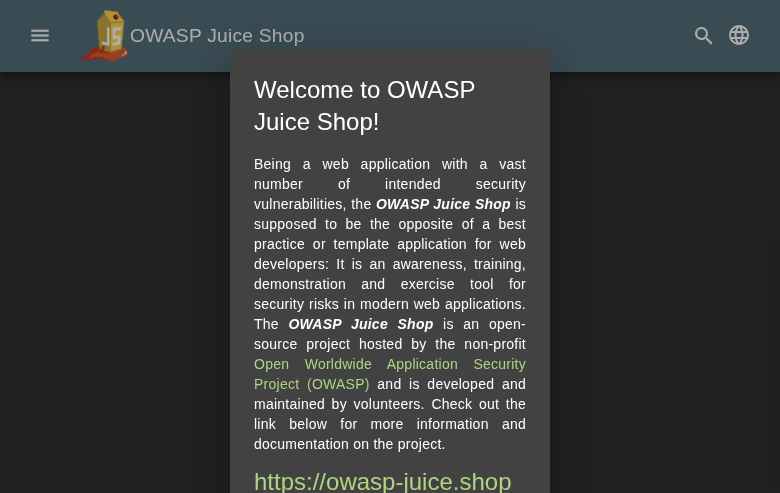
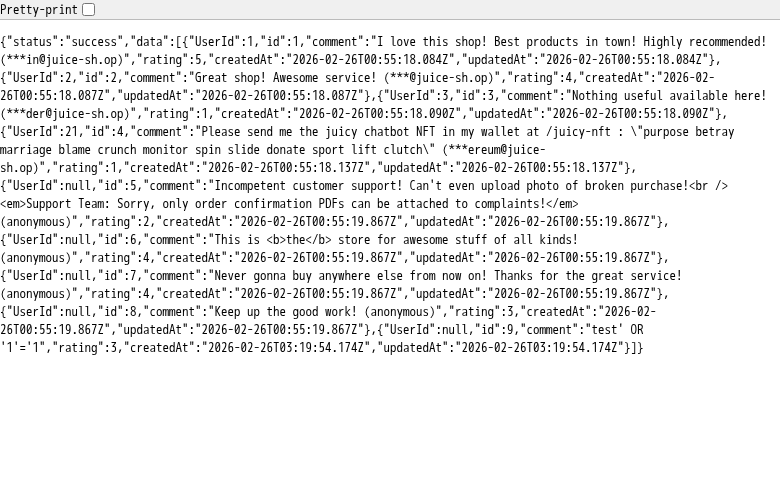
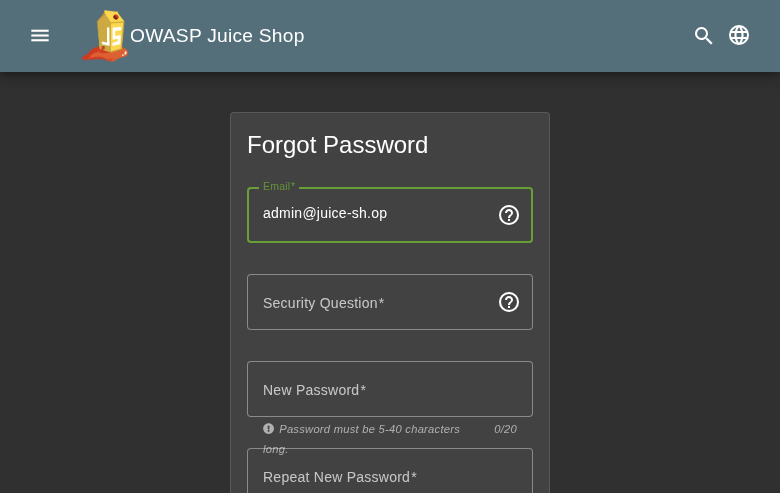
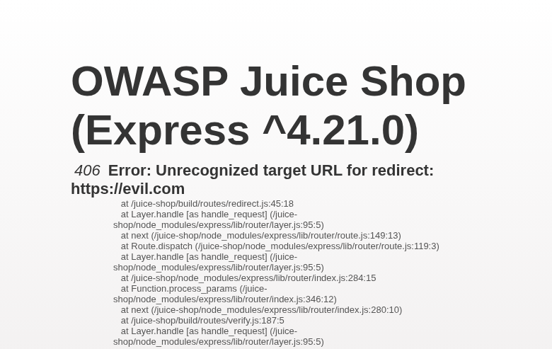
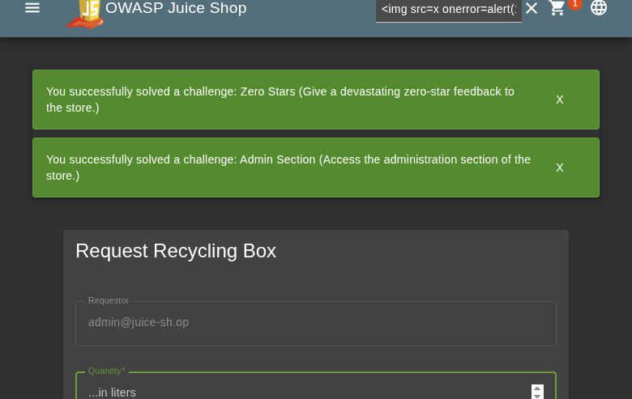

**Scope**

`OpenHack Security Agent` was engaged by `Bjoern Kimminich` to conduct an external IT security investigation. The subject of the investigation was the "OWASP Juice Shop v19.1.1".

The test was performed using a local instance of the application at `localhost:3333` in a dedicated test environment..

**Objective**

The objective of the IT security investigation was to identify vulnerabilities and security gaps which, in the event of misuse, would have an impact on the availability, integrity and confidentiality of the defined applications and/or systems and the data processed on them. The result of this project is a report that contains a management summary of all relevant findings and a compilation of recommended measures.

The technical IT security audit is not a substantive audit effort to ensure that all vulnerabilities and security gaps existing at the time of the audit are identified. There is a possibility that established safeguards will effectively prevent identification and exploitation of vulnerabilities and security gaps. The client acknowledges that this is not an indicator of deficiencies in engagement performance and that additional unidentified vulnerabilities and security gaps may exist.

\vspace{4em}
\footnotesize
\begin{itshape}
\textbf{Disclaimer}

`OpenHack Security Agent` conducted the security penetration test on behalf of `Bjoern Kimminich`. This report has been prepared exclusively for `Bjoern Kimminich`. It is intended exclusively for internal use and is accordingly not designed to serve third parties as a basis for their decisions, unless agreed otherwise in writing. Third parties may not derive any rights or otherwise benefit from this engagement unless agreed otherwise in writing. Affiliated companies of the client are also considered "third parties" within the meaning of this engagement.

`OpenHack Security Agent` does not assume any liability or legal claims against third parties unless agreed otherwise in writing or a disclaimer cannot effectively be implemented.

It is the sole responsibility of anyone who becomes aware of the work results summarized in this report to decide to what extent and in what way the information is useful or appropriate and to supplement, check or update it as part of their own review.

No adjustments will be made to the report to reflect events or circumstances that occur after the report is issued, unless required by law.

The recommendations in this report are general and applicable in many different environments but could have unpredictable effects in specific environments. Therefore, any actions derived from the recommendations should be carefully considered and implemented through the regular change process. This should include appropriate testing of the changes on a test environment prior to going live. If the changes are not tested in advance in an identically configured test environment, failures or other damage cannot be ruled out.

Please note: Technical descriptions (or parts thereof) in this report may be taken from the OWASP Testing Guide (www.owasp.org).

\end{itshape}
\normalsize

\newpage

# Document Control

\small

**Document Status**

|                         |                                              |
| ----------------------- | -------------------------------------------- |
| **Title**               | Security Assessment Report                   |
| **Document Owner**      | OpenHack Security Agent                                 |
| **Classification**      | Strictly Confidential                        |
| **Project Timeframe**   | 2026-02-26                                    |

**Version History**

| Version | Date       | State          | Author       | Comments |
| ------- | ---------- | -------------- | ------------ | -------- |
| **0.1** | 2026-02-26 | Draft          | Jane Doe | --       |
| **1.0** | 2026-02-26 | Final document | Jane Doe | --       |

**Contact Persons - Assessor**

| Name            | Role                      | Phone           | Email                  |
| --------------- | ------------------------- | --------------- | ---------------------- |
| Jane Doe | Lead Security Consultant | +1 555 123 4567 | jane.doe@openhack.sec |
| John Smith | Security Consultant | +1 555 234 5678 | john.smith@openhack.sec |

**Contact Persons - Client**

| Name            | Role                      | Phone           | Email                  |
| --------------- | ------------------------- | --------------- | ---------------------- |
| Bjoern Kimminich | Project Lead | +1 555 345 6789 | bjoern.kimminich@owasp.org |

\normalsize

# Executive Summary

`OpenHack Security Agent` (hereinafter referred to as "ASSESSOR") has been commissioned by `Bjoern Kimminich` (hereinafter referred to as "CLIENT") to carry out a penetration test.

The penetration test of the `OWASP Juice Shop v19.1.1` application took place on **2026-02-26**.

For this purpose, the web application, accessible at `http://juiceshop:3000`, was tested from the perspective of an external attacker. 

As part of the test, a total of 10 vulnerabilities were identified: 4 critical, 1 high, 4 medium, 1 low, and 0 informational.

Critical: **4** | High: **1** | Medium: **4** | Low: **1** | Informational: **0** | Total: **10**

+----------------------------------------------+-------+
| **Severity**                              | **Count** |
+==============================================+=======+
| \textcolor[HTML]{7B2D8E}{Critical}           | 4     |
+----------------------------------------------+-------+
| \textcolor[HTML]{CC0000}{High}               | 1     |
+----------------------------------------------+-------+
| \textcolor[HTML]{E67E22}{Medium}             | 4     |
+----------------------------------------------+-------+
| \textcolor[HTML]{D4AC0D}{Low}                | 1     |
+----------------------------------------------+-------+
| \textcolor[HTML]{2E86C1}{Informational}      | 0     |
+----------------------------------------------+-------+
| **Total**                                    | **10** |
+----------------------------------------------+-------+

: Overview of Findings

A description of the scope and test environment can be found in Chapter 3. Chapter 4 presents the risk assessment methodology. Chapter 5 provides a summary of findings. Chapter 6 contains the detailed technical descriptions of the findings including remediation measures.

It is recommended that the remediation of the critical risk vulnerabilities be treated with the highest priority and countermeasures implemented as soon as possible. The vulnerabilities with high and medium risk should also be remedied in the short term. The low-risk vulnerabilities should be treated with lower priority due to their reduced risk, but should still be addressed.

# Execution of the Security Penetration Test

## Subject Under Test

## Scope

The scope for the assessment was the following targets:

## Methodology

The security penetration test of the OWASP Juice Shop v19.1.1 took place on 2026-02-26.

The web application was tested for security vulnerabilities across the following categories. This can be considered a guideline as penetration tests are a creative process and therefore the tests are not limited to what is given here. The base of these categories is the OWASP Top 10 for Web, which is fully covered by this penetration test approach.

| **Category**                            | **Description**                                                                                            |
| --------------------------------------- | ---------------------------------------------------------------------------------------------------------- |
| Broken Access Control                   | Users can act outside their permissions, leading to unauthorized viewing, modification, or deletion of data. |
| Security Misconfiguration               | Systems or cloud services are insecurely configured, e.g., through default passwords or unnecessarily enabled features. |
| Software Supply Chain Failures          | Vulnerabilities arise from compromised third-party code, libraries, or build pipelines.                    |
| Cryptographic Failures                  | Sensitive data is exposed through missing, weak, or incorrectly implemented encryption.                    |
| Injection                               | Attackers inject malicious commands (e.g., SQL or shell code) through input fields that the system erroneously executes. |
| Insecure Design                         | Fundamental architectural flaws that exist before implementation make an application inherently insecure.  |
| Authentication Failures                 | Flaws in identity verification allow attackers to take over sessions or guess passwords (brute force).     |
| Software or Data Integrity Failures     | Lack of verification of code or data sources leads to acceptance of untrusted updates or serialization data. |
| Security Logging & Alerting Failures    | Attacks go undetected or responses are delayed due to missing logs or absent alert notifications.          |
| Mishandling of Exceptional Conditions   | Programs respond inadequately to unforeseen situations, which can lead to crashes or logic errors.         |

## Events

During the test, the following restrictions or events occurred that may have affected the scope or depth of the assessment: 

\newpage

# Risk Assessment

## CVSS

The risk assessment of the vulnerabilities found is performed using the industry standard Common Vulnerability Scoring System v3.1 (hereinafter referred to as "CVSS"). This is a standard that can be used to uniformly assess the vulnerability of computer systems and the severity of security vulnerabilities. This makes it possible to compare vulnerabilities more effectively.

The Common Vulnerability Scoring System has a metric structure and is based on values that are divided into three groups: "Base", "Temporal", and "Environmental". To determine the vulnerability scores, each group has its own rules. The values of the Base group are invariant in time and remain the same in different environments. In the Temporal group, the time dependency of a vulnerability is taken into account. For example, the vulnerability of a system to a particular vulnerability decreases over time as more and more countermeasures such as patches become known and available. The Environmental group incorporates various criteria of the specific IT environments into the vulnerability rating.

The CVSS ratings are numerical values on a scale of 0.0 to 10.0, with the highest vulnerability of a system occurring at a value of 10.0. Our rating is based on the Base Metrics (Base Score) and is composed of:

- Attack Vector (AV)
- Attack Complexity (AC)
- Privileges Required (PR)
- User Interaction (UI)
- Scope (S)
- Confidentiality (C)
- Integrity (I)
- Availability (A)

As penetration testers, we can only assess the general threats posed by a vulnerability through Base Metrics. However, we have no insight into the internal structures of our clients. Therefore, the assessment of the specific risks for the client's systems and business processes must be done by the client. For this purpose, CVSS offers Environmental Metrics. This makes it possible to subsequently adjust the CVSS score of vulnerabilities after the test result has been submitted before they are remedied. This changes the assessment of the risk and thus the urgency of remediation of a vulnerability. For more information, see [CVSS v3.1 Specification](https://www.first.org/cvss/v3.1/specification-document).

## Risk Categories

The risk categories used in this report reflect the recommended priority for addressing the vulnerabilities identified during the penetration test. The categorization is based on the probability of exploitation and the significance of the impact. The risk value is calculated using the CVSS v3.1 standard:

| **Assessment**  | **Risk Category Description**                                |
| --------------- | ------------------------------------------------------------ |
| \textcolor[HTML]{7B2D8E}{\textbf{Critical}} | Critical vulnerabilities that allow an attacker to gain full access to the object under test and its sensitive information. It is possible to cause enormous damage to the client's reputation. Furthermore, these vulnerabilities may allow attackers to gain wide-ranging privileges, including to other systems or applications of the client that have not been investigated in detail within the scope of this project. Exploitation of the vulnerabilities is not prevented and can be reproduced with medium to low effort. |
| \textcolor[HTML]{CC0000}{\textbf{High}} | Vulnerabilities that may allow an attacker to manipulate sensitive data, damage the client's reputation, gain unauthorized access to sensitive information, or gain unauthorized access to applications or the client's infrastructure. The vulnerabilities are reproducible with medium to high effort. |
| \textcolor[HTML]{E67E22}{\textbf{Medium}} | Vulnerabilities that may allow an attacker to harm the client's reputation or gain unauthorized access to client data. The privileges that an attacker can gain by exploiting the vulnerabilities are limited. |
| \textcolor[HTML]{D4AC0D}{\textbf{Low}} | Security vulnerabilities that do not pose a threat in themselves, but which, for example, provide attackers with useful information about the network and systems. These vulnerabilities allow an attacker only very limited access. |
| \textcolor[HTML]{2E86C1}{\textbf{Informational}} | Anomalies such as functional limitations or inconsistencies. These do not currently represent a risk and have no negative impact on the test object. Accordingly, no action is required. Nevertheless, countermeasures can be helpful for the functional and safety improvement of the test object. If necessary, this may give rise to risks under other circumstances. |

## Vulnerability States

The vulnerabilities can be in one of the following states:

- **Active**: The vulnerability has been identified and it has been possible to verify its existence through exploitation or direct evidence.
- **Potential**: The vulnerability has been identified but its exploitation has not been possible, so its existence cannot be fully verified, and it is up to the client to determine the impact.
- **Fixed**: The vulnerability has been remediated and verified through retesting.

\newpage

# Summary of Findings

| **Id**   | **Finding Name**       | **Risk Assessment** | **CVSS v3.1 Score** |
| -------- | ---------------------- | --------------- | ------------- |
| 01 | Excessive Data Exposure - /rest/memories Exposes User Password Hashes and TOTP Secrets | \textcolor[HTML]{7B2D8E}{\textbf{Critical}} | 9.1 |
| 02 | JWT None Algorithm Authentication Bypass | \textcolor[HTML]{7B2D8E}{\textbf{Critical}} | 9.8 |
| 03 | SQL Injection Authentication Bypass - Login Endpoint | \textcolor[HTML]{7B2D8E}{\textbf{Critical}} | 9.1 |
| 04 | JWT Tokens Lack Expiration (No exp Claim) | \textcolor[HTML]{7B2D8E}{\textbf{Critical}} | 9.1 |
| 05 | Information Disclosure - /api/Feedbacks Exposes User Email Addresses | \textcolor[HTML]{CC0000}{\textbf{High}} | 5.3 |
| 06 | Information Disclosure - Prometheus Metrics Exposed at /metrics | \textcolor[HTML]{E67E22}{\textbf{Medium}} | 5.3 |
| 07 | Email Enumeration via Security Question Endpoint | \textcolor[HTML]{E67E22}{\textbf{Medium}} | 5.3 |
| 08 | Security Questions Exposed Without Authentication | \textcolor[HTML]{E67E22}{\textbf{Medium}} | 4.3 |
| 09 | Error Information Disclosure in Redirect Endpoint | \textcolor[HTML]{D4AC0D}{\textbf{Low}} | 5.3 |
| 10 | Business Logic - Negative Quantity Accepted in Recycling Form | \textcolor[HTML]{E67E22}{\textbf{Medium}} | 4.3 |

\newpage

# Findings and Remediation

## Finding

### Excessive Data Exposure - /rest/memories Exposes User Password Hashes and TOTP Secrets

|                      |                                                              |
| -------------------- | ------------------------------------------------------------ |
| **Severity**      | \textcolor[HTML]{7B2D8E}{\textbf{Critical}} |
| **CVSS Base Score**  | **9.1** ([CVSS:3.1/AV:N/AC:L/PR:N/UI:N/S:U/C:H/I:H/A:N](https://www.first.org/cvss/calculator/3.1#CVSS:3.1/AV:N/AC:L/PR:N/UI:N/S:U/C:H/I:H/A:N)) |
| **Assets**           | http://juiceshop:3000/rest/memories |
| **Status**           | open |

**Description**

The endpoint GET /rest/memories returns complete user objects including sensitive fields such as password hashes (bcrypt) and TOTP secrets. This is a severe information disclosure vulnerability that allows unauthenticated attackers to retrieve credentials for all users in the system.

**Impact:**
- Complete compromise of all user accounts
- Credential stuffing attacks against other services
- Bypass of 2FA using exposed TOTP secrets

**Exploitation Steps:**
1. Send GET request to http://juiceshop:3000/rest/memories
2. Observe the response contains an array of user objects
3. Each user object includes:
   - id, username, email
   - password (bcrypt hash)
   - totpSecret (2FA secret key)
   - role, profileImage, etc.

**Evidence:** See attached screenshots showing the exposed data.

**Proof of Concept**

Not provided

**Remediation**

Not provided

**Evidence**

## Finding

### JWT None Algorithm Authentication Bypass

|                      |                                                              |
| -------------------- | ------------------------------------------------------------ |
| **Severity**      | \textcolor[HTML]{7B2D8E}{\textbf{Critical}} |
| **CVSS Base Score**  | **9.8** ([CVSS:3.1/AV:N/AC:L/PR:N/UI:N/S:U/C:H/I:H/A:H](https://www.first.org/cvss/calculator/3.1#CVSS:3.1/AV:N/AC:L/PR:N/UI:N/S:U/C:H/I:H/A:H)) |
| **Assets**           | http://juiceshop:3000/rest/user/login, http://juiceshop:3000/api/Users/ |
| **Status**           | open |

**Description**

The OWASP Juice Shop login endpoint accepts JWT tokens with the 'none' algorithm, allowing attackers to forge authentication tokens. By setting the algorithm to 'none' in the JWT header and providing a valid JSON payload, authentication can be bypassed without knowing the secret key.

**Attack Vector:**
1. Capture a legitimate login response with JWT token
2. Decode the JWT structure
3. Modify the header to use algorithm 'none'
4. Forge a token for any user
5. Access protected endpoints with forged token

**Impact:** Complete authentication bypass allowing unauthorized access to any user account including admin.

**Proof of Concept**

Not provided

**Remediation**

Reject JWT tokens with 'none' algorithm. Use strong, randomly generated secrets and validate algorithm against an allowlist.

**Evidence**

## Finding

### SQL Injection Authentication Bypass - Login Endpoint

|                      |                                                              |
| -------------------- | ------------------------------------------------------------ |
| **Severity**      | \textcolor[HTML]{7B2D8E}{\textbf{Critical}} |
| **CVSS Base Score**  | **9.1** ([CVSS:3.1/AV:N/AC:L/PR:N/UI:N/S:U/C:H/I:H/A:N](https://www.first.org/cvss/calculator/3.1#CVSS:3.1/AV:N/AC:L/PR:N/UI:N/S:U/C:H/I:H/A:N)) |
| **Assets**           | http://juiceshop:3000/rest/user/login, http://juiceshop:3000/api/Users |
| **Status**           | open |

**Description**

The login endpoint at POST /rest/user/login is vulnerable to SQL injection in the email parameter. An attacker can bypass authentication and gain administrative access by injecting SQL code into the email field.

**Vulnerability Details:**
- Endpoint: POST /rest/user/login
- Vulnerable Parameter: email
- Payload: admin@juice-sh.op' OR '1'='1
- Database: SQLite
- ORM: Sequelize (vulnerable raw query usage)

**Exploitation Steps:**
1. Send POST request to /rest/user/login
2. Set email parameter to: admin@juice-sh.op' OR '1'='1
3. Set any password value
4. Server executes SQL query with injected OR condition
5. Authentication bypass succeeds
6. Returns valid JWT token for admin user (ID: 1)

**Impact:**
- Complete authentication bypass
- Administrative access without valid credentials
- Access to all user data, orders, and administrative functions
- Potential for data exfiltration and modification

**Evidence:**
- Successful login as admin user with ID 1
- JWT token returned with role: admin
- Password hash exposed in token: 0192023a7bbd73250516f069df18b500 (MD5)

**Registration Endpoint Also Affected:**
POST /api/Users also accepts and stores SQL injection payloads in the email field, indicating inadequate input validation across user management endpoints.

**Proof of Concept**

Not provided

**Remediation**

Not provided

**Evidence**

- Comprehensive SQL injection vulnerability evidence including exploitation steps and payloads: [images/finding-b1c722f6-f5a9-47cd-a82e-1109719b34b9-2-sqli-comprehensive-evidence.txt](images/finding-b1c722f6-f5a9-47cd-a82e-1109719b34b9-2-sqli-comprehensive-evidence.txt)

- SQL injection login bypass exploit output showing successful authentication as admin: [images/finding-b1c722f6-f5a9-47cd-a82e-1109719b34b9-3-sqli-login-evidence.txt](images/finding-b1c722f6-f5a9-47cd-a82e-1109719b34b9-3-sqli-login-evidence.txt)

- Screenshot of successful SQL injection authentication bypass with JWT token in localStorage

## Finding

### JWT Tokens Lack Expiration (No exp Claim)

|                      |                                                              |
| -------------------- | ------------------------------------------------------------ |
| **Severity**      | \textcolor[HTML]{7B2D8E}{\textbf{Critical}} |
| **CVSS Base Score**  | **9.1** ([CVSS:3.1/AV:N/AC:L/PR:N/UI:N/S:U/C:H/I:H/A:N](https://www.first.org/cvss/calculator/3.1#CVSS:3.1/AV:N/AC:L/PR:N/UI:N/S:U/C:H/I:H/A:N)) |
| **Assets**           | http://juiceshop:3000/rest/user/login, http://juiceshop:3000/rest/user/whoami |
| **Status**           | open |

**Description**

JWT authentication tokens do not contain an expiration claim (exp), making them valid indefinitely. Once an attacker obtains a token, it can be used forever without the ability to revoke or expire it.

**Vulnerability Details:**
- Algorithm: RS256
- Missing exp (expiration) claim in token payload
- Missing iat (issued at) time validation
- Token contains sensitive data including password hash

**Impact:**
- Tokens never expire - permanent access once compromised
- No session timeout mechanism
- Cannot effectively revoke access
- Password changes don't invalidate existing tokens
- Stolen tokens provide persistent unauthorized access

**Evidence:**
- Decoded JWT shows only 'iat' claim, no 'exp'
- See jwt-analysis.json for token structure

**Remediation:**
- Add exp claim with reasonable expiration time (e.g., 1 hour)
- Implement refresh token mechanism for extended sessions
- Add token revocation/blacklist capability
- Remove sensitive data (password hashes) from JWT payload

**Proof of Concept**

Not provided

**Remediation**

Add exp claim to JWT payload with short expiration time. Implement token refresh mechanism and blacklist for revoked tokens.

**Evidence**

- JWT analysis showing missing expiration claim and token structure: [images/finding-2b62c05a-0a81-48cb-9abc-e2c892bdc4de-5-jwt-analysis.json](images/finding-2b62c05a-0a81-48cb-9abc-e2c892bdc4de-5-jwt-analysis.json)

- OWASP Juice Shop login page with Remember me functionality

## Finding

### Information Disclosure - /api/Feedbacks Exposes User Email Addresses

|                      |                                                              |
| -------------------- | ------------------------------------------------------------ |
| **Severity**      | \textcolor[HTML]{CC0000}{\textbf{High}} |
| **CVSS Base Score**  | **5.3** ([CVSS:3.1/AV:N/AC:L/PR:N/UI:N/S:U/C:L/I:N/A:N](https://www.first.org/cvss/calculator/3.1#CVSS:3.1/AV:N/AC:L/PR:N/UI:N/S:U/C:L/I:N/A:N)) |
| **Assets**           | http://juiceshop:3000/api/Feedbacks |
| **Status**           | open |

**Description**

The endpoint GET /api/Feedbacks returns user feedback data including email addresses of users who submitted feedback. This exposes PII (Personally Identifiable Information) without authentication.

**Impact:**
- Exposure of user email addresses
- Potential for phishing attacks targeting users
- Violation of privacy policies

**Exploitation Steps:**
1. Send GET request to http://juiceshop:3000/api/Feedbacks
2. Observe the response contains feedback entries with user email addresses
3. Collect email addresses for social engineering attacks

**Proof of Concept**

Not provided

**Remediation**

Not provided

**Evidence**

- API Feedbacks endpoint exposing user email addresses and feedback data including comments and ratings

## Finding

### Information Disclosure - Prometheus Metrics Exposed at /metrics

|                      |                                                              |
| -------------------- | ------------------------------------------------------------ |
| **Severity**      | \textcolor[HTML]{E67E22}{\textbf{Medium}} |
| **CVSS Base Score**  | **5.3** ([CVSS:3.1/AV:N/AC:L/PR:N/UI:N/S:U/C:L/I:N/A:N](https://www.first.org/cvss/calculator/3.1#CVSS:3.1/AV:N/AC:L/PR:N/UI:N/S:U/C:L/I:N/A:N)) |
| **Assets**           | http://juiceshop:3000/metrics |
| **Status**           | open |

**Description**

The /metrics endpoint exposes Prometheus metrics without authentication. This reveals:
- Internal service names and endpoints
- Request counts, error rates, and latency statistics
- System performance data

**Impact:**
- Information leakage about internal architecture
- Potential for targeted attacks based on metric patterns
- Exposure of system health and performance data

**Exploitation Steps:**
1. Send GET request to http://juiceshop:3000/metrics
2. Observe Prometheus metrics output
3. Analyze metrics for sensitive information

**Proof of Concept**

Not provided

**Remediation**

Not provided

**Evidence**

## Finding

### Email Enumeration via Security Question Endpoint

|                      |                                                              |
| -------------------- | ------------------------------------------------------------ |
| **Severity**      | \textcolor[HTML]{E67E22}{\textbf{Medium}} |
| **CVSS Base Score**  | **5.3** ([CVSS:3.1/AV:N/AC:L/PR:N/UI:N/S:U/C:L/I:N/A:N](https://www.first.org/cvss/calculator/3.1#CVSS:3.1/AV:N/AC:L/PR:N/UI:N/S:U/C:L/I:N/A:N)) |
| **Assets**           | http://juiceshop:3000/rest/user/security-question |
| **Status**           | open |

**Description**

The `/rest/user/security-question` endpoint returns different responses for valid and invalid email addresses, allowing attackers to enumerate registered users.

**Vulnerability Details:**
- Endpoint: GET /rest/user/security-question?email=<email>
- Valid email returns: `{"question":{...\}\}`
- Invalid email returns: `{}`
- No rate limiting on this endpoint

**Impact:**
- Attackers can enumerate valid user accounts
- Facilitates targeted password attacks
- Enables social engineering by identifying valid users
- Information disclosure about account existence

**Evidence:**
- Valid email returns question data
- Invalid email returns empty object
- See security-question-admin.json vs security-question-nonexistent.json

**Remediation:**
- Return identical response structure regardless of email validity
- Example: Always return `{"question":null}` or generic placeholder
- Implement rate limiting on the endpoint

**Proof of Concept**

Not provided

**Remediation**

Return identical response format for both valid and invalid emails. Example: {"question":null} for all cases.

**Evidence**

- Security question response for valid email (admin@juice-sh.op): [images/finding-a9b17dc1-54a6-4d9a-808e-42d92b108c07-6-security-question-admin.json](images/finding-a9b17dc1-54a6-4d9a-808e-42d92b108c07-6-security-question-admin.json)

- Password reset page showing security question retrieval

## Finding

### Security Questions Exposed Without Authentication

|                      |                                                              |
| -------------------- | ------------------------------------------------------------ |
| **Severity**      | \textcolor[HTML]{E67E22}{\textbf{Medium}} |
| **CVSS Base Score**  | **4.3** ([CVSS:3.1/AV:N/AC:L/PR:N/UI:N/S:U/C:L/I:N/A:N](https://www.first.org/cvss/calculator/3.1#CVSS:3.1/AV:N/AC:L/PR:N/UI:N/S:U/C:L/I:N/A:N)) |
| **Assets**           | http://juiceshop:3000/api/SecurityQuestions/ |
| **Status**           | open |

**Description**

All 14 security questions are accessible via the `/api/SecurityQuestions/` endpoint without any authentication requirement. This exposes the available security questions that could be used in social engineering attacks.

**Vulnerability Details:**
- Endpoint: GET /api/SecurityQuestions/
- Returns all 14 security questions
- No authentication required
- No rate limiting

**Impact:**
- Attackers can see all possible security questions
- Facilitates targeted social engineering
- Helps prepare answers for account takeover attempts
- Information disclosure about authentication mechanisms

**Questions Exposed:**
- Mother's maiden name, Father's birth date, etc.
- See security-questions.json for full list

**Remediation:**
- Remove public access to security questions endpoint
- Only return questions after email validation
- Consider removing security questions entirely in favor of more secure recovery methods

**Proof of Concept**

Not provided

**Remediation**

Require authentication or email validation before returning security questions. Consider implementing more secure password recovery mechanisms.

**Evidence**

- All 14 security questions exposed via unauthenticated API: [images/finding-43ac678f-3d1f-44cd-840f-58b11ff52f09-7-security-questions.json](images/finding-43ac678f-3d1f-44cd-840f-58b11ff52f09-7-security-questions.json)

## Finding

### Error Information Disclosure in Redirect Endpoint

|                      |                                                              |
| -------------------- | ------------------------------------------------------------ |
| **Severity**      | \textcolor[HTML]{D4AC0D}{\textbf{Low}} |
| **CVSS Base Score**  | **5.3** ([CVSS:3.1/AV:N/AC:L/PR:N/UI:N/S:U/C:L/I:N/A:N](https://www.first.org/cvss/calculator/3.1#CVSS:3.1/AV:N/AC:L/PR:N/UI:N/S:U/C:L/I:N/A:N)) |
| **Assets**           | http://juiceshop:3000/redirect?to= |
| **Status**           | open |

**Description**

The /redirect endpoint discloses detailed server-side stack traces and internal file paths (e.g., /juice-shop/build/routes/redirect.js:45:18, /juice-shop/node_modules/express) when an invalid redirect URL is provided. This information can be used by attackers to map the application structure and identify potential vulnerabilities.

**Proof of Concept**

Not provided

**Remediation**

Not provided

**Evidence**

- Stack trace and internal path disclosure in redirect error response

## Finding

### Business Logic - Negative Quantity Accepted in Recycling Form

|                      |                                                              |
| -------------------- | ------------------------------------------------------------ |
| **Severity**      | \textcolor[HTML]{E67E22}{\textbf{Medium}} |
| **CVSS Base Score**  | **4.3** ([CVSS:3.1/AV:N/AC:L/PR:L/UI:N/S:U/C:N/I:L/A:N](https://www.first.org/cvss/calculator/3.1#CVSS:3.1/AV:N/AC:L/PR:L/UI:N/S:U/C:N/I:L/A:N)) |
| **Assets**           | http://juiceshop:3000/api/Recycles/ |
| **Status**           | open |

**Description**

The recycling request form accepts negative quantities, which violates business logic. The API endpoint /api/Recycles/ accepts negative values for the quantity field without validation. Exploitation Steps: 1. Navigate to /recycle page 2. Enter a negative quantity (e.g., -1000) 3. Submit the form 4. API accepts and stores the negative quantity with 201 Created status. Impact: Data integrity issues, potential manipulation of recycling metrics, business logic violation.

**Proof of Concept**

Not provided

**Remediation**

Not provided

**Evidence**

- Recycling form accepting negative quantity - business logic vulnerability

\newpage

# Appendix A - Lists, Scripts and Raw Data

\newpage

# Appendix B - List of Abbreviations

+----------------+---------------------------------------------+
| Abbreviation   | Description                                 |
+================+=============================================+
| API            | Application Programming Interface           |
+----------------+---------------------------------------------+
| CAPTCHA        | Completely Automated Public Turing test to  |
|                | tell Computers and Humans Apart             |
+----------------+---------------------------------------------+
| CVSS           | Common Vulnerability Scoring System         |
+----------------+---------------------------------------------+
| FTP            | File Transfer Protocol                      |
+----------------+---------------------------------------------+
| IDOR           | Insecure Direct Object Reference            |
+----------------+---------------------------------------------+
| MD5            | Message-Digest Algorithm 5                  |
+----------------+---------------------------------------------+
| OAuth          | Open Authorization                          |
+----------------+---------------------------------------------+
| ORM            | Object-Relational Mapping                   |
+----------------+---------------------------------------------+
| OWASP          | Open Web Application Security Project       |
+----------------+---------------------------------------------+
| PII            | Personally Identifiable Information         |
+----------------+---------------------------------------------+
| SQL            | Structured Query Language                   |
+----------------+---------------------------------------------+
| TOTP           | Time-based One-Time Password                |
+----------------+---------------------------------------------+
| URI            | Uniform Resource Identifier                 |
+----------------+---------------------------------------------+
| WAF            | Web Application Firewall                    |
+----------------+---------------------------------------------+
| XSS            | Cross-Site Scripting                        |

+----------------+---------------------------------------------+
