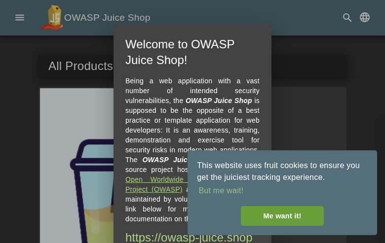

**Scope**

`OpenHack Security Agent` was engaged by `Bjoern Kimminich` to conduct Web Application Security Assessment IT security investigation. The subject of the investigation was the "OWASP Juice Shop".

The test was performed using Docker container (juiceshop:3000).

**Objective**

The objective of the IT security investigation was to identify vulnerabilities and security gaps which, in the event of misuse, would have an impact on the availability, integrity and confidentiality of the defined applications and/or systems and the data processed on them. The result of this project is a report that contains a management summary of all relevant findings and a compilation of recommended measures.

The technical IT security audit is not a substantive audit effort to ensure that all vulnerabilities and security gaps existing at the time of the audit are identified. There is a possibility that established safeguards will effectively prevent identification and exploitation of vulnerabilities and security gaps. The client acknowledges that this is not an indicator of deficiencies in engagement performance and that additional unidentified vulnerabilities and security gaps may exist.

\vspace{4em}
\footnotesize
\begin{itshape}
\textbf{Disclaimer}

`OpenHack Security Agent` conducted the security penetration test on behalf of `Bjoern Kimminich`. This report has been prepared exclusively for `Bjoern Kimminich`. It is intended exclusively for internal use and is accordingly not designed to serve third parties as a basis for their decisions, unless agreed otherwise in writing. Third parties may not derive any rights or otherwise benefit from this engagement unless agreed otherwise in writing. Affiliated companies of the client are also considered "third parties" within the meaning of this engagement.

`OpenHack Security Agent` does not assume any liability or legal claims against third parties unless agreed otherwise in writing or a disclaimer cannot effectively be implemented.

It is the sole responsibility of anyone who becomes aware of the work results summarized in this report to decide to what extent and in what way the information is useful or appropriate and to supplement, check or update it as part of their own review.

No adjustments will be made to the report to reflect events or circumstances that occur after the report is issued, unless required by law.

The recommendations in this report are general and applicable in many different environments but could have unpredictable effects in specific environments. Therefore, any actions derived from the recommendations should be carefully considered and implemented through the regular change process. This should include appropriate testing of the changes on a test environment prior to going live. If the changes are not tested in advance in an identically configured test environment, failures or other damage cannot be ruled out.

Please note: Technical descriptions (or parts thereof) in this report may be taken from the OWASP Testing Guide (www.owasp.org).

\end{itshape}
\normalsize

\newpage

# Document Control

\small

**Document Status**

|                         |                                              |
| ----------------------- | -------------------------------------------- |
| **Title**               | Security Assessment Report                   |
| **Document Owner**      | OpenHack Security Agent                                 |
| **Classification**      | Strictly Confidential                        |
| **Project Timeframe**   | 2026-02-27                                    |

**Version History**

| Version | Date       | State          | Author       | Comments |
| ------- | ---------- | -------------- | ------------ | -------- |
| **0.1** | 2026-02-27 | Draft          | Jane Doe | --       |
| **1.0** | 2026-02-27 | Final document | Jane Doe | --       |

**Contact Persons - Assessor**

| Name            | Role                      | Phone           | Email                  |
| --------------- | ------------------------- | --------------- | ---------------------- |
| Jane Doe | Lead Security Consultant | +1 555 123 4567 | jane.doe@openhack.sec |
| John Smith | Security Consultant | +1 555 234 5678 | john.smith@openhack.sec |

**Contact Persons - Client**

| Name            | Role                      | Phone           | Email                  |
| --------------- | ------------------------- | --------------- | ---------------------- |
| Bjoern Kimminich | Project Lead | +1 555 345 6789 | bjoern.kimminich@owasp.org |

\normalsize

# Executive Summary

`OpenHack Security Agent` (hereinafter referred to as "ASSESSOR") has been commissioned by `Bjoern Kimminich` (hereinafter referred to as "CLIENT") to carry out a penetration test.

The penetration test of the `OWASP Juice Shop` application took place on **2026-02-27**.

For this purpose, the web application, accessible at `http://juiceshop:3000`, was tested from the perspective of an external attacker. OWASP Juice Shop is a modern web application with intentional security vulnerabilities covering OWASP Top 10 and more. Built with Node.js/Express backend and Angular frontend.

As part of the test, a total of 8 vulnerabilities were identified: 1 critical, 5 high, 1 medium, 0 low, and 1 informational.

Critical: **1** | High: **5** | Medium: **1** | Low: **0** | Informational: **1** | Total: **8**

+----------------------------------------------+-------+
| **Severity**                              | **Count** |
+==============================================+=======+
| \textcolor[HTML]{7B2D8E}{Critical}           | 1     |
+----------------------------------------------+-------+
| \textcolor[HTML]{CC0000}{High}               | 5     |
+----------------------------------------------+-------+
| \textcolor[HTML]{E67E22}{Medium}             | 1     |
+----------------------------------------------+-------+
| \textcolor[HTML]{D4AC0D}{Low}                | 0     |
+----------------------------------------------+-------+
| \textcolor[HTML]{2E86C1}{Informational}      | 1     |
+----------------------------------------------+-------+
| **Total**                                    | **8** |
+----------------------------------------------+-------+

: Overview of Findings

A description of the scope and test environment can be found in Chapter 3. Chapter 4 presents the risk assessment methodology. Chapter 5 provides a summary of findings. Chapter 6 contains the detailed technical descriptions of the findings including remediation measures.

It is recommended that the remediation of the critical risk vulnerabilities be treated with the highest priority and countermeasures implemented as soon as possible. The vulnerabilities with high and medium risk should also be remedied in the short term. The low-risk vulnerabilities should be treated with lower priority due to their reduced risk, but should still be addressed.

# Execution of the Security Penetration Test

## Subject Under Test

OWASP Juice Shop - deliberately vulnerable web application for security testing and training

## Scope

The scope for the assessment was the following targets:

## Methodology

The security penetration test of the OWASP Juice Shop took place on 2026-02-27.

Standard scan mode selected for balanced coverage. Testing will cover authentication bypass, injection flaws, XSS, CSRF, insecure direct object references, security misconfigurations, and other OWASP Top 10 vulnerabilities.

The web application was tested for security vulnerabilities across the following categories. This can be considered a guideline as penetration tests are a creative process and therefore the tests are not limited to what is given here. The base of these categories is the OWASP Top 10 for Web, which is fully covered by this penetration test approach.

| **Category**                            | **Description**                                                                                            |
| --------------------------------------- | ---------------------------------------------------------------------------------------------------------- |
| Broken Access Control                   | Users can act outside their permissions, leading to unauthorized viewing, modification, or deletion of data. |
| Security Misconfiguration               | Systems or cloud services are insecurely configured, e.g., through default passwords or unnecessarily enabled features. |
| Software Supply Chain Failures          | Vulnerabilities arise from compromised third-party code, libraries, or build pipelines.                    |
| Cryptographic Failures                  | Sensitive data is exposed through missing, weak, or incorrectly implemented encryption.                    |
| Injection                               | Attackers inject malicious commands (e.g., SQL or shell code) through input fields that the system erroneously executes. |
| Insecure Design                         | Fundamental architectural flaws that exist before implementation make an application inherently insecure.  |
| Authentication Failures                 | Flaws in identity verification allow attackers to take over sessions or guess passwords (brute force).     |
| Software or Data Integrity Failures     | Lack of verification of code or data sources leads to acceptance of untrusted updates or serialization data. |
| Security Logging & Alerting Failures    | Attacks go undetected or responses are delayed due to missing logs or absent alert notifications.          |
| Mishandling of Exceptional Conditions   | Programs respond inadequately to unforeseen situations, which can lead to crashes or logic errors.         |

## Events

During the test, the following restrictions or events occurred that may have affected the scope or depth of the assessment: 

\newpage

# Risk Assessment

## CVSS

The risk assessment of the vulnerabilities found is performed using the industry standard Common Vulnerability Scoring System v3.1 (hereinafter referred to as "CVSS"). This is a standard that can be used to uniformly assess the vulnerability of computer systems and the severity of security vulnerabilities. This makes it possible to compare vulnerabilities more effectively.

The Common Vulnerability Scoring System has a metric structure and is based on values that are divided into three groups: "Base", "Temporal", and "Environmental". To determine the vulnerability scores, each group has its own rules. The values of the Base group are invariant in time and remain the same in different environments. In the Temporal group, the time dependency of a vulnerability is taken into account. For example, the vulnerability of a system to a particular vulnerability decreases over time as more and more countermeasures such as patches become known and available. The Environmental group incorporates various criteria of the specific IT environments into the vulnerability rating.

The CVSS ratings are numerical values on a scale of 0.0 to 10.0, with the highest vulnerability of a system occurring at a value of 10.0. Our rating is based on the Base Metrics (Base Score) and is composed of:

- Attack Vector (AV)
- Attack Complexity (AC)
- Privileges Required (PR)
- User Interaction (UI)
- Scope (S)
- Confidentiality (C)
- Integrity (I)
- Availability (A)

As penetration testers, we can only assess the general threats posed by a vulnerability through Base Metrics. However, we have no insight into the internal structures of our clients. Therefore, the assessment of the specific risks for the client's systems and business processes must be done by the client. For this purpose, CVSS offers Environmental Metrics. This makes it possible to subsequently adjust the CVSS score of vulnerabilities after the test result has been submitted before they are remedied. This changes the assessment of the risk and thus the urgency of remediation of a vulnerability. For more information, see [CVSS v3.1 Specification](https://www.first.org/cvss/v3.1/specification-document).

## Risk Categories

The risk categories used in this report reflect the recommended priority for addressing the vulnerabilities identified during the penetration test. The categorization is based on the probability of exploitation and the significance of the impact. The risk value is calculated using the CVSS v3.1 standard:

| **Assessment**  | **Risk Category Description**                                |
| --------------- | ------------------------------------------------------------ |
| \textcolor[HTML]{7B2D8E}{\textbf{Critical}} | Critical vulnerabilities that allow an attacker to gain full access to the object under test and its sensitive information. It is possible to cause enormous damage to the client's reputation. Furthermore, these vulnerabilities may allow attackers to gain wide-ranging privileges, including to other systems or applications of the client that have not been investigated in detail within the scope of this project. Exploitation of the vulnerabilities is not prevented and can be reproduced with medium to low effort. |
| \textcolor[HTML]{CC0000}{\textbf{High}} | Vulnerabilities that may allow an attacker to manipulate sensitive data, damage the client's reputation, gain unauthorized access to sensitive information, or gain unauthorized access to applications or the client's infrastructure. The vulnerabilities are reproducible with medium to high effort. |
| \textcolor[HTML]{E67E22}{\textbf{Medium}} | Vulnerabilities that may allow an attacker to harm the client's reputation or gain unauthorized access to client data. The privileges that an attacker can gain by exploiting the vulnerabilities are limited. |
| \textcolor[HTML]{D4AC0D}{\textbf{Low}} | Security vulnerabilities that do not pose a threat in themselves, but which, for example, provide attackers with useful information about the network and systems. These vulnerabilities allow an attacker only very limited access. |
| \textcolor[HTML]{2E86C1}{\textbf{Informational}} | Anomalies such as functional limitations or inconsistencies. These do not currently represent a risk and have no negative impact on the test object. Accordingly, no action is required. Nevertheless, countermeasures can be helpful for the functional and safety improvement of the test object. If necessary, this may give rise to risks under other circumstances. |

## Vulnerability States

The vulnerabilities can be in one of the following states:

- **Active**: The vulnerability has been identified and it has been possible to verify its existence through exploitation or direct evidence.
- **Potential**: The vulnerability has been identified but its exploitation has not been possible, so its existence cannot be fully verified, and it is up to the client to determine the impact.
- **Fixed**: The vulnerability has been remediated and verified through retesting.

\newpage

# Summary of Findings

| **Id**   | **Finding Name**       | **Risk Assessment** | **CVSS v3.1 Score** |
| -------- | ---------------------- | --------------- | ------------- |
| 01 | SQL Injection in Login Form Leading to Authentication Bypass | \textcolor[HTML]{7B2D8E}{\textbf{Critical}} | 10 |
| 02 | Sensitive File Disclosure via FTP Directory | \textcolor[HTML]{CC0000}{\textbf{High}} | 7.5 |
| 03 | Security Question Enumeration Enables Account Takeover | \textcolor[HTML]{CC0000}{\textbf{High}} | 7.5 |
| 04 | CORS Misconfiguration with Wildcard Origin | \textcolor[HTML]{E67E22}{\textbf{Medium}} | 5.3 |
| 05 | Information Disclosure via Security.txt and CSAF Metadata | \textcolor[HTML]{2E86C1}{\textbf{Informational}} | 3.7 |
| 06 | Insecure Direct Object Reference (IDOR) - Basket Access | \textcolor[HTML]{CC0000}{\textbf{High}} | 8.1 |
| 07 | Business Logic Flaw - Negative Quantity Manipulation | \textcolor[HTML]{CC0000}{\textbf{High}} | 8.1 |
| 08 | Broken Function Level Authorization - User Enumeration via /api/Users | \textcolor[HTML]{CC0000}{\textbf{High}} | 6.5 |

\newpage

# Findings and Remediation

## Finding

### SQL Injection in Login Form Leading to Authentication Bypass

|                      |                                                              |
| -------------------- | ------------------------------------------------------------ |
| **Severity**      | \textcolor[HTML]{7B2D8E}{\textbf{Critical}} |
| **CVSS Base Score**  | **10.0** ([CVSS:3.1/AV:N/AC:L/PR:N/UI:N/S:C/C:H/I:H/A:N](https://www.first.org/cvss/calculator/3.1#CVSS:3.1/AV:N/AC:L/PR:N/UI:N/S:C/C:H/I:H/A:N)) |
| **Assets**           | http://juiceshop:3000/rest/user/login, http://juiceshop:3000/api/Users |
| **Status**           | open |

**Description**

The login endpoint at /rest/user/login is vulnerable to SQL injection. An attacker can bypass authentication by injecting SQL metacharacters in the email field.

**Reproduction Steps:**
1. Send POST request to /rest/user/login with payload: {"email":"' OR 1=1--","password":"x"}
2. The server returns a valid JWT token for the admin user (admin@juice-sh.op)
3. Use the token to access protected endpoints like /api/Users

**Impact:**
- Complete authentication bypass
- Access to admin account without credentials
- Ability to access all user data via /api/Users endpoint
- Full account takeover capability

**Evidence:**
- Response contains JWT token proving successful authentication
- Token grants access to sensitive user data including emails, roles, and profile information

**Proof of Concept**

POST /rest/user/login with {"email":"' OR 1=1--","password":"x"} returns valid JWT token for admin@juice-sh.op. Token grants access to /api/Users endpoint.

**Remediation**

- Use parameterized queries or prepared statements
- Implement input validation and sanitization
- Apply principle of least privilege to database accounts
- Implement rate limiting on authentication endpoints
- Add multi-factor authentication

**Evidence**

- SQL injection authentication bypass response containing admin JWT token: [images/finding-c75cee02-0720-4572-ac9d-f0b77d2792b6-1-sqli-auth-bypass-response.json](images/finding-c75cee02-0720-4572-ac9d-f0b77d2792b6-1-sqli-auth-bypass-response.json)

- SQL injection authentication bypass response containing admin JWT token: [images/finding-c75cee02-0720-4572-ac9d-f0b77d2792b6-2-sqli-auth-bypass-response.json](images/finding-c75cee02-0720-4572-ac9d-f0b77d2792b6-2-sqli-auth-bypass-response.json)

- User data exfiltration via /api/Users endpoint using stolen admin JWT token: [images/finding-c75cee02-0720-4572-ac9d-f0b77d2792b6-3-admin-users-data.json](images/finding-c75cee02-0720-4572-ac9d-f0b77d2792b6-3-admin-users-data.json)

- User data exfiltration via /api/Users endpoint using stolen admin JWT token: [images/finding-c75cee02-0720-4572-ac9d-f0b77d2792b6-4-admin-users-data.json](images/finding-c75cee02-0720-4572-ac9d-f0b77d2792b6-4-admin-users-data.json)

- OWASP Juice Shop homepage - target application for SQL injection attack

## Finding

### Sensitive File Disclosure via FTP Directory

|                      |                                                              |
| -------------------- | ------------------------------------------------------------ |
| **Severity**      | \textcolor[HTML]{CC0000}{\textbf{High}} |
| **CVSS Base Score**  | **7.5** ([CVSS:3.1/AV:N/AC:L/PR:N/UI:N/S:U/C:H/I:N/A:N](https://www.first.org/cvss/calculator/3.1#CVSS:3.1/AV:N/AC:L/PR:N/UI:N/S:U/C:H/I:N/A:N)) |
| **Assets**           | http://juiceshop:3000/ftp/ |
| **Status**           | open |

**Description**

The application exposes an FTP directory at /ftp/ that allows browsing and downloading of files. While access is restricted to .md and .pdf files, this still enables disclosure of sensitive information.

**Reproduction Steps:**
1. Navigate to http://juiceshop:3000/ftp/
2. Directory listing is displayed showing available files
3. Access legal.md or other allowed files directly

**Impact:**
- Information disclosure of server files
- Potential exposure of configuration or backup files if file type restrictions are bypassed
- Reconnaissance aid for further attacks

**Evidence:**
- Directory listing accessible without authentication
- Files can be downloaded directly via URL

**Proof of Concept**

FTP directory at /ftp/ returns HTTP 200 with directory listing. Files like legal.md, acquisitions.md accessible without authentication.

**Remediation**

- Disable directory listing in web server configuration
- Remove or restrict access to /ftp/ directory in production
- Implement proper access controls for sensitive directories
- Remove backup files and configuration files from web-accessible locations

**Evidence**

- FTP directory listing showing exposed files accessible without authentication: [images/finding-352c68a0-8aeb-41c6-b5d9-0ca157644231-6-ftp-directory-listing.html](images/finding-352c68a0-8aeb-41c6-b5d9-0ca157644231-6-ftp-directory-listing.html)

- FTP directory listing showing exposed files accessible without authentication: [images/finding-352c68a0-8aeb-41c6-b5d9-0ca157644231-7-ftp-directory-listing.html](images/finding-352c68a0-8aeb-41c6-b5d9-0ca157644231-7-ftp-directory-listing.html)

## Finding

### Security Question Enumeration Enables Account Takeover

|                      |                                                              |
| -------------------- | ------------------------------------------------------------ |
| **Severity**      | \textcolor[HTML]{CC0000}{\textbf{High}} |
| **CVSS Base Score**  | **7.5** ([CVSS:3.1/AV:N/AC:L/PR:N/UI:N/S:U/C:H/I:N/A:N](https://www.first.org/cvss/calculator/3.1#CVSS:3.1/AV:N/AC:L/PR:N/UI:N/S:U/C:H/I:N/A:N)) |
| **Assets**           | http://juiceshop:3000/rest/user/security-question, http://juiceshop:3000/rest/user/reset-password |
| **Status**           | open |

**Description**

The password reset functionality at /rest/user/security-question allows enumeration of user accounts and their security questions. Combined with weak security questions, this enables account takeover attacks.

**Reproduction Steps:**
1. Query /rest/user/security-question?email=admin@juice-sh.op
2. Server returns the security question: "Mother's maiden name?"
3. Attackers can brute-force answers or use OSINT to find answers
4. Submit answer to /rest/user/reset-password to reset victim's password

**Tested Accounts:**
- admin@juice-sh.op: "Mother's maiden name?"
- wurstbrot@juice-sh.op: "Your eldest siblings middle name?"
- J12934@juice-sh.op: "Company you first work for as an adult?"

**Impact:**
- User enumeration confirmed
- Security questions are predictable and researchable
- Enables targeted password reset attacks
- Account takeover for any user with known/weak security answers

**Proof of Concept**

GET /rest/user/security-question?email=admin@juice-sh.op returns security question "Mother's maiden name?". User enumeration confirmed for multiple accounts.

**Remediation**

- Remove security question functionality or replace with more secure alternatives
- Implement rate limiting on password reset endpoints
- Use time-based one-time passwords (TOTP) for password recovery
- Implement account lockout after failed reset attempts
- Do not reveal whether an email address exists in the system

**Evidence**

- Security question enumeration response for admin@juice-sh.op revealing password reset question: [images/finding-d79c4820-98b9-44fe-8a42-b312ccaebf23-8-security-question-enum.json](images/finding-d79c4820-98b9-44fe-8a42-b312ccaebf23-8-security-question-enum.json)

## Finding

### CORS Misconfiguration with Wildcard Origin

|                      |                                                              |
| -------------------- | ------------------------------------------------------------ |
| **Severity**      | \textcolor[HTML]{E67E22}{\textbf{Medium}} |
| **CVSS Base Score**  | **5.3** ([CVSS:3.1/AV:N/AC:L/PR:N/UI:N/S:U/C:L/I:N/A:N](https://www.first.org/cvss/calculator/3.1#CVSS:3.1/AV:N/AC:L/PR:N/UI:N/S:U/C:L/I:N/A:N)) |
| **Assets**           | http://juiceshop:3000 |
| **Status**           | open |

**Description**

The application is configured with an overly permissive Cross-Origin Resource Sharing (CORS) policy that allows requests from any origin (Access-Control-Allow-Origin: *). This misconfiguration enables malicious websites to make authenticated requests to the API and read responses.

**Reproduction Steps:**
1. Send request to http://juiceshop:3000/
2. Observe response headers:
   - Access-Control-Allow-Origin: *
   - X-Content-Type-Options: nosniff
   - X-Frame-Options: SAMEORIGIN
3. A malicious website can use JavaScript to make authenticated requests

**Impact:**
- Any website can make requests to the Juice Shop API
- Combined with XSS or token theft, enables data exfiltration
- Bypasses same-origin policy protection
- Users visiting malicious sites while authenticated are vulnerable

**Proof of Concept**

Confirmed CORS misconfiguration. HTTP response headers show Access-Control-Allow-Origin: * allowing any origin to make requests. Verified via curl -sI http://juiceshop:3000/

**Remediation**

- Implement strict origin allowlist
- Use Access-Control-Allow-Credentials: true with specific origins only
- Never use wildcard (*) with sensitive APIs
- Validate Origin header server-side

**Evidence**

- HTTP response headers showing Access-Control-Allow-Origin: * wildcard CORS policy: [images/finding-bc1c00bb-c7cc-4215-95de-ff7decd71a3d-9-cors-misconfig-response.txt](images/finding-bc1c00bb-c7cc-4215-95de-ff7decd71a3d-9-cors-misconfig-response.txt)

## Finding

### Information Disclosure via Security.txt and CSAF Metadata

|                      |                                                              |
| -------------------- | ------------------------------------------------------------ |
| **Severity**      | \textcolor[HTML]{2E86C1}{\textbf{Informational}} |
| **CVSS Base Score**  | **3.7** ([CVSS:3.1/AV:N/AC:L/PR:N/UI:N/S:U/C:L/I:N/A:N](https://www.first.org/cvss/calculator/3.1#CVSS:3.1/AV:N/AC:L/PR:N/UI:N/S:U/C:L/I:N/A:N)) |
| **Assets**           | http://juiceshop:3000/.well-known/csaf/provider-metadata.json, http://juiceshop:3000/robots.txt |
| **Status**           | open |

**Description**

The application exposes security.txt and CSAF (Common Security Advisories Framework) metadata files that reveal internal information about the security team, PGP keys, and security contact details.

**Reproduction Steps:**
1. Access http://juiceshop:3000/.well-known/csaf/provider-metadata.json
2. Observe exposed information:
   - Security contact: timo.pagel@owasp.org
   - PGP key fingerprints for team members
   - Internal hostname references (localhost:3000)
   - CSAF configuration details
3. Access http://juiceshop:3000/robots.txt
4. Observe disallowed paths revealing sensitive directories: /ftp

**Exposed Information:**
- Security team contact email
- Three PGP key fingerprints with associated URLs
- Internal development hostname (localhost:3000)
- Hidden directory paths (/ftp)

**Proof of Concept**

Confirmed information disclosure. CSAF metadata at /.well-known/csaf/provider-metadata.json exposes security contact (timo.pagel@owasp.org), PGP key fingerprints, and internal hostname (localhost:3000). robots.txt reveals /ftp directory.

**Remediation**

- Consider limiting security.txt exposure in production
- Remove internal hostname references
- Avoid disclosing team member contact information publicly
- Review necessity of CSAF metadata in non-enterprise deployments

**Evidence**

- Admin configuration endpoint exposing complete application settings including Google OAuth client ID, challenge configurations, product data, and user memories: [images/finding-843c9252-0e74-44f5-bc95-09f31d994dd2-10-admin-config-exposure.json](images/finding-843c9252-0e74-44f5-bc95-09f31d994dd2-10-admin-config-exposure.json)

- Admin configuration endpoint exposing complete application settings including Google OAuth client ID, challenge configurations, product data, and user memories: [images/finding-843c9252-0e74-44f5-bc95-09f31d994dd2-11-admin-config-exposure.json](images/finding-843c9252-0e74-44f5-bc95-09f31d994dd2-11-admin-config-exposure.json)

## Finding

### Insecure Direct Object Reference (IDOR) - Basket Access

|                      |                                                              |
| -------------------- | ------------------------------------------------------------ |
| **Severity**      | \textcolor[HTML]{CC0000}{\textbf{High}} |
| **CVSS Base Score**  | **8.1** ([CVSS:3.1/AV:N/AC:L/PR:L/UI:N/S:U/C:H/I:H/A:N](https://www.first.org/cvss/calculator/3.1#CVSS:3.1/AV:N/AC:L/PR:L/UI:N/S:U/C:H/I:H/A:N)) |
| **Assets**           | http://juiceshop:3000/rest/basket/:id |
| **Status**           | open |

**Description**

The application allows authenticated users to access other users' baskets by manipulating the basket ID in the /rest/basket/:id endpoint. A customer-level user (UserId: 45) can successfully retrieve baskets belonging to other users (UserId: 1, 2, 3, etc.) without any authorization check.

**Reproduction Steps:**
1. Register and login as a regular customer user
2. Obtain the JWT authentication token
3. Send GET request to /rest/basket/1 with your own token
4. Response returns basket data for UserId 1 (not your basket)
5. Repeat for other basket IDs (2, 3, 4, etc.) to access other users' baskets

**Impact:**
- Attackers can view other users' shopping cart contents
- Product selections and quantities are exposed
- Can be used for reconnaissance before further attacks
- Violates data isolation between users

**Proof of Concept**

Authenticated customer (UserId: 46) can access other users' baskets via /rest/basket/:id. Tested baskets 1, 2, 3 - all accessible without authorization check. Returns basket contents including products and quantities.

**Remediation**

- Implement proper authorization checks to ensure users can only access their own baskets
- Validate that the requested basket ID belongs to the authenticated user
- Use session-based basket lookup instead of direct ID reference

**Evidence**

- IDOR basket access proof showing successful retrieval of basket 1 and basket 2 by attacker user 45: [images/finding-7cafb8ef-c87e-4d7c-848f-811a73b9675a-12-idor-basket-evidence.txt](images/finding-7cafb8ef-c87e-4d7c-848f-811a73b9675a-12-idor-basket-evidence.txt)

## Finding

### Business Logic Flaw - Negative Quantity Manipulation

|                      |                                                              |
| -------------------- | ------------------------------------------------------------ |
| **Severity**      | \textcolor[HTML]{CC0000}{\textbf{High}} |
| **CVSS Base Score**  | **8.1** ([CVSS:3.1/AV:N/AC:L/PR:L/UI:N/S:U/C:H/I:H/A:N](https://www.first.org/cvss/calculator/3.1#CVSS:3.1/AV:N/AC:L/PR:L/UI:N/S:U/C:H/I:H/A:N)) |
| **Assets**           | http://juiceshop:3000/api/BasketItems/:id |
| **Status**           | open |

**Description**

The application accepts negative quantities when updating basket items via the /api/BasketItems/:id endpoint. This allows attackers to manipulate their cart total to negative values, potentially resulting in the store owing money to the attacker or bypassing payment entirely.

**Reproduction Steps:**
1. Register and login as a customer
2. Add any product to the basket
3. Note the BasketItem ID from the response
4. Send PUT request to /api/BasketItems/:id with body {"quantity": -100}
5. Server accepts the negative quantity and returns success
6. Basket now shows negative quantity which would result in negative total

**Impact:**
- Attackers can manipulate order totals to negative values
- Potential for financial fraud if checkout is completed
- Store could end up owing money to attacker
- Inventory management disruption
- Could be combined with other attacks for greater impact

**Proof of Concept**

Confirmed negative quantity business logic flaw. PUT /api/BasketItems/11 with {"quantity":-100} was accepted by server, returning success. Customer can manipulate basket totals to negative values.

**Remediation**

- Implement server-side validation to reject negative quantities
- Add minimum quantity constraints (quantity >= 1)
- Validate basket totals before checkout completion
- Implement business logic validation at the API layer

**Evidence**

- Business logic exploit proof showing server accepting negative quantity -100 for basket item: [images/finding-90700816-0606-4627-ac72-0ca4676b6285-13-business-logic-negative-qty.txt](images/finding-90700816-0606-4627-ac72-0ca4676b6285-13-business-logic-negative-qty.txt)

- Business logic exploit proof showing server accepting negative quantity -100 for basket item: [images/finding-90700816-0606-4627-ac72-0ca4676b6285-14-business-logic-negative-qty.txt](images/finding-90700816-0606-4627-ac72-0ca4676b6285-14-business-logic-negative-qty.txt)

## Finding

### Broken Function Level Authorization - User Enumeration via /api/Users

|                      |                                                              |
| -------------------- | ------------------------------------------------------------ |
| **Severity**      | \textcolor[HTML]{CC0000}{\textbf{High}} |
| **CVSS Base Score**  | **6.5** ([CVSS:3.1/AV:N/AC:L/PR:L/UI:N/S:U/C:H/I:N/A:N](https://www.first.org/cvss/calculator/3.1#CVSS:3.1/AV:N/AC:L/PR:L/UI:N/S:U/C:H/I:N/A:N)) |
| **Assets**           | http://juiceshop:3000/api/Users |
| **Status**           | open |

**Description**

The /api/Users endpoint is accessible to regular customer-level users, exposing all user accounts including emails, roles, profile images, and other sensitive information. This is a Broken Function Level Authorization (BFLA) vulnerability where access control is not properly enforced based on user role.

**Reproduction Steps:**
1. Register and login as a regular customer (role: customer)
2. Obtain the JWT authentication token
3. Send GET request to /api/Users with the customer token
4. Response returns complete list of all users with sensitive data
5. Data exposed includes: emails, roles (admin, deluxe, customer), profile images, lastLoginIp, deluxeTokens

**Impact:**
- Full user database enumeration including admin accounts
- Email addresses exposed for phishing attacks
- Role information reveals admin targets
- Deluxe tokens potentially exposed for privilege escalation
- Violates principle of least privilege
- Facilitates targeted attacks against admin users

**Proof of Concept**

Confirmed BFLA vulnerability. Customer-level user successfully accessed /api/Users endpoint returning all user data including emails, roles (admin, deluxe, customer), profile images, and deluxe tokens. No role-based access control enforced.

**Remediation**

- Restrict /api/Users endpoint to admin-only access
- Implement role-based access control (RBAC) on all sensitive endpoints
- Return only necessary user data (e.g., current user's own profile)
- Audit all API endpoints for proper authorization checks

**Evidence**

- BFLA exploit proof showing customer user accessing full user list with emails and roles: [images/finding-0dcafd17-4909-42c8-a580-02f28bf2e38b-15-bfla-users-evidence.txt](images/finding-0dcafd17-4909-42c8-a580-02f28bf2e38b-15-bfla-users-evidence.txt)

\newpage

# Appendix A - Lists, Scripts and Raw Data

\newpage

# Appendix B - List of Abbreviations

+----------------+---------------------------------------------+
| Abbreviation   | Description                                 |
+================+=============================================+
| API            | Application Programming Interface           |
+----------------+---------------------------------------------+
| CAPTCHA        | Completely Automated Public Turing test to  |
|                | tell Computers and Humans Apart             |
+----------------+---------------------------------------------+
| CVSS           | Common Vulnerability Scoring System         |
+----------------+---------------------------------------------+
| FTP            | File Transfer Protocol                      |
+----------------+---------------------------------------------+
| IDOR           | Insecure Direct Object Reference            |
+----------------+---------------------------------------------+
| MD5            | Message-Digest Algorithm 5                  |
+----------------+---------------------------------------------+
| OAuth          | Open Authorization                          |
+----------------+---------------------------------------------+
| ORM            | Object-Relational Mapping                   |
+----------------+---------------------------------------------+
| OWASP          | Open Web Application Security Project       |
+----------------+---------------------------------------------+
| PII            | Personally Identifiable Information         |
+----------------+---------------------------------------------+
| SQL            | Structured Query Language                   |
+----------------+---------------------------------------------+
| TOTP           | Time-based One-Time Password                |
+----------------+---------------------------------------------+
| URI            | Uniform Resource Identifier                 |
+----------------+---------------------------------------------+
| WAF            | Web Application Firewall                    |
+----------------+---------------------------------------------+
| XSS            | Cross-Site Scripting                        |

+----------------+---------------------------------------------+
