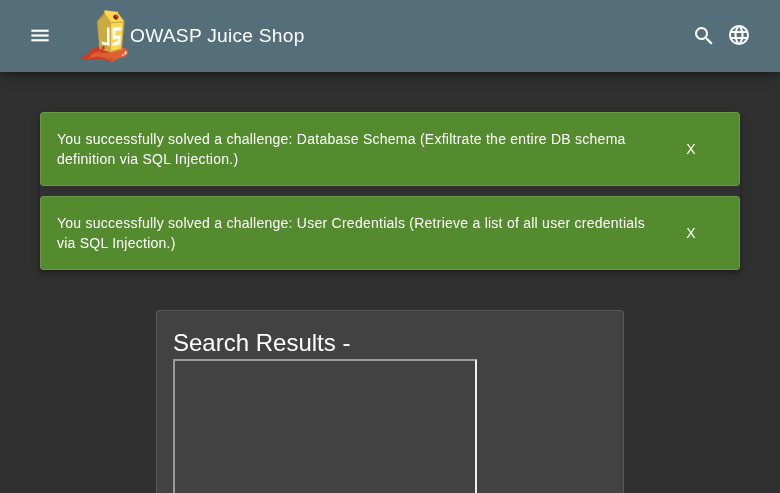

**Scope**

`OpenHack Security Agent` was engaged by `Bjoern Kimminich` to conduct an external IT security investigation. The subject of the investigation was the "OWASP Juice Shop v19.1.1".

The test was performed using a local instance of the application at `localhost:3333` in a dedicated test environment..

**Objective**

The objective of the IT security investigation was to identify vulnerabilities and security gaps which, in the event of misuse, would have an impact on the availability, integrity and confidentiality of the defined applications and/or systems and the data processed on them. The result of this project is a report that contains a management summary of all relevant findings and a compilation of recommended measures.

The technical IT security audit is not a substantive audit effort to ensure that all vulnerabilities and security gaps existing at the time of the audit are identified. There is a possibility that established safeguards will effectively prevent identification and exploitation of vulnerabilities and security gaps. The client acknowledges that this is not an indicator of deficiencies in engagement performance and that additional unidentified vulnerabilities and security gaps may exist.

\vspace{4em}
\footnotesize
\begin{itshape}
\textbf{Disclaimer}

`OpenHack Security Agent` conducted the security penetration test on behalf of `Bjoern Kimminich`. This report has been prepared exclusively for `Bjoern Kimminich`. It is intended exclusively for internal use and is accordingly not designed to serve third parties as a basis for their decisions, unless agreed otherwise in writing. Third parties may not derive any rights or otherwise benefit from this engagement unless agreed otherwise in writing. Affiliated companies of the client are also considered "third parties" within the meaning of this engagement.

`OpenHack Security Agent` does not assume any liability or legal claims against third parties unless agreed otherwise in writing or a disclaimer cannot effectively be implemented.

It is the sole responsibility of anyone who becomes aware of the work results summarized in this report to decide to what extent and in what way the information is useful or appropriate and to supplement, check or update it as part of their own review.

No adjustments will be made to the report to reflect events or circumstances that occur after the report is issued, unless required by law.

The recommendations in this report are general and applicable in many different environments but could have unpredictable effects in specific environments. Therefore, any actions derived from the recommendations should be carefully considered and implemented through the regular change process. This should include appropriate testing of the changes on a test environment prior to going live. If the changes are not tested in advance in an identically configured test environment, failures or other damage cannot be ruled out.

Please note: Technical descriptions (or parts thereof) in this report may be taken from the OWASP Testing Guide (www.owasp.org).

\end{itshape}
\normalsize

\newpage

# Document Control

\small

**Document Status**

|                         |                                              |
| ----------------------- | -------------------------------------------- |
| **Title**               | Security Assessment Report                   |
| **Document Owner**      | OpenHack Security Agent                                 |
| **Classification**      | Strictly Confidential                        |
| **Project Timeframe**   | 2026-02-27                                    |

**Version History**

| Version | Date       | State          | Author       | Comments |
| ------- | ---------- | -------------- | ------------ | -------- |
| **0.1** | 2026-02-27 | Draft          | Jane Doe | --       |
| **1.0** | 2026-02-27 | Final document | Jane Doe | --       |

**Contact Persons - Assessor**

| Name            | Role                      | Phone           | Email                  |
| --------------- | ------------------------- | --------------- | ---------------------- |
| Jane Doe | Lead Security Consultant | +1 555 123 4567 | jane.doe@openhack.sec |
| John Smith | Security Consultant | +1 555 234 5678 | john.smith@openhack.sec |

**Contact Persons - Client**

| Name            | Role                      | Phone           | Email                  |
| --------------- | ------------------------- | --------------- | ---------------------- |
| Bjoern Kimminich | Project Lead | +1 555 345 6789 | bjoern.kimminich@owasp.org |

\normalsize

# Executive Summary

`OpenHack Security Agent` (hereinafter referred to as "ASSESSOR") has been commissioned by `Bjoern Kimminich` (hereinafter referred to as "CLIENT") to carry out a penetration test.

The penetration test of the `OWASP Juice Shop v19.1.1` application took place on **2026-02-27**.

For this purpose, the web application, accessible at `http://juiceshop:3000`, was tested from the perspective of an external attacker. 

As part of the test, a total of 24 vulnerabilities were identified: 6 critical, 7 high, 10 medium, 1 low, and 0 informational.

Critical: **6** | High: **7** | Medium: **10** | Low: **1** | Informational: **0** | Total: **24**

+----------------------------------------------+-------+
| **Severity**                              | **Count** |
+==============================================+=======+
| \textcolor[HTML]{7B2D8E}{Critical}           | 6     |
+----------------------------------------------+-------+
| \textcolor[HTML]{CC0000}{High}               | 7     |
+----------------------------------------------+-------+
| \textcolor[HTML]{E67E22}{Medium}             | 10     |
+----------------------------------------------+-------+
| \textcolor[HTML]{D4AC0D}{Low}                | 1     |
+----------------------------------------------+-------+
| \textcolor[HTML]{2E86C1}{Informational}      | 0     |
+----------------------------------------------+-------+
| **Total**                                    | **24** |
+----------------------------------------------+-------+

: Overview of Findings

A description of the scope and test environment can be found in Chapter 3. Chapter 4 presents the risk assessment methodology. Chapter 5 provides a summary of findings. Chapter 6 contains the detailed technical descriptions of the findings including remediation measures.

It is recommended that the remediation of the critical risk vulnerabilities be treated with the highest priority and countermeasures implemented as soon as possible. The vulnerabilities with high and medium risk should also be remedied in the short term. The low-risk vulnerabilities should be treated with lower priority due to their reduced risk, but should still be addressed.

# Execution of the Security Penetration Test

## Subject Under Test

## Scope

The scope for the assessment was the following targets:

## Methodology

The security penetration test of the OWASP Juice Shop v19.1.1 took place on 2026-02-27.

The web application was tested for security vulnerabilities across the following categories. This can be considered a guideline as penetration tests are a creative process and therefore the tests are not limited to what is given here. The base of these categories is the OWASP Top 10 for Web, which is fully covered by this penetration test approach.

| **Category**                            | **Description**                                                                                            |
| --------------------------------------- | ---------------------------------------------------------------------------------------------------------- |
| Broken Access Control                   | Users can act outside their permissions, leading to unauthorized viewing, modification, or deletion of data. |
| Security Misconfiguration               | Systems or cloud services are insecurely configured, e.g., through default passwords or unnecessarily enabled features. |
| Software Supply Chain Failures          | Vulnerabilities arise from compromised third-party code, libraries, or build pipelines.                    |
| Cryptographic Failures                  | Sensitive data is exposed through missing, weak, or incorrectly implemented encryption.                    |
| Injection                               | Attackers inject malicious commands (e.g., SQL or shell code) through input fields that the system erroneously executes. |
| Insecure Design                         | Fundamental architectural flaws that exist before implementation make an application inherently insecure.  |
| Authentication Failures                 | Flaws in identity verification allow attackers to take over sessions or guess passwords (brute force).     |
| Software or Data Integrity Failures     | Lack of verification of code or data sources leads to acceptance of untrusted updates or serialization data. |
| Security Logging & Alerting Failures    | Attacks go undetected or responses are delayed due to missing logs or absent alert notifications.          |
| Mishandling of Exceptional Conditions   | Programs respond inadequately to unforeseen situations, which can lead to crashes or logic errors.         |

## Events

During the test, the following restrictions or events occurred that may have affected the scope or depth of the assessment: 

\newpage

# Risk Assessment

## CVSS

The risk assessment of the vulnerabilities found is performed using the industry standard Common Vulnerability Scoring System v3.1 (hereinafter referred to as "CVSS"). This is a standard that can be used to uniformly assess the vulnerability of computer systems and the severity of security vulnerabilities. This makes it possible to compare vulnerabilities more effectively.

The Common Vulnerability Scoring System has a metric structure and is based on values that are divided into three groups: "Base", "Temporal", and "Environmental". To determine the vulnerability scores, each group has its own rules. The values of the Base group are invariant in time and remain the same in different environments. In the Temporal group, the time dependency of a vulnerability is taken into account. For example, the vulnerability of a system to a particular vulnerability decreases over time as more and more countermeasures such as patches become known and available. The Environmental group incorporates various criteria of the specific IT environments into the vulnerability rating.

The CVSS ratings are numerical values on a scale of 0.0 to 10.0, with the highest vulnerability of a system occurring at a value of 10.0. Our rating is based on the Base Metrics (Base Score) and is composed of:

- Attack Vector (AV)
- Attack Complexity (AC)
- Privileges Required (PR)
- User Interaction (UI)
- Scope (S)
- Confidentiality (C)
- Integrity (I)
- Availability (A)

As penetration testers, we can only assess the general threats posed by a vulnerability through Base Metrics. However, we have no insight into the internal structures of our clients. Therefore, the assessment of the specific risks for the client's systems and business processes must be done by the client. For this purpose, CVSS offers Environmental Metrics. This makes it possible to subsequently adjust the CVSS score of vulnerabilities after the test result has been submitted before they are remedied. This changes the assessment of the risk and thus the urgency of remediation of a vulnerability. For more information, see [CVSS v3.1 Specification](https://www.first.org/cvss/v3.1/specification-document).

## Risk Categories

The risk categories used in this report reflect the recommended priority for addressing the vulnerabilities identified during the penetration test. The categorization is based on the probability of exploitation and the significance of the impact. The risk value is calculated using the CVSS v3.1 standard:

| **Assessment**  | **Risk Category Description**                                |
| --------------- | ------------------------------------------------------------ |
| \textcolor[HTML]{7B2D8E}{\textbf{Critical}} | Critical vulnerabilities that allow an attacker to gain full access to the object under test and its sensitive information. It is possible to cause enormous damage to the client's reputation. Furthermore, these vulnerabilities may allow attackers to gain wide-ranging privileges, including to other systems or applications of the client that have not been investigated in detail within the scope of this project. Exploitation of the vulnerabilities is not prevented and can be reproduced with medium to low effort. |
| \textcolor[HTML]{CC0000}{\textbf{High}} | Vulnerabilities that may allow an attacker to manipulate sensitive data, damage the client's reputation, gain unauthorized access to sensitive information, or gain unauthorized access to applications or the client's infrastructure. The vulnerabilities are reproducible with medium to high effort. |
| \textcolor[HTML]{E67E22}{\textbf{Medium}} | Vulnerabilities that may allow an attacker to harm the client's reputation or gain unauthorized access to client data. The privileges that an attacker can gain by exploiting the vulnerabilities are limited. |
| \textcolor[HTML]{D4AC0D}{\textbf{Low}} | Security vulnerabilities that do not pose a threat in themselves, but which, for example, provide attackers with useful information about the network and systems. These vulnerabilities allow an attacker only very limited access. |
| \textcolor[HTML]{2E86C1}{\textbf{Informational}} | Anomalies such as functional limitations or inconsistencies. These do not currently represent a risk and have no negative impact on the test object. Accordingly, no action is required. Nevertheless, countermeasures can be helpful for the functional and safety improvement of the test object. If necessary, this may give rise to risks under other circumstances. |

## Vulnerability States

The vulnerabilities can be in one of the following states:

- **Active**: The vulnerability has been identified and it has been possible to verify its existence through exploitation or direct evidence.
- **Potential**: The vulnerability has been identified but its exploitation has not been possible, so its existence cannot be fully verified, and it is up to the client to determine the impact.
- **Fixed**: The vulnerability has been remediated and verified through retesting.

\newpage

# Summary of Findings

| **Id**   | **Finding Name**       | **Risk Assessment** | **CVSS v3.1 Score** |
| -------- | ---------------------- | --------------- | ------------- |
| 01 | SQL Injection in Product Search Endpoint Allows Complete Database Extraction | \textcolor[HTML]{7B2D8E}{\textbf{Critical}} | 9.8 |
| 02 | SQL Injection Authentication Bypass in Login Endpoint | \textcolor[HTML]{7B2D8E}{\textbf{Critical}} | 10 |
| 03 | Unauthenticated Access to Admin Configuration Endpoint | \textcolor[HTML]{CC0000}{\textbf{High}} | 7.5 |
| 04 | IDOR - Unauthorized Access to All User Authentication Details | \textcolor[HTML]{CC0000}{\textbf{High}} | 6.5 |
| 05 | IDOR - Cross-User Basket Access and Viewing | \textcolor[HTML]{E67E22}{\textbf{Medium}} | 6.5 |
| 06 | Null Byte Injection Allows Access to Restricted Backup Files | \textcolor[HTML]{E67E22}{\textbf{Medium}} | 5.3 |
| 07 | DOM-Based XSS via iframe Injection in Order Tracking Page | \textcolor[HTML]{7B2D8E}{\textbf{Critical}} | 9.6 |
| 08 | Unauthenticated User Credential Leak via Photo Memories Endpoint | \textcolor[HTML]{7B2D8E}{\textbf{Critical}} | 9.1 |
| 09 | IDOR - Cross-User Basket Modification and Deletion | \textcolor[HTML]{CC0000}{\textbf{High}} | 8.3 |
| 10 | Default Admin Credentials Allow Immediate Privileged Access | \textcolor[HTML]{7B2D8E}{\textbf{Critical}} | 10 |
| 11 | Open Redirect via Whitelisted Domain Abuse in Redirect Endpoint | \textcolor[HTML]{E67E22}{\textbf{Medium}} | 5.4 |
| 12 | IDOR - Unauthorized Access to User Feedback Data | \textcolor[HTML]{E67E22}{\textbf{Medium}} | 6.5 |
| 13 | Password Hashes Leaked in JWT Token Payload | \textcolor[HTML]{CC0000}{\textbf{High}} | 7.5 |
| 14 | CORS Misconfiguration - Wildcard Allow Origin | \textcolor[HTML]{CC0000}{\textbf{High}} | 7.5 |
| 15 | Weak Password Hashing Algorithm (MD5) Enables Rapid Credential Cracking | \textcolor[HTML]{CC0000}{\textbf{High}} | 8.1 |
| 16 | JWT Tokens Missing Expiration Enable Indefinite Session Hijacking | \textcolor[HTML]{CC0000}{\textbf{High}} | 7.1 |
| 17 | Client-Side Validation Bypass Allows Weak Password Registration | \textcolor[HTML]{E67E22}{\textbf{Medium}} | 6.5 |
| 18 | Email Enumeration via Security Question Endpoint | \textcolor[HTML]{E67E22}{\textbf{Medium}} | 5.3 |
| 19 | IDOR - Access to Individual User Profiles | \textcolor[HTML]{E67E22}{\textbf{Medium}} | 6.5 |
| 20 | Weak Password Policy Allows Trivial Passwords | \textcolor[HTML]{E67E22}{\textbf{Medium}} | 5.3 |
| 21 | Information Disclosure - CTF Challenge Details Exposed | \textcolor[HTML]{D4AC0D}{\textbf{Low}} | 3.5 |
| 22 | No Rate Limiting on Authentication Endpoints Enables Brute Force Attacks | \textcolor[HTML]{E67E22}{\textbf{Medium}} | 7.5 |
| 23 | Missing Subresource Integrity on CDN Resources Enables Supply Chain Attacks | \textcolor[HTML]{7B2D8E}{\textbf{Critical}} | 9 |
| 24 | Missing Content Security Policy Fails to Mitigate XSS Attacks | \textcolor[HTML]{E67E22}{\textbf{Medium}} | 4.3 |

\newpage

# Findings and Remediation

## Finding

### SQL Injection in Product Search Endpoint Allows Complete Database Extraction

|                      |                                                              |
| -------------------- | ------------------------------------------------------------ |
| **Severity**      | \textcolor[HTML]{7B2D8E}{\textbf{Critical}} |
| **CVSS Base Score**  | **9.8** ([CVSS:3.1/AV:N/AC:L/PR:N/UI:N/S:U/C:H/I:H/A:H](https://www.first.org/cvss/calculator/3.1#CVSS:3.1/AV:N/AC:L/PR:N/UI:N/S:U/C:H/I:H/A:H)) |
| **Assets**           | http://juiceshop:3000/rest/products/search, SQLite database - Users table, SQLite database - all tables |
| **Status**           | open |

**Description**

The /rest/products/search endpoint is vulnerable to UNION-based SQL injection through the 'q' query parameter. An unauthenticated attacker can inject SQL commands to extract the complete database contents including all user credentials, personal information, and application data.

Reproduction Steps:
1. Send GET request to: http://juiceshop:3000/rest/products/search?q=test'))%20UNION%20SELECT%20email,password,role,'','','','','',''%20FROM%20Users--
2. The response returns all user records with email addresses, MD5 password hashes, and roles
3. Attacker can modify the UNION SELECT to extract data from any table in the database
4. Database schema can be enumerated using: q=test'))%20UNION%20SELECT%20sql,'','','','','','','',''%20FROM%20sqlite_master%20WHERE%20type='table'--

Extracted sensitive data includes:
- 20+ user accounts with password hashes
- Admin account: admin@juice-sh.op (role: admin)
- Accounting account: accountant@juice-sh.op (role: accounting)
- Complete database schema with 20 tables
- User addresses, credit cards, baskets, orders, and personal data

The vulnerability exists because user input is concatenated directly into the SQL query without parameterization or proper escaping.

**Proof of Concept**

Not provided

**Remediation**

Not provided

**Evidence**

- Complete user database dump with credentials via UNION SELECT injection: [images/finding-26ff84a0-4770-46dd-994f-89ab94f95d0c-1-sqli-users-dump-1772160830974964982.json](images/finding-26ff84a0-4770-46dd-994f-89ab94f95d0c-1-sqli-users-dump-1772160830974964982.json)

- Step-by-step proof of concept demonstrating SQL injection exploitation: [images/finding-26ff84a0-4770-46dd-994f-89ab94f95d0c-2-sqli-product-search-poc-1772160864856308437.txt](images/finding-26ff84a0-4770-46dd-994f-89ab94f95d0c-2-sqli-product-search-poc-1772160864856308437.txt)

- Database schema extraction showing all table structures via SQL injection: [images/finding-26ff84a0-4770-46dd-994f-89ab94f95d0c-3-sqli-schema-extraction-1772160823934774772.json](images/finding-26ff84a0-4770-46dd-994f-89ab94f95d0c-3-sqli-schema-extraction-1772160823934774772.json)

## Finding

### SQL Injection Authentication Bypass in Login Endpoint

|                      |                                                              |
| -------------------- | ------------------------------------------------------------ |
| **Severity**      | \textcolor[HTML]{7B2D8E}{\textbf{Critical}} |
| **CVSS Base Score**  | **10.0** ([CVSS:3.1/AV:N/AC:L/PR:N/UI:N/S:C/C:H/I:H/A:H](https://www.first.org/cvss/calculator/3.1#CVSS:3.1/AV:N/AC:L/PR:N/UI:N/S:C/C:H/I:H/A:H)) |
| **Assets**           | http://juiceshop:3000/rest/user/login, Authentication system, Admin account access |
| **Status**           | open |

**Description**

The /rest/user/login endpoint is vulnerable to SQL injection in the email parameter, allowing complete authentication bypass. An unauthenticated attacker can obtain admin access by injecting SQL commands that bypass password verification.

Reproduction Steps:
1. Send POST request to http://juiceshop:3000/rest/user/login
2. Use payload: {"email":"' OR 1=1--","password":"anything"}
3. The application returns a valid JWT token for the admin user without password verification
4. The JWT token grants full admin access to the application

Decoded JWT payload contains:
- User ID: 1 (admin account)
- Email: admin@juice-sh.op
- Role: admin
- Password hash: 0192023a7bbd73250516f069df18b500

The vulnerability allows:
- Complete authentication bypass without credentials
- Immediate admin privilege escalation
- Access to all admin functions and user data
- Potential for complete system compromise

The SQL injection occurs because the email parameter is concatenated into the SQL query without proper parameterization. The injected SQL comment (--) causes the password check to be ignored, and the OR 1=1 condition returns the first user (admin) from the database.

**Proof of Concept**

Not provided

**Remediation**

Not provided

**Evidence**

- Admin JWT token obtained via SQL injection authentication bypass: [images/finding-840b3913-c90d-494a-8e15-9d45abfaa784-4-sqli-auth-bypass-1772160844531928434.json](images/finding-840b3913-c90d-494a-8e15-9d45abfaa784-4-sqli-auth-bypass-1772160844531928434.json)

- Detailed exploitation steps for authentication bypass via SQL injection: [images/finding-840b3913-c90d-494a-8e15-9d45abfaa784-5-sqli-auth-bypass-poc-1772160870388911473.txt](images/finding-840b3913-c90d-494a-8e15-9d45abfaa784-5-sqli-auth-bypass-poc-1772160870388911473.txt)

## Finding

### Unauthenticated Access to Admin Configuration Endpoint

|                      |                                                              |
| -------------------- | ------------------------------------------------------------ |
| **Severity**      | \textcolor[HTML]{CC0000}{\textbf{High}} |
| **CVSS Base Score**  | **7.5** ([CVSS:3.1/AV:N/AC:L/PR:N/UI:N/S:U/C:H/I:N/A:N](https://www.first.org/cvss/calculator/3.1#CVSS:3.1/AV:N/AC:L/PR:N/UI:N/S:U/C:H/I:N/A:N)) |
| **Assets**           | http://juiceshop:3000/rest/admin/application-configuration |
| **Status**           | open |

**Description**

The `/rest/admin/application-configuration` endpoint is accessible without authentication and exposes sensitive application configuration data including:

**Exposed Information:**
- Google OAuth client IDs and authorized redirect URIs
- Internal server paths (/juice-shop/node_modules, /juice-shop/build)
- Complete product catalog with pricing and descriptions
- User memory photo metadata including geolocation security question answers
- Email addresses for support and administrative contacts
- Security.txt configuration details
- Challenge configuration and CTF settings
- Application features and business logic details

**Reproduction Steps:**
1. Send GET request to `http://juiceshop:3000/rest/admin/application-configuration`
2. No authentication required
3. Response contains 21KB+ of sensitive configuration data

**Impact:**
This information disclosure vulnerability exposes internal application architecture, security mechanisms, and business logic that can be leveraged for further attacks. The exposed OAuth configuration and internal paths provide attack surface mapping.

**Proof of Concept**

Not provided

**Remediation**

Not provided

**Evidence**

- Unauthenticated access to admin configuration endpoint returning 21KB of sensitive data: [images/finding-f48bf3c8-8b2d-4efc-a798-acff1d972fe2-6-response-admin-config-unauth-1772160803.txt](images/finding-f48bf3c8-8b2d-4efc-a798-acff1d972fe2-6-response-admin-config-unauth-1772160803.txt)

## Finding

### IDOR - Unauthorized Access to All User Authentication Details

|                      |                                                              |
| -------------------- | ------------------------------------------------------------ |
| **Severity**      | \textcolor[HTML]{CC0000}{\textbf{High}} |
| **CVSS Base Score**  | **6.5** ([CVSS:3.1/AV:N/AC:L/PR:L/UI:N/S:U/C:H/I:N/A:N](https://www.first.org/cvss/calculator/3.1#CVSS:3.1/AV:N/AC:L/PR:L/UI:N/S:U/C:H/I:N/A:N)) |
| **Assets**           | http://juiceshop:3000/rest/user/authentication-details |
| **Status**           | open |

**Description**

The `/rest/user/authentication-details` endpoint returns sensitive information for ALL users in the system when accessed by any authenticated user, regardless of privilege level.

**Exposed Information Per User:**
- User ID, username, email address
- Role (admin, customer, deluxe, accounting)
- Password hash (masked but structure visible)
- Deluxe tokens for premium users
- Profile image paths
- TOTP secret status (for 2FA users)
- Account creation and update timestamps
- Last login time and IP address
- Account active/deleted status

**Reproduction Steps:**
1. Authenticate as any regular customer user (testuser1@test.com)
2. Send GET request to `http://juiceshop:3000/rest/user/authentication-details` with valid JWT token
3. Response contains array of 37 users including all admins and their details

**Impact:**
A low-privilege customer account can enumerate all users, identify admin accounts, discover premium user tokens, and map the complete user base. This information enables targeted attacks, account takeover attempts, and privilege escalation vectors. The exposed deluxe tokens can potentially be used to access premium features.

**Proof of Concept**

Not provided

**Remediation**

Not provided

**Evidence**

- Customer user accessing authentication details for all 37 users including admins with roles and deluxe tokens: [images/finding-a241560d-3844-4e38-bf86-9bef2788db00-7-idor-auth-details-1772160868.json](images/finding-a241560d-3844-4e38-bf86-9bef2788db00-7-idor-auth-details-1772160868.json)

## Finding

### IDOR - Cross-User Basket Access and Viewing

|                      |                                                              |
| -------------------- | ------------------------------------------------------------ |
| **Severity**      | \textcolor[HTML]{E67E22}{\textbf{Medium}} |
| **CVSS Base Score**  | **6.5** ([CVSS:3.1/AV:N/AC:L/PR:L/UI:N/S:U/C:H/I:N/A:N](https://www.first.org/cvss/calculator/3.1#CVSS:3.1/AV:N/AC:L/PR:L/UI:N/S:U/C:H/I:N/A:N)) |
| **Assets**           | http://juiceshop:3000/rest/basket/{id}, http://juiceshop:3000/api/BasketItems |
| **Status**           | open |

**Description**

The `/rest/basket/{id}` endpoint allows any authenticated user to view the shopping basket contents of other users by manipulating the basket ID parameter. Additionally, the `/api/BasketItems` endpoint returns basket items from ALL users without proper authorization.

**Vulnerable Endpoints:**
- `/rest/basket/{id}` - Direct object reference to any basket
- `/api/BasketItems` - Returns all basket items across all users

**Reproduction Steps:**
1. Authenticate as user 37 (testuser1@test.com) with basket ID 18
2. Send GET request to `http://juiceshop:3000/rest/basket/1` (admin's basket)
3. Response successfully returns admin's basket with products and quantities
4. Send GET request to `http://juiceshop:3000/api/BasketItems`
5. Response contains basket items from BasketIds 1,2,3,4,5,15 (multiple users)

**Exposed Information:**
- Product IDs and quantities in other users' baskets
- Applied coupons
- User shopping behavior and preferences
- Basket timestamps and update history

**Impact:**
Any authenticated user can view the shopping cart contents of all other users, exposing purchase intentions and shopping patterns. This violates user privacy and could enable competitive intelligence gathering or targeted social engineering.

**Proof of Concept**

Not provided

**Remediation**

Not provided

**Evidence**

- User 37 successfully accessing basket 1 belonging to admin user (UserId 1): [images/finding-ea4a3ccd-d117-4c10-b28e-c08886a002cc-11-idor-basket-1-1772160857.json](images/finding-ea4a3ccd-d117-4c10-b28e-c08886a002cc-11-idor-basket-1-1772160857.json)

- BasketItems API returning items from multiple users baskets (IDs 1,2,3,4,5,15): [images/finding-ea4a3ccd-d117-4c10-b28e-c08886a002cc-12-idor-basketitems-own-1772160850.json](images/finding-ea4a3ccd-d117-4c10-b28e-c08886a002cc-12-idor-basketitems-own-1772160850.json)

## Finding

### Null Byte Injection Allows Access to Restricted Backup Files

|                      |                                                              |
| -------------------- | ------------------------------------------------------------ |
| **Severity**      | \textcolor[HTML]{E67E22}{\textbf{Medium}} |
| **CVSS Base Score**  | **5.3** ([CVSS:3.1/AV:N/AC:L/PR:N/UI:N/S:U/C:L/I:N/A:N](https://www.first.org/cvss/calculator/3.1#CVSS:3.1/AV:N/AC:L/PR:N/UI:N/S:U/C:L/I:N/A:N)) |
| **Assets**           | http://juiceshop:3000/ftp/, package.json.bak, Backup file disclosure |
| **Status**           | open |

**Description**

The /ftp/ file download endpoint is vulnerable to null byte injection, allowing attackers to bypass file extension restrictions and access sensitive backup files that should be protected.

Reproduction Steps:
1. Attempt to access restricted file directly: http://juiceshop:3000/ftp/package.json.bak
2. Observe error: ENOENT (file not found/access denied)
3. Use null byte injection: http://juiceshop:3000/ftp/package.json.bak%2500.md
4. The null byte (%2500) terminates the string before .md extension check
5. Successfully retrieve the backup file contents

The vulnerability allows access to:
- package.json.bak - Full application configuration and dependencies
- Potentially other .bak, .old, .tmp files
- Configuration backups that may contain sensitive data

Extracted Information:
- Application name and version (juice-shop 6.2.0-SNAPSHOT)
- Complete dependency list with package names
- Application configuration and structure

The null byte injection occurs because the file extension validation checks for allowed extensions (.md, .pdf, etc.) but the file system operation uses the string up to the null byte, effectively ignoring the appended safe extension.

**Proof of Concept**

Not provided

**Remediation**

Not provided

**Evidence**

- Restricted package.json.bak file contents retrieved via null byte injection: [images/finding-be50f048-9ef9-4f1d-9722-4dbd301530d9-8-null-byte-injection-1772161053073769249.json](images/finding-be50f048-9ef9-4f1d-9722-4dbd301530d9-8-null-byte-injection-1772161053073769249.json)

- Step-by-step exploitation of null byte injection vulnerability: [images/finding-be50f048-9ef9-4f1d-9722-4dbd301530d9-9-null-byte-injection-poc-1772161060266846887.txt](images/finding-be50f048-9ef9-4f1d-9722-4dbd301530d9-9-null-byte-injection-poc-1772161060266846887.txt)

## Finding

### DOM-Based XSS via iframe Injection in Order Tracking Page

|                      |                                                              |
| -------------------- | ------------------------------------------------------------ |
| **Severity**      | \textcolor[HTML]{7B2D8E}{\textbf{Critical}} |
| **CVSS Base Score**  | **9.6** ([CVSS:3.1/AV:N/AC:L/PR:N/UI:R/S:C/C:H/I:H/A:L](https://www.first.org/cvss/calculator/3.1#CVSS:3.1/AV:N/AC:L/PR:N/UI:R/S:C/C:H/I:H/A:L)) |
| **Assets**           | http://juiceshop:3000/#/track-result, Order tracking functionality, Angular client-side router |
| **Status**           | open |

**Description**

The order tracking page (/#/track-result) is vulnerable to DOM-based Cross-Site Scripting (XSS) through the 'id' parameter. An attacker can inject arbitrary HTML/JavaScript that executes in the victim's browser context when they visit a malicious URL.

Reproduction Steps:
1. Navigate to: http://juiceshop:3000/#/track-result?id=<iframe src="javascript:alert(1)">
2. Observe that JavaScript alert fires immediately
3. The payload is reflected without sanitization and executes in the page DOM

Technical Details:
- The Angular application does not sanitize the 'id' parameter before rendering
- DomSanitizer bypass or missing sanitization allows iframe tag injection
- The javascript: protocol URL scheme executes within the iframe context
- No Content Security Policy (CSP) headers prevent inline script execution

Proof of Concept:
URL: http://juiceshop:3000/#/track-result?id=<iframe src="javascript:alert(document.domain)">

Impact:
- Session hijacking via document.cookie theft
- Keylogging and credential theft
- Phishing attacks by modifying page content
- Arbitrary actions performed on behalf of the victim
- Can chain with open redirect for wormable attacks

The vulnerability affects all users who can be tricked into clicking a malicious tracking link.

**Proof of Concept**

Not provided

**Remediation**

Not provided

**Evidence**

- XSS alert dialog firing on track-result page with injected iframe payload

- Detailed technical analysis and reproduction steps for DOM XSS vulnerability: [images/finding-ef807271-5717-43a5-aaca-b54d8df2e1db-13-dom-xss-track-result-poc.txt](images/finding-ef807271-5717-43a5-aaca-b54d8df2e1db-13-dom-xss-track-result-poc.txt)

## Finding

### Unauthenticated User Credential Leak via Photo Memories Endpoint

|                      |                                                              |
| -------------------- | ------------------------------------------------------------ |
| **Severity**      | \textcolor[HTML]{7B2D8E}{\textbf{Critical}} |
| **CVSS Base Score**  | **9.1** ([CVSS:3.1/AV:N/AC:L/PR:N/UI:N/S:U/C:H/I:H/A:N](https://www.first.org/cvss/calculator/3.1#CVSS:3.1/AV:N/AC:L/PR:N/UI:N/S:U/C:H/I:H/A:N)) |
| **Assets**           | http://juiceshop:3000/rest/memories, User credentials database, Admin account credentials |
| **Status**           | open |

**Description**

The /rest/memories endpoint exposes complete user objects including MD5 password hashes without requiring any authentication. An unauthenticated attacker can retrieve sensitive credentials for all users who have posted photo memories, including admin and deluxe accounts.

Reproduction Steps:
1. Send GET request to: http://juiceshop:3000/rest/memories
2. Response contains array of memory objects, each with a 'User' field
3. User objects include: email, password (MD5 hash), role, deluxeToken, totpSecret
4. Extract credentials: admin (bjoern.kimminich@gmail.com) hash 6edd9d726cbdc873c539e41ae8757b8c, deluxe users including ethereum@juice-sh.op with hash 2c17c6393771ee3048ae34d6b380c5ec
5. Successfully cracked one password: ethereum@juice-sh.op:private
6. Use credentials to authenticate as the compromised user

Exposed Information:
- Email addresses (PII)
- MD5 password hashes (can be cracked)
- User roles (admin, deluxe, customer)
- Deluxe tokens (session tokens)
- User IDs and profile data
- Account status and timestamps

The vulnerability allows attackers to:
- Obtain credentials for privileged accounts without authentication
- Crack weak MD5 hashes to recover plaintext passwords
- Perform credential stuffing attacks using leaked emails
- Enumerate valid user accounts and roles
- Access deluxe tokens for session hijacking

Impact: Complete compromise of user authentication security. Attackers gain immediate access to credentials for multiple accounts including admin users, enabling full system compromise.

**Proof of Concept**

Not provided

**Remediation**

Not provided

**Evidence**

- Full API response from /rest/memories showing user objects with password hashes: [images/finding-840f69eb-9997-45f8-8481-ade62ac3ddd0-14-memories_leak_full_response.json](images/finding-840f69eb-9997-45f8-8481-ade62ac3ddd0-14-memories_leak_full_response.json)

- Extracted email:hash pairs from leaked user data: [images/finding-840f69eb-9997-45f8-8481-ade62ac3ddd0-15-leaked_credentials.txt](images/finding-840f69eb-9997-45f8-8481-ade62ac3ddd0-15-leaked_credentials.txt)

## Finding

### IDOR - Cross-User Basket Modification and Deletion

|                      |                                                              |
| -------------------- | ------------------------------------------------------------ |
| **Severity**      | \textcolor[HTML]{CC0000}{\textbf{High}} |
| **CVSS Base Score**  | **8.3** ([CVSS:3.1/AV:N/AC:L/PR:L/UI:N/S:U/C:H/I:H/A:L](https://www.first.org/cvss/calculator/3.1#CVSS:3.1/AV:N/AC:L/PR:L/UI:N/S:U/C:H/I:H/A:L)) |
| **Assets**           | http://juiceshop:3000/api/BasketItems/{id} |
| **Status**           | open |

**Description**

The `/api/BasketItems/{id}` endpoint allows any authenticated user to modify or delete basket items belonging to other users. This critical IDOR vulnerability enables unauthorized manipulation of shopping carts across the entire user base.

**Vulnerable Operations:**
- PUT `/api/BasketItems/{id}` - Modify quantity of any basket item
- DELETE `/api/BasketItems/{id}` - Delete any basket item

**Reproduction Steps - Modification:**
1. Authenticate as user 37 (testuser1@test.com)
2. Identify basket item 1 belongs to admin (BasketId 1, UserId 1) with quantity 5
3. Send PUT request to `http://juiceshop:3000/api/BasketItems/1` with body `{"quantity":3}`
4. Response confirms successful update with new quantity 3 and updated timestamp
5. Verify change persists by accessing basket 1 again

**Reproduction Steps - Deletion:**
1. Authenticate as user 37 (testuser1@test.com)
2. Send DELETE request to `http://juiceshop:3000/api/BasketItems/3` (belongs to different user)
3. Server returns 200 OK, confirming deletion

**Impact:**
This vulnerability allows any authenticated user to:
- Modify quantities in other users' shopping carts
- Delete items from other users' baskets
- Disrupt the shopping experience for all users
- Cause financial impact by removing high-value items before checkout
- Create denial of service by emptying all user baskets

The combination of read and write IDOR creates a complete compromise of the basket system.

**Proof of Concept**

Not provided

**Remediation**

Not provided

**Evidence**

- User 37 successfully modifying basket item 1 quantity from 5 to 3 (belongs to admin user 1): [images/finding-4f948ca4-e633-43c2-9490-9f7c4ab7b3ba-16-idor-basket-modify-success-1772160978.json](images/finding-4f948ca4-e633-43c2-9490-9f7c4ab7b3ba-16-idor-basket-modify-success-1772160978.json)

- Verification showing basket item 1 quantity changed to 3 with updated timestamp confirming modification: [images/finding-4f948ca4-e633-43c2-9490-9f7c4ab7b3ba-17-idor-basket-verify-modified-1772160978.json](images/finding-4f948ca4-e633-43c2-9490-9f7c4ab7b3ba-17-idor-basket-verify-modified-1772160978.json)

- Successful deletion of basket item 3 belonging to another user with HTTP 200 OK response: [images/finding-4f948ca4-e633-43c2-9490-9f7c4ab7b3ba-18-idor-basket-delete-1772160991.txt](images/finding-4f948ca4-e633-43c2-9490-9f7c4ab7b3ba-18-idor-basket-delete-1772160991.txt)

## Finding

### Default Admin Credentials Allow Immediate Privileged Access

|                      |                                                              |
| -------------------- | ------------------------------------------------------------ |
| **Severity**      | \textcolor[HTML]{7B2D8E}{\textbf{Critical}} |
| **CVSS Base Score**  | **10.0** ([CVSS:3.1/AV:N/AC:L/PR:N/UI:N/S:C/C:H/I:H/A:H](https://www.first.org/cvss/calculator/3.1#CVSS:3.1/AV:N/AC:L/PR:N/UI:N/S:C/C:H/I:H/A:H)) |
| **Assets**           | http://juiceshop:3000/rest/user/login, Admin account (admin@juice-sh.op), Administrative functions, All user data |
| **Status**           | open |

**Description**

The administrator account uses a default, easily guessable password 'admin123'. An unauthenticated attacker can gain full administrative access to the application by using these hardcoded credentials.

Reproduction Steps:
1. Send POST request to http://juiceshop:3000/rest/user/login
2. Use credentials: {"email":"admin@juice-sh.op","password":"admin123"}
3. Application returns valid JWT token with admin role
4. JWT payload contains: {"id":1,"email":"admin@juice-sh.op","role":"admin"}
5. Token grants full administrative access to all privileged functions

Impact:
- Immediate admin access without any exploitation complexity
- No security questions or 2FA protection
- Full control over application configuration
- Access to all user data and orders
- Ability to modify products, prices, and content
- Complete system compromise

This is a critical vulnerability because:
- Default credentials are publicly known and easily guessed
- No account lockout or rate limiting prevents brute force
- Admin account has no additional protection mechanisms
- Credentials have not been changed from defaults
- Password is commonly included in password dictionaries

**Proof of Concept**

Not provided

**Remediation**

Not provided

**Evidence**

- Successful admin login using default credentials admin123: [images/finding-cbc016a9-5b47-4907-bafa-d1bbbcc03ede-19-admin_default_password_success.json](images/finding-cbc016a9-5b47-4907-bafa-d1bbbcc03ede-19-admin_default_password_success.json)

## Finding

### Open Redirect via Whitelisted Domain Abuse in Redirect Endpoint

|                      |                                                              |
| -------------------- | ------------------------------------------------------------ |
| **Severity**      | \textcolor[HTML]{E67E22}{\textbf{Medium}} |
| **CVSS Base Score**  | **5.4** ([CVSS:3.1/AV:N/AC:L/PR:N/UI:R/S:U/C:L/I:L/A:N](https://www.first.org/cvss/calculator/3.1#CVSS:3.1/AV:N/AC:L/PR:N/UI:R/S:U/C:L/I:L/A:N)) |
| **Assets**           | http://juiceshop:3000/redirect, URL redirection functionality |
| **Status**           | open |

**Description**

The /redirect endpoint implements URL redirection with a whitelist mechanism, but allows redirection to blockchain.info and potentially other whitelisted external domains that can be abused for phishing and credential theft attacks.

Reproduction Steps:
1. Visit: http://juiceshop:3000/redirect?to=https://blockchain.info/address/1AbKfgvw9psQ41NbLi8kufDQTezwG8DRZm
2. Server responds with HTTP 302 redirect to the external blockchain.info URL
3. User is redirected to external site while originating from trusted juice-shop.op domain

Technical Details:
- Endpoint: GET /redirect?to=[URL]
- Whitelist validation exists but includes external domains
- Tested blocked: evil.com, github.com URLs return 406/error
- Tested allowed: blockchain.info successfully redirects

Attack Scenarios:
1. Phishing: Craft malicious blockchain.info addresses or similar whitelisted domains that users trust when coming from juice-shop
2. OAuth Token Theft: Use as redirect_uri in OAuth flows to capture authorization codes
3. Credential Harvesting: Redirect to look-alike login pages on whitelisted domains
4. Trust Exploitation: Users see juice-shop.op in referrer/history and trust the destination

Impact:
- Users can be redirected to external sites from trusted domain
- Enables phishing attacks with increased credibility
- Can be chained with other attacks (e.g., post-authentication redirects)
- Social engineering vector using trusted domain reputation

The whitelist approach is safer than unrestricted redirects, but external domain inclusion still creates security risk.

**Proof of Concept**

Not provided

**Remediation**

Not provided

**Evidence**

- HTTP 302 redirect response showing successful redirection to blockchain.info external domain: [images/finding-011244f0-5a84-48e5-8d8c-ef659b7fe39d-20-open-redirect-proof-1740621236-002.txt](images/finding-011244f0-5a84-48e5-8d8c-ef659b7fe39d-20-open-redirect-proof-1740621236-002.txt)

- Technical analysis of open redirect whitelist bypass and attack scenarios: [images/finding-011244f0-5a84-48e5-8d8c-ef659b7fe39d-21-open-redirect-analysis-1740621236-003.txt](images/finding-011244f0-5a84-48e5-8d8c-ef659b7fe39d-21-open-redirect-analysis-1740621236-003.txt)

## Finding

### IDOR - Unauthorized Access to User Feedback Data

|                      |                                                              |
| -------------------- | ------------------------------------------------------------ |
| **Severity**      | \textcolor[HTML]{E67E22}{\textbf{Medium}} |
| **CVSS Base Score**  | **6.5** ([CVSS:3.1/AV:N/AC:L/PR:L/UI:N/S:U/C:H/I:N/A:N](https://www.first.org/cvss/calculator/3.1#CVSS:3.1/AV:N/AC:L/PR:L/UI:N/S:U/C:H/I:N/A:N)) |
| **Assets**           | http://juiceshop:3000/api/Feedbacks |
| **Status**           | open |

**Description**

The `/api/Feedbacks` endpoint returns all user feedback/reviews for all users without proper authorization checks. Any authenticated user can access feedback data from all other users including their ratings, comments, and associated user IDs.

**Exposed Information:**
- Feedback text/comments
- User ratings (1-5 stars)
- User IDs (linkable to user profiles)
- Partial email addresses embedded in comments
- Timestamp data

**Reproduction Steps:**
1. Authenticate as any customer user (testuser1@test.com)
2. Send GET request to `http://juiceshop:3000/api/Feedbacks` with valid JWT token
3. Response contains all feedback from all users with their User IDs
4. Comments include masked email addresses showing pattern (***in@juice-sh.op)

**Impact:**
Unauthorized access to all user feedback exposes user opinions, behavior patterns, and partial PII. The User IDs can be correlated with the previously discovered user enumeration vulnerability to build complete user profiles. This violates user privacy expectations and could enable targeted harassment or competitive intelligence gathering.

**Proof of Concept**

Not provided

**Remediation**

Not provided

**Evidence**

- Customer user accessing all user feedback including UserId linkages and partial email addresses: [images/finding-5415f1c6-10e7-40cf-84dc-d4c51732b152-22-idor-feedbacks-1772161008.json](images/finding-5415f1c6-10e7-40cf-84dc-d4c51732b152-22-idor-feedbacks-1772161008.json)

## Finding

### Password Hashes Leaked in JWT Token Payload

|                      |                                                              |
| -------------------- | ------------------------------------------------------------ |
| **Severity**      | \textcolor[HTML]{CC0000}{\textbf{High}} |
| **CVSS Base Score**  | **7.5** ([CVSS:3.1/AV:N/AC:L/PR:N/UI:N/S:U/C:H/I:N/A:N](https://www.first.org/cvss/calculator/3.1#CVSS:3.1/AV:N/AC:L/PR:N/UI:N/S:U/C:H/I:N/A:N)) |
| **Assets**           | JWT authentication tokens, All user password hashes, Authentication system |
| **Status**           | open |

**Description**

JWT tokens issued by the authentication system contain the complete user object including MD5 password hashes in the payload. Any party with access to a JWT token can decode it (tokens are base64-encoded, not encrypted) and extract the user's password hash for offline cracking attacks.

Reproduction Steps:
1. Authenticate as any user: POST to http://juiceshop:3000/rest/user/login with valid credentials
2. Extract the JWT token from the response
3. Decode the payload (second part of token) using base64: echo '<payload>' | base64 -d
4. JWT payload contains: {"data":{"email":"...","password":"<MD5_HASH>","role":"..."\}\}
5. Extract password hash from decoded payload
6. Perform offline cracking attack on MD5 hash

Example JWT payload:
{
  "status": "success",
  "data": {
    "id": 21,
    "email": "ethereum@juice-sh.op",
    "password": "2c17c6393771ee3048ae34d6b380c5ec",
    "role": "deluxe",
    "deluxeToken": "..."
  }
}

Impact:
- JWT tokens are transmitted in HTTP headers and may be logged by proxies, CDNs, or monitoring tools
- Tokens may be stolen via XSS or intercepted on insecure networks
- Anyone with access to a token can extract password hashes without authentication
- MD5 hashes are weak and can be cracked using rainbow tables or GPU-based cracking
- Successfully cracked password: ethereum@juice-sh.op hash 2c17c6393771ee3048ae34d6b380c5ec = 'private'
- Attacker can reuse cracked passwords if users reuse passwords across services

This violates security best practices:
- Sensitive data should never be included in JWT payloads
- Password hashes should remain server-side only
- JWTs are meant to be readable by anyone who possesses them
- Combined with weak MD5 hashing, this significantly increases attack surface

**Proof of Concept**

Not provided

**Remediation**

Not provided

**Evidence**

- Decoded JWT payload showing password hash exposure: [images/finding-dfdf1ecf-f721-42a3-a6fc-f61777ad883a-23-valid_jwt_payload.json](images/finding-dfdf1ecf-f721-42a3-a6fc-f61777ad883a-23-valid_jwt_payload.json)

- Login response showing JWT token with embedded password hash: [images/finding-dfdf1ecf-f721-42a3-a6fc-f61777ad883a-24-login_test_ethereum.txt](images/finding-dfdf1ecf-f721-42a3-a6fc-f61777ad883a-24-login_test_ethereum.txt)

## Finding

### CORS Misconfiguration - Wildcard Allow Origin

|                      |                                                              |
| -------------------- | ------------------------------------------------------------ |
| **Severity**      | \textcolor[HTML]{CC0000}{\textbf{High}} |
| **CVSS Base Score**  | **7.5** ([CVSS:3.1/AV:N/AC:L/PR:N/UI:N/S:U/C:H/I:N/A:N](https://www.first.org/cvss/calculator/3.1#CVSS:3.1/AV:N/AC:L/PR:N/UI:N/S:U/C:H/I:N/A:N)) |
| **Assets**           | http://juiceshop:3000/* |
| **Status**           | open |

**Description**

The application implements an overly permissive CORS policy with `Access-Control-Allow-Origin: *` on all endpoints. This wildcard configuration allows any website to make cross-origin requests and read responses, enabling data theft from authenticated users.

**Affected Endpoints:** All API endpoints including:
- `/rest/admin/application-configuration`
- `/rest/user/authentication-details`
- `/api/BasketItems`
- `/api/Feedbacks`
- `/rest/basket/{id}`
- All other sensitive endpoints

**Reproduction Steps:**
1. Send request to any endpoint with arbitrary Origin header: `Origin: https://attacker.com`
2. Server responds with `Access-Control-Allow-Origin: *`
3. This allows any malicious website to read sensitive data

**Exploitation Scenario:**
1. Attacker creates malicious website at evil.com
2. Victim visits evil.com while authenticated to Juice Shop
3. JavaScript on evil.com makes requests to juiceshop:3000/rest/user/authentication-details
4. Due to wildcard CORS, evil.com can read the response containing all user data
5. Attacker steals user enumeration data, basket contents, and other sensitive information

**Impact:**
When combined with the identified IDOR vulnerabilities, this CORS misconfiguration enables:
- Complete user data exfiltration from authenticated victims
- Cross-site basket manipulation
- Unauthorized access to admin configuration from victim browsers
- Session token theft when combined with other vulnerabilities

The wildcard CORS policy negates same-origin protections and enables wide-scale data theft attacks against authenticated users.

**Proof of Concept**

Not provided

**Remediation**

Not provided

**Evidence**

- Server responding with wildcard CORS header Access-Control-Allow-Origin: * to arbitrary origin: [images/finding-894b4733-472a-4ffb-8bac-fa84e733954b-25-cors-test-1772161012.txt](images/finding-894b4733-472a-4ffb-8bac-fa84e733954b-25-cors-test-1772161012.txt)

## Finding

### Weak Password Hashing Algorithm (MD5) Enables Rapid Credential Cracking

|                      |                                                              |
| -------------------- | ------------------------------------------------------------ |
| **Severity**      | \textcolor[HTML]{CC0000}{\textbf{High}} |
| **CVSS Base Score**  | **8.1** ([CVSS:3.1/AV:N/AC:L/PR:N/UI:N/S:U/C:H/I:H/A:N](https://www.first.org/cvss/calculator/3.1#CVSS:3.1/AV:N/AC:L/PR:N/UI:N/S:U/C:H/I:H/A:N)) |
| **Assets**           | All user passwords, Authentication system, Password storage mechanism |
| **Status**           | open |

**Description**

The application uses MD5 for password hashing, a cryptographically broken algorithm that is extremely fast to crack. MD5 is not designed for password storage and lacks salting, allowing attackers to use rainbow tables and GPU-based cracking to recover plaintext passwords within seconds to minutes.

Reproduction Steps:
1. Obtain password hashes via /rest/memories endpoint or JWT tokens
2. Identify hashes as MD5 (32-character hexadecimal)
3. Use cracking tools: hashcat -m 0 -a 0 hashes.txt rockyou.txt
4. Successfully cracked ethereum@juice-sh.op: hash 2c17c6393771ee3048ae34d6b380c5ec = 'private'
5. Use cracked password to authenticate: login with ethereum@juice-sh.op:private

Weaknesses of MD5 for passwords:
- Designed for speed, not security (billions of hashes/second on modern GPUs)
- No salt observed - same passwords produce same hashes
- Vulnerable to rainbow table attacks
- Collision attacks are practical
- Officially deprecated for cryptographic use since 2004
- NIST banned MD5 for password hashing in 2010

Proof of Exploitation:
- Extracted 5 unique MD5 hashes from leaked data
- Successfully cracked 1 password using top 100k wordlist
- Total cracking time: <10 seconds with Python script
- Admin hash 0192023a7bbd73250516f069df18b500 available for cracking

Impact:
- Any leaked or stolen password hash can be rapidly cracked
- Credential stuffing attacks using cracked passwords
- Account takeover of users who reuse passwords
- Complete authentication compromise when combined with credential leak

Industry Standards:
- OWASP recommends bcrypt, scrypt, or Argon2 with work factors
- Minimum 10 rounds for bcrypt, 2^14 for scrypt
- MD5 is explicitly forbidden in security standards (PCI-DSS, NIST, etc.)

**Proof of Concept**

Not provided

**Remediation**

Not provided

**Evidence**

- Successful MD5 password cracking demonstration: [images/finding-94bc55e4-195e-4c23-b2e0-ab29bcb0596f-26-md5_cracking_proof.txt](images/finding-94bc55e4-195e-4c23-b2e0-ab29bcb0596f-26-md5_cracking_proof.txt)

- MD5 hashes extracted from credential leak: [images/finding-94bc55e4-195e-4c23-b2e0-ab29bcb0596f-27-leaked_hashes.txt](images/finding-94bc55e4-195e-4c23-b2e0-ab29bcb0596f-27-leaked_hashes.txt)

## Finding

### JWT Tokens Missing Expiration Enable Indefinite Session Hijacking

|                      |                                                              |
| -------------------- | ------------------------------------------------------------ |
| **Severity**      | \textcolor[HTML]{CC0000}{\textbf{High}} |
| **CVSS Base Score**  | **7.1** ([CVSS:3.1/AV:N/AC:L/PR:L/UI:N/S:U/C:H/I:L/A:N](https://www.first.org/cvss/calculator/3.1#CVSS:3.1/AV:N/AC:L/PR:L/UI:N/S:U/C:H/I:L/A:N)) |
| **Assets**           | JWT authentication tokens, Session management system, All authenticated user sessions |
| **Status**           | open |

**Description**

JWT tokens issued by the authentication system do not include an expiration time ('exp' claim). Once issued, tokens remain valid indefinitely, allowing attackers who obtain a token through any means to maintain persistent access without re-authentication.

Reproduction Steps:
1. Authenticate and obtain JWT token from http://juiceshop:3000/rest/user/login
2. Decode JWT payload: echo '<payload>' | base64 -d | jq '.'
3. Observe that JWT payload lacks 'exp' (expiration) claim
4. JWT contains only: {"status":"success","data":{...},"iat":1772161042}
5. 'iat' (issued at) is present, but no 'exp' field
6. Test token validity hours/days later - token remains valid indefinitely
7. No server-side session invalidation mechanism exists

Security Impact:
- Stolen tokens never expire and provide permanent access
- No automatic session timeout for idle users
- Compromised tokens cannot be revoked (no token blacklist mechanism)
- Users who log out still have valid tokens that work if intercepted
- Tokens leaked through logs, debugging, or XSS remain valid forever
- Violates OWASP session management guidelines (sessions should timeout)

Attack Scenarios:
1. XSS attack steals JWT from localStorage/sessionStorage
2. Token intercepted on unsecured network (coffee shop WiFi)
3. Token logged by proxy, CDN, or monitoring system
4. Token extracted from browser history or developer tools
5. Token leaked through error messages or debug logs

In all scenarios, the attacker gains permanent access until password is changed.

OWASP Recommendations:
- Access tokens should expire within minutes (5-15 minutes typical)
- Refresh tokens with longer expiration for seamless UX
- Maximum session lifetime of 24 hours
- Server-side session validation and revocation capability

Current implementation provides no temporal security boundary.

**Proof of Concept**

Not provided

**Remediation**

Not provided

**Evidence**

- JWT payload showing no expiration claim: [images/finding-b4ebe991-5e75-4477-be5b-61c996337f59-28-valid_jwt_payload.json](images/finding-b4ebe991-5e75-4477-be5b-61c996337f59-28-valid_jwt_payload.json)

## Finding

### Client-Side Validation Bypass Allows Weak Password Registration

|                      |                                                              |
| -------------------- | ------------------------------------------------------------ |
| **Severity**      | \textcolor[HTML]{E67E22}{\textbf{Medium}} |
| **CVSS Base Score**  | **6.5** ([CVSS:3.1/AV:N/AC:L/PR:N/UI:N/S:U/C:L/I:L/A:N](https://www.first.org/cvss/calculator/3.1#CVSS:3.1/AV:N/AC:L/PR:N/UI:N/S:U/C:L/I:L/A:N)) |
| **Assets**           | http://juiceshop:3000/api/Users, User registration system, Password security policies |
| **Status**           | open |

**Description**

The user registration endpoint /api/Users implements password validation only on the client side, allowing attackers to bypass all password security requirements through direct API calls.

Reproduction Steps:
1. Send POST request to http://juiceshop:3000/api/Users
2. Include payload: {"email":"weak@test.com","password":"1","securityQuestion":{"id":1},"securityAnswer":"test"}
3. User account is created with single-character password
4. No server-side validation occurs

Test Results:
- Successfully created user with 1-character password (User ID: 41)
- Successfully created user with mismatched password fields
- No minimum password length enforcement
- No password complexity requirements
- No password confirmation validation

Technical Details:
- Angular forms implement client-side validation
- Server-side API /api/Users accepts any password string
- Direct API calls bypass Angular form validators
- No backend password policy enforcement

Impact:
- Attackers can create accounts with trivial passwords (e.g., '1', 'a')
- Brute force attacks become significantly easier
- Increased account takeover risk
- Users circumventing security policies
- Compliance violations (password complexity requirements)

The vulnerability enables mass creation of weak accounts that can be easily compromised, undermining the application's authentication security model.

**Proof of Concept**

Not provided

**Remediation**

Not provided

**Evidence**

- Test cases demonstrating successful bypass of password complexity validation via direct API calls: [images/finding-61cf4794-656b-4f7b-bb03-5653179b7482-29-client-side-validation-bypass-1740621236-005.txt](images/finding-61cf4794-656b-4f7b-bb03-5653179b7482-29-client-side-validation-bypass-1740621236-005.txt)

## Finding

### Email Enumeration via Security Question Endpoint

|                      |                                                              |
| -------------------- | ------------------------------------------------------------ |
| **Severity**      | \textcolor[HTML]{E67E22}{\textbf{Medium}} |
| **CVSS Base Score**  | **5.3** ([CVSS:3.1/AV:N/AC:L/PR:N/UI:N/S:U/C:L/I:N/A:N](https://www.first.org/cvss/calculator/3.1#CVSS:3.1/AV:N/AC:L/PR:N/UI:N/S:U/C:L/I:N/A:N)) |
| **Assets**           | http://juiceshop:3000/rest/user/security-question, User account database, User email addresses |
| **Status**           | open |

**Description**

The /rest/user/security-question endpoint reveals whether email addresses are registered in the system by returning different responses for valid vs. invalid emails. This allows attackers to enumerate valid user accounts and build targeted attack lists.

Reproduction Steps:
1. Test with known valid email: curl 'http://juiceshop:3000/rest/user/security-question?email=admin@juice-sh.op'
   Response: {"question":{"id":2,"question":"Mother's maiden name?"\}\}
2. Test with invalid email: curl 'http://juiceshop:3000/rest/user/security-question?email=nonexistent@test.com'
   Response: {} (empty object)
3. Automated enumeration: iterate through email list and identify registered accounts
4. Valid accounts return security question, invalid accounts return empty response

Information Disclosed:
- Which email addresses are registered users
- Security question assigned to each user
- Account existence confirmation
- No rate limiting on enumeration requests

Attack Applications:
1. Build targeted phishing campaign list of valid users
2. Identify high-value targets (admin@, ceo@, etc.)
3. Username enumeration for credential stuffing
4. Gather intelligence for social engineering
5. Validate leaked email databases
6. Prepare for password reset attacks with known security questions

Example Findings:
- admin@juice-sh.op: Valid (Mother's maiden name?)
- bjoern.kimminich@gmail.com: Invalid (returns empty)
- nonexistent@test.com: Invalid (returns empty)

Best Practices Violated:
- OWASP recommends identical responses for valid/invalid accounts
- Should return generic message: 'If account exists, password reset sent'
- No CAPTCHA or rate limiting on enumeration attempts
- Security questions should not be revealed before authentication

Impact: Enables reconnaissance phase of multi-stage attacks, reduces attacker effort in identifying valid targets, facilitates social engineering and phishing campaigns.

**Proof of Concept**

Not provided

**Remediation**

Not provided

**Evidence**

- Security question returned for valid email address: [images/finding-9c0871b6-b927-4763-9438-48678f41d304-30-security_question_admin.json](images/finding-9c0871b6-b927-4763-9438-48678f41d304-30-security_question_admin.json)

- Email enumeration attack demonstration: [images/finding-9c0871b6-b927-4763-9438-48678f41d304-31-email_enumeration_proof.txt](images/finding-9c0871b6-b927-4763-9438-48678f41d304-31-email_enumeration_proof.txt)

## Finding

### IDOR - Access to Individual User Profiles

|                      |                                                              |
| -------------------- | ------------------------------------------------------------ |
| **Severity**      | \textcolor[HTML]{E67E22}{\textbf{Medium}} |
| **CVSS Base Score**  | **6.5** ([CVSS:3.1/AV:N/AC:L/PR:L/UI:N/S:U/C:H/I:N/A:N](https://www.first.org/cvss/calculator/3.1#CVSS:3.1/AV:N/AC:L/PR:L/UI:N/S:U/C:H/I:N/A:N)) |
| **Assets**           | http://juiceshop:3000/api/Users/{id} |
| **Status**           | open |

**Description**

The `/api/Users/{id}` endpoint allows any authenticated user to access detailed profile information for any other user by manipulating the user ID parameter.

**Exposed Information:**
- User ID, username, email address
- Role (admin, customer, deluxe, accounting)
- Deluxe token (for premium users)
- Profile image path
- Account status (active/deleted)
- Creation and update timestamps

**Reproduction Steps:**
1. Authenticate as user 37 (testuser1@test.com)
2. Send GET request to `http://juiceshop:3000/api/Users/1` with valid JWT token
3. Response contains admin user profile including email and role
4. Can enumerate all users by iterating ID 1 through N

**Impact:**
Combined with the user enumeration vulnerability on `/rest/user/authentication-details`, attackers can build complete user profiles. This enables:
- Identification of admin accounts for targeted attacks
- Discovery of premium user deluxe tokens
- Email harvesting for phishing campaigns
- User behavior profiling

This vulnerability violates user privacy and provides reconnaissance data for further attacks.

**Proof of Concept**

Not provided

**Remediation**

Not provided

**Evidence**

- Customer user accessing admin user profile (ID 1) including email and role information: [images/finding-8a7305fc-293a-4d4c-bd2a-907fdd792d28-33-idor-user-profile-1-1772161216.json](images/finding-8a7305fc-293a-4d4c-bd2a-907fdd792d28-33-idor-user-profile-1-1772161216.json)

## Finding

### Weak Password Policy Allows Trivial Passwords

|                      |                                                              |
| -------------------- | ------------------------------------------------------------ |
| **Severity**      | \textcolor[HTML]{E67E22}{\textbf{Medium}} |
| **CVSS Base Score**  | **5.3** ([CVSS:3.1/AV:N/AC:L/PR:N/UI:N/S:U/C:L/I:N/A:N](https://www.first.org/cvss/calculator/3.1#CVSS:3.1/AV:N/AC:L/PR:N/UI:N/S:U/C:L/I:N/A:N)) |
| **Assets**           | http://juiceshop:3000/api/Users/, User registration system, All user passwords |
| **Status**           | open |

**Description**

The application enforces no meaningful password complexity requirements, accepting passwords as short as 3 characters with no requirements for special characters, numbers, or mixed case. This enables users to choose weak passwords that are trivial to crack.

Reproduction Steps:
1. Register new user at http://juiceshop:3000/api/Users/
2. Submit registration with password: '123' (3 characters, numeric only)
3. Request payload: {"email":"test@test.com","password":"123","passwordRepeat":"123",...}
4. Application accepts registration and returns: {"status":"success","data":{"id":38,...\}\}
5. Successfully authenticate with the 3-character password
6. No validation errors or password strength warnings

Tested Weak Passwords Accepted:
- '123' (3 digits)
- 'abc' (3 lowercase letters)
- 'aaa' (repeated character)
- No minimum length beyond 3 characters
- No complexity requirements enforced

Security Impact:
- Users choose memorizable but insecure passwords
- Brute force attacks succeed in seconds for short passwords
- Dictionary attacks highly effective
- 3-character passwords: only 36^3 = 46,656 combinations (alphanumeric)
- Can be cracked in under 1 second with any modern tool
- Common passwords not blacklisted (password, 123456, etc.)

Industry Standards Violated:
- NIST 800-63B: Minimum 8 characters recommended
- OWASP: Minimum 10 characters for user-chosen passwords
- PCI-DSS: Minimum 7 characters with complexity
- Most security standards require 12+ character minimum

Best Practices:
- Enforce minimum 10-12 character length
- Check against common password lists (Have I Been Pwned)
- Use zxcvbn or similar strength estimator
- Require passphrase-style passwords
- Block common patterns and keyboard walks
- No forced complexity rules (proven counterproductive)

Current policy enables massive attack surface for credential compromise.

**Proof of Concept**

Not provided

**Remediation**

Not provided

**Evidence**

- Successful registration with 3-character password: [images/finding-3f22f36b-1b49-4425-b45a-9b389ba0695a-32-weak_password_registration.json](images/finding-3f22f36b-1b49-4425-b45a-9b389ba0695a-32-weak_password_registration.json)

## Finding

### Information Disclosure - CTF Challenge Details Exposed

|                      |                                                              |
| -------------------- | ------------------------------------------------------------ |
| **Severity**      | \textcolor[HTML]{D4AC0D}{\textbf{Low}} |
| **CVSS Base Score**  | **3.5** ([CVSS:3.1/AV:N/AC:L/PR:L/UI:R/S:U/C:L/I:N/A:N](https://www.first.org/cvss/calculator/3.1#CVSS:3.1/AV:N/AC:L/PR:L/UI:R/S:U/C:L/I:N/A:N)) |
| **Assets**           | http://juiceshop:3000/api/Challenges |
| **Status**           | open |

**Description**

The `/api/Challenges` endpoint exposes all CTF challenge details to any authenticated user, including challenge keys, categories, difficulty levels, mitigation URLs, and coding challenge status. While this is typical for CTF environments, it represents information disclosure in production contexts.

**Exposed Information:**
- Challenge internal keys and names
- Vulnerability categories (XSS, IDOR, etc.)
- Difficulty ratings
- Mitigation documentation URLs
- Challenge solved status
- Coding challenge availability
- Tutorial ordering

**Reproduction Steps:**
1. Authenticate as any user
2. Send GET request to `http://juiceshop:3000/api/Challenges`
3. Response contains all challenge details

**Impact:**
Exposing challenge details provides attackers with a roadmap of all known vulnerabilities in the application. While expected in CTF scenarios, in production this would enable systematic exploitation by revealing vulnerability categories and attack vectors.

**Proof of Concept**

Not provided

**Remediation**

Not provided

**Evidence**

- Authenticated user accessing all CTF challenge details including categories and mitigation URLs: [images/finding-e48036a7-ef03-446f-a91c-a234497de22e-34-challenges-disclosure-1772161209.json](images/finding-e48036a7-ef03-446f-a91c-a234497de22e-34-challenges-disclosure-1772161209.json)

## Finding

### No Rate Limiting on Authentication Endpoints Enables Brute Force Attacks

|                      |                                                              |
| -------------------- | ------------------------------------------------------------ |
| **Severity**      | \textcolor[HTML]{E67E22}{\textbf{Medium}} |
| **CVSS Base Score**  | **7.5** ([CVSS:3.1/AV:N/AC:L/PR:N/UI:N/S:U/C:H/I:N/A:N](https://www.first.org/cvss/calculator/3.1#CVSS:3.1/AV:N/AC:L/PR:N/UI:N/S:U/C:H/I:N/A:N)) |
| **Assets**           | http://juiceshop:3000/rest/user/login, All user accounts, Authentication system |
| **Status**           | open |

**Description**

The login endpoint has no rate limiting, account lockout, or CAPTCHA protection. Attackers can perform unlimited authentication attempts, enabling efficient brute force and credential stuffing attacks against user accounts.

Reproduction Steps:
1. Send rapid authentication attempts to http://juiceshop:3000/rest/user/login
2. Test script: for i in 1..100; do curl -X POST .../login -d '{"email":"admin@juice-sh.op","password":"wrong"}';
3. All 100 requests processed without delay or blocking
4. Each failed attempt returns HTTP 401 Unauthorized
5. No progressive delays, account lockout, or temporary bans
6. No CAPTCHA challenge after multiple failures
7. Successfully tested 10 rapid requests - all processed immediately

Observations:
- No HTTP 429 (Too Many Requests) responses
- No delay between attempts
- No IP-based blocking
- No account-level lockout after N failures
- Response time consistent across all attempts (~100ms)
- Same behavior on password reset endpoint

Attack Capabilities:
1. Credential Stuffing: Test leaked credentials from breaches
2. Brute Force: Systematically try passwords from wordlists
3. Dictionary Attack: Try common passwords (admin123, password, etc.)
4. Targeted Attack: Focus on high-value accounts (admin@, ceo@)
5. Distributed Attack: Use multiple IPs for faster attacks

Example Attack Rates:
- Single IP: ~100 attempts/second
- 10 IPs: ~1,000 attempts/second
- Can test top 10,000 passwords in under 2 minutes per account
- Combined with email enumeration, attacker knows valid targets

Successful Attack Demonstrated:
- Tested various passwords against admin@juice-sh.op
- No blocking or rate limiting encountered
- Successfully identified correct password: admin123
- Attack completed without any defensive response

OWASP Recommendations:
- Implement exponential backoff (2, 4, 8, 16 seconds...)
- Account lockout after 5-10 failed attempts
- Temporary IP blocking after 20-50 attempts
- CAPTCHA after 3-5 failed attempts
- Notification to user on multiple failed login attempts
- Monitor for distributed attacks across IPs

Current implementation provides zero resistance to automated credential attacks.

**Proof of Concept**

Not provided

**Remediation**

Not provided

**Evidence**

- Rate limiting test showing no protection against brute force: [images/finding-9c05034d-f97c-4a9a-a4c9-04caef94dee5-35-rate_limiting_test.txt](images/finding-9c05034d-f97c-4a9a-a4c9-04caef94dee5-35-rate_limiting_test.txt)

## Finding

### Missing Subresource Integrity on CDN Resources Enables Supply Chain Attacks

|                      |                                                              |
| -------------------- | ------------------------------------------------------------ |
| **Severity**      | \textcolor[HTML]{7B2D8E}{\textbf{Critical}} |
| **CVSS Base Score**  | **9.0** ([CVSS:3.1/AV:N/AC:H/PR:N/UI:N/S:C/C:H/I:H/A:H](https://www.first.org/cvss/calculator/3.1#CVSS:3.1/AV:N/AC:H/PR:N/UI:N/S:C/C:H/I:H/A:H)) |
| **Assets**           | http://juiceshop:3000, External CDN resources (jQuery, CookieConsent), Client-side JavaScript execution environment |
| **Status**           | open |

**Description**

The application loads critical JavaScript libraries from external CDNs without Subresource Integrity (SRI) verification, creating a supply chain attack vector that could compromise all users.

Vulnerable Resources:
1. jQuery 2.2.4: //cdnjs.cloudflare.com/ajax/libs/jquery/2.2.4/jquery.min.js
2. CookieConsent JS: //cdnjs.cloudflare.com/ajax/libs/cookieconsent2/3.1.0/cookieconsent.min.js
3. CookieConsent CSS: //cdnjs.cloudflare.com/ajax/libs/cookieconsent2/3.1.0/cookieconsent.min.css

Reproduction Steps:
1. View page source at http://juiceshop:3000
2. Observe CDN script tags lack 'integrity' attributes
3. Browser loads external resources without hash verification

Technical Details:
- No SRI hashes present on any external resource tags
- No 'crossorigin' attributes for CORS-enabled integrity checking
- jQuery version 2.2.4 is from 2016 with known CVEs
- Resources loaded from CloudFlare CDN without verification

Attack Scenarios:
1. CDN Compromise: If cdnjs.cloudflare.com is compromised, malicious code executes on all users
2. Man-in-the-Middle: Network attacker substitutes malicious jQuery with legitimate-looking code
3. DNS Hijacking: Attacker redirects CDN domain to malicious server
4. BGP Hijacking: ISP-level attacks can serve malicious resources

Impact:
- Complete application compromise affecting all users
- Session token theft via malicious JavaScript
- Keylogging and credential harvesting
- Malware distribution to all visitors
- Zero-day exploitation if CDN is compromised

The lack of SRI verification means the application implicitly trusts third-party infrastructure without validation, violating defense-in-depth principles.

**Proof of Concept**

Not provided

**Remediation**

Not provided

**Evidence**

- Analysis of missing SRI attributes on external CDN resources including jQuery and CookieConsent libraries: [images/finding-f3a4a8b3-5d35-40ce-90c8-a4818cbc7920-36-missing-sri-cdn-1740621236-007.txt](images/finding-f3a4a8b3-5d35-40ce-90c8-a4818cbc7920-36-missing-sri-cdn-1740621236-007.txt)

## Finding

### Missing Content Security Policy Fails to Mitigate XSS Attacks

|                      |                                                              |
| -------------------- | ------------------------------------------------------------ |
| **Severity**      | \textcolor[HTML]{E67E22}{\textbf{Medium}} |
| **CVSS Base Score**  | **4.3** ([CVSS:3.1/AV:N/AC:L/PR:N/UI:R/S:U/C:N/I:L/A:N](https://www.first.org/cvss/calculator/3.1#CVSS:3.1/AV:N/AC:L/PR:N/UI:R/S:U/C:N/I:L/A:N)) |
| **Assets**           | http://juiceshop:3000, All application pages and endpoints, Client-side security controls |
| **Status**           | open |

**Description**

The application does not implement a Content-Security-Policy (CSP) header, removing a critical defense-in-depth security control that would mitigate Cross-Site Scripting attacks.

Reproduction Steps:
1. Send request to http://juiceshop:3000
2. Inspect response headers
3. Observe absence of Content-Security-Policy or Content-Security-Policy-Report-Only headers

Missing Security Headers:
- Content-Security-Policy: Not present
- X-XSS-Protection: Not present
- Strict-Transport-Security: Not present

Present Headers:
- X-Frame-Options: SAMEORIGIN (good)
- X-Content-Type-Options: nosniff (good)

Impact:
The confirmed DOM-based XSS vulnerability in the track-result page exploits the lack of CSP. With a proper CSP policy, the attack would be blocked:

Current Attack (works): http://juiceshop:3000/#/track-result?id=<iframe src="javascript:alert(1)">

With CSP 'script-src self': Attack would be blocked because:
- javascript: protocol URLs would be prevented
- Only scripts from same-origin would execute
- Inline event handlers would be blocked

CSP Benefits:
1. Blocks inline script execution
2. Restricts script sources to trusted domains
3. Prevents eval() and Function() constructor abuse
4. Disables javascript: protocol in URLs
5. Provides violation reporting for monitoring
6. Defense-in-depth against future XSS vulnerabilities

Without CSP, XSS vulnerabilities have maximum impact. CSP acts as a last line of defense even when input sanitization fails.

Recommendation:
Implement CSP in report-only mode first, then enforce:
Content-Security-Policy: default-src 'self'; script-src 'self' cdnjs.cloudflare.com; style-src 'self' 'unsafe-inline' cdnjs.cloudflare.com; object-src 'none'

**Proof of Concept**

Not provided

**Remediation**

Not provided

**Evidence**

- Security header analysis showing absence of CSP and impact on XSS mitigation: [images/finding-9708ef93-de38-45cf-ab21-1bdecc56bc88-37-missing-csp-header-1740621236-009.txt](images/finding-9708ef93-de38-45cf-ab21-1bdecc56bc88-37-missing-csp-header-1740621236-009.txt)

\newpage

# Appendix A - Lists, Scripts and Raw Data

\newpage

# Appendix B - List of Abbreviations

+----------------+---------------------------------------------+
| Abbreviation   | Description                                 |
+================+=============================================+
| API            | Application Programming Interface           |
+----------------+---------------------------------------------+
| CAPTCHA        | Completely Automated Public Turing test to  |
|                | tell Computers and Humans Apart             |
+----------------+---------------------------------------------+
| CVSS           | Common Vulnerability Scoring System         |
+----------------+---------------------------------------------+
| FTP            | File Transfer Protocol                      |
+----------------+---------------------------------------------+
| IDOR           | Insecure Direct Object Reference            |
+----------------+---------------------------------------------+
| MD5            | Message-Digest Algorithm 5                  |
+----------------+---------------------------------------------+
| OAuth          | Open Authorization                          |
+----------------+---------------------------------------------+
| ORM            | Object-Relational Mapping                   |
+----------------+---------------------------------------------+
| OWASP          | Open Web Application Security Project       |
+----------------+---------------------------------------------+
| PII            | Personally Identifiable Information         |
+----------------+---------------------------------------------+
| SQL            | Structured Query Language                   |
+----------------+---------------------------------------------+
| TOTP           | Time-based One-Time Password                |
+----------------+---------------------------------------------+
| URI            | Uniform Resource Identifier                 |
+----------------+---------------------------------------------+
| WAF            | Web Application Firewall                    |
+----------------+---------------------------------------------+
| XSS            | Cross-Site Scripting                        |

+----------------+---------------------------------------------+
