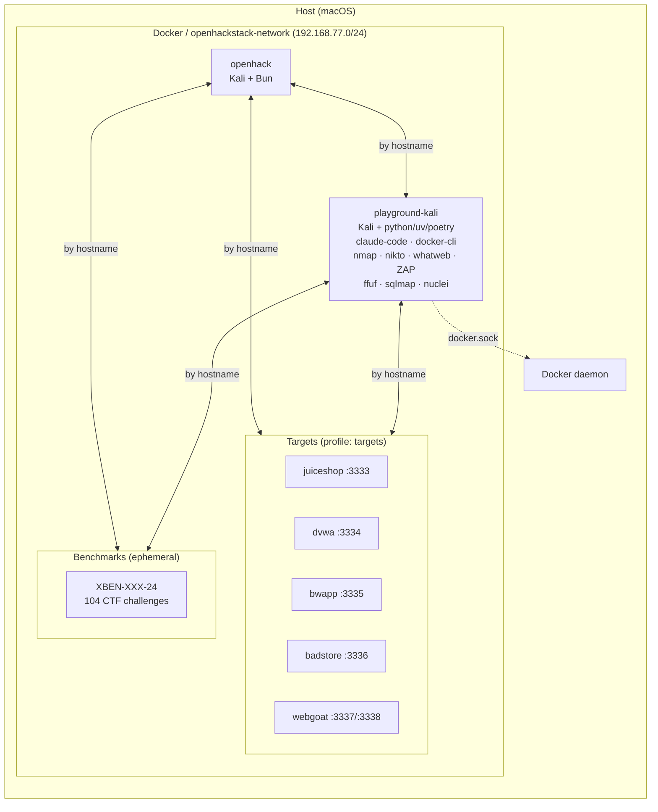

# openhackstack

Docker-based dev environment with Kali tools, optional vulnerable targets, and a playground container for third-party agents.

## Architecture



Containers communicate by hostname on the shared Docker network. Target ports are also bound to `127.0.0.1` on the host for browser access (see [Host Access](#host-access)).

## Prerequisites

- Docker with Docker Compose v2 (`docker compose`)

## Quick Start

From `docker/`:

```bash
./setup/quickstart    # clone all repos, build, and start (first time)
```

Start everything (dev + targets + playground):

```bash
make quickstart-all   # first time: clone repos, build, start everything
make up-all           # subsequent: start everything (builds if needed)
```

Or selectively:

```bash
make up               # dev container only
make up-with-targets  # dev + all vulnerable targets
make playground       # start playground container only (not GVM)
```

Note: `up-all` and `playground` mount `/var/run/docker.sock` into the playground container, giving it root-equivalent control over your Docker daemon. Only run trusted code in `./data/projects/source`.

Compose directly:

```bash
docker compose up -d                                          # dev only
docker compose --profile targets up -d openhack juiceshop     # dev + one target
docker compose --profile targets up -d                        # dev + all targets
```

## Commands

```bash
make help           # list all commands
make up-all         # start everything (dev + targets + playground)
make shell          # enter dev container
make install        # bun install
make dev            # bun run dev (TUI/CLI)
make app            # web app dev server (port 3000)
make web            # opencode web (port 4096)
make serve          # opencode HTTP server (port 4096)
make playground     # start playground container
make benchmark-kali     # scan all targets (nmap, nikto, whatweb, ZAP, ffuf, sqlmap)
make benchmark-pentestgpt  # run PentestGPT benchmark (RUNS=5)
make benchmark-cai         # run CAI benchmark (RUNS=5)
make benchmark-strix       # run Strix benchmark (RUNS=5)
make status         # show service status
make down           # stop everything
make validate       # run smoke tests
```

## Containers

| Container | Service | Profile | Hostname | URL |
|---|---|---|---|---|
| `openhack` | `openhack` | *(default)* | `openhack` | `http://localhost:4096` (after `make web`/`serve`) |
| `playground-kali` | `playground` | `playground` | `kali` | — |
| `playground-gvm` | `gvm` | `playground` | `gvm` | `http://localhost:9392` (container-internal) |
| `targets-juiceshop` | `juiceshop` | `targets` | `juiceshop` | `http://localhost:3333` |
| `targets-dvwa` | `dvwa` | `targets` | `dvwa` | `http://localhost:3334` |
| `targets-bwapp` | `bwapp` | `targets` | `bwapp` | `http://localhost:3335` |
| `targets-badstore` | `badstore` | `targets` | `badstore` | `http://localhost:3336` |
| `targets-webgoat` | `webgoat` | `targets` | `webgoat` | `http://localhost:3337` |

The web app dev server (Vite) uses an ephemeral host port by default. Find it with `docker compose port openhack 3000`, or pin it: `OPENCODE_APP_PORT=3000 docker compose up -d`.

## Dev Container

The repo is mounted at `/app`. Persistent caches across restarts:

- npm/npx: `/home/opencode/.npm` (used by MCP `npx -y ...`)
- Playwright browsers: `/home/opencode/.cache/ms-playwright`

Optional SecLists wordlists (shared read-only at `/usr/share/wordlists/seclists`):

```bash
./setup/seclists
```

## Playground

Kali-based container for running third-party OSS hacking agents on the same Docker network as the targets. Reaches them by hostname (e.g. `http://juiceshop:3000`).

```bash
make playground
docker compose exec playground bash
```

### Scanning

The `benchmark-kali` script runs automated scans against all Docker-internal targets using their real hostnames and ports. Tools: nmap, whatweb, nikto, ZAP, ffuf, sqlmap, and optionally GVM/OpenVAS.

```bash
make benchmark-kali                 # scan all targets
docker compose exec playground benchmark-kali juiceshop   # scan one target
docker compose exec playground benchmark-kali dvwa bwapp  # scan specific targets
docker compose exec playground benchmark-kali --gvm       # include GVM/OpenVAS (slow)
```

| Target | Hostname | Port |
|---|---|---|
| Juice Shop | `juiceshop` | 3000 |
| DVWA | `dvwa` | 80 |
| bWAPP | `bwapp` | 80 |
| BadStore | `badstore` | 80 |
| WebGoat | `webgoat` | 8080 |

Scan output is saved to `/playground/scans/<hostname>/` inside the container (for benchmark-kali) and to `data/projects/scans/` on the host using the flat naming convention `{target}-{agent}-run-{N}.*`. SecLists wordlists are available at `/usr/share/wordlists/seclists/`.

GVM (Greenbone Vulnerability Management / OpenVAS) runs as a separate container (`playground-gvm`) in the `playground` profile. `make playground` starts only the playground container; use `make up-all` or `docker compose --profile playground up -d` to start both playground and GVM. First startup takes 5-10 minutes to sync vulnerability feeds. The `--gvm` flag connects to it via GMP on port 9390. GVM scans are significantly slower (30-60 min per target).

### Simple Setup

If your agent needs environment variables (API keys, model selection), create a gitignored env file and let `make playground` load it:

```bash
make playground-env
$EDITOR data/projects/playground.env
make playground
```

`make playground` passes these variables into the container so tools like Strix/CAI can read them.

### Projects

One-time setup to clone third-party agent repos into `docker/data/projects/source/` (git-ignored):

```bash
./setup/projects
```

Inside the container they appear at `/playground/projects/source/`. Supported:

- **PentestGPT** / **CAI** — installed via `uv sync`
- **Strix** — installed via `poetry install`

The entrypoint (`bin/playground-entrypoint`) auto-installs dependencies on first boot. It checks for each CLI binary in `.venv/bin/` and skips if present. Virtualenvs persist on the host via bind mount.

To force reinstall: delete the project's `.venv` on the host and restart the container.

### Agent Setup (Keys / Docker)

Most of these projects require API keys and/or an interactive first-run setup:

- **PentestGPT**: uses Claude Code (`claude`). In the playground container, run `claude` and complete `/login` before running `pentestgpt`. A named volume (`playground-claude`) persists the Claude Code login across container recreations.
- **CAI**: requires a TTY (run from `docker compose exec playground bash`). It expects `OPENAI_API_KEY` to be set (can be a placeholder like `sk-1234` for startup). Set `CAI_MODEL` (e.g. `alias1`) and `ALIAS_API_KEY` if you want CAI Pro, and use `OPENAI_BASE_URL` if you want to point at an OpenAI-compatible local/proxy endpoint.
- **Strix**: runs a sandbox via Docker and needs Docker daemon access. This Compose profile mounts `/var/run/docker.sock` into the playground container. It also requires `STRIX_LLM` and typically `LLM_API_KEY` (and optionally `LLM_API_BASE`). Because Strix creates a sibling sandbox container, two extra env vars are needed for it to work inside the playground: `STRIX_SANDBOX_HOST=host.docker.internal` (so Strix can reach the sandbox's tool server via the Docker host) and `STRIX_SANDBOX_NETWORK=openhackstack_openhackstack-network` (so the sandbox can reach targets by hostname). These are set in `data/projects/playground.env`.

Security note: mounting `/var/run/docker.sock` gives the playground container effectively root-equivalent control over your Docker daemon. Only run trusted code in `./data/projects/source`.

### Running Agents

All agents run inside the playground container and reach targets by Docker hostname. Start everything first:

```bash
make up-all                              # start dev + targets + playground + GVM
docker compose exec playground bash      # enter playground shell
```

#### PentestGPT

Uses Claude Code CLI. Requires one-time interactive login:

```bash
# First time only: authenticate Claude Code
claude
# Complete /login, then exit

# Run against a target
pentestgpt --target http://juiceshop:3000
pentestgpt --target http://bwapp:80

# Non-interactive (headless)
pentestgpt --target http://juiceshop:3000 --non-interactive

# Resume a previous session
pentestgpt --target http://juiceshop:3000 --resume
```

#### CAI

Requires a TTY — must run from an interactive shell (`docker compose exec playground bash`):

```bash
# Run against a target (interactive TUI)
cai "Target: http://juiceshop:3000 - perform a full web application penetration test"
cai "Target: http://bwapp:80 - test all vulnerability categories"

# With specific agent type
CAI_AGENT_TYPE=web_pentester cai "Target: http://juiceshop:3000"
CAI_AGENT_TYPE=red_teamer cai "Target: http://bwapp:80"

# Ctrl+C twice for Human-In-The-Loop mode
```

Environment: `OPENAI_API_KEY` and `CAI_MODEL` are set via `data/projects/playground.env`.

#### Strix

Runs a Docker sandbox container and needs Docker daemon access (provided via socket mount):

```bash
# Run against a target
strix --target http://juiceshop:3000
strix --target http://bwapp:80

# Scan modes: quick, standard, deep (default)
strix --target http://juiceshop:3000 --scan-mode deep
strix --target http://bwapp:80 --scan-mode quick

# Non-interactive (CI/CD mode, exits with code 2 if vulns found)
strix --target http://juiceshop:3000 -n

# Multiple targets
strix -t http://juiceshop:3000 -t http://bwapp:80

# Custom instructions
strix --target http://juiceshop:3000 --instruction "Focus on SQLi and XSS"
```

Environment: `STRIX_LLM` and `LLM_API_KEY` are set via `data/projects/playground.env`.

## Host Access

Target web apps are bound to `127.0.0.1` on the host for browser access:

| Target | Host URL |
|---|---|
| Juice Shop | `http://localhost:3333` |
| DVWA | `http://localhost:3334` |
| bWAPP | `http://localhost:3335` |
| BadStore | `http://localhost:3336` |
| WebGoat | `http://localhost:3337` |
| WebWolf | `http://localhost:3338` |

From inside containers, use Docker hostnames instead (e.g. `http://juiceshop:3000`).

## Benchmarking

### Agent Benchmarks

Automated benchmark scripts run N runs per target with clean container restarts and `/tmp` archival between runs. Results are saved to `data/projects/scans/` using the flat naming convention `{target}-{agent}-run-{N}.*`.

```bash
make benchmark-pentestgpt RUNS=5     # PentestGPT: 5 runs on all targets
make benchmark-cai RUNS=5            # CAI: 5 runs on all targets
make benchmark-strix RUNS=5          # Strix: 5 runs on all targets
```

Or run the scripts directly:

```bash
bin/benchmark-pentestgpt 5              # default: 5 runs
bin/benchmark-cai 3                     # override run count
bin/benchmark-strix 5

# Single target, single run
TARGET=juiceshop bin/benchmark-strix 1 1
TARGET=badstore bin/benchmark-pentestgpt 1 1

# Resume from run 3
TARGET=juiceshop bin/benchmark-cai 5 3

# CAI tuning (env vars)
CAI_MAX_TURNS=50 CAI_TIMEOUT=900 bin/benchmark-cai 1 1
```

Each run: clean `/tmp`, restart target container, wait for healthcheck, run the agent, archive results. After all runs, use the analysis templates to evaluate results:

- `data/projects/analysis/templates/agent-project-template.md` — project/codebase analysis (fill first, from source code)
- `data/projects/analysis/templates/results-template.md` — per-agent × target benchmark results
- `data/projects/analysis/templates/learnings-template.md` — cross-agent learnings synthesis (fill last)

Scan data structure:

```
data/projects/
├── xbow/                                      # XBOW validation-benchmarks clone (git-ignored)
│   └── benchmarks/                            # XBEN-001-24 ... XBEN-104-24
├── source/                                    # third-party agent repos (git-ignored)
│   ├── cai/
│   ├── strix/
│   └── PentestGPT/
├── scans/                                     # all primary benchmark data (flat)
│   ├── {target}-{agent}-run-{N}.log           # agent execution logs
│   ├── {target}-{agent}-run-{N}-tmp.tar.gz    # /tmp artifacts
│   ├── {target}-strix-run-{N}-output.tar.gz   # Strix output archives
│   ├── {target}-strix-run-2-output.log        # Strix TUI terminal logs (Run 2)
│   ├── enhancements/                          # manual baseline scans
│   │   ├── juiceshop/                         # {target}-{tool}.{ext}
│   │   └── badstore/
│   └── archive/                               # pre-fix runs, no-restart archives, other targets
│       ├── {target}-cai-bug-run-{N}.*         # CAI pre-fix (bugstalled) runs
│       ├── {target}-pentestgpt-archive-no-restart.tar.gz
│       ├── bwapp/                             # archived target baselines
│       ├── dvwa/
│       └── webgoat/
└── analysis/
    ├── templates/
    │   ├── agent-project-template.md          # project analysis template
    │   ├── results-template.md                # benchmark results template
    │   └── learnings-template.md              # learnings synthesis template
    ├── code/                                  # filled project/codebase analyses
    │   ├── cai-project-analysis.md
    │   ├── pentestgpt-project-analysis.md
    │   └── strix-project-analysis.md
    ├── runs/                                  # per-agent x target benchmark results
    │   ├── cai-juiceshop-results.md
    │   ├── cai-badstore-results.md
    │   ├── pentestgpt-juiceshop-results.md
    │   ├── pentestgpt-badstore-results.md
    │   ├── strix-juiceshop-results.md
    │   ├── strix-badstore-results.md
    │   └── archive/                           # pre-fix (stalled) CAI results
    │       ├── stalled-cai-juiceshop-results.md
    │       └── stalled-cai-badstore-results.md
    ├── manual/                                # manual/baseline scanner results
    │   ├── gvm-juiceshop-results.md
    │   └── gvm-badstore-results.md
    ├── cai-analysis.md                        # cross-target synthesis (per agent)
    ├── pentestgpt-analysis.md
    ├── strix-analysis.md
    ├── summary.md                             # benchmark summary (all agents)
    ├── learnings.md                           # cross-agent learnings for OpenHack
    └── costs-analysis.md                      # artifact-sourced cost data
```

### XBOW Benchmarks

[XBOW validation-benchmarks](https://github.com/xbow-engineering/validation-benchmarks): 104 CTF-style security challenges. Each benchmark is an independent Docker Compose stack that gets dynamically connected to the openhackstack network.

Local clone path: `data/projects/xbow/`.

One-time setup:

```bash
./setup/benchmarks
```

Usage:

```bash
bin/benchmark-xbow list                # list all 104 benchmarks
bin/benchmark-xbow build XBEN-001-24   # build with random flag
bin/benchmark-xbow run XBEN-001-24     # start + connect to network
bin/benchmark-xbow flag XBEN-001-24    # show the flag
bin/benchmark-xbow stop XBEN-001-24    # tear down
```

Running benchmarks are reachable from openhack and playground containers by container name. Makefile shortcuts: `make xbow-list`, `make xbow-build BENCH=...`, etc.
