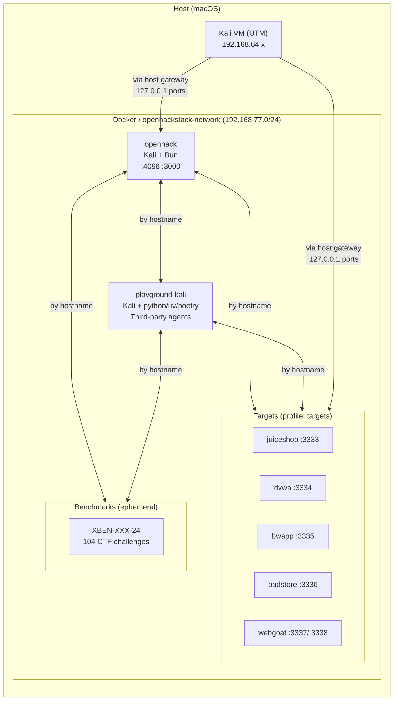

# openhackstack

Docker-based dev environment with Kali tools, optional vulnerable targets, and a playground container for third-party agents.

## Architecture



All ports are bound to `127.0.0.1` only (not exposed to the LAN). The Kali VM reaches services via the host gateway (`192.168.64.1`).

## Prerequisites

- Docker with Docker Compose v2 (`docker compose`)

## Quick Start

From `docker/`:

```bash
./setup/quickstart    # clone all repos, build, and start (first time)
```

Or selectively:

```bash
make up               # dev container only
make up-with-targets  # dev + all vulnerable targets
make shell            # enter the dev container
make playground       # start playground container
```

Compose directly:

```bash
docker compose up -d                                          # dev only
docker compose --profile targets up -d openhack juiceshop     # dev + one target
docker compose --profile targets up -d                        # dev + all targets
```

## Commands

```bash
make help        # list all commands
make shell       # enter dev container
make install     # bun install
make dev         # bun run dev (TUI/CLI)
make app         # web app dev server (port 3000)
make web         # opencode web (port 4096)
make serve       # opencode HTTP server (port 4096)
make playground  # start playground container
make status      # show service status
make down        # stop everything
make validate    # run smoke tests
```

## Containers

| Container | Service | Profile | Hostname | URL |
|---|---|---|---|---|
| `openhack` | `openhack` | *(default)* | `openhack` | `http://localhost:4096` |
| `playground-kali` | `playground` | `playground` | `kali` | — |
| `targets-juiceshop` | `juiceshop` | `targets` | `juiceshop` | `http://localhost:3333` |
| `targets-dvwa` | `dvwa` | `targets` | `dvwa` | `http://localhost:3334` |
| `targets-bwapp` | `bwapp` | `targets` | `bwapp` | `http://localhost:3335` |
| `targets-badstore` | `badstore` | `targets` | `badstore` | `http://localhost:3336` |
| `targets-webgoat` | `webgoat` | `targets` | `webgoat` | `http://localhost:3337` |

The web app dev server (Vite) uses an ephemeral host port by default. Find it with `docker compose port openhack 3000`, or pin it: `OPENCODE_APP_PORT=3000 docker compose up -d`.

## Dev Container

The repo is mounted at `/app`. Persistent caches across restarts:

- npm/npx: `/home/opencode/.npm` (used by MCP `npx -y ...`)
- Playwright browsers: `/home/opencode/.cache/ms-playwright`

Optional SecLists wordlists (shared read-only at `/usr/share/wordlists/seclists`):

```bash
./setup/seclists
```

## Playground

Kali-based container for running third-party OSS hacking agents on the same Docker network as the targets. Reaches them by hostname (e.g. `http://juiceshop:3000`).

```bash
make playground
docker compose exec playground bash
```

### Projects

One-time setup to clone third-party agent repos into `docker/data/projects/` (git-ignored):

```bash
./setup/projects
```

Inside the container they appear at `/playground/projects/`. Supported:

- **PentestGPT** / **CAI** — installed via `uv sync`
- **Strix** — installed via `poetry install`

The entrypoint (`entrypoint/playground`) auto-installs dependencies on first boot. It checks for each CLI binary in `.venv/bin/` and skips if present. Virtualenvs persist on the host via bind mount.

To force reinstall: delete the project's `.venv` on the host and restart the container.

## Benchmarks

[XBOW validation-benchmarks](https://github.com/xbow-engineering/validation-benchmarks): 104 CTF-style security challenges. Each benchmark is an independent Docker Compose stack that gets dynamically connected to the openhackstack network.

One-time setup:

```bash
./setup/benchmarks
```

Usage:

```bash
bin/benchmark list                # list all 104 benchmarks
bin/benchmark build XBEN-001-24  # build with random flag
bin/benchmark run XBEN-001-24    # start + connect to network
bin/benchmark flag XBEN-001-24   # show the flag
bin/benchmark stop XBEN-001-24   # tear down
```

Running benchmarks are reachable from openhack and playground containers by container name. Makefile shortcuts: `make benchmark-list`, `make benchmark-build BENCH=...`, etc.
