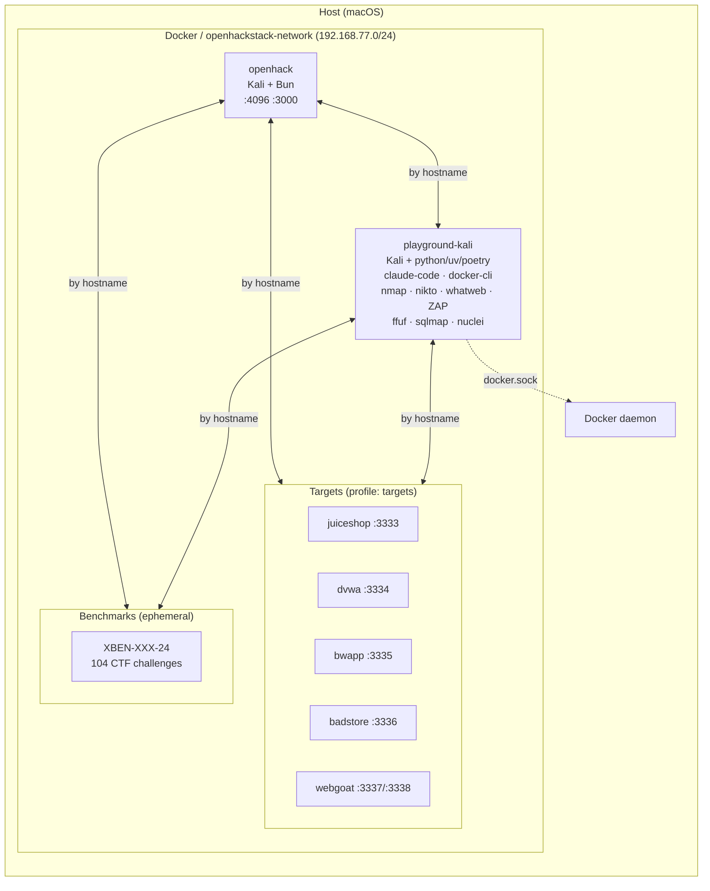

# openhackstack

Docker-based dev environment with Kali tools, optional vulnerable targets, and a playground container for third-party agents.

## Architecture



Containers communicate by hostname on the shared Docker network. Target ports are also bound to `127.0.0.1` on the host for browser access (see [Host Access](#host-access)).

## Prerequisites

- Docker with Docker Compose v2 (`docker compose`)

## Quick Start

From `docker/`:

```bash
./setup/quickstart    # clone all repos, build, and start (first time)
```

Start everything (dev + targets + playground):

```bash
make quickstart-all   # first time: clone repos, build, start everything
make up-all           # subsequent: start everything (builds if needed)
```

Or selectively:

```bash
make up               # dev container only
make up-with-targets  # dev + all vulnerable targets
make playground       # start playground container only
```

Note: `up-all` and `playground` mount `/var/run/docker.sock` into the playground container, giving it root-equivalent control over your Docker daemon. Only run trusted code in `./data/projects`.

Compose directly:

```bash
docker compose up -d                                          # dev only
docker compose --profile targets up -d openhack juiceshop     # dev + one target
docker compose --profile targets up -d                        # dev + all targets
```

## Commands

```bash
make help           # list all commands
make up-all         # start everything (dev + targets + playground)
make shell          # enter dev container
make install        # bun install
make dev            # bun run dev (TUI/CLI)
make app            # web app dev server (port 3000)
make web            # opencode web (port 4096)
make serve          # opencode HTTP server (port 4096)
make playground     # start playground container
make kali-scan      # scan all targets (nmap, nikto, whatweb, ZAP, ffuf, sqlmap)
make status         # show service status
make down           # stop everything
make validate       # run smoke tests
```

## Containers

| Container | Service | Profile | Hostname | URL |
|---|---|---|---|---|
| `openhack` | `openhack` | *(default)* | `openhack` | `http://localhost:4096` |
| `playground-kali` | `playground` | `playground` | `kali` | — |
| `targets-juiceshop` | `juiceshop` | `targets` | `juiceshop` | `http://localhost:3333` |
| `targets-dvwa` | `dvwa` | `targets` | `dvwa` | `http://localhost:3334` |
| `targets-bwapp` | `bwapp` | `targets` | `bwapp` | `http://localhost:3335` |
| `targets-badstore` | `badstore` | `targets` | `badstore` | `http://localhost:3336` |
| `targets-webgoat` | `webgoat` | `targets` | `webgoat` | `http://localhost:3337` |

The web app dev server (Vite) uses an ephemeral host port by default. Find it with `docker compose port openhack 3000`, or pin it: `OPENCODE_APP_PORT=3000 docker compose up -d`.

## Dev Container

The repo is mounted at `/app`. Persistent caches across restarts:

- npm/npx: `/home/opencode/.npm` (used by MCP `npx -y ...`)
- Playwright browsers: `/home/opencode/.cache/ms-playwright`

Optional SecLists wordlists (shared read-only at `/usr/share/wordlists/seclists`):

```bash
./setup/seclists
```

## Playground

Kali-based container for running third-party OSS hacking agents on the same Docker network as the targets. Reaches them by hostname (e.g. `http://juiceshop:3000`).

```bash
make playground
docker compose exec playground bash
```

### Scanning

The `kali-scan` script runs automated scans against all Docker-internal targets using their real hostnames and ports. Tools: nmap, whatweb, nikto, ZAP, ffuf, sqlmap.

```bash
make kali-scan                 # scan all targets
docker compose exec playground kali-scan juiceshop   # scan one target
docker compose exec playground kali-scan dvwa bwapp  # scan specific targets
```

| Target | Hostname | Port |
|---|---|---|
| Juice Shop | `juiceshop` | 3000 |
| DVWA | `dvwa` | 80 |
| bWAPP | `bwapp` | 80 |
| BadStore | `badstore` | 80 |
| WebGoat | `webgoat` | 8080 |

Scan output is saved to `/playground/scans/<hostname>/` inside the container, which maps to `docker/data/scans/` on the host (gitignored). SecLists wordlists are available at `/usr/share/wordlists/seclists/`.

### Simple Setup

If your agent needs environment variables (API keys, model selection), create a gitignored env file and let `make playground` load it:

```bash
make playground-env
$EDITOR data/playground.env
make playground
```

`make playground` passes these variables into the container so tools like Strix/CAI can read them.

### Projects

One-time setup to clone third-party agent repos into `docker/data/projects/` (git-ignored):

```bash
./setup/projects
```

Inside the container they appear at `/playground/projects/`. Supported:

- **PentestGPT** / **CAI** — installed via `uv sync`
- **Strix** — installed via `poetry install`

The entrypoint (`entrypoint/playground`) auto-installs dependencies on first boot. It checks for each CLI binary in `.venv/bin/` and skips if present. Virtualenvs persist on the host via bind mount.

To force reinstall: delete the project's `.venv` on the host and restart the container.

### Agent Setup (Keys / Docker)

Most of these projects require API keys and/or an interactive first-run setup:

- **PentestGPT**: uses Claude Code (`claude`). In the playground container, run `claude` and complete `/login` before running `pentestgpt`.
- **CAI**: requires a TTY (run from `docker compose exec playground bash`). It expects `OPENAI_API_KEY` to be set (can be a placeholder like `sk-1234` for startup). Set `CAI_MODEL` (e.g. `alias1`) and `ALIAS_API_KEY` if you want CAI Pro, and use `OPENAI_BASE_URL` if you want to point at an OpenAI-compatible local/proxy endpoint.
- **Strix**: runs a sandbox via Docker and needs Docker daemon access. This Compose profile mounts `/var/run/docker.sock` into the playground container. It also requires `STRIX_LLM` and typically `LLM_API_KEY` (and optionally `LLM_API_BASE`).

Security note: mounting `/var/run/docker.sock` gives the playground container effectively root-equivalent control over your Docker daemon. Only run trusted code in `./data/projects`.

## Host Access

Target web apps are bound to `127.0.0.1` on the host for browser access:

| Target | Host URL |
|---|---|
| Juice Shop | `http://localhost:3333` |
| DVWA | `http://localhost:3334` |
| bWAPP | `http://localhost:3335` |
| BadStore | `http://localhost:3336` |
| WebGoat | `http://localhost:3337` |
| WebWolf | `http://localhost:3338` |

From inside containers, use Docker hostnames instead (e.g. `http://juiceshop:3000`).

## Benchmarks

[XBOW validation-benchmarks](https://github.com/xbow-engineering/validation-benchmarks): 104 CTF-style security challenges. Each benchmark is an independent Docker Compose stack that gets dynamically connected to the openhackstack network.

One-time setup:

```bash
./setup/benchmarks
```

Usage:

```bash
bin/benchmark list                # list all 104 benchmarks
bin/benchmark build XBEN-001-24  # build with random flag
bin/benchmark run XBEN-001-24    # start + connect to network
bin/benchmark flag XBEN-001-24   # show the flag
bin/benchmark stop XBEN-001-24   # tear down
```

Running benchmarks are reachable from openhack and playground containers by container name. Makefile shortcuts: `make benchmark-list`, `make benchmark-build BENCH=...`, etc.
