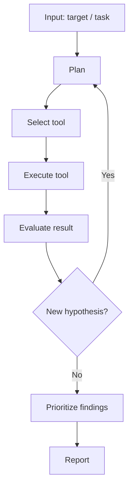
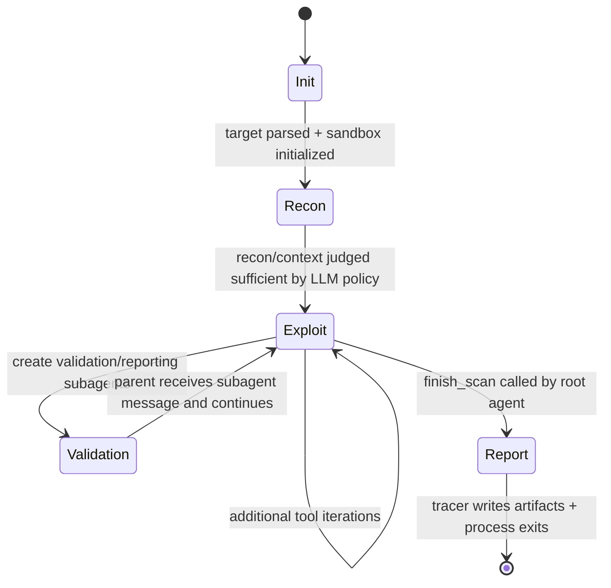

# Strix - Project Analysis

> **Context:** This template provides a standardized analysis framework for
> autonomous penetration testing agents, designed for use in a bachelor thesis.
> It enables systematic, comparable evaluation of each agent's architecture,
> tool usage, and vulnerability discovery capabilities.

| Field | Value |
|-------|-------|
| **Project** | Strix |
| **Version / Commit** | `strix-agent` 0.7.0 / `0a63ffba63d37d3f9d37ebaa3412f09c651f61ce` (local clone) |
| **Repository** | https://github.com/usestrix/strix |
| **License** | Apache-2.0 |
| **Language(s)** | Python 3.12+, Shell (container/runtime bootstrap) |
| **Runtime** | Host CLI + Docker sandbox runtime (Kali-based container + internal tool server) |
| **Date Analyzed** | 2026-02-13 |

> **Template Ecosystem - Three-Layer Analysis:**
>
> | Layer | Template | Scope | Cardinality |
> |-------|----------|-------|-------------|
> | 1. Project Analysis | **this file** | Deep technical analysis of codebase, architecture, and design decisions | One per agent |
> | 2. Benchmark Results | `results-template.md` | Quantitative data: tool calls, flags, cost, duration, vulnerability coverage | One per agent x target |
> | 3. Learnings Synthesis | `learnings-template.md` | Qualitative synthesis: what worked, what to adopt for OpenHack | One per agent |
>
> **Workflow:** (1) Analyze the codebase and fill this template ->
> (2) Run benchmarks and fill `results-template.md` per target ->
> (3) Synthesize findings from both into `learnings-template.md`.

---

## 1. Project Profile

- **Primary goal:** Autonomous offensive security assessment of applications and infrastructure with validated PoCs and report generation (`strix/README.md:43`, `strix/README.md:49`, `strix/README.md:66`).
- **Supported asset types:** URLs/web apps, repositories (HTTP/SSH git), local code directories, domains, and IP addresses (`strix/strix/interface/main.py:313`, `strix/strix/interface/utils.py:469`, `strix/strix/interface/utils.py:499`, `strix/README.md:139`).
- **Explicitly out of scope:** Unauthorized testing is explicitly disallowed at policy/documentation level (`strix/README.md:245`).
- **Assumed attacker model:** Authorized tester with broad non-destructive pentest authority in isolated runtime; both black-box and white-box modes are first-class in prompt strategy (`strix/strix/agents/StrixAgent/system_prompt.jinja:35`, `strix/strix/agents/StrixAgent/system_prompt.jinja:71`, `strix/strix/agents/StrixAgent/system_prompt.jinja:78`).
- **Human-in-the-loop:** Yes. TUI supports selecting/stopping agents and injecting user messages; headless mode supports unattended CI behavior (`strix/strix/interface/tui.py:676`, `strix/strix/interface/tui.py:1764`, `strix/README.md:168`).
- **Short description (3-5 sentences):**
  Strix is a Python-based autonomous pentest agent framework with a host-side orchestrator and a Dockerized Kali sandbox that executes tools via an authenticated local tool server (`strix/strix/interface/main.py:520`, `strix/strix/runtime/docker_runtime.py:245`, `strix/strix/runtime/tool_server.py:86`). The core loop combines LLM streaming, XML tool-call parsing, and sequential tool execution with explicit finish/report tools (`strix/strix/llm/llm.py:128`, `strix/strix/llm/utils.py:20`, `strix/strix/tools/executor.py:313`, `strix/strix/tools/finish/finish_actions.py:86`). It has built-in multi-agent graph orchestration, inter-agent messaging, and per-agent runtime contexts for browser/terminal/python tools (`strix/strix/tools/agents_graph/agents_graph_actions.py:187`, `strix/strix/tools/browser/tab_manager.py:13`, `strix/strix/tools/terminal/terminal_manager.py:13`, `strix/strix/tools/python/python_actions.py:9`). Output artifacts are persisted in `strix_runs/<run-name>` with final markdown report plus per-vulnerability markdown and CSV index (`strix/strix/telemetry/tracer.py:65`, `strix/strix/telemetry/tracer.py:285`, `strix/strix/telemetry/tracer.py:372`).

---

## 2. Quickstart for Reproduction

> Required for thesis reproducibility. Document the exact steps to set up
> and run the agent from a clean state.

- **Entry point(s) in code:**
  - CLI entrypoint: `strix.interface.main:main` (`strix/pyproject.toml:45`, `strix/strix/interface/main.py:520`)
  - Headless runner: `run_cli(args)` (`strix/strix/interface/cli.py:23`)
  - Interactive runner: `run_tui(args)` (`strix/strix/interface/tui.py:1935`)
- **Key configuration files:**
  - Config model and defaults: `strix/strix/config/config.py:8`
  - LLM runtime config: `strix/strix/llm/config.py:4`
  - Main system prompt: `strix/strix/agents/StrixAgent/system_prompt.jinja:1`
  - Scan-mode skills: `strix/strix/skills/scan_modes/quick.md:1`, `strix/strix/skills/scan_modes/standard.md:1`, `strix/strix/skills/scan_modes/deep.md:1`
  - Sandbox container definition: `strix/containers/Dockerfile:1`
- **Startup command:**
  - `pipx install strix-agent`
  - `export STRIX_LLM="openai/gpt-5"`
  - `export LLM_API_KEY="<key>"`
  - `strix --target ./app-directory` (`strix/README.md:84`, `strix/README.md:87`, `strix/README.md:91`)
- **Minimal test run:**
  - `strix -n --target https://example.com --scan-mode quick` (`strix/docs/usage/cli.mdx:50`, `strix/docs/usage/scan-modes.mdx:11`)
- **Log / artifact output paths:**
  - Run artifacts directory: `strix_runs/<run-name>` (`strix/README.md:95`, `strix/strix/telemetry/tracer.py:65`)
  - Final report: `strix_runs/<run-name>/penetration_test_report.md` (`strix/strix/telemetry/tracer.py:286`)
  - Vulnerability markdown files: `strix_runs/<run-name>/vulnerabilities/*.md` (`strix/strix/telemetry/tracer.py:299`, `strix/strix/telemetry/tracer.py:314`)
  - Vulnerability index: `strix_runs/<run-name>/vulnerabilities.csv` (`strix/strix/telemetry/tracer.py:372`)

---

## 3. Architecture

### 3a. Component Decomposition

| Component | Purpose | Inputs | Outputs | Key Files |
|-----------|---------|--------|---------|-----------|
| Agent Core | Builds task description and runs autonomous loop | Parsed targets, user instructions, agent config | Final success/error state, tool traces, reports | `strix/strix/agents/StrixAgent/strix_agent.py:21`, `strix/strix/agents/base_agent.py:149` |
| Planner / Orchestrator | Host lifecycle (arg parsing, env checks, mode dispatch, telemetry start/end) | CLI args/env/config | TUI/CLI run invocation, run metadata, exit code | `strix/strix/interface/main.py:265`, `strix/strix/interface/main.py:520` |
| Executor | Executes LLM/tool iterations and dispatches tool calls | Conversation history + tool invocations | Updated conversation, stop/finish signals | `strix/strix/agents/base_agent.py:347`, `strix/strix/tools/executor.py:313` |
| Tool Adapter | Registry, validation, sandbox routing and result formatting | XML tool calls (`toolName`, args) | Tool result XML + optional image attachments | `strix/strix/tools/registry.py:152`, `strix/strix/tools/executor.py:29`, `strix/strix/tools/executor.py:227` |
| Memory / State | Tracks per-agent execution state, waits/stops, context, errors, iteration counters | Messages, actions, observations | Stateful loop behavior and execution summaries | `strix/strix/agents/state.py:12`, `strix/strix/agents/state.py:88`, `strix/strix/agents/state.py:147` |
| Reporter | Persists scan report/vulnerabilities and exposes live/final stats | Tool execution traces + vuln reports + final fields | Markdown report, markdown per vuln, CSV index, telemetry events | `strix/strix/telemetry/tracer.py:76`, `strix/strix/telemetry/tracer.py:152`, `strix/strix/telemetry/tracer.py:279`, `strix/strix/telemetry/posthog.py:107` |

### 3b. Generic Agent Loop (reference)

The following diagram shows a generic agent loop for comparison. Replace section 3c
with the project's actual flow.



### 3c. Project-Specific Agent Flow (Mermaid)

```mermaid
flowchart TD
    START([START: strix --target ...]) --> PARSE[parse_arguments]
    PARSE --> PREP[check_docker_installed + pull_docker_image + validate_environment + warm_up_llm]
    PREP --> TARGETS[infer_target_type + assign_workspace_subdirs + rewrite_localhost_targets]
    TARGETS --> MODE{--non-interactive?}

    MODE -- yes --> CLI[run_cli(args)]
    MODE -- no --> TUI[run_tui(args)]

    CLI --> AGENT
    TUI --> AGENT

    subgraph AGENT [StrixAgent/BaseAgent Loop]
      AGENT[StrixAgent.execute_scan builds task] --> INIT[_initialize_sandbox_and_state]
      INIT --> ITER[while loop: increment iteration]
      ITER --> LLM[LLM.generate stream]
      LLM --> PARSETOOLS[parse_tool_invocations XML]
      PARSETOOLS --> HASACTION{tool calls present?}
      HASACTION -- yes --> TOOLRUN[process_tool_invocations]
      TOOLRUN --> FINCHK{finish_scan or agent_finish success?}
      FINCHK -- no --> ITER
      FINCHK -- yes --> DONESTATE[set_completed / return]
      HASACTION -- no --> ITER
    end

    DONESTATE --> ARTIFACTS[Tracer save_run_data]
    ARTIFACTS --> EXITCHECK{headless and vulnerabilities found?}
    EXITCHECK -- yes --> EXIT2([STOP: exit code 2])
    EXITCHECK -- no --> EXIT0([STOP: normal completion])

    PREP --> FAILINIT([STOP: early fail env/docker/LLM])
```

> **Customization checklist:**
> - [x] Replace placeholder nodes with actual function/method names
> - [x] Add agent-specific branches (sandbox init, TUI/CLI split, finish tool gating)
> - [x] Annotate edges with transition conditions where non-obvious
> - [x] Update STOP node with actual termination reasons

### 3d. Start and Stop Conditions

| Condition | Type | Trigger | Behavior |
|------|------|---------|----------|
| CLI invocation with target URL/path/repo/IP | **Start** | User runs `strix --target ...` | Parse targets, set run name, initialize telemetry and runtime checks (`strix/strix/interface/main.py:524`, `strix/strix/interface/main.py:537`, `strix/strix/interface/main.py:550`) |
| Missing required env (for example `STRIX_LLM`) | **Stop (early)** | `validate_environment()` failure | Prints panel and exits code 1 (`strix/strix/interface/main.py:54`, `strix/strix/interface/main.py:175`) |
| Docker unavailable/image pull failure | **Stop (early)** | Docker CLI/daemon/image problems | Aborts startup via explicit exit path (`strix/strix/interface/main.py:178`, `strix/strix/interface/main.py:486`, `strix/strix/interface/main.py:502`) |
| LLM warmup failure | **Stop (early)** | Test completion request fails | Aborts with explicit exit code 1 (`strix/strix/interface/main.py:200`, `strix/strix/interface/main.py:253`) |
| Root or subagent calls finish tool successfully | **Stop (objective)** | `finish_scan` or `agent_finish` returns completion signal | Agent marks completed and returns from loop (`strix/strix/tools/executor.py:278`, `strix/strix/tools/executor.py:331`, `strix/strix/agents/base_agent.py:417`) |
| Max iterations reached | **Stop (budget)** | `iteration >= max_iterations` in state | `should_stop()` true; in non-interactive returns final result, in interactive enters waiting state (`strix/strix/agents/state.py:110`, `strix/strix/agents/state.py:88`, `strix/strix/agents/base_agent.py:171`) |
| User stop in TUI | **Stop (manual)** | `Esc` -> stop agent / quit action | Sends graceful stop request and/or exits app (`strix/strix/interface/tui.py:680`, `strix/strix/interface/tui.py:1822`, `strix/strix/tools/agents_graph/agents_graph_actions.py:469`) |
| User interrupt in CLI/non-interactive | **Stop (manual/external)** | SIGINT/SIGTERM handlers | Cleanup and process exit (`strix/strix/interface/cli.py:114`, `strix/strix/interface/cli.py:119`) |
| Non-interactive vulnerabilities present | **Stop (policy)** | After run, tracer contains findings | Process exits with code 2 (`strix/strix/interface/main.py:578`, `strix/strix/interface/main.py:581`, `strix/docs/usage/cli.mdx:62`) |
| Agent/tool/runtime unrecoverable error | **Stop (error)** | LLM/sandbox/tool error in non-interactive mode | Marks failed, returns/raises, CLI can exit code 1 (`strix/strix/agents/base_agent.py:556`, `strix/strix/agents/base_agent.py:521`, `strix/strix/interface/cli.py:166`) |

### 3e. Phase Transitions



| From | To | Signal | Explicit or LLM-decided? | Code Location |
|------|----|--------|--------------------------|---------------|
| Init -> Recon | `execute_scan()` creates target-specific task and appends first user message | Explicit | `strix/strix/agents/StrixAgent/strix_agent.py:21`, `strix/strix/agents/base_agent.py:345` |
| Recon -> Exploit | Model chooses exploit-oriented tools after reconnaissance | LLM-decided (prompt-directed) | `strix/strix/agents/base_agent.py:350`, `strix/strix/agents/StrixAgent/system_prompt.jinja:96` |
| Exploit -> Validation | Agent creates specialized validation/reporting subagents | Mixed: LLM decides; creation path explicit | `strix/strix/agents/StrixAgent/system_prompt.jinja:205`, `strix/strix/tools/agents_graph/agents_graph_actions.py:187` |
| Validation -> Exploit | Parent receives child completion/inter-agent message and resumes loop | Explicit with LLM handling of message content | `strix/strix/tools/agents_graph/agents_graph_actions.py:405`, `strix/strix/agents/base_agent.py:427` |
| Exploit -> Report | Root calls `finish_scan` with required report sections | Explicit tool contract + LLM decision timing | `strix/strix/tools/finish/finish_actions.py:86`, `strix/strix/tools/finish/finish_actions.py:121` |
| Report -> Stop | Tracer persists markdown/csv artifacts and main returns/sets exit code | Explicit | `strix/strix/telemetry/tracer.py:279`, `strix/strix/interface/main.py:575`, `strix/strix/interface/main.py:581` |

### 3f. Retry and Backtrack Strategy

- **On tool failure:** Tool execution returns structured error strings and loop continues; no hard abort unless major runtime failure occurs (`strix/strix/tools/executor.py:178`, `strix/strix/tools/executor.py:200`).
- **On exploit failure:** Predominantly LLM policy-driven iteration/backtracking, reinforced by aggressive persistence prompt rules (`strix/strix/agents/base_agent.py:159`, `strix/strix/agents/StrixAgent/system_prompt.jinja:45`).
- **Max retries per hypothesis:** No explicit hypothesis-level counter; global retry controls exist for LLM requests (`max_retries`) and global max iterations (`strix/strix/llm/llm.py:115`, `strix/strix/agents/state.py:23`).
- **Backtrack depth:** Potentially deep/unbounded inside one run until `finish_scan`, stop request, or iteration cap; agent graph allows recursive delegation chains (`strix/strix/tools/agents_graph/agents_graph_actions.py:24`, `strix/strix/tools/agents_graph/agents_graph_actions.py:260`).
- **Dead-end detection:** Combination of LLM self-assessment, explicit wait states, and enforced finish warnings near iteration budget (`strix/strix/agents/base_agent.py:183`, `strix/strix/agents/base_agent.py:199`, `strix/strix/agents/state.py:94`).

### 3g. Memory and State Management

- **Session state:** Tracks agent identity, parent linkage, task, iteration counters, waiting flags, messages/actions/errors, and sandbox metadata (`strix/strix/agents/state.py:12`, `strix/strix/agents/state.py:31`).
- **Short-term memory:** Conversation history plus memory compression that summarizes older messages while preserving recent context (`strix/strix/llm/llm.py:182`, `strix/strix/llm/memory_compressor.py:172`).
- **Long-term memory:** No dedicated cross-session semantic memory store in core loop; persistence is run artifacts and tracer outputs (assumption based on reviewed code paths) (`strix/strix/telemetry/tracer.py:279`).
- **Persistence format:** Markdown (`penetration_test_report.md`, per-vuln `.md`), CSV (`vulnerabilities.csv`), and in-memory runtime state during execution (`strix/strix/telemetry/tracer.py:286`, `strix/strix/telemetry/tracer.py:372`).
- **Resume capability:** No first-class resume-from-session CLI option in current entrypoint; each invocation starts a new run name (`strix/strix/interface/main.py:537`, `strix/docs/usage/cli.mdx:14`).
- **Reset behavior:** New invocation initializes fresh tracer/agents/runtime; previous run artifacts remain in `strix_runs` (`strix/strix/interface/cli.py:87`, `strix/strix/telemetry/tracer.py:65`).

---

## 4. Tool-Use Analysis

### 4a. Tool Inventory

| Tool | Type | Purpose | Agent Trigger | Input | Output | Error Handling | Security Constraints |
|------|------|---------|---------------|-------|--------|----------------|----------------------|
| `terminal_execute` | external (sandbox shell) | Command execution for recon/exploit steps | LLM tool call | command, timeout, session id | command output/status/exit code | returns structured error dict on failure | runs inside sandbox container; per-agent session isolation (`strix/strix/tools/terminal/terminal_actions.py:7`, `strix/strix/tools/terminal/terminal_manager.py:20`) |
| `python_action` | internal runtime | Execute multi-step PoC/exploit scripts | LLM tool call | code/session/timeout | stdout/stderr/result | timeout and execution error capture | runs in container Python runtime with session manager (`strix/strix/tools/python/python_actions.py:10`, `strix/strix/tools/python/python_instance.py:116`) |
| `browser_action` | internal browser automation | Dynamic web testing (click/type/nav/tab) with screenshots | LLM tool call | action + params | page state + screenshot + metadata | structured tool error return | Playwright headless inside sandbox; per-agent browser instances (`strix/strix/tools/browser/browser_actions.py:183`, `strix/strix/tools/browser/tab_manager.py:13`, `strix/strix/tools/browser/browser_instance.py:64`) |
| Proxy tools (`list_requests`, `view_request`, `send_request`, etc.) | internal proxy adapter | Traffic inspection/replay/scope mgmt via Caido GraphQL | LLM tool call | request ids, filters, scope rules, raw req data | parsed request/response, scope changes | GraphQL/request errors converted to structured errors | routed through local Caido instance and token auth (`strix/strix/tools/proxy/proxy_actions.py:9`, `strix/strix/tools/proxy/proxy_manager.py:23`, `strix/containers/docker-entrypoint.sh:76`) |
| File editing/search (`str_replace_editor`, `list_files`, `search_files`) | internal | Source review and patching in white-box flows | LLM tool call | file path/text/regex | file diff/content/listings | returns command/editor-level errors | workspace-oriented paths, tool-server mediation (`strix/strix/tools/file_edit/file_edit_actions.py:24`, `strix/strix/tools/file_edit/file_edit_actions.py:61`) |
| `create_vulnerability_report` | internal reporting | Structured vulnerability registration with CVSS and PoC | LLM tool call (reporting agent) | required finding metadata + CVSS tuple | persisted report id/severity/cvss | strict required-field + CVSS validation + duplicate rejection | dedupe check and tracer persistence contracts (`strix/strix/tools/reporting/reporting_actions.py:89`, `strix/strix/tools/reporting/reporting_actions.py:117`, `strix/strix/tools/reporting/reporting_actions.py:176`) |
| `finish_scan` / `agent_finish` / `wait_for_message` | internal orchestration | End run, end subagent, or wait/resume | LLM tool call | report sections / completion summary / wait reason | completion flags and graph updates | validation errors if wrong role/state | root-only finish, active-agent checks, wait semantics (`strix/strix/tools/finish/finish_actions.py:6`, `strix/strix/tools/finish/finish_actions.py:17`, `strix/strix/tools/agents_graph/agents_graph_actions.py:355`, `strix/strix/tools/agents_graph/agents_graph_actions.py:577`) |
| Agent graph tools (`create_agent`, `send_message_to_agent`, `view_agent_graph`) | internal multi-agent | Spawn and coordinate specialized subagents | LLM tool call | delegated task/name/skills/messages | agent ids, graph state, delivery status | validation and exception wrapping | skill count limits, parent-child graph linkage (`strix/strix/tools/agents_graph/agents_graph_actions.py:187`, `strix/strix/tools/agents_graph/agents_graph_actions.py:202`, `strix/strix/tools/agents_graph/agents_graph_actions.py:285`) |
| `web_search` (optional) | external API | Real-time security research via Perplexity | LLM tool call when key present | query text | summarized search content | timeout/request-format exceptions handled | requires `PERPLEXITY_API_KEY`; not loaded otherwise (`strix/strix/tools/__init__.py:27`, `strix/strix/tools/web_search/web_search_actions.py:34`) |
| `think`, notes/todo tools | internal cognition/organization | Capture reasoning and task management in-loop | LLM tool call | thought text / note/todo content | state acknowledgement and item data | returns validation errors for bad inputs | local in-process state only (`strix/strix/tools/thinking/thinking_actions.py:6`, `strix/strix/tools/notes/notes_actions.py:42`, `strix/strix/tools/todo/todo_actions.py:161`) |

> **Type:** `internal` = built into the agent (custom HTTP client, code
> execution sandbox); `external` = shell-invoked CLI tool (nmap, sqlmap, ffuf).

### 4b. Tool Selection Strategy

- Tool choice is primarily LLM-driven through XML schema exposure in system prompt (`get_tools_prompt`) rather than hardcoded deterministic planning (`strix/strix/llm/llm.py:96`, `strix/strix/tools/registry.py:231`).
- The agent prompt strongly pushes a workflow pattern and near-tool-only outputs, effectively acting as a soft controller (`strix/strix/agents/StrixAgent/system_prompt.jinja:30`, `strix/strix/agents/StrixAgent/system_prompt.jinja:310`).
- Global tool availability can be constrained by configuration: browser tools can be disabled and web search is only loaded with key (`strix/strix/tools/__init__.py:29`, `strix/strix/tools/__init__.py:46`).
- Execution backend is selected per tool by `sandbox_execution` metadata and runtime mode; sandbox routing is explicit (`strix/strix/tools/registry.py:152`, `strix/strix/tools/executor.py:29`, `strix/strix/tools/executor.py:33`).
- Users can add custom tools by implementing functions with `@register_tool` and schema files; registry auto-loads param contracts from XML (`strix/strix/tools/registry.py:152`, `strix/strix/tools/registry.py:166`, `strix/strix/tools/registry.py:187`).

### 4c. Tool-Use Risks

| Risk | Concrete Example | Impact | Existing Mitigation | Residual Risk |
|------|------------------|--------|---------------------|---------------|
| Hallucinated tool parameters | LLM emits unknown/missing tool args | wasted turns and missed exploitation opportunities | tool availability + arg schema validation before execution (`strix/strix/tools/executor.py:118`, `strix/strix/tools/executor.py:130`) | Medium |
| Over-privileged tool usage | Container user has passwordless sudo and broad pentest toolkit | potential destructive or out-of-scope actions inside sandbox | isolation in Docker sandbox + token-auth tool server (`strix/containers/Dockerfile:12`, `strix/strix/runtime/tool_server.py:42`) | Medium-high |
| Unsafe command execution | `terminal_execute` can run arbitrary shell commands | accidental destructive operations on test target/sandbox | scoped to sandbox container and per-agent terminal sessions (`strix/strix/tools/terminal/terminal_actions.py:7`, `strix/strix/runtime/docker_runtime.py:131`) | Medium |
| Missing global scope guard | Agent can still test beyond intended host set if prompt/logic drifts (assumption) | legal/ethical and signal-to-noise issues | optional proxy scope rules exist but are not globally enforced by orchestrator (`strix/strix/tools/proxy/proxy_actions.py:79`, `strix/strix/interface/main.py:524`) | Medium |
| Duplicate/low-quality findings | multiple agents report same vuln | noisy reports and reduced trust | dedupe in `create_vulnerability_report` and strict required fields/CVSS checks (`strix/strix/tools/reporting/reporting_actions.py:117`, `strix/strix/tools/reporting/reporting_actions.py:176`) | Low-medium |

---

## 5. Operational Workflow

### 5a. Workflow Phases

| # | Phase | Entry Condition | Exit Condition | Typical Actions | Artifacts Produced |
|---|-------|-----------------|----------------|-----------------|--------------------|
| 1 | Initialization | CLI invocation with target(s) | Docker/LLM checks pass and scan config prepared | parse args, infer target types, clone repos, collect sources, start telemetry | run name and in-memory tracer metadata (`strix/strix/interface/main.py:524`, `strix/strix/interface/utils.py:469`, `strix/strix/interface/main.py:546`) |
| 2 | Reconnaissance | Sandbox initialized and task injected | Sufficient target map/context for exploitation (LLM-decided) | attack surface mapping via terminal/proxy/browser and code-path discovery | tool execution logs and conversation context (`strix/strix/agents/base_agent.py:318`, `strix/strix/tools/executor.py:324`) |
| 3 | Hypothesis Generation | Recon data exists in conversation/memory | prioritized exploit/testing actions selected | think/notes/todo updates and exploit planning | reasoning traces + todo/note records (`strix/strix/tools/thinking/thinking_actions.py:7`, `strix/strix/tools/notes/notes_actions.py:43`) |
| 4 | Exploitation | Hypotheses selected | successful validation, exhaustion, or budget/stop trigger | payload execution via terminal/python/browser/proxy tooling | tool results XML, screenshots, and possible interim findings (`strix/strix/tools/executor.py:251`, `strix/strix/tools/executor.py:335`) |
| 5 | Post-Exploitation / Chaining | initial exploitable path found | no useful pivot or reporting/fix branch completed | subagent-based validation/reporting/fixing chains | agent graph updates and inter-agent completion reports (`strix/strix/tools/agents_graph/agents_graph_actions.py:405`, `strix/strix/agents/base_agent.py:427`) |
| 6 | Reporting | root invokes `finish_scan` or process exits | artifacts persisted and exit code decided | write final markdown summary, per-vuln markdown, CSV index, end telemetry | `penetration_test_report.md`, `vulnerabilities/*.md`, `vulnerabilities.csv` (`strix/strix/telemetry/tracer.py:286`, `strix/strix/telemetry/tracer.py:314`, `strix/strix/telemetry/tracer.py:372`) |

---

## 6. Vulnerability Discovery Model

### 6a. Methodology

- **Detection strategies:** Hybrid model: LLM-guided reasoning + direct tool execution (terminal/python/browser/proxy/static search) with scan-mode policy overlays (`strix/strix/agents/StrixAgent/system_prompt.jinja:96`, `strix/strix/tools/__init__.py:31`, `strix/strix/skills/scan_modes/deep.md:55`).
- **Exploitability verification:** Explicitly required by prompt and operationalized through mandatory PoC fields in reporting tool (`strix/strix/agents/StrixAgent/system_prompt.jinja:128`, `strix/strix/tools/reporting/reporting_actions.py:53`).
- **Payload generation:** Dynamic (LLM generated) with strong encouragement to automate sprays via python/terminal and external scanners (`strix/strix/agents/StrixAgent/system_prompt.jinja:120`, `strix/strix/agents/StrixAgent/system_prompt.jinja:332`).
- **False-positive handling:** Validation-focused process plus structured report validation, CVSS checks, and dedupe logic (`strix/strix/tools/reporting/reporting_actions.py:65`, `strix/strix/tools/reporting/reporting_actions.py:176`).
- **False-negative risk:** Reduced by broad toolkit and deep-mode persistence, but still depends on model strategy quality and iteration budget limits (assumption) (`strix/containers/Dockerfile:37`, `strix/strix/agents/state.py:23`, `strix/strix/agents/StrixAgent/system_prompt.jinja:45`).

### 6b. Browser vs. CLI Capabilities

- **Browser capabilities:** Headless Chromium automation including navigation, clicks, typing, key presses, tab management, JS execution, screenshots, PDF/source/console retrieval (`strix/strix/tools/browser/browser_actions.py:183`, `strix/strix/tools/browser/browser_instance.py:168`, `strix/strix/tools/browser/browser_instance.py:177`).
- **Headless browser integration:** Playwright-based implementation with shared browser backend and per-agent context management (`strix/strix/tools/browser/browser_instance.py:9`, `strix/strix/tools/browser/browser_instance.py:63`, `strix/containers/Dockerfile:164`).
- **CLI-only limitations:** If browser tools are disabled, DOM/session/client-side workflow testing depth drops and analysis becomes primarily command/proxy driven (`strix/strix/tools/__init__.py:29`).

### 6c. Attack Chaining

- **Multi-step attacks:** Strongly encouraged in prompt and reinforced by multi-agent orchestration patterns (`strix/strix/agents/StrixAgent/system_prompt.jinja:107`, `strix/strix/agents/StrixAgent/system_prompt.jinja:205`).
- **Privilege escalation:** Explicitly targeted in vulnerability focus and red-team style instructions (`strix/strix/agents/StrixAgent/system_prompt.jinja:145`, `strix/README.md:117`).
- **Lateral movement:** Possible through proxy/internal network probing and chained subagent tasks, although not a separate deterministic controller phase (assumption) (`strix/containers/Dockerfile:49`, `strix/strix/tools/proxy/proxy_manager.py:25`, `strix/strix/tools/agents_graph/agents_graph_actions.py:187`).

---

## 7. Reporting and Output

- **Output format:** Markdown final report + markdown per vulnerability + CSV vulnerability index; live CLI/TUI summaries during execution (`strix/strix/telemetry/tracer.py:286`, `strix/strix/telemetry/tracer.py:314`, `strix/strix/telemetry/tracer.py:372`, `strix/strix/interface/cli.py:186`).
- **Severity classification:** CVSS 3.1 based scoring with derived severity labels (`strix/strix/tools/reporting/reporting_actions.py:17`, `strix/strix/tools/reporting/reporting_actions.py:32`).
- **Remediation advice:** Required field in vulnerability creation API (`remediation_steps`) and persisted in output reports (`strix/strix/tools/reporting/reporting_actions.py:54`, `strix/strix/telemetry/tracer.py:366`).
- **Evidence / PoC quality:** Report schema enforces PoC description and code payload; dynamic artifacts include request/response details and optional code diffs (`strix/strix/tools/reporting/reporting_actions.py:52`, `strix/strix/tools/reporting/reporting_actions.py:97`, `strix/strix/telemetry/tracer.py:347`).
- **Report generation:** Findings are stored continuously as they are reported; final executive report is generated when `finish_scan` updates final fields (`strix/strix/telemetry/tracer.py:139`, `strix/strix/tools/finish/finish_actions.py:121`, `strix/strix/telemetry/tracer.py:168`).

---

## 8. Security and Ethics Mechanisms

- **Scope enforcement:** Technical scope control exists at proxy-level (`scope_rules`) but no global orchestrator-level allowlist hard gate in main loop (assumption) (`strix/strix/tools/proxy/proxy_actions.py:79`, `strix/strix/interface/main.py:520`).
- **Rate limiting:** No central request-throttling service in core loop; throttling is mostly left to tool logic/LLM behavior (assumption) (`strix/strix/tools/executor.py:313`).
- **Dangerous action guards:** Sandboxed execution with authenticated tool-server calls and per-request timeout; finish/report tools include strict contracts (`strix/strix/runtime/tool_server.py:42`, `strix/strix/runtime/tool_server.py:100`, `strix/strix/tools/finish/finish_actions.py:94`, `strix/strix/tools/reporting/reporting_actions.py:117`).
- **Secrets handling:** Config values persisted in `~/.strix/cli-config.json` with file mode `0600`; runtime reads secrets from env (`strix/strix/config/config.py:85`, `strix/strix/config/config.py:115`, `strix/README.md:204`).
- **Logging / auditability:** High observability via tracer logs for agent creation, tool executions, chat messages, vulnerabilities, and output artifacts (`strix/strix/telemetry/tracer.py:189`, `strix/strix/telemetry/tracer.py:227`, `strix/strix/telemetry/tracer.py:205`).
- **Legal / ethical constraints:** Explicit legal warning in README; runtime prompt also frames testing as pre-authorized (policy-level safety) (`strix/README.md:245`, `strix/strix/agents/StrixAgent/system_prompt.jinja:35`).

---

## 9. Evaluation Scorecard

> Standardized scoring for cross-project comparison. Rate each criterion 1-5
> based **solely on codebase review** (reading source code, documentation,
> and configuration). Criteria marked with *(B)* receive a preliminary score
> here; their final score is validated against benchmark data in
> `learnings-template.md`.

| Criterion | 1 (weak) | 3 (medium) | 5 (strong) | Score | Code Evidence |
|-----------|----------|------------|------------|-------|---------------|
| Flow traceability | barely documented | partly explainable | clear, reproducible | 5 | `strix/strix/interface/main.py:520`, `strix/strix/agents/base_agent.py:149`, `strix/strix/tools/executor.py:313` |
| Tool-use transparency | black box | partly visible | fully traceable | 4 | registry + tracer + tool execution records (`strix/strix/tools/registry.py:152`, `strix/strix/telemetry/tracer.py:227`) |
| Reproducibility | hard to set up | partly documented | fully scripted setup | 4 | clear quickstart + deterministic docker image/runtime (`strix/README.md:79`, `strix/strix/config/config.py:40`, `strix/containers/docker-entrypoint.sh:154`) |
| Detection coverage *(B)* | few vuln categories | moderate coverage | comprehensive methodology | 4 | broad vuln focus + comprehensive toolkit (`strix/strix/agents/StrixAgent/system_prompt.jinja:140`, `strix/containers/Dockerfile:37`) |
| False-positive handling *(B)* | none | basic checks | systematic verification | 4 | required PoC + CVSS validation + dedupe (`strix/strix/tools/reporting/reporting_actions.py:53`, `strix/strix/tools/reporting/reporting_actions.py:176`) |
| Level of autonomy | mostly manual | semi-autonomous | robust autonomous | 5 | autonomous loop with optional HITL (`strix/strix/agents/base_agent.py:159`, `strix/README.md:168`) |
| Execution safety | no guardrails | basic limits | defense-in-depth | 4 | sandbox execution + auth token + timeouts + role-bound finish/report tools (`strix/strix/runtime/tool_server.py:42`, `strix/strix/tools/executor.py:74`, `strix/strix/tools/finish/finish_actions.py:6`) |
| Extensibility | hard to adapt | moderate | modular, extensible | 4 | tool registry + skills + agent graph patterns (`strix/strix/tools/registry.py:152`, `strix/strix/skills/scan_modes/deep.md:1`, `strix/strix/tools/agents_graph/agents_graph_actions.py:187`) |
| Cost awareness | no controls | basic limits | fine-grained budgeting | 3 | tracks token/cost stats but no strict preemptive budget stop in core loop (`strix/strix/llm/llm.py:43`, `strix/strix/telemetry/tracer.py:426`) |
| Adoptability for OpenHack | low transferability | selectively usable | directly adoptable | 5 | transferable sandbox + tool abstraction + artifact model (`strix/strix/runtime/docker_runtime.py:245`, `strix/strix/tools/executor.py:29`, `strix/strix/telemetry/tracer.py:279`) |

**Overall score:** 42 / 50

> *(B)* = preliminary, to be validated by benchmarks. After running benchmarks,
> compare these code-review scores with actual performance in
> `learnings-template.md` section 9.

---

## 10. Strengths, Weaknesses, and Transferable Ideas

### 10a. Strengths (from code review)

- Strong end-to-end architecture with explicit startup validation, sandbox creation, and deterministic artifact output (`strix/strix/interface/main.py:529`, `strix/strix/runtime/docker_runtime.py:245`, `strix/strix/telemetry/tracer.py:279`).
- Mature offensive tool surface (terminal/python/browser/proxy/static edit/search) with a unified execution and validation layer (`strix/strix/tools/__init__.py:31`, `strix/strix/tools/executor.py:165`).
- Multi-agent orchestration is built-in rather than bolted on, including delegation, completion reporting, and user-directed interruption (`strix/strix/tools/agents_graph/agents_graph_actions.py:187`, `strix/strix/tools/agents_graph/agents_graph_actions.py:355`, `strix/strix/interface/tui.py:1822`).
- Reporting quality controls are relatively strong: required fields, CVSS vector validation, and duplicate detection before persistence (`strix/strix/tools/reporting/reporting_actions.py:43`, `strix/strix/tools/reporting/reporting_actions.py:65`, `strix/strix/tools/reporting/reporting_actions.py:176`).
- CI-friendly headless semantics with explicit exit code contract for vulnerability gating (`strix/docs/integrations/ci-cd.mdx:18`, `strix/strix/interface/main.py:578`).

### 10b. Weaknesses (from code review)

- Core scope/rate governance is not centrally enforced in orchestrator logic; safe operation depends heavily on prompt policy and operator constraints (assumption) (`strix/strix/interface/main.py:520`, `strix/strix/agents/StrixAgent/system_prompt.jinja:35`).
- Prompt-level aggression directives may bias toward excessive scanning behavior and potential noise/cost inflation without deterministic budget guardrails (`strix/strix/agents/StrixAgent/system_prompt.jinja:45`, `strix/strix/agents/state.py:23`).
- No first-class run resume flow in CLI, which may reduce efficiency for interrupted long assessments (`strix/docs/usage/cli.mdx:14`, `strix/strix/interface/main.py:265`).
- Tool execution is sequential inside each agent turn, which can reduce throughput compared to explicit parallel tool scheduling in some scenarios (`strix/strix/tools/executor.py:324`).
- Local config persists API/environment values in one file; while permissioned, this still needs operator hygiene in shared environments (`strix/strix/config/config.py:106`, `strix/strix/config/config.py:115`).

### 10c. Transferable Ideas for OpenHack

| Idea / Mechanism | Why Useful | Effort (low / med / high) | Priority |
|------------------|-----------|---------------------------|----------|
| Authenticated sandbox tool-server pattern | Separates planner from execution substrate and adds clear trust boundary | med | High |
| Structured finish/report tools as hard completion contracts | Makes autonomous runs easier to evaluate and benchmark consistently | low | High |
| Tracer artifact model (`report.md` + per-vuln markdown + CSV index) | Excellent for scientific comparison and reproducible evidence trails | low | High |
| Tool registry with XML schemas and argument validation | Reduces malformed tool calls and improves explainability | med | High |
| Multi-agent graph with explicit parent-child delegation metadata | Enables controlled specialization experiments | med | Medium |
| Scan-mode skills (`quick/standard/deep`) | Useful for benchmark normalization across time/cost budgets | low | High |

> **Detailed prioritized recommendations** belong in `learnings-template.md`
> section 8, where this analysis is combined with benchmark results for the final
> synthesis.

---

## 11. Cross-Project Comparison

> Fill in after analyzing multiple agents. Keep brief here - the full
> comparison lives in `learnings-template.md` section 9.

- Similarities with PentestGPT:
  - Both are highly autonomous CLI-first pentest agents with strong shell-driven exploitation workflows (`analysis/pentestgpt-project-analysis.md:130`, `strix/strix/tools/terminal/terminal_actions.py:7`).
  - Both use containerized environments to improve reproducibility and isolate runtime impact (`analysis/pentestgpt-project-analysis.md:37`, `strix/containers/Dockerfile:1`).
- Similarities with CAI:
  - Both provide explicit multi-agent/agent-pattern capabilities and configurable tool surfaces (`analysis/cai-project-analysis.md:27`, `strix/strix/tools/agents_graph/agents_graph_actions.py:187`).
  - Both expose richer orchestration primitives than single-loop wrappers (guardrails/turn control in CAI; finish/report/state contracts in Strix).
- Key differences from PentestGPT:
  - Strix has a larger first-class internal tool and reporting stack (browser/proxy/python/reporting), while PentestGPT relies more directly on Claude Code tool mediation.
  - Strix has stronger structured vulnerability output (CVSS + required PoC schema), whereas PentestGPT is more walkthrough/flag oriented.
- Key differences from CAI:
  - CAI is broader as a reusable SDK/framework substrate with many runtime patterns; Strix is more opinionated toward autonomous pentest execution and fixed sandbox tooling.
  - CAI includes stronger explicit budget/guardrail hooks in runner core; Strix tracks cost well but does not enforce comparable hard budget stops in the core loop.
- Relative positioning:
  - Strix currently appears strongest in integrated pentest runtime completeness (sandbox + proxy + browser + reporting contracts), while CAI appears strongest in generic framework extensibility and control-plane flexibility.
- Open questions for follow-up investigation:
  - Does Strix's larger integrated tool stack improve vulnerability yield per cost compared to CAI's more modular approach on identical OpenHack targets?
  - How often do prompt-driven aggressive scan policies in Strix cause redundant tool usage versus net discovery gains?

---

## 12. Sources and Evidence

| Type | Reference | Relevance | Date |
|------|-----------|-----------|------|
| README | `strix/README.md` | Product goals, setup, headless mode semantics, ethics notice | 2026-02-13 |
| Docs | `strix/docs/usage/cli.mdx` | CLI options and exit-code contract | 2026-02-13 |
| Docs | `strix/docs/usage/scan-modes.mdx` | Quick/standard/deep scan intent and duration profile | 2026-02-13 |
| Docs | `strix/docs/integrations/ci-cd.mdx` | CI/CD headless exit behavior | 2026-02-13 |
| Code path | `strix/strix/interface/main.py` | Startup validation, mode dispatch, final exit behavior | 2026-02-13 |
| Code path | `strix/strix/interface/cli.py`, `strix/strix/interface/tui.py` | Non-interactive and interactive execution semantics | 2026-02-13 |
| Code path | `strix/strix/agents/base_agent.py`, `strix/strix/agents/state.py`, `strix/strix/agents/StrixAgent/strix_agent.py` | Core execution loop, state transitions, task construction | 2026-02-13 |
| Code path | `strix/strix/llm/llm.py`, `strix/strix/llm/memory_compressor.py`, `strix/strix/llm/utils.py` | LLM streaming, retries, tool parsing, context compression | 2026-02-13 |
| Code path | `strix/strix/runtime/docker_runtime.py`, `strix/strix/runtime/tool_server.py`, `strix/containers/docker-entrypoint.sh` | Sandbox lifecycle, tool-server auth/timeouts, proxy bootstrap | 2026-02-13 |
| Code path | `strix/strix/tools/*` | Tool inventory, execution routing, finish/reporting contracts | 2026-02-13 |
| Code path | `strix/strix/telemetry/tracer.py`, `strix/strix/telemetry/posthog.py` | Artifact persistence and telemetry behavior | 2026-02-13 |
| Code path | `strix/pyproject.toml`, `strix/strix/config/config.py` | Version, script entrypoint, defaults, runtime config | 2026-02-13 |

---

## 13. Setup and Execution Protocol

> Document the exact steps to install and run this agent from a clean state.
> Required for thesis reproducibility. Benchmark-specific parameters and
> results belong in `results-template.md`.

1. **Prerequisites:** Docker running locally, Python environment (if not using installer), and an LLM provider key (`STRIX_LLM` plus optional `LLM_API_KEY`) (`strix/README.md:73`, `strix/strix/interface/main.py:529`, `strix/strix/interface/main.py:532`).
2. **Install Strix:**
   - Installer route: `curl -sSL https://strix.ai/install | bash`
   - Package route: `pipx install strix-agent` (`strix/README.md:81`, `strix/README.md:84`).
3. **Configure model/provider:**
   - `export STRIX_LLM="openai/gpt-5"`
   - `export LLM_API_KEY="<your-key>"`
   - Optional: `export LLM_API_BASE=...` and `export PERPLEXITY_API_KEY=...` (`strix/README.md:87`, `strix/README.md:208`, `strix/README.md:209`).
4. **Run a baseline scan:**
   - Interactive: `strix --target https://example.com`
   - Headless CI style: `strix -n --target ./ --scan-mode quick` (`strix/README.md:141`, `strix/README.md:198`).
5. **Verify environment behavior during startup:**
   - Confirm Docker image pull on first run and LLM warmup pass (`strix/strix/interface/main.py:530`, `strix/strix/interface/main.py:533`).
6. **Collect artifacts for thesis evidence:**
   - Open `strix_runs/<run-name>/penetration_test_report.md`
   - Review `strix_runs/<run-name>/vulnerabilities/*.md`
   - Parse `strix_runs/<run-name>/vulnerabilities.csv` for structured comparison (`strix/strix/telemetry/tracer.py:286`, `strix/strix/telemetry/tracer.py:314`, `strix/strix/telemetry/tracer.py:372`).
7. **Use exit code semantics in benchmark harness:**
   - `0` no vulnerabilities, `1` execution error, `2` vulnerabilities found (headless mode) (`strix/docs/integrations/ci-cd.mdx:18`, `strix/strix/interface/main.py:578`).

