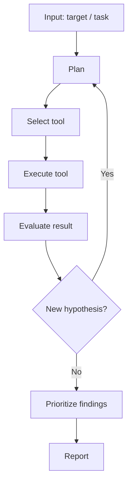
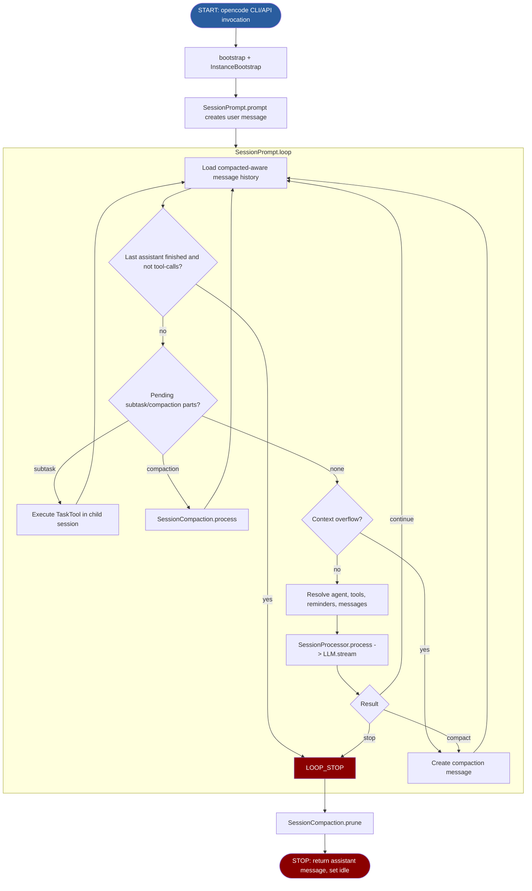
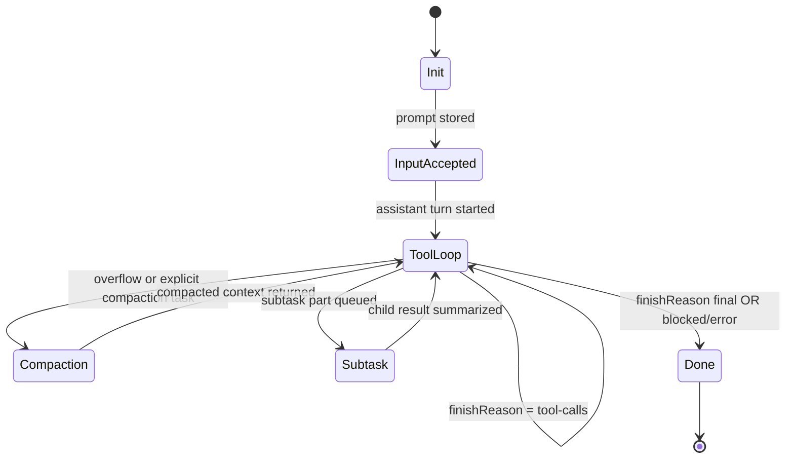

# OpenHack (OpenCode Core) - Project Analysis

> **Context:** This template provides a standardized analysis framework for
> autonomous penetration testing agents, designed for use in a bachelor thesis.
> It enables systematic, comparable evaluation of each agent's architecture,
> tool usage, and vulnerability discovery capabilities.

| Field | Value |
|-------|-------|
| **Project** | OpenHack (fork of OpenCode, base agent platform) |
| **Version / Commit** | `opencode` 1.1.53 / `75a176a4304733049a2700c356187441f93144c4` (branch `feature-agentbenchmarks`) |
| **Repository** | `origin`: git@github.com:mkdirtim/openhack.git, upstream: https://github.com/anomalyco/opencode |
| **License** | MIT |
| **Language(s)** | TypeScript (Bun runtime), JavaScript (launcher), Shell (ops/runtime scripts) |
| **Runtime** | Local Bun CLI/TUI/server runtime with configurable MCP/custom tool/plugin extensions |
| **Date Analyzed** | 2026-02-13 |

> **Template Ecosystem - Three-Layer Analysis:**
>
> | Layer | Template | Scope | Cardinality |
> |-------|----------|-------|-------------|
> | 1. Project Analysis | **this file** | Deep technical analysis of codebase, architecture, and design decisions | One per agent |
> | 2. Benchmark Results | `results-template.md` | Quantitative data: tool calls, flags, cost, duration, vulnerability coverage | One per agent x target |
> | 3. Learnings Synthesis | `learnings-template.md` | Qualitative synthesis: what worked, what to adopt for OpenHack | One per agent |
>
> **Workflow:** (1) Analyze the codebase and fill this template ->
> (2) Run benchmarks and fill `results-template.md` per target ->
> (3) Synthesize findings from both into `learnings-template.md`.

---

## 1. Project Profile

- **Primary goal:** General-purpose autonomous coding/research agent orchestration (not pentest-specific), with configurable agents, tools, permissions, and MCP integrations (`packages/opencode/src/index.ts:42`, `packages/opencode/src/session/prompt.ts:256`, `packages/opencode/src/tool/registry.ts:94`).
- **Supported asset types:** Source repositories/filesystems, shell environments, web content (`webfetch`/`websearch`), and external systems exposed via MCP servers (`packages/opencode/src/tool/read.ts:17`, `packages/opencode/src/tool/bash.ts:55`, `packages/opencode/src/mcp/index.ts:566`).
- **Explicitly out of scope:** No built-in vulnerability taxonomy, exploit framework, scanner orchestration, or CVSS-centric security report pipeline in core runtime (assumption from reviewed core paths and tool set).
- **Assumed attacker model:** Authorized developer/operator working inside a local project context with optional elevated tool permissions and explicit approval gates (`packages/opencode/src/permission/next.ts:24`, `packages/opencode/src/tool/external-directory.ts:12`).
- **Human-in-the-loop:** Yes. Permission requests and explicit question prompts are first-class runtime constructs (`packages/opencode/src/permission/next.ts:127`, `packages/opencode/src/question/index.ts:97`, `packages/opencode/src/server/routes/permission.ts:10`, `packages/opencode/src/server/routes/question.ts:33`).
- **Short description (3-5 sentences):**
  OpenHack currently uses OpenCode as a modular agent runtime: session control, LLM streaming, tool execution, and state persistence are centrally orchestrated in `SessionPrompt.loop()` + `SessionProcessor.process()` (`packages/opencode/src/session/prompt.ts:256`, `packages/opencode/src/session/processor.ts:45`). Core behavior is policy-driven through agents and permissions, with defaults for build/plan/general/explore and configurable overrides from local/global/project config layers (`packages/opencode/src/agent/agent.ts:77`, `packages/opencode/src/config/config.ts:68`). The platform exposes built-in tools, custom local tools, plugin tools, and MCP tools through one unified resolver (`packages/opencode/src/tool/registry.ts:98`, `packages/opencode/src/session/prompt.ts:694`, `packages/opencode/src/mcp/index.ts:566`). This makes it highly suitable as a base for a dedicated hacking agent, but pentest-specific logic, reporting, and benchmarking semantics still need to be added explicitly.

---

## 2. Quickstart for Reproduction

> Required for thesis reproducibility. Document the exact steps to set up
> and run the agent from a clean state.

- **Entry point(s) in code:**
  - CLI entrypoint registration: `packages/opencode/src/index.ts:42`
  - Binary launcher: `packages/opencode/bin/opencode:1`
  - Runtime bootstrap wrapper: `packages/opencode/src/cli/bootstrap.ts:4`
  - Main run command (non-TUI CLI flow): `packages/opencode/src/cli/cmd/run.ts:214`
- **Key configuration files:**
  - Global/project config loading and precedence: `packages/opencode/src/config/config.ts:68`
  - Agent definitions and defaults: `packages/opencode/src/agent/agent.ts:77`
  - Rules and permission config schema: `packages/opencode/src/config/config.ts:619`
  - Skills discovery and loading: `packages/opencode/src/skill/skill.ts:51`
  - MCP config schema and runtime client wiring: `packages/opencode/src/config/config.ts:521`, `packages/opencode/src/mcp/index.ts:163`
- **Startup command:**
  - `cd /Users/mkdirtim/FERR/openhack && bun install && bun run dev`
  - Evidence: root dev script targets `packages/opencode` entrypoint (`package.json:9`).
- **Minimal test run:**
  - `cd /Users/mkdirtim/FERR/openhack && bun --cwd packages/opencode src/index.ts --help`
  - Optional run-path smoke test: `bun --cwd packages/opencode src/index.ts run "analyze current repo structure"`
- **Log / artifact output paths:**
  - Runtime logs: `${XDG_DATA_HOME}/opencode/log/*.log` (or default OS XDG path) (`packages/opencode/src/global/index.ts:21`, `packages/opencode/src/util/log.ts:62`).
  - Session/storage state: `${XDG_DATA_HOME}/opencode/storage/...` (`packages/opencode/src/storage/storage.ts:145`).
  - Config path root: `${XDG_CONFIG_HOME}/opencode` (`packages/opencode/src/global/index.ts:10`).

---

## 3. Architecture

### 3a. Component Decomposition

| Component | Purpose | Inputs | Outputs | Key Files |
|-----------|---------|--------|---------|-----------|
| Agent Core | Defines built-in and custom agents, default behavior, and permissions | Config, skills directories, provider/model settings | Agent registry with prompts/options/permission rules | `packages/opencode/src/agent/agent.ts:51` |
| Planner / Orchestrator | Drives session loop and phase transitions across user input, tools, compaction, and stop conditions | Session history, user message, agent selection, model | Assistant turns, tool calls, state updates, loop termination | `packages/opencode/src/session/prompt.ts:256` |
| Executor | Streams LLM events, writes tool/text/reasoning parts, retries provider failures | Stream input (system/messages/tools/model), abort signal | Message parts, error states, continue/stop/compact decisions | `packages/opencode/src/session/processor.ts:45`, `packages/opencode/src/session/llm.ts:46` |
| Tool Adapter | Resolves and wraps internal/custom/plugin/MCP tools into AI SDK-compatible tools | Tool registry, MCP clients, permissions, per-call context | Unified tool map + tool execution results/metadata/attachments | `packages/opencode/src/tool/registry.ts:126`, `packages/opencode/src/session/prompt.ts:647` |
| Memory / State | Persists sessions/messages/parts/status, computes summaries/diffs, compacts/prunes context | Session events, snapshots, token usage | Durable JSON state + summary/diff metadata + compacted context | `packages/opencode/src/session/index.ts:52`, `packages/opencode/src/storage/storage.ts:169`, `packages/opencode/src/session/compaction.ts:30` |
| Reporter | Emits structured runtime events and serializable session artifacts (not vuln-specific reports) | Session parts/status/errors | API events, status streams, summaries/diffs | `packages/opencode/src/server/routes/session.ts:22`, `packages/opencode/src/session/summary.ts:79` |

### 3b. Generic Agent Loop (reference)

The following diagram shows a generic agent loop for comparison. Replace section 3c
with the project's actual flow.

### 3c. Project-Specific Agent Flow (Mermaid)

> **Customization checklist:**
> - [x] Replace placeholder nodes with actual function/method names
> - [x] Add agent-specific branches (subtask, compaction, permission-blocked stop)
> - [x] Annotate edges with transition conditions where non-obvious
> - [x] Update STOP node with actual termination reasons

### 3d. Start and Stop Conditions

| Condition | Type | Trigger | Behavior |
|------|------|---------|----------|
| CLI/API invocation | **Start** | `opencode ...` command or API route action | Bootstraps instance context and enters session flow (`packages/opencode/src/index.ts:42`, `packages/opencode/src/cli/bootstrap.ts:4`) |
| New prompt submitted | **Start** | `SessionPrompt.prompt(...)` called | Creates user message/parts, updates session, enters loop (`packages/opencode/src/session/prompt.ts:149`) |
| Assistant completes without further tool loop | **Stop (objective/self-assessed)** | Last assistant `finish` is neither `tool-calls` nor `unknown` and newer than last user | Breaks loop and returns latest assistant message (`packages/opencode/src/session/prompt.ts:293`) |
| Permission/question rejection | **Stop (policy)** | Tool error becomes `PermissionNext.RejectedError` or `Question.RejectedError` | Processor marks blocked and returns `stop` (`packages/opencode/src/session/processor.ts:212`, `packages/opencode/src/session/processor.ts:399`) |
| Max steps reached | **Stop (budget soft-stop)** | `step >= agent.steps` | Injects `MAX_STEPS` instruction to force text-only completion path (`packages/opencode/src/session/prompt.ts:514`, `packages/opencode/src/session/prompt.ts:605`) |
| Manual cancellation | **Stop (manual)** | `SessionPrompt.cancel(sessionID)` / abort API | Aborts controller, sets session idle (`packages/opencode/src/session/prompt.ts:242`, `packages/opencode/src/server/routes/session.ts:358`) |
| Recoverable provider/transient error | **Stop (temporary no)** | Retryable API error | Exponential backoff and retry loop (`packages/opencode/src/session/processor.ts:345`, `packages/opencode/src/session/retry.ts:28`) |
| Unrecoverable error | **Stop (error)** | Non-retryable stream/processing error | Writes session error event and returns stop (`packages/opencode/src/session/processor.ts:358`, `packages/opencode/src/session/processor.ts:400`) |
| Context overflow | **Stop (phase transition)** | Token usage exceeds usable context | Creates compaction task and loops again (not process exit) (`packages/opencode/src/session/prompt.ts:497`, `packages/opencode/src/session/compaction.ts:30`) |

### 3e. Phase Transitions

| From | To | Signal | Explicit or LLM-decided? | Code Location |
|------|----|--------|--------------------------|---------------|
| Init -> InputAccepted | `SessionPrompt.prompt()` persists user message | Explicit | `packages/opencode/src/session/prompt.ts:149` |
| InputAccepted -> ToolLoop | `SessionPrompt.loop()` starts assistant processing | Explicit | `packages/opencode/src/session/prompt.ts:256` |
| ToolLoop -> ToolLoop | Assistant requests tools again (`finish = tool-calls`) | Mixed: LLM chooses call; loop mechanics explicit | `packages/opencode/src/session/prompt.ts:293`, `packages/opencode/src/session/processor.ts:126` |
| ToolLoop -> Compaction | Overflow detected or compaction part exists | Explicit policy check | `packages/opencode/src/session/prompt.ts:485`, `packages/opencode/src/session/prompt.ts:499` |
| Compaction -> ToolLoop | Compaction processor returns continue | Explicit | `packages/opencode/src/session/compaction.ts:190` |
| ToolLoop -> Subtask | Subtask part dequeued and TaskTool executed | Explicit orchestration + LLM-created subtask part | `packages/opencode/src/session/prompt.ts:314`, `packages/opencode/src/tool/task.ts:28` |
| ToolLoop -> Done | Processor returns stop / terminal finish condition met | Explicit | `packages/opencode/src/session/processor.ts:399`, `packages/opencode/src/session/prompt.ts:617` |

### 3f. Retry and Backtrack Strategy

- **On tool failure:** Tool state is converted to `error` and loop can continue unless the error is permission/question rejection (`packages/opencode/src/session/processor.ts:196`, `packages/opencode/src/session/processor.ts:213`).
- **On exploit failure:** No dedicated exploit layer exists; remediation/backtracking is LLM-driven through repeated tool-calls (assumption).
- **Max retries per hypothesis:** No explicit hypothesis-level counter. Provider retries use exponential backoff (`packages/opencode/src/session/retry.ts:54`).
- **Backtrack depth:** Potentially unbounded within session until stop criteria, manual abort, or step constraints (`packages/opencode/src/session/prompt.ts:269`, `packages/opencode/src/session/prompt.ts:514`).
- **Dead-end detection:** Combination of finish-reason gating, blocked state on denied calls, and context-compaction fallback (`packages/opencode/src/session/prompt.ts:293`, `packages/opencode/src/session/processor.ts:399`, `packages/opencode/src/session/compaction.ts:30`).

### 3g. Memory and State Management

- **Session state:** Session metadata includes title, parent, time, permission ruleset, share info, and summary fields (`packages/opencode/src/session/index.ts:52`).
- **Short-term memory:** Full conversation is streamed through `MessageV2` and transformed into model messages each loop (`packages/opencode/src/session/prompt.ts:603`).
- **Long-term memory:** File-based durable storage for session/message/part records in `${XDG_DATA}/opencode/storage` (not semantic memory DB) (`packages/opencode/src/storage/storage.ts:145`).
- **Persistence format:** JSON files by keyed paths (`packages/opencode/src/storage/storage.ts:169`, `packages/opencode/src/storage/storage.ts:191`).
- **Resume capability:** Existing sessions can be continued via CLI `--continue`/`--session` and API routes (`packages/opencode/src/cli/cmd/run.ts:351`, `packages/opencode/src/server/routes/session.ts:93`).
- **Reset behavior:** New session creates fresh state; old sessions remain persisted until explicit delete (`packages/opencode/src/session/index.ts:140`, `packages/opencode/src/session/index.ts:353`).

---

## 4. Tool-Use Analysis

### 4a. Tool Inventory

| Tool | Type | Purpose | Agent Trigger | Input | Output | Error Handling | Security Constraints |
|------|------|---------|---------------|-------|--------|----------------|----------------------|
| `bash` | external (shell) | Execute shell commands in project context | LLM tool-call | command, timeout, workdir, description | stdout/stderr combined output + exit metadata | timeout/abort/parse errors captured | per-command permission ask + external dir checks + shell process kill tree (`packages/opencode/src/tool/bash.ts:147`) |
| `read` | internal | Read file content with line numbers, binary safeguards | LLM tool-call | filepath, offset, limit | `<file>` block + metadata + optional attachments | not-found suggestions and binary rejection | `read` permission + external directory enforcement (`packages/opencode/src/tool/read.ts:35`) |
| `list` | internal | Enumerate project directory tree quickly | LLM tool-call | path, ignore globs | rendered tree + count/truncated metadata | bounded result set | `list` permission + directory guard (`packages/opencode/src/tool/ls.ts:48`) |
| `edit` / `write` / `apply_patch` | internal | File mutations with diff output and LSP diagnostics | LLM tool-call | path/content or patch text | success summary + diffs + diagnostics | schema + patch verification + lock checks | unified `edit` permission prompts with diff metadata (`packages/opencode/src/tool/edit.ts:87`, `packages/opencode/src/tool/apply_patch.ts:174`) |
| `webfetch` | internal network | Fetch remote content as text/markdown/html | LLM tool-call | URL, format, timeout | fetched/converted content | HTTP status, timeout, max-size checks | URL validation + permission ask (`packages/opencode/src/tool/webfetch.ts:23`) |
| `websearch` | external API (Exa MCP endpoint) | Retrieve web search context | LLM tool-call | query + search params | summarized search output | network/SSE parse/timeouts | explicit `websearch` permission ask (`packages/opencode/src/tool/websearch.ts:66`) |
| `task` | internal subagent orchestration | Spawn/resume child sessions for delegated subtasks | LLM tool-call | description, prompt, subagent type | child result text + task id + metadata | unknown-agent and execution error handling | `task` permission + subagent-specific restricted session permissions (`packages/opencode/src/tool/task.ts:50`, `packages/opencode/src/tool/task.ts:73`) |
| `question` | internal HITL | Ask user structured multiple-choice questions | LLM tool-call | question set | formatted user answers | rejection path throws | explicit user response required (`packages/opencode/src/tool/question.ts:12`) |
| `skill` | internal instruction loader | Discover/load SKILL.md content on demand | LLM tool-call | skill name | injected `<skill_content>` block | unknown skill error | `skill` permission enforcement (`packages/opencode/src/tool/skill.ts:69`) |
| MCP tools (`<server>_<tool>`) | external via MCP | Access arbitrary external tools/resources | LLM tool-call | server-specific schema | normalized text/resources/images | per-client failure status downgrade | each MCP call wrapped with permission ask + timeout (`packages/opencode/src/session/prompt.ts:731`, `packages/opencode/src/mcp/index.ts:566`) |

> **Type:** `internal` = built into the agent (custom HTTP client, code
> execution sandbox); `external` = shell-invoked CLI/API systems.

### 4b. Tool Selection Strategy

- Tool availability is dynamically assembled from built-ins, local/global custom tools, plugin tools, and MCP tools (`packages/opencode/src/tool/registry.ts:94`, `packages/opencode/src/session/prompt.ts:731`).
- Selection is primarily LLM-decided based on tool schemas/descriptions; orchestration code enforces availability/filtering but not a deterministic planner (`packages/opencode/src/session/llm.ts:214`, `packages/opencode/src/session/processor.ts:126`).
- Model/provider-aware routing exists (for example `apply_patch` vs `edit/write`, Exa search gating, optional LSP/batch) (`packages/opencode/src/tool/registry.ts:137`).
- Permission policy can disable tools globally/agent-scoped and force `ask`/`deny` at runtime (`packages/opencode/src/permission/next.ts:231`, `packages/opencode/src/session/llm.ts:268`).
- Users can add custom tools in `.opencode/tools` or `~/.config/opencode/tools` and use plugin definitions (`packages/opencode/src/tool/registry.ts:36`; docs: https://opencode.ai/docs/custom-tools/).

### 4c. Tool-Use Risks

| Risk | Concrete Example | Impact | Existing Mitigation | Residual Risk |
|------|------------------|--------|---------------------|---------------|
| Hallucinated tool parameters | Malformed JSON input or wrong schema field names | wasted turns and missed actions | strict zod validation wrapper + optional custom validation formatter (`packages/opencode/src/tool/tool.ts:59`) | Medium |
| Over-privileged tool usage | Agent executes broad shell commands when `bash` allowed | accidental destructive actions | configurable `allow/ask/deny`, tool-level permission prompts (`packages/opencode/src/permission/next.ts:24`, `packages/opencode/src/tool/bash.ts:157`) | Medium-high |
| Unsafe command execution | `bash` command modifies non-project paths | data/system risk beyond repo scope | AST path extraction + `external_directory` permission checks (`packages/opencode/src/tool/bash.ts:88`, `packages/opencode/src/tool/external-directory.ts:23`) | Medium |
| Missing output validation for security findings | LLM claims a vulnerability without deterministic verification pipeline | false positives in pentest adaptation | none in core runtime (assumption) | High for pentest use-case |
| Tool recursion / looping | repeated identical tool-call sequence | token/cost drain | doom-loop threshold prompt/permission checkpoint (`packages/opencode/src/session/processor.ts:20`, `packages/opencode/src/session/processor.ts:147`) | Medium |

---

## 5. Operational Workflow

### 5a. Workflow Phases

| # | Phase | Entry Condition | Exit Condition | Typical Actions | Artifacts Produced |
|---|-------|-----------------|----------------|-----------------|--------------------|
| 1 | Initialization | CLI/API call and bootstrap | Instance + config + plugins initialized | bootstrap, load config layers, setup LSP/watchers | runtime context and initialized services (`packages/opencode/src/project/bootstrap.ts:17`, `packages/opencode/src/config/config.ts:65`) |
| 2 | Context Assembly | User prompt enters `SessionPrompt.prompt` | User message/parts persisted | parse prompt parts, attach files/resources, choose model/agent | session/message/part records (`packages/opencode/src/session/prompt.ts:149`, `packages/opencode/src/session/prompt.ts:827`) |
| 3 | Hypothesis/Plan Generation | Loop starts for latest user turn | Assistant emits first tool/text/reasoning events | generate with system+history, create assistant message, stream reasoning | reasoning/text/tool parts (`packages/opencode/src/session/processor.ts:55`) |
| 4 | Execution | Tool-calls emitted by model | Tool chain exhausted or blocked/error | execute tools, permission checks, plugin hooks, patch snapshots | tool result parts, step-finish token/cost data (`packages/opencode/src/session/processor.ts:126`, `packages/opencode/src/session/processor.ts:236`) |
| 5 | Subtask/Compaction Branches | Subtask/compaction parts queued or overflow detected | Branch returns continue/stop | run child-agent task session, or compact context and continue | subtask outputs, compaction summary entries (`packages/opencode/src/session/prompt.ts:314`, `packages/opencode/src/session/compaction.ts:92`) |
| 6 | Finalization/Reporting | Terminal finish or stop condition | Loop breaks and latest assistant returned | prune old tool outputs, summarize diffs/session stats, emit idle | session summary + diff metadata + status events (`packages/opencode/src/session/prompt.ts:628`, `packages/opencode/src/session/summary.ts:93`) |

---

## 6. Vulnerability Discovery Model

### 6a. Methodology

- **Detection strategies:** Not a native vulnerability scanner; relies on LLM-driven reasoning plus whichever tools are enabled (built-in/custom/MCP). For security testing this becomes prompt-and-tool dependent (assumption).
- **Exploitability verification:** No dedicated exploit-verification contract in core (no mandatory validation stage like `create_vulnerability_report` gating).
- **Payload generation:** Fully dynamic via LLM outputs and tool invocations (assumption).
- **False-positive handling:** No built-in vulnerability validation pipeline in core runtime; mitigation must be implemented via custom tools/agents/rules.
- **False-negative risk:** High for pentest tasks unless security-specific tooling, target modeling, and verification loops are added.

### 6b. Browser vs. CLI Capabilities

- **Browser capabilities:** No native browser automation tool in core built-ins.
- **Headless browser integration:** None built-in; can be added through custom tools or MCP servers (docs + registry support).
- **CLI-only limitations:** JS-heavy web workflows (DOM state, client-side auth/flows) are under-reachable with only `webfetch`/`bash` unless external browser tooling is integrated.

### 6c. Attack Chaining

- **Multi-step attacks:** Framework supports multi-step task decomposition via `task` subagents and iterative tool loops (`packages/opencode/src/tool/task.ts:28`, `packages/opencode/src/session/prompt.ts:314`).
- **Privilege escalation:** Not security-specialized; possible only through custom workflow design and granted tool permissions.
- **Lateral movement:** Possible through shell/MCP capabilities if configured, but not explicit in core prompt logic.

---

## 7. Reporting and Output

- **Output format:** Session/message/part JSON in storage; API routes expose JSON models; CLI can emit human or JSON event stream (`packages/opencode/src/storage/storage.ts:191`, `packages/opencode/src/cli/cmd/run.ts:395`).
- **Severity classification:** None built-in for vulnerabilities.
- **Remediation advice:** Emergent from model text; not schema-enforced.
- **Evidence / PoC quality:** Tool outputs, diffs, and attachments can be preserved, but no dedicated pentest evidence schema.
- **Report generation:** Incremental during loop (parts/status updates) plus summary/diff post-processing at end (`packages/opencode/src/session/processor.ts:245`, `packages/opencode/src/session/summary.ts:79`).

---

## 8. Security and Ethics Mechanisms

- **Scope enforcement:** Relative path anchoring and external directory checks for file/directory tools (`packages/opencode/src/tool/external-directory.ts:12`, `packages/opencode/src/tool/read.ts:31`, `packages/opencode/src/tool/ls.ts:46`).
- **Rate limiting:** No explicit HTTP scan throttling layer in built-ins (assumption), but timeout controls exist per tool/LLM/MCP (`packages/opencode/src/tool/webfetch.ts:8`, `packages/opencode/src/mcp/index.ts:29`).
- **Dangerous action guards:** Permission model supports `allow/deny/ask` with interactive replies and deny fallbacks (`packages/opencode/src/permission/next.ts:24`, `packages/opencode/src/server/routes/permission.ts:10`).
- **Secrets handling:** Provider auth/config handled via provider/auth modules and config layering; no hardcoded secret-in-code pattern observed in reviewed paths (`packages/opencode/src/session/llm.ts:59`, `packages/opencode/src/config/config.ts:66`).
- **Logging / auditability:** Structured per-session state and timestamped logs support reconstruction (`packages/opencode/src/storage/storage.ts:169`, `packages/opencode/src/util/log.ts:62`).
- **Legal / ethical constraints:** Core runtime enforces operational permissions but does not embed domain-specific legal policy for pentest scope; this must be defined through AGENTS/rules and permission policy.

---

## 9. Evaluation Scorecard

> Standardized scoring for cross-project comparison. Rate each criterion 1-5
> based **solely on codebase review** (reading source code, documentation,
> and configuration). Criteria marked with *(B)* receive a preliminary score
> here; their final score is validated against benchmark data in
> `learnings-template.md`.

| Criterion | 1 (weak) | 3 (medium) | 5 (strong) | Score | Code Evidence |
|-----------|----------|------------|------------|-------|---------------|
| Flow traceability | barely documented | partly explainable | clear, reproducible | **4** | `packages/opencode/src/session/prompt.ts:256`, `packages/opencode/src/session/processor.ts:45` |
| Tool-use transparency | black box | partly visible | fully traceable | **5** | unified tool wrappers + part updates (`packages/opencode/src/tool/tool.ts:57`, `packages/opencode/src/session/processor.ts:172`) |
| Reproducibility | hard to set up | partly documented | fully scripted setup | **4** | deterministic CLI/bootstrap/config paths (`package.json:9`, `packages/opencode/src/cli/bootstrap.ts:4`) |
| Detection coverage *(B)* | few vuln categories | moderate coverage | comprehensive methodology | **2** | no pentest-native vuln model in core (assumption + built-in tool set) |
| False-positive handling *(B)* | none | basic checks | systematic verification | **2** | generic runtime checks only, no vuln verification contract |
| Level of autonomy | mostly manual | semi-autonomous | robust autonomous | **4** | autonomous loop with subtask delegation (`packages/opencode/src/session/prompt.ts:256`, `packages/opencode/src/tool/task.ts:151`) |
| Execution safety | no guardrails | basic limits | defense-in-depth | **4** | permissions + external dir + question flow + doom-loop (`packages/opencode/src/permission/next.ts:127`, `packages/opencode/src/session/processor.ts:147`) |
| Extensibility | hard to adapt | moderate | modular, extensible | **5** | custom tools/plugins/MCP/skills (`packages/opencode/src/tool/registry.ts:36`, `packages/opencode/src/mcp/index.ts:566`, `packages/opencode/src/skill/skill.ts:51`) |
| Cost awareness | no controls | basic limits | fine-grained budgeting | **3** | token/cost accounting and model limits, but no hard global budget governor by default (`packages/opencode/src/session/index.ts:439`, `packages/opencode/src/session/processor.ts:237`) |
| Adoptability for OpenHack | low transferability | selectively usable | directly adoptable | **5** | already your target base repo; architecture is modular and adaptable |

**Overall score:** **38 / 50**

> *(B)* = preliminary, to be validated by benchmarks. After running benchmarks,
> compare these code-review scores with actual performance in
> `learnings-template.md` section 9.

---

## 10. Strengths, Weaknesses, and Transferable Ideas

### 10a. Strengths (from code review)

- Strong modular architecture with clear boundaries between session orchestration, tool abstraction, config, and providers (`packages/opencode/src/session/prompt.ts:647`, `packages/opencode/src/tool/registry.ts:31`, `packages/opencode/src/config/config.ts:65`).
- Permission-first execution model (`allow`/`ask`/`deny`) is explicit and composable across agents and sessions (`packages/opencode/src/permission/next.ts:24`, `packages/opencode/src/session/prompt.ts:685`).
- High extensibility through three independent extension planes: custom tools, plugins, and MCP servers (`packages/opencode/src/tool/registry.ts:42`, `packages/opencode/src/mcp/index.ts:566`; docs: https://opencode.ai/docs/custom-tools/, https://opencode.ai/docs/mcp-servers/).
- Robust long-session handling via compaction and pruning to sustain autonomous runs (`packages/opencode/src/session/compaction.ts:30`, `packages/opencode/src/session/compaction.ts:49`).
- Good observability: step parts, tool metadata, session status events, and diff summaries are persisted (`packages/opencode/src/session/processor.ts:225`, `packages/opencode/src/session/status.ts:61`, `packages/opencode/src/session/summary.ts:93`).

### 10b. Weaknesses (from code review)

- Not a pentest-specialized system out-of-the-box: no vulnerability schema, no exploit-verification contract, no severity taxonomy.
- No native browser exploitation workflow; dynamic web attacks require external additions.
- Governance for offensive use is mostly generic permission controls; pentest-specific scope enforcement (targets, rate, legal boundaries) is not first-class in core flow.
- Some run behavior remains LLM-policy-dependent (tool choice, stopping rationale), which can reduce determinism for benchmark comparability (assumption).

### 10c. Transferable Ideas for OpenHack

| Idea / Mechanism | Why Useful | Effort (low / med / high) | Priority |
|------------------|-----------|---------------------------|----------|
| Session + part event model | Gives reproducible, analyzable traces for thesis benchmarks | med | High |
| PermissionNext rulesets (`allow/ask/deny`) | Enables safe autonomous operation with clear HITL checkpoints | low-med | High |
| `task` subagent delegation with child sessions | Natural foundation for recon/exploit/report multi-agent decomposition | med | High |
| MCP tool bridge | Fast integration of external security tooling without bloating core | med | High |
| Skill loading via `SKILL.md` | Reusable tactic playbooks (SQLi, SSRF, auth bypass, etc.) | low | High |
| Compaction/prune mechanics | Stable long-running tests at lower token pressure | med | Medium |
| Structured tool metadata capture | Better post-hoc scoring of tool-use efficiency | low-med | Medium |

### 10d. Adaptation Options for the Future Hacking Agent (paragraphs)

**Option 1 - Strix-style validated finding pipeline:**
Add a dedicated security reporting tool contract (for example `create_vulnerability_report`) that requires evidence fields, impact, reproducibility steps, and confidence before a finding is accepted. Compared with current free-form assistant output, this reduces duplicate/weak findings and improves thesis comparability across agents. In OpenHack terms, this should be implemented as a custom tool plus validation subagent, while preserving existing session event traces.

**Option 2 - CAI-style guardrail and budget layer on top of permissions:**
Keep `PermissionNext` as the hard execution gate, but add explicit run-budget controls (max turns per phase, max tool-call count per category, max wall-clock per target, optional spend ceiling). This gives you deterministic benchmark behavior and cleaner failure semantics than relying mostly on model self-regulation. Implementation can hook into `SessionPrompt.loop()` and `SessionStatus` with minimal architectural disruption.

**Option 3 - PentestGPT-style benchmark mode with strict objectives:**
Introduce a non-interactive benchmark profile where session completion is tied to concrete security objectives (for example validated vulnerabilities found, mandatory recon coverage, required evidence artifacts). This mode should auto-retry selectively when outputs fail validation, similar to challenge-focused automation patterns. It will improve fairness for scientific comparison and reduce manual normalization effort in your thesis.

**Option 4 - OpenHack-native composable offensive stack (recommended baseline):**
Use OpenCode's existing strengths directly: implement pentest-specific subagents (`recon`, `web-exploit`, `api-exploit`, `validator`, `reporter`) and connect them through `task` delegation, then attach scanner/proxy/browser capabilities via MCP/custom tools. This keeps core orchestration untouched while moving domain logic into versioned skills/rules/agent prompts, which is the cleanest path for rapid iteration and controlled experimentation.

---

## 11. Cross-Project Comparison

- Similarities with **PentestGPT**:
  - Both rely on iterative LLM + tool loops and maintain session artifacts.
  - Both can run autonomous flows with optional human intervention.
- Key differences from **PentestGPT**:
  - OpenHack/OpenCode is a platform runtime; PentestGPT is already a pentest-task-focused product.
  - OpenHack has much richer extension architecture (MCP/plugins/custom tools), but less native offensive specialization.
- Similarities with **CAI**:
  - Multi-agent/task decomposition and flexible tool abstractions.
  - Stronger-than-average operational controls compared to simpler wrappers.
- Key differences from **CAI**:
  - OpenHack has cleaner file-centric config/skill conventions and explicit AGENTS/rules precedence docs.
  - CAI currently offers more security-centric prebuilt agent variants and guardrail motifs.
- Similarities with **Strix**:
  - Autonomous loops, subagent concepts, and artifact persistence.
- Key differences from **Strix**:
  - Strix is purpose-built for pentesting (browser/proxy/reporting stack included); OpenHack is intentionally general.
- Relative positioning:
  - **Best base platform for building your own hacking agent** (extensibility and control), but **requires additional security-specific layers** for parity with dedicated pentest agents.
- Open questions for follow-up investigation:
  - Which MCP/browser stack gives best reliability for dynamic web exploitation in your benchmark targets?
  - Which minimum reporting schema balances strict validation and agent velocity?
  - How should scoring penalize broad reconnaissance without validated exploit evidence?

---

## 12. Sources and Evidence

| Type | Reference | Relevance | Date |
|------|-----------|-----------|------|
| Code path | `packages/opencode/src/session/prompt.ts:256` | Core loop/orchestration | 2026-02-13 |
| Code path | `packages/opencode/src/session/processor.ts:45` | Stream processing and stop/compact/blocked outcomes | 2026-02-13 |
| Code path | `packages/opencode/src/tool/registry.ts:94` | Built-in/custom/plugin tool registry | 2026-02-13 |
| Code path | `packages/opencode/src/permission/next.ts:24` | Permission model and runtime approval flow | 2026-02-13 |
| Code path | `packages/opencode/src/mcp/index.ts:566` | MCP tool bridge and status handling | 2026-02-13 |
| Code path | `packages/opencode/src/skill/skill.ts:51` | Skill discovery loading and precedence behavior | 2026-02-13 |
| Code path | `packages/opencode/src/config/config.ts:68` | Config precedence and extension loading | 2026-02-13 |
| Code path | `packages/opencode/src/tool/bash.ts:147` | Command execution + permission checks | 2026-02-13 |
| Code path | `packages/opencode/src/tool/webfetch.ts:23` | URL validation and permission gating | 2026-02-13 |
| Code path | `packages/opencode/src/storage/storage.ts:145` | Persistent artifact storage | 2026-02-13 |
| Documentation | https://opencode.ai/docs/tools/ | Tool model, built-ins, permission framing | 2026-02-13 |
| Documentation | https://opencode.ai/docs/rules/ | AGENTS/rules types, precedence, custom instructions | 2026-02-13 |
| Documentation | https://opencode.ai/docs/agents/ | Built-in agent roles and primary/subagent model | 2026-02-13 |
| Documentation | https://opencode.ai/docs/mcp-servers/ | Local/remote MCP setup and OAuth behavior | 2026-02-13 |
| Documentation | https://opencode.ai/docs/custom-tools/ | Custom tool location/structure/args/context | 2026-02-13 |
| Documentation | https://opencode.ai/docs/skills/ | SKILL.md discovery/loading conventions | 2026-02-13 |

---

## 13. Setup and Execution Protocol

> Document the exact steps to install and run this agent from a clean state.
> Required for thesis reproducibility. Benchmark-specific parameters and
> results belong in `results-template.md`.

1. **Prerequisites:** macOS/Linux, Bun installed, network access for model/provider APIs, configured credentials for at least one provider, optional MCP server credentials.
2. **Installation:**
   - `cd /Users/mkdirtim/FERR/openhack`
   - `bun install`
3. **Configuration:**
   - Create/update `opencode.json` or `.opencode/opencode.json` with providers, permissions, agents, and optional MCP definitions (`packages/opencode/src/config/config.ts:68`).
   - Add project rules in `AGENTS.md` and optional shared instruction files via `instructions` field (docs: https://opencode.ai/docs/rules/).
4. **Verify installation:**
   - `bun --cwd packages/opencode src/index.ts --help`
   - Optional: `bun --cwd packages/opencode src/index.ts models` to verify provider/model resolution.
5. **Run against a target:**
   - Generic run: `bun --cwd packages/opencode src/index.ts run "<task prompt for target>"`
   - Session continuation: `... run --continue "<follow-up task>"`
   - Structured benchmark mode (recommended future): run with fixed agent, model, permissions, and deterministic prompt template.
6. **Known issues / gotchas:**
   - Without strict permission configuration, autonomous shell/file operations can be broader than desired.
   - Security-use benchmarking requires additional custom tools/agents for consistent vulnerability validation.
   - Some behavior is provider/model-dependent (tool-call formatting, finish reasons), so lock provider/model versions for reproducibility.

---

### Fill Rules

- Filled from source code, documentation, and project configuration only.
- Behavior that depends on model discretion is marked as **assumption** where needed.
- Structure mirrors the thesis template to keep comparability with PentestGPT, CAI, and Strix analyses.
