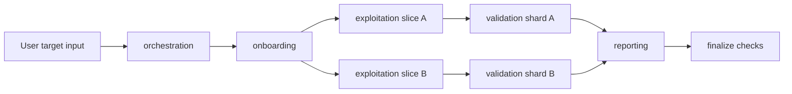
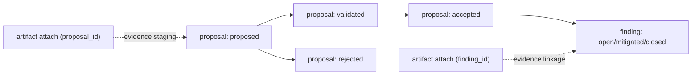
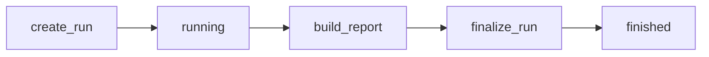
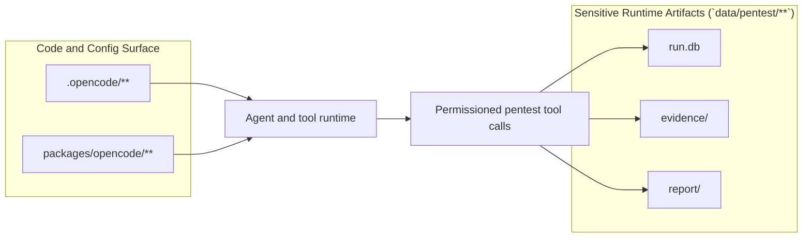

# OpenHack Project Overview

This document covers the OpenHack security-assessment layer integrated into this repository.

## Scope

OpenHack adds:
- pentest-specific agent orchestration and prompts,
- a proposal-first runtime database model per assessment run,
- evidence and report pipelines,
- report templates and build tooling.

OpenCode core runtime/package details are documented in `project-opencode.md`.

## Security Layer Paths

| Path | Purpose |
| --- | --- |
| `.opencode/opencode.jsonc` | Local OpenCode config for provider/MCP/tool permissions |
| `.opencode/tools/pentest.ts` | Pentest tool API surface (`create_run`, `add_proposal`, `build_report`, `finalize_run`, etc.) |
| `.opencode/lib/pentest-db.ts` | Canonical DB runtime logic, readiness gates, artifact linking, report assembly/finalize |
| `.opencode/agents/*.md` | Agent prompts/contracts (`orchestration`, `onboarding`, `exploitation`, `validation`, `reporting`) |
| `.opencode/skills/*/SKILL.md` | Security testing playbooks (SQLi, XSS, IDOR, CSRF, SSRF, JWT, RCE, XXE, and more) |
| `.opencode/skills/agent-report/` | Report templates, marker/proposal references, report build scripts, fixtures |
| `.opencode/scripts/migrate-runtime-artifacts.sh` | Moves stray runtime artifacts into run-scoped locations |

## Runtime Data Paths

| Path | Purpose |
| --- | --- |
| `features/` | Workflow docs (`features/database.md`, `features/onboarding.md`, `features/reporting.md`) |
| `data/pentest/assets/` | Default/custom onboarding profiles and archived templates |
| `data/pentest/running/<run_id>/` | Active run state (`run.db`, `evidence/`, `report/`) |
| `data/pentest/finished/<run_id>/` | Finalized run state and artifacts |

Notes:
- Each run has its own `run.db`.
- Evidence and report outputs are run-scoped by `run_id`.

## Pentest Flow (High Level)

1. Onboarding creates a run and sets engagement metadata.
2. Exploitation agents fan out in parallel and submit proposals.
3. Validation agents fan out in parallel and resolve proposals to `validated` or `rejected`.
4. Reporting rejects duplicates, accepts remaining `validated` proposals, then runs readiness/build/finalize.
5. Finalize moves run from `running` to `finished`.

## Agent Orchestration

## Proposal-to-Finding State Flow

## Run Lifecycle

## Key Tests

Pentest-focused tests:
- `packages/opencode/test/pentest/pentest-db-runtime.test.ts`
- `packages/opencode/test/pentest/pentest-agent-prompts.test.ts`

## Report Tooling

- DB-driven report script:
  - `.opencode/skills/agent-report/scripts/build-report-db.ts`
- Legacy/debug renderer:
  - `.opencode/skills/agent-report/scripts/build-report.sh`
- Dependency helper:
  - `script/pentest-report-deps.sh`

## Operational Notes

- Pentest artifacts can include sensitive exploit evidence and token/credential-like data.
- Treat `data/pentest/**` as sensitive runtime material.
- For full lab orchestration (targets/containers), see `docker/README.md`.

## Trust and Sensitivity Boundary

